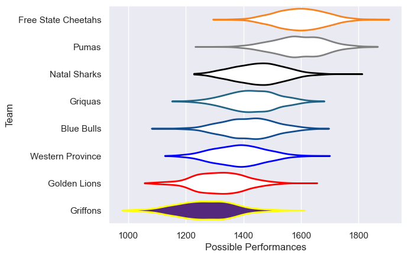

---  
title: "Currie Cup Status"  
date: 2023-04-21 6:00:00 -0500  
categories: model review projection  
layout: article  
aside:  
    toc: true  
---
# Current Team Rankings

# Standings

## Current Standings

| Club                |   Played |   Wins |   Point Differential |   Losing Bonus Points |   Try Bonus Points |   Competition Points |
|:--------------------|---------:|-------:|---------------------:|----------------------:|-------------------:|---------------------:|
| Free State Cheetahs |        7 |      6 |                  131 |                     0 |                  6 |                   30 |
| Pumas               |        7 |      5 |                  154 |                     2 |                  4 |                   26 |
| Western Province    |        8 |      4 |                    2 |                     0 |                  4 |                   20 |
| Natal Sharks        |        8 |      4 |                    7 |                     1 |                  2 |                   19 |
| Griquas             |        8 |      4 |                  -59 |                     0 |                  3 |                   19 |
| Golden Lions        |        8 |      3 |                  -65 |                     2 |                  5 |                   19 |
| Blue Bulls          |        7 |      3 |                   -7 |                     1 |                  5 |                   18 |
| Griffons            |        7 |      1 |                 -163 |                     0 |                  3 |                    7 |

## Projected Remaining Table

| Club                |   Matches Remaining |   Wins |   Point Differential |   Losing Bonus Points |   Try Bonus Points |   Competition Points |
|:--------------------|--------------------:|-------:|---------------------:|----------------------:|-------------------:|---------------------:|
| Pumas               |                   8 |    7.2 |                 80.1 |                   0.7 |                7   |                 36.5 |
| Free State Cheetahs |                   8 |    7   |                 94.3 |                   0.8 |                6.9 |                 35.8 |
| Griquas             |                   8 |    5   |                 21.7 |                   1.6 |                4.8 |                 26.5 |
| Blue Bulls          |                   7 |    3.9 |                 11.1 |                   1.9 |                3.7 |                 21.1 |
| Natal Sharks        |                   8 |    3.1 |                -19.7 |                   2.1 |                3   |                 17.6 |
| Western Province    |                   8 |    2.4 |                -43.5 |                   2.1 |                2.3 |                 14   |
| Golden Lions        |                   7 |    1.7 |                -42.3 |                   2   |                1.7 |                 10.7 |
| Griffons            |                   8 |    0.6 |               -101.6 |                   1.5 |                0.9 |                  5   |

## Projected Total Table

| Club                |   Total Matches |   Wins |   Point Differential |   Losing Bonus Points |   Try Bonus Points |   Competition Points |
|:--------------------|----------------:|-------:|---------------------:|----------------------:|-------------------:|---------------------:|
| Free State Cheetahs |              15 |   13   |                225.3 |                   0.8 |               12.9 |                 65.8 |
| Pumas               |              15 |   12.2 |                234.1 |                   2.7 |               11   |                 62.5 |
| Griquas             |              16 |    9   |                -37.3 |                   1.6 |                7.8 |                 45.5 |
| Blue Bulls          |              14 |    6.9 |                  4.1 |                   2.9 |                8.7 |                 39.1 |
| Natal Sharks        |              16 |    7.1 |                -12.7 |                   3.1 |                5   |                 36.6 |
| Western Province    |              16 |    6.4 |                -41.5 |                   2.1 |                6.3 |                 34   |
| Golden Lions        |              15 |    4.7 |               -107.3 |                   4   |                6.7 |                 29.7 |
| Griffons            |              15 |    1.6 |               -264.6 |                   1.5 |                3.9 |                 12   |

# Completed Match Review

| Model | Percent Correct Predictions | Spread Error |
| ------ | ------ | ------ |
| Club Level | 54.2% | 19.6 |
| Player Level: Lineup | 54.2% | 21.3 |
| Player Level: Minutes | 54.2% | 21.3 |

# Future Predictions

## Week 7

### Pumas V Western Province on 2023/04/21

Average Margin: Pumas by 15.2

### Free State Cheetahs V Natal Sharks on 2023/04/21

Average Margin: Free State Cheetahs by 13.8

### Griquas V Griffons on 2023/04/23

Average Margin: Griquas by 14.1

## Week 8

### Free State Cheetahs V Griffons on 2023/04/28

Average Margin: Free State Cheetahs by 23.3

### Golden Lions V Pumas on 2023/04/28

Average Margin: Pumas by 10.2

### Western Province V Blue Bulls on 2023/04/29

Average Margin: Blue Bulls by 2.6

### Natal Sharks V Griquas on 2023/04/29

Average Margin: Natal Sharks by 2.7

## Week 9

### Pumas V Griffons on 2023/05/05

Average Margin: Pumas by 21.1

### Griquas V Golden Lions on 2023/05/05

Average Margin: Griquas by 9.7

### Blue Bulls V Natal Sharks on 2023/05/06

Average Margin: Blue Bulls by 5.7

### Free State Cheetahs V Western Province on 2023/05/06

Average Margin: Free State Cheetahs by 17.0

## Week 10

### Griffons V Western Province on 2023/05/12

Average Margin: Western Province by 2.3

### Pumas V Natal Sharks on 2023/05/12

Average Margin: Pumas by 11.3

### Free State Cheetahs V Golden Lions on 2023/05/13

Average Margin: Free State Cheetahs by 19.0

### Griquas V Blue Bulls on 2023/05/13

Average Margin: Griquas by 2.1

## Week 11

### Natal Sharks V Free State Cheetahs on 2023/05/19

Average Margin: Free State Cheetahs by 6.6

### Western Province V Pumas on 2023/05/19

Average Margin: Pumas by 8.3

### Golden Lions V Blue Bulls on 2023/05/20

Average Margin: Blue Bulls by 4.0

### Griffons V Griquas on 2023/05/20

Average Margin: Griquas by 6.9

## Week 12

### Natal Sharks V Griffons on 2023/05/26

Average Margin: Natal Sharks by 12.4

### Western Province V Golden Lions on 2023/05/26

Average Margin: Western Province by 5.2

### Pumas V Blue Bulls on 2023/05/27

Average Margin: Pumas by 9.2

### Free State Cheetahs V Griquas on 2023/05/27

Average Margin: Free State Cheetahs by 12.4

## Week 13

### Griquas V Western Province on 2023/06/02

Average Margin: Griquas by 8.3

### Blue Bulls V Griffons on 2023/06/02

Average Margin: Blue Bulls by 14.6

### Golden Lions V Natal Sharks on 2023/06/03

Average Margin: Natal Sharks by 2.1

### Pumas V Free State Cheetahs on 2023/06/03

Average Margin: Pumas by 1.5

## Week 14

### Golden Lions V Griffons on 2023/06/09

Average Margin: Golden Lions by 7.3

### Griquas V Pumas on 2023/06/09

Average Margin: Pumas by 3.8

### Western Province V Natal Sharks on 2023/06/10

Average Margin: Natal Sharks by 0.1

### Blue Bulls V Free State Cheetahs on 2023/06/10

Average Margin: Free State Cheetahs by 4.2

