---  
"title: Currie Cup Status"  
date: 2023-03-29 6:00:00 -0500  
categories: model review projection  
layout: article  
aside:  
    toc: true  
---
# Standings

## Current Standings

| Club                |   Wins |   Point Differential |   Losing Bonus Points |   Try Bonus Points |   Competition Points |
|:--------------------|-------:|---------------------:|----------------------:|-------------------:|---------------------:|
| Pumas               |      4 |                  118 |                     0 |                  3 |                   19 |
| Free State Cheetahs |      3 |                   88 |                     0 |                  3 |                   15 |
| Natal Sharks        |      2 |                   21 |                     0 |                  2 |                   10 |
| Western Province    |      2 |                   11 |                     0 |                  2 |                   10 |
| Golden Lions        |      1 |                   -8 |                     1 |                  3 |                    8 |
| Griquas             |      1 |                  -30 |                     0 |                  1 |                    5 |
| Blue Bulls          |      0 |                 -129 |                     0 |                  1 |                    1 |
| Griffons            |      0 |                  -71 |                     0 |                  0 |                    0 |

## Projected Remaining Table

| Club                |   Wins |   Point Differential |   Losing Bonus Points |   Try Bonus Points |   Competition Points |
|:--------------------|-------:|---------------------:|----------------------:|-------------------:|---------------------:|
| Free State Cheetahs |    9.6 |                123.9 |                   0.9 |                6.6 |                 46.5 |
| Pumas               |    9.1 |                104.6 |                   1.2 |                5.5 |                 43.5 |
| Griquas             |    6   |                 12.4 |                   2.5 |                4.2 |                 31.4 |
| Natal Sharks        |    5.7 |                  5.4 |                   2.5 |                4   |                 29.8 |
| Western Province    |    5.3 |                 -6.2 |                   2.4 |                4   |                 28.1 |
| Blue Bulls          |    3.5 |                -45.3 |                   3.1 |                3.5 |                 21.3 |
| Golden Lions        |    2.6 |                -69.7 |                   3.1 |                5.3 |                 19.3 |
| Griffons            |    1.1 |               -125.1 |                   2.6 |                3.1 |                 10.5 |

## Projected Total Table

| Club                |   Wins |   Point Differential |   Losing Bonus Points |   Try Bonus Points |   Competition Points |
|:--------------------|-------:|---------------------:|----------------------:|-------------------:|---------------------:|
| Pumas               |   13.1 |                222.6 |                   1.2 |                8.5 |                 62.5 |
| Free State Cheetahs |   12.6 |                211.9 |                   0.9 |                9.6 |                 61.5 |
| Natal Sharks        |    7.7 |                 26.4 |                   2.5 |                6   |                 39.8 |
| Western Province    |    7.3 |                  4.8 |                   2.4 |                6   |                 38.1 |
| Griquas             |    7   |                -17.6 |                   2.5 |                5.2 |                 36.4 |
| Golden Lions        |    3.6 |                -77.7 |                   4.1 |                8.3 |                 27.3 |
| Blue Bulls          |    3.5 |               -174.3 |                   3.1 |                4.5 |                 22.3 |
| Griffons            |    1.1 |               -196.1 |                   2.6 |                3.1 |                 10.5 |

# Completed Match Review

| Match                                          |   Result |   Lineup Prediction |   Minutes Prediction |   Club Prediction |
|:-----------------------------------------------|---------:|--------------------:|---------------------:|------------------:|
| Griquas V Free State Cheetahs on 2023/03/10    |      -23 |                32.6 |                 30.8 |               2.1 |
| Natal Sharks V Griffons on 2023/03/11          |       16 |                -2.8 |                -11.2 |               8   |
| Golden Lions V Western Province on 2023/03/11  |      -16 |                -7.9 |                 -9.5 |               1.3 |
| Blue Bulls V Pumas on 2023/03/12               |      -48 |               -23.6 |                -20.6 |               6.5 |
| Pumas V Golden Lions on 2023/03/17             |        7 |                28.3 |                 31.5 |              13.7 |
| Blue Bulls V Western Province on 2023/03/17    |       -8 |               -11.3 |                -11   |              12.5 |
| Griffons V Free State Cheetahs on 2023/03/19   |      -40 |                -1.2 |                 -2.8 |              -5.1 |
| Griquas V Natal Sharks on 2023/03/19           |        8 |                -3.3 |                 -3.4 |               8.2 |
| Golden Lions V Griffons on 2023/03/24          |       15 |                 7.5 |                  7.8 |               3   |
| Free State Cheetahs V Blue Bulls on 2023/03/24 |       25 |                25.9 |                 26.4 |               4.5 |
| Pumas V Griquas on 2023/03/24                  |       15 |                19.2 |                  5.7 |               5   |
| Western Province V Natal Sharks on 2023/03/26  |      -13 |                12.6 |                 12.6 |               2.7 |
| ------ | ------ | ------ | ------ | ------ |
| Average Error |       - | 18.3 | 19.5 | 18.8 |
| Correct Winner |       - | 66.7% | 66.7% | 58.3% |

# Future Predictions

## Week 4

### Griffons V Blue Bulls on 2023/03/31

Average Margin: Blue Bulls by 1.6

### Free State Cheetahs V Pumas on 2023/03/31

Average Margin: Free State Cheetahs by 4.7

### Golden Lions V Natal Sharks on 2023/04/01

Average Margin: Natal Sharks by 4.2

### Western Province V Griquas on 2023/04/01

Average Margin: Western Province by 3.0

## Week 5

### Blue Bulls V Griquas on 2023/04/07

Average Margin: Griquas by 0.9

### Natal Sharks V Pumas on 2023/04/07

Average Margin: Pumas by 4.2

### Golden Lions V Free State Cheetahs on 2023/04/09

Average Margin: Free State Cheetahs by 13.2

### Western Province V Griffons on 2023/04/09

Average Margin: Western Province by 12.1

## Week 6

### Natal Sharks V Blue Bulls on 2023/04/14

Average Margin: Natal Sharks by 9.6

### Western Province V Free State Cheetahs on 2023/04/15

Average Margin: Free State Cheetahs by 7.7

### Griffons V Pumas on 2023/04/16

Average Margin: Pumas by 15.4

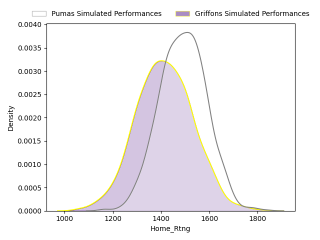
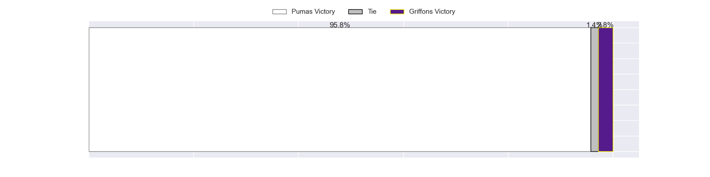
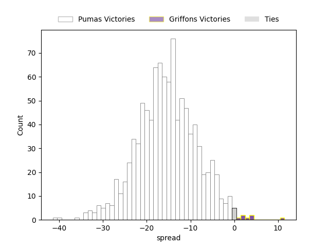

### Golden Lions V Griquas on 2023/04/16

Average Margin: Griquas by 2.5

## Week 7

### Pumas V Western Province on 2023/04/21

Average Margin: Pumas by 13.5

### Blue Bulls V Golden Lions on 2023/04/22

Average Margin: Blue Bulls by 4.6

### Griquas V Griffons on 2023/04/23

Average Margin: Griquas by 12.0

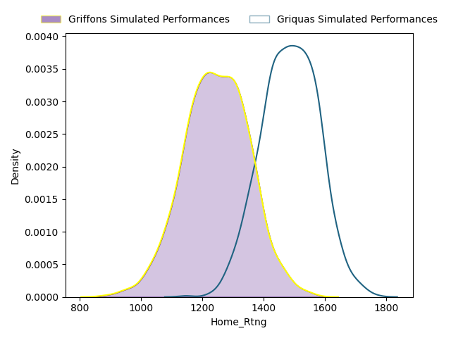
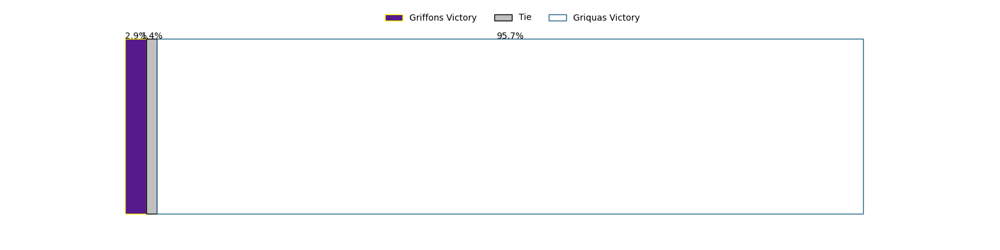
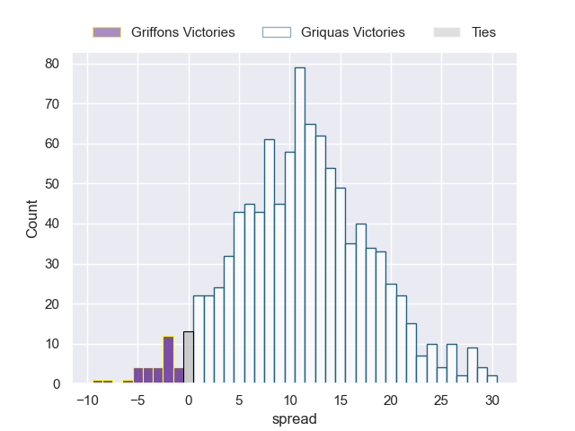

### Free State Cheetahs V Natal Sharks on 2023/04/23

Average Margin: Free State Cheetahs by 12.5

## Week 8

### Golden Lions V Pumas on 2023/04/28

Average Margin: Pumas by 12.2

### Free State Cheetahs V Griffons on 2023/04/28

Average Margin: Free State Cheetahs by 23.2

### Natal Sharks V Griquas on 2023/04/29

Average Margin: Natal Sharks by 5.2

### Western Province V Blue Bulls on 2023/04/29

Average Margin: Western Province by 7.6

## Week 9

### Griquas V Golden Lions on 2023/05/05

Average Margin: Griquas by 9.2

### Pumas V Griffons on 2023/05/05

Average Margin: Pumas by 21.6

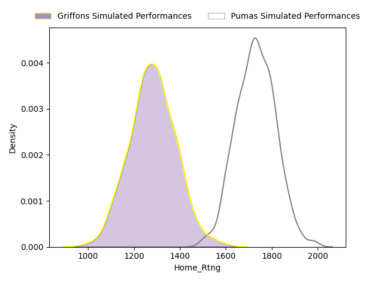
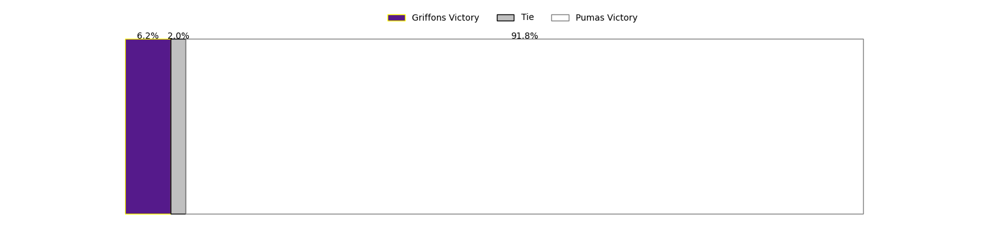
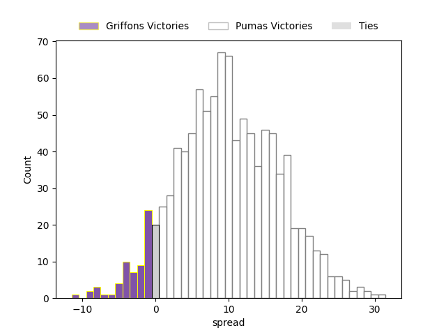

### Free State Cheetahs V Western Province on 2023/05/06

Average Margin: Free State Cheetahs by 13.8

### Blue Bulls V Natal Sharks on 2023/05/06

Average Margin: Natal Sharks by 2.5

## Week 10

### Griffons V Western Province on 2023/05/12

Average Margin: Western Province by 5.4

### Pumas V Natal Sharks on 2023/05/12

Average Margin: Pumas by 10.6

### Griquas V Blue Bulls on 2023/05/13

Average Margin: Griquas by 7.6

### Free State Cheetahs V Golden Lions on 2023/05/13

Average Margin: Free State Cheetahs by 19.4

## Week 11

### Western Province V Pumas on 2023/05/19

Average Margin: Pumas by 6.2

### Natal Sharks V Free State Cheetahs on 2023/05/19

Average Margin: Free State Cheetahs by 5.6

### Griffons V Griquas on 2023/05/20

Average Margin: Griquas by 5.4

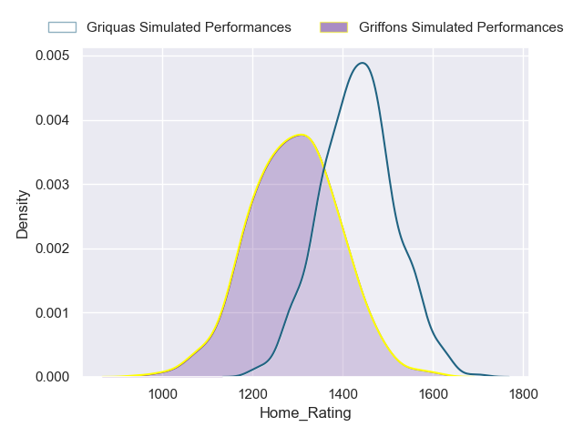
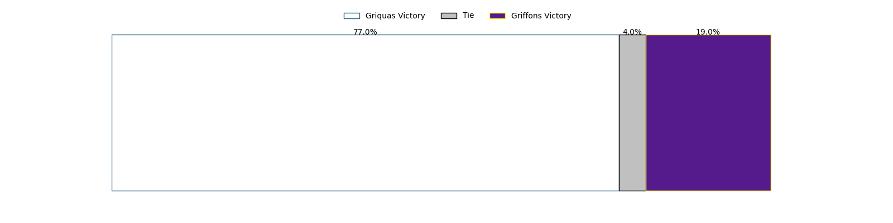
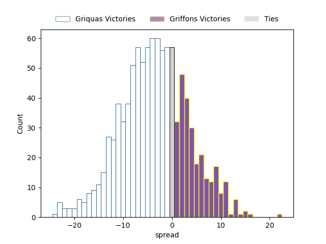

### Golden Lions V Blue Bulls on 2023/05/20

Average Margin: Golden Lions by 2.1

## Week 12

### Natal Sharks V Griffons on 2023/05/26

Average Margin: Natal Sharks by 14.1

### Western Province V Golden Lions on 2023/05/26

Average Margin: Western Province by 8.8

### Free State Cheetahs V Griquas on 2023/05/27

Average Margin: Free State Cheetahs by 14.1

### Pumas V Blue Bulls on 2023/05/27

Average Margin: Pumas by 17.4

## Week 13

### Griquas V Western Province on 2023/06/02

Average Margin: Griquas by 3.4

### Blue Bulls V Griffons on 2023/06/02

Average Margin: Blue Bulls by 7.8

### Pumas V Free State Cheetahs on 2023/06/03

Average Margin: Pumas by 2.0

### Golden Lions V Natal Sharks on 2023/06/03

Average Margin: Natal Sharks by 4.2

## Week 14

### Griquas V Pumas on 2023/06/09

Average Margin: Pumas by 6.2

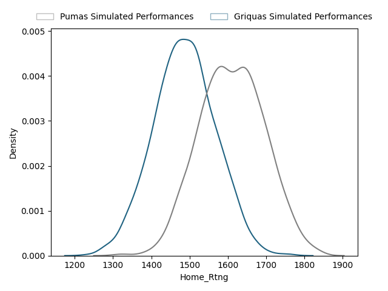
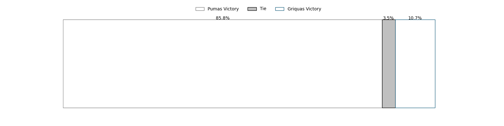
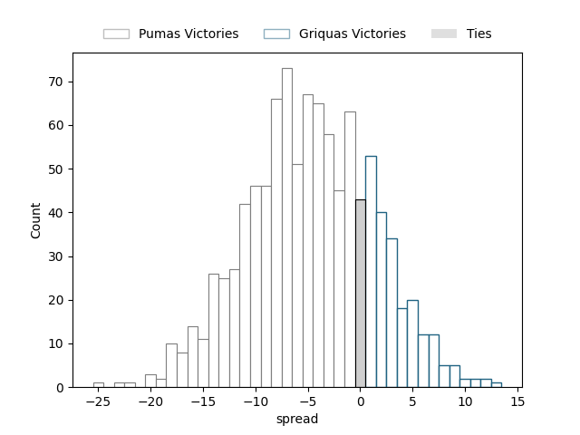

### Golden Lions V Griffons on 2023/06/09

Average Margin: Golden Lions by 6.6

### Blue Bulls V Free State Cheetahs on 2023/06/10

Average Margin: Free State Cheetahs by 11.5

### Western Province V Natal Sharks on 2023/06/10

Average Margin: Western Province by 1.5

