---  
title: "Currie Cup Status"  
date: 2023-04-19 6:00:00 -0500  
categories: model review projection  
layout: article  
aside:  
    toc: true  
---
# Team Rankings

# Standings

## Current Standings

| Club                |   Played |   Wins |   Point Differential |   Losing Bonus Points |   Try Bonus Points |   Competition Points |
|:--------------------|---------:|-------:|---------------------:|----------------------:|-------------------:|---------------------:|
| Pumas               |        5 |      4 |                  103 |                     1 |                nan |                   20 |
| Free State Cheetahs |        5 |      4 |                   85 |                     0 |                nan |                   19 |
| Natal Sharks        |        5 |      3 |                   16 |                     0 |                nan |                   14 |
| Western Province    |        5 |      3 |                   11 |                     0 |                nan |                   14 |
| Golden Lions        |        5 |      2 |                  -33 |                     1 |                nan |                   12 |
| Griquas             |        5 |      2 |                  -48 |                     0 |                nan |                    9 |
| Blue Bulls          |        5 |      1 |                  -48 |                     1 |                nan |                    7 |
| Griffons            |        5 |      1 |                  -86 |                     0 |                nan |                    5 |

## Projected Remaining Table

| Club                |   Matches Remaining |   Wins |   Point Differential |   Losing Bonus Points |   Try Bonus Points |   Competition Points |
|:--------------------|--------------------:|-------:|---------------------:|----------------------:|-------------------:|---------------------:|
| Pumas               |                   8 |    7.1 |                 81   |                   0.6 |                4.8 |                 34.2 |
| Free State Cheetahs |                   8 |    6.7 |                 78.7 |                   0.8 |                5.1 |                 33.1 |
| Griquas             |                   8 |    4.6 |                 13.4 |                   1.7 |                3.6 |                 24   |
| Blue Bulls          |                   8 |    3.7 |                 -3.5 |                   2.3 |                3.2 |                 20.6 |
| Natal Sharks        |                   8 |    3.6 |                 -6   |                   2.2 |                3   |                 20   |
| Western Province    |                   8 |    2.9 |                -26.8 |                   2.1 |                2.9 |                 17.2 |
| Golden Lions        |                   8 |    1.8 |                -49.1 |                   2.4 |                3.3 |                 13.3 |
| Griffons            |                   8 |    0.8 |                -87.7 |                   2   |                2.5 |                  7.8 |

## Projected Total Table

| Club                |   Total Matches |   Wins |   Point Differential |   Losing Bonus Points |   Try Bonus Points |   Competition Points |
|:--------------------|----------------:|-------:|---------------------:|----------------------:|-------------------:|---------------------:|
| Pumas               |              13 |   11.1 |                184   |                   1.6 |                nan |                 54.2 |
| Free State Cheetahs |              13 |   10.7 |                163.7 |                   0.8 |                nan |                 52.1 |
| Natal Sharks        |              13 |    6.6 |                 10   |                   2.2 |                nan |                 34   |
| Griquas             |              13 |    6.6 |                -34.6 |                   1.7 |                nan |                 33   |
| Western Province    |              13 |    5.9 |                -15.8 |                   2.1 |                nan |                 31.2 |
| Blue Bulls          |              13 |    4.7 |                -51.5 |                   3.3 |                nan |                 27.6 |
| Golden Lions        |              13 |    3.8 |                -82.1 |                   3.4 |                nan |                 25.3 |
| Griffons            |              13 |    1.8 |               -173.7 |                   2   |                nan |                 12.8 |

# Completed Match Review

| Match                                            |   Result |   Lineup Prediction |   Minutes Prediction |   Club Prediction |
|:-------------------------------------------------|---------:|--------------------:|---------------------:|------------------:|
| Griquas V Free State Cheetahs on 2023/03/10      |      -23 |                32.9 |                 31.1 |               2.1 |
| Natal Sharks V Griffons on 2023/03/11            |       16 |                -0.4 |                 -8.8 |               8   |
| Golden Lions V Western Province on 2023/03/11    |      -16 |                -6.3 |                 -7.7 |               1.3 |
| Blue Bulls V Pumas on 2023/03/12                 |      -48 |               -22.3 |                -19.1 |               6.5 |
| Pumas V Golden Lions on 2023/03/17               |        7 |                28.6 |                 31.9 |              13.7 |
| Blue Bulls V Western Province on 2023/03/17      |       -8 |                -7   |                 -6.2 |              12.5 |
| Griffons V Free State Cheetahs on 2023/03/19     |      -40 |                -0.6 |                 -2.2 |              -5.1 |
| Griquas V Natal Sharks on 2023/03/19             |        8 |                -5.2 |                 -5.4 |               8.2 |
| Golden Lions V Griffons on 2023/03/24            |       15 |                 7.4 |                  7.8 |               3   |
| Free State Cheetahs V Blue Bulls on 2023/03/24   |       25 |                26.1 |                 26.3 |               4.5 |
| Pumas V Griquas on 2023/03/24                    |       15 |                18.9 |                  5.3 |               5   |
| Western Province V Natal Sharks on 2023/03/26    |      -13 |                20.3 |                 15.8 |               2.7 |
| Griffons V Blue Bulls on 2023/03/31              |        4 |                -5   |                 -7.6 |              -5.1 |
| Free State Cheetahs V Pumas on 2023/03/31        |      -40 |               -14.8 |                -14.5 |               6.5 |
| Western Province V Griquas on 2023/04/01         |      -19 |               nan   |                nan   |               4.4 |
| Western Province V Griffons on 2023/04/08        |       19 |               nan   |                nan   |              11.6 |
| Natal Sharks V Pumas on 2023/04/07               |        7 |               nan   |                nan   |              -3.3 |
| Blue Bulls V Griquas on 2023/04/07               |       37 |               nan   |                nan   |               2.1 |
| Golden Lions V Natal Sharks on 2023/04/01        |       12 |               nan   |                nan   |              -3.1 |
| Golden Lions V Free State Cheetahs on 2023/04/09 |      -37 |               nan   |                nan   |              -8.9 |
| ------ | ------ | ------ | ------ | ------ |
| Average Error |       - | 18.8 | 19.9 | 20.0 |
| Correct Winner |       - | 64.3% | 64.3% | 50.0% |

# Future Predictions

## Week 6

### Pumas V Western Province on 2023/04/21

Average Margin: Pumas by 13.6

### Blue Bulls V Golden Lions on 2023/04/22

Average Margin: Blue Bulls by 8.3

### Griquas V Griffons on 2023/04/23

Average Margin: Griquas by 11.4

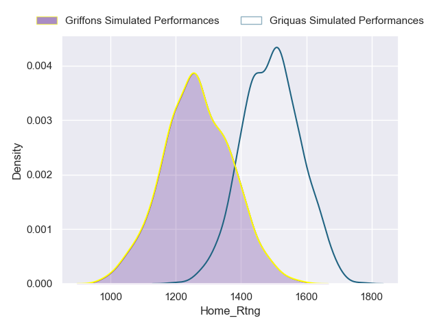
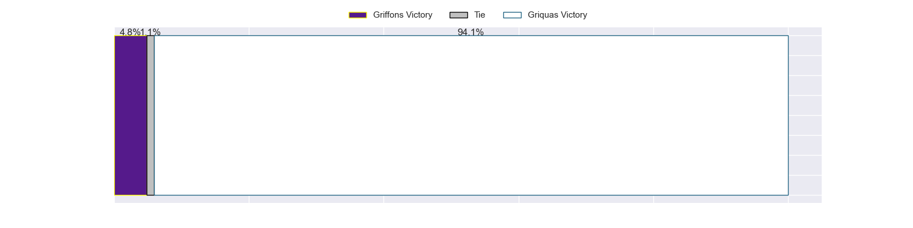
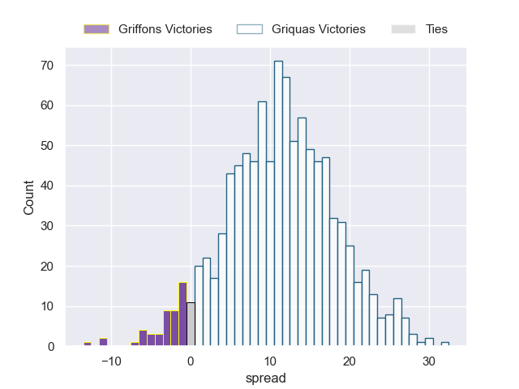

### Free State Cheetahs V Natal Sharks on 2023/04/23

Average Margin: Free State Cheetahs by 10.8

## Week 7

### Golden Lions V Pumas on 2023/04/28

Average Margin: Pumas by 10.4

### Free State Cheetahs V Griffons on 2023/04/28

Average Margin: Free State Cheetahs by 19.8

### Natal Sharks V Griquas on 2023/04/29

Average Margin: Natal Sharks by 4.4

### Western Province V Blue Bulls on 2023/04/29

Average Margin: Western Province by 2.7

## Week 8

### Griquas V Golden Lions on 2023/05/05

Average Margin: Griquas by 8.7

### Pumas V Griffons on 2023/05/05

Average Margin: Pumas by 19.9

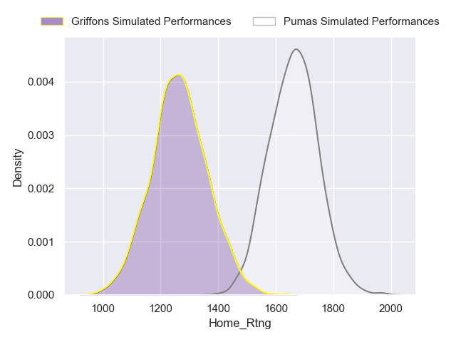
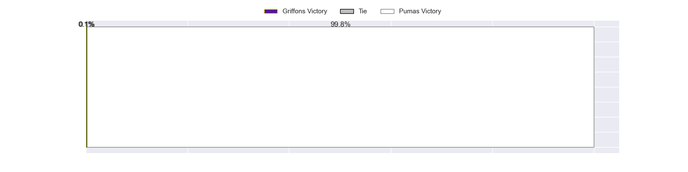
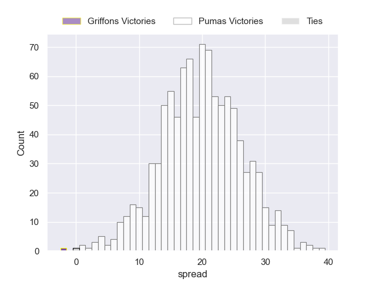

### Free State Cheetahs V Western Province on 2023/05/06

Average Margin: Free State Cheetahs by 13.4

### Blue Bulls V Natal Sharks on 2023/05/06

Average Margin: Blue Bulls by 1.5

## Week 9

### Griffons V Western Province on 2023/05/12

Average Margin: Western Province by 2.9

### Pumas V Natal Sharks on 2023/05/12

Average Margin: Pumas by 10.3

### Griquas V Blue Bulls on 2023/05/13

Average Margin: Griquas by 4.4

### Free State Cheetahs V Golden Lions on 2023/05/13

Average Margin: Free State Cheetahs by 16.8

## Week 10

### Western Province V Pumas on 2023/05/19

Average Margin: Pumas by 6.9

### Natal Sharks V Free State Cheetahs on 2023/05/19

Average Margin: Free State Cheetahs by 3.5

### Griffons V Griquas on 2023/05/20

Average Margin: Griquas by 4.7

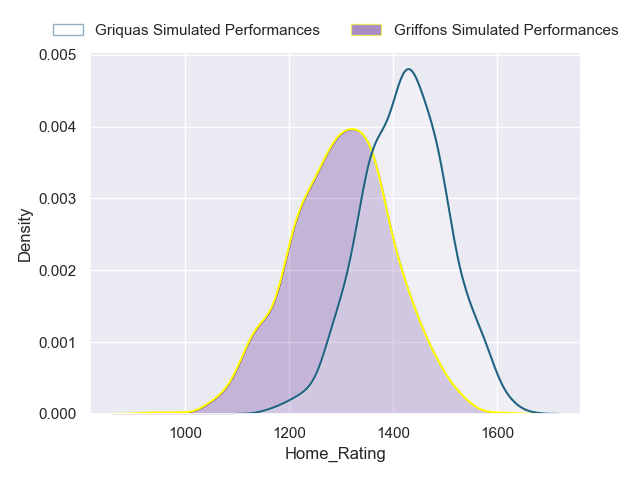
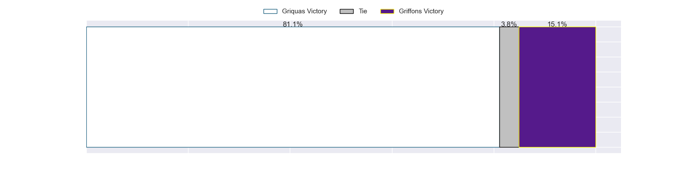
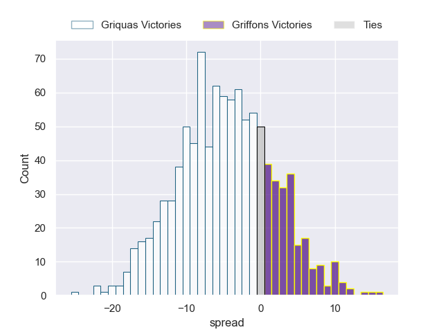

### Golden Lions V Blue Bulls on 2023/05/20

Average Margin: Blue Bulls by 1.3

## Week 11

### Natal Sharks V Griffons on 2023/05/26

Average Margin: Natal Sharks by 12.8

### Western Province V Golden Lions on 2023/05/26

Average Margin: Western Province by 6.5

### Free State Cheetahs V Griquas on 2023/05/27

Average Margin: Free State Cheetahs by 11.9

### Pumas V Blue Bulls on 2023/05/27

Average Margin: Pumas by 12.0

## Week 12

### Griquas V Western Province on 2023/06/02

Average Margin: Griquas by 5.1

### Blue Bulls V Griffons on 2023/06/02

Average Margin: Blue Bulls by 10.3

### Pumas V Free State Cheetahs on 2023/06/03

Average Margin: Pumas by 3.2

### Golden Lions V Natal Sharks on 2023/06/03

Average Margin: Natal Sharks by 3.1

## Week 13

### Griquas V Pumas on 2023/06/09

Average Margin: Pumas by 4.6

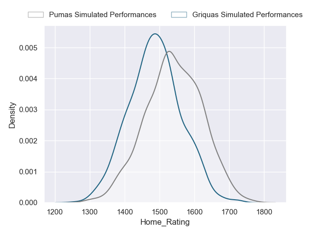
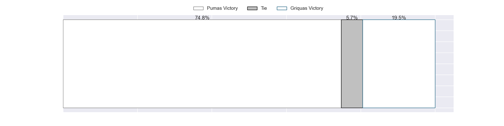
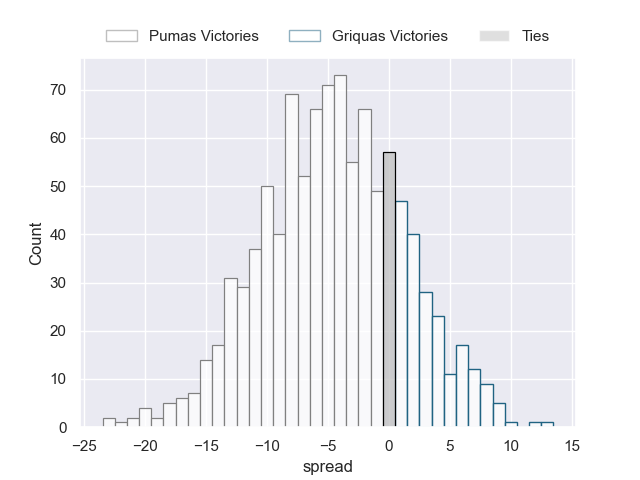

### Golden Lions V Griffons on 2023/06/09

Average Margin: Golden Lions by 6.0

### Blue Bulls V Free State Cheetahs on 2023/06/10

Average Margin: Free State Cheetahs by 5.7

### Western Province V Natal Sharks on 2023/06/10

Average Margin: Western Province by 0.1

