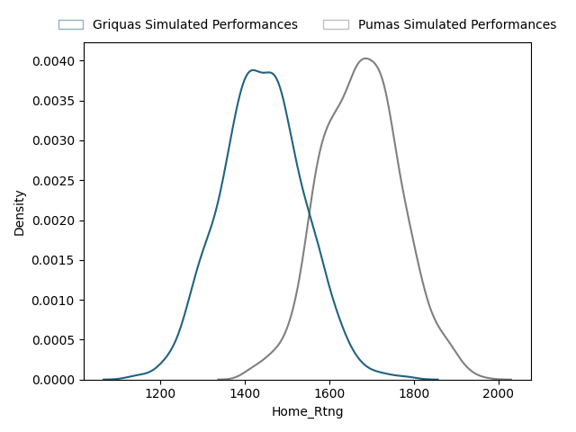
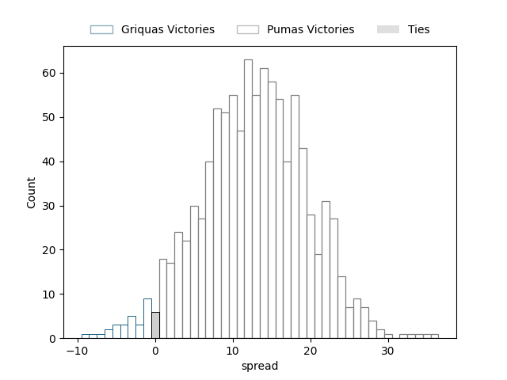

---  
layout: page  
title: Currie Cup Status  
date:   
categories: model review projection  
---
# Currie Cup Status

# Completed Match Review

| Match                                         |   Result |   Lineup Prediction |   Minutes Prediction |   Club Prediction |
|:----------------------------------------------|---------:|--------------------:|---------------------:|------------------:|
| Griquas V Free State Cheetahs on 2023/03/10   |      -23 |                47.7 |                 47.7 |               2.1 |
| Natal Sharks V Griffons on 2023/03/11         |       16 |                -7.7 |                -16.3 |               8   |
| Golden Lions V Western Province on 2023/03/11 |      -16 |               -11.1 |                -12.8 |               1.3 |
| Blue Bulls V Pumas on 2023/03/12              |      -48 |               nan   |                nan   |               6.5 |
| ------ | ------ | ------ | ------ | ------ |
| Average Error |       - | 33.1 | 35.4 | 26.2 |
| Correct Winner |       - | 33.3% | 33.3% | 25.0% |

## Future Club-Level Match Predictions

### Week 2

#### Pumas V Golden Lions on 2023/03/17

Average Margin: Pumas by 17.8

#### Blue Bulls V Western Province on 2023/03/17

Average Margin: Blue Bulls by 5.5

#### Griffons V Free State Cheetahs on 2023/03/19

Average Margin: Free State Cheetahs by 9.8

#### Griquas V Natal Sharks on 2023/03/19

Average Margin: Griquas by 3.8

### Week 3

#### Golden Lions V Griffons on 2023/03/24

Average Margin: Golden Lions by 0.7

#### Pumas V Griquas on 2023/03/24

Average Margin: Pumas by 9.3

#### Natal Sharks V Western Province on 2023/03/26

Average Margin: Natal Sharks by 4.4

#### Free State Cheetahs V Blue Bulls on 2023/03/26

Average Margin: Free State Cheetahs by 9.1

### Week 4

#### Griffons V Blue Bulls on 2023/03/31

Average Margin: Blue Bulls by 4.0

#### Free State Cheetahs V Pumas on 2023/03/31

Average Margin: Free State Cheetahs by 4.6

#### Natal Sharks V Golden Lions on 2023/04/01

Average Margin: Natal Sharks by 11.4

#### Western Province V Griquas on 2023/04/01

Average Margin: Western Province by 2.2

### Week 5

#### Blue Bulls V Griquas on 2023/04/07

Average Margin: Blue Bulls by 4.4

#### Natal Sharks V Pumas on 2023/04/07

Average Margin: Pumas by 2.9

#### Golden Lions V Free State Cheetahs on 2023/04/09

Average Margin: Free State Cheetahs by 12.0

#### Western Province V Griffons on 2023/04/09

Average Margin: Western Province by 8.1

### Week 6

#### Natal Sharks V Blue Bulls on 2023/04/14

Average Margin: Natal Sharks by 1.6

#### Western Province V Free State Cheetahs on 2023/04/15

Average Margin: Free State Cheetahs by 4.7

#### Griffons V Pumas on 2023/04/16

Average Margin: Pumas by 8.4

#### Golden Lions V Griquas on 2023/04/16

Average Margin: Griquas by 5.2

### Week 7

#### Pumas V Western Province on 2023/04/21

Average Margin: Pumas by 10.5

#### Blue Bulls V Golden Lions on 2023/04/22

Average Margin: Blue Bulls by 13.1

#### Griquas V Griffons on 2023/04/23

Average Margin: Griquas by 9.3

#### Free State Cheetahs V Natal Sharks on 2023/04/23

Average Margin: Free State Cheetahs by 10.8

### Week 8

#### Golden Lions V Pumas on 2023/04/28

Average Margin: Pumas by 11.0

#### Free State Cheetahs V Griffons on 2023/04/28

Average Margin: Free State Cheetahs by 16.2

#### Natal Sharks V Griquas on 2023/04/29

Average Margin: Natal Sharks by 2.8

#### Western Province V Blue Bulls on 2023/04/29

Average Margin: Western Province by 1.0

### Week 9

#### Griquas V Golden Lions on 2023/05/05

Average Margin: Griquas by 11.6

#### Pumas V Griffons on 2023/05/05

Average Margin: Pumas by 14.5

#### Free State Cheetahs V Western Province on 2023/05/06

Average Margin: Free State Cheetahs by 11.2

#### Blue Bulls V Natal Sharks on 2023/05/06

Average Margin: Blue Bulls by 4.6

### Week 10

#### Griffons V Western Province on 2023/05/12

Average Margin: Western Province by 1.0

#### Pumas V Natal Sharks on 2023/05/12

Average Margin: Pumas by 9.6

#### Griquas V Blue Bulls on 2023/05/13

Average Margin: Griquas by 2.0

#### Free State Cheetahs V Golden Lions on 2023/05/13

Average Margin: Free State Cheetahs by 18.4

### Week 11

#### Western Province V Pumas on 2023/05/19

Average Margin: Pumas by 3.7

#### Natal Sharks V Free State Cheetahs on 2023/05/19

Average Margin: Free State Cheetahs by 4.1

#### Griffons V Griquas on 2023/05/20

Average Margin: Griquas by 2.1

#### Golden Lions V Blue Bulls on 2023/05/20

Average Margin: Blue Bulls by 5.8

### Week 12

#### Natal Sharks V Griffons on 2023/05/26

Average Margin: Natal Sharks by 8.1

#### Western Province V Golden Lions on 2023/05/26

Average Margin: Western Province by 10.3

#### Free State Cheetahs V Griquas on 2023/05/27

Average Margin: Free State Cheetahs by 10.2

#### Pumas V Blue Bulls on 2023/05/27

Average Margin: Pumas by 8.1

### Week 13

#### Griquas V Western Province on 2023/06/02

Average Margin: Griquas by 4.4

#### Blue Bulls V Griffons on 2023/06/02

Average Margin: Blue Bulls by 10.1

#### Pumas V Free State Cheetahs on 2023/06/03

Average Margin: Pumas by 2.5

#### Golden Lions V Natal Sharks on 2023/06/03

Average Margin: Natal Sharks by 4.3

### Week 14

#### Griquas V Pumas on 2023/06/09

Average Margin: Pumas by 2.0

#### Golden Lions V Griffons on 2023/06/09

Average Margin: Golden Lions by 0.7

#### Blue Bulls V Free State Cheetahs on 2023/06/10

Average Margin: Free State Cheetahs by 2.6

#### Western Province V Natal Sharks on 2023/06/10

Average Margin: Western Province by 2.7

