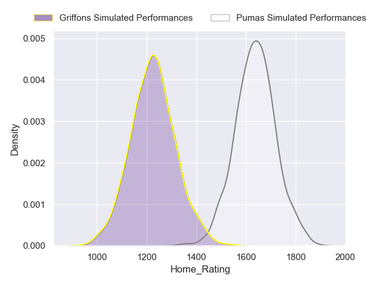
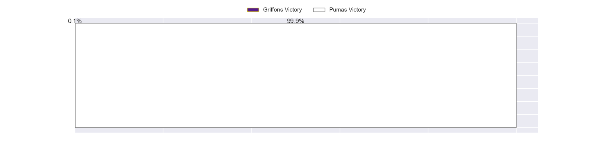
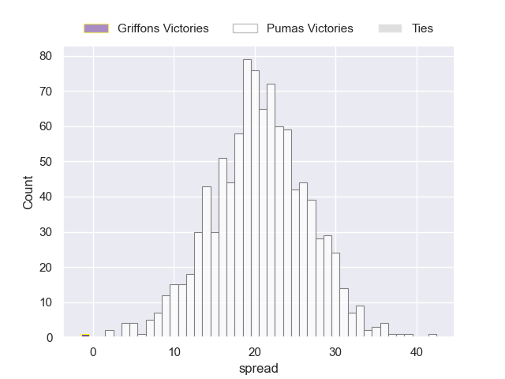
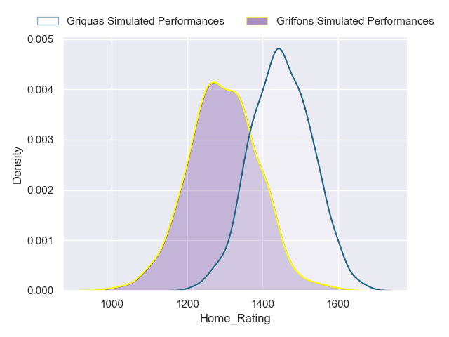
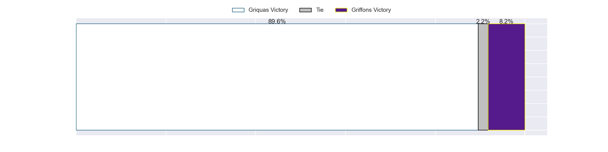
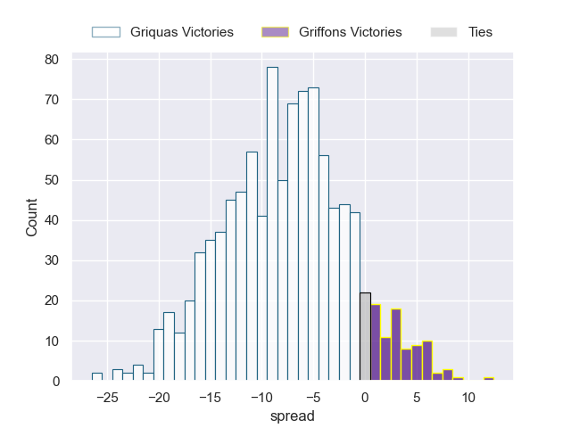
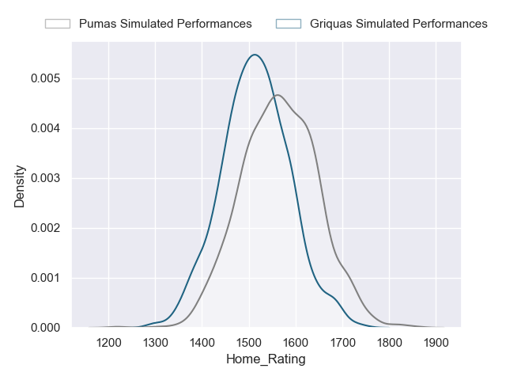
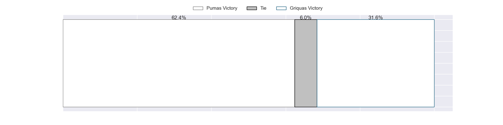
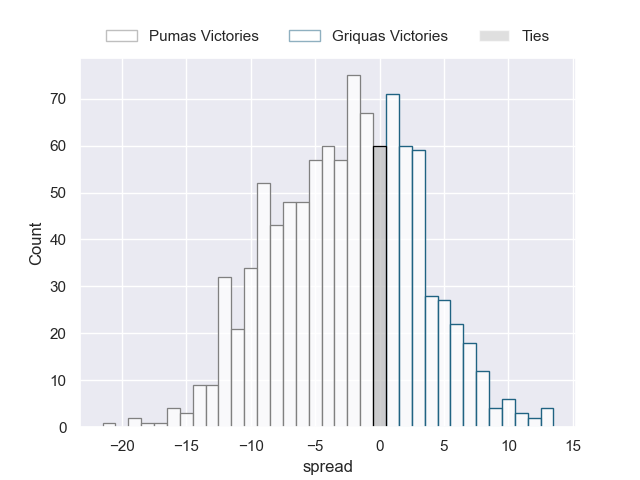

---  
title: "Currie Cup Status"  
date: 2023-04-28 6:00:00 -0500  
categories: model review projection  
layout: article  
aside:  
    toc: true  
---
# Current Team Rankings

# Standings

## Current Standings

| Club                |   Played |   Wins |   Point Differential |   Losing Bonus Points |   Try Bonus Points |   Competition Points |
|:--------------------|---------:|-------:|---------------------:|----------------------:|-------------------:|---------------------:|
| Free State Cheetahs |        8 |      6 |                  124 |                     1 |                  6 |                   31 |
| Pumas               |        8 |      6 |                  155 |                     2 |                  4 |                   30 |
| Griquas             |        9 |      5 |                  -44 |                     0 |                  4 |                   24 |
| Natal Sharks        |        9 |      5 |                   14 |                     1 |                  2 |                   23 |
| Blue Bulls          |        8 |      4 |                    4 |                     1 |                  5 |                   22 |
| Western Province    |        9 |      4 |                    1 |                     1 |                  4 |                   21 |
| Golden Lions        |        9 |      3 |                  -76 |                     2 |                  5 |                   19 |
| Griffons            |        8 |      1 |                 -178 |                     0 |                  4 |                    8 |

## Projected Remaining Table

| Club                |   Matches Remaining |   Wins |   Point Differential |   Losing Bonus Points |   Try Bonus Points |   Competition Points |
|:--------------------|--------------------:|-------:|---------------------:|----------------------:|-------------------:|---------------------:|
| Pumas               |                   7 |    6   |                 58.4 |                   0.9 |                5.9 |                 30.8 |
| Free State Cheetahs |                   7 |    5.8 |                 67   |                   1   |                5.6 |                 29.6 |
| Griquas             |                   7 |    4.1 |                 10.4 |                   1.7 |                3.9 |                 21.7 |
| Blue Bulls          |                   7 |    3.9 |                 11.5 |                   2   |                3.6 |                 21   |
| Natal Sharks        |                   7 |    3.6 |                  5.9 |                   2   |                3.4 |                 19.8 |
| Western Province    |                   7 |    2.7 |                -18.9 |                   2.1 |                2.5 |                 15.4 |
| Golden Lions        |                   7 |    1.6 |                -43.9 |                   2   |                1.5 |                  9.7 |
| Griffons            |                   7 |    0.4 |                -90.8 |                   1.4 |                0.5 |                  3.7 |

## Projected Total Table

| Club                |   Total Matches |   Wins |   Point Differential |   Losing Bonus Points |   Try Bonus Points |   Competition Points |
|:--------------------|----------------:|-------:|---------------------:|----------------------:|-------------------:|---------------------:|
| Pumas               |              15 |   12   |                213.4 |                   2.9 |                9.9 |                 60.8 |
| Free State Cheetahs |              15 |   11.8 |                191   |                   2   |               11.6 |                 60.6 |
| Griquas             |              16 |    9.1 |                -33.6 |                   1.7 |                7.9 |                 45.7 |
| Blue Bulls          |              15 |    7.9 |                 15.5 |                   3   |                8.6 |                 43   |
| Natal Sharks        |              16 |    8.6 |                 19.9 |                   3   |                5.4 |                 42.8 |
| Western Province    |              16 |    6.7 |                -17.9 |                   3.1 |                6.5 |                 36.4 |
| Golden Lions        |              16 |    4.6 |               -119.9 |                   4   |                6.5 |                 28.7 |
| Griffons            |              15 |    1.4 |               -268.8 |                   1.4 |                4.5 |                 11.7 |

# Completed Match Review

| Model | Percent Correct Predictions | Spread Error |
| ------ | ------ | ------ |
| Club Level | 57.1% | 18.1 |
| Player Level: Lineup | 67.9% | 18.6 |
| Player Level: Minutes | 60.7% | 18.3 |

# Future Predictions

## Week 9

### Free State Cheetahs V Griffons on 2023/04/28

Average Margin: Free State Cheetahs by 21.2

### Golden Lions V Pumas on 2023/04/28

Average Margin: Pumas by 9.6

### Natal Sharks V Griquas on 2023/04/29

Average Margin: Natal Sharks by 3.8

### Western Province V Blue Bulls on 2023/04/29

Average Margin: Blue Bulls by 1.5

## Week 10

### Griquas V Golden Lions on 2023/05/05

Average Margin: Griquas by 10.2

### Pumas V Griffons on 2023/05/05

Average Margin: Pumas by 20.6

### Blue Bulls V Natal Sharks on 2023/05/06

Average Margin: Blue Bulls by 4.2

### Free State Cheetahs V Western Province on 2023/05/06

Average Margin: Free State Cheetahs by 14.4

## Week 11

### Pumas V Natal Sharks on 2023/05/12

Average Margin: Pumas by 9.2

### Griffons V Western Province on 2023/05/12

Average Margin: Western Province by 4.4

### Griquas V Blue Bulls on 2023/05/13

Average Margin: Griquas by 2.3

### Free State Cheetahs V Golden Lions on 2023/05/13

Average Margin: Free State Cheetahs by 17.2

## Week 12

### Natal Sharks V Free State Cheetahs on 2023/05/19

Average Margin: Free State Cheetahs by 3.8

### Western Province V Pumas on 2023/05/19

Average Margin: Pumas by 6.4

### Griffons V Griquas on 2023/05/20

Average Margin: Griquas by 7.8

### Golden Lions V Blue Bulls on 2023/05/20

Average Margin: Blue Bulls by 4.5

## Week 13

### Natal Sharks V Griffons on 2023/05/26

Average Margin: Natal Sharks by 14.9

### Western Province V Golden Lions on 2023/05/26

Average Margin: Western Province by 6.3

### Pumas V Blue Bulls on 2023/05/27

Average Margin: Pumas by 8.4

### Free State Cheetahs V Griquas on 2023/05/27

Average Margin: Free State Cheetahs by 10.3

## Week 14

### Griquas V Western Province on 2023/06/02

Average Margin: Griquas by 7.1

### Blue Bulls V Griffons on 2023/06/02

Average Margin: Blue Bulls by 15.0

### Golden Lions V Natal Sharks on 2023/06/03

Average Margin: Natal Sharks by 4.0

### Pumas V Free State Cheetahs on 2023/06/03

Average Margin: Pumas by 2.1

## Week 15

### Griquas V Pumas on 2023/06/09

Average Margin: Pumas by 2.6

### Golden Lions V Griffons on 2023/06/09

Average Margin: Golden Lions by 7.5

### Blue Bulls V Free State Cheetahs on 2023/06/10

Average Margin: Free State Cheetahs by 2.7

### Western Province V Natal Sharks on 2023/06/10

Average Margin: Natal Sharks by 0.6

