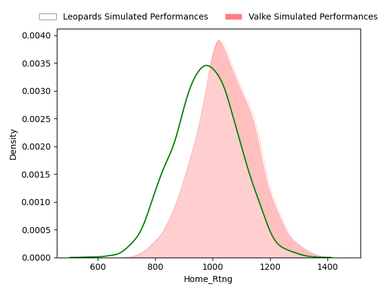
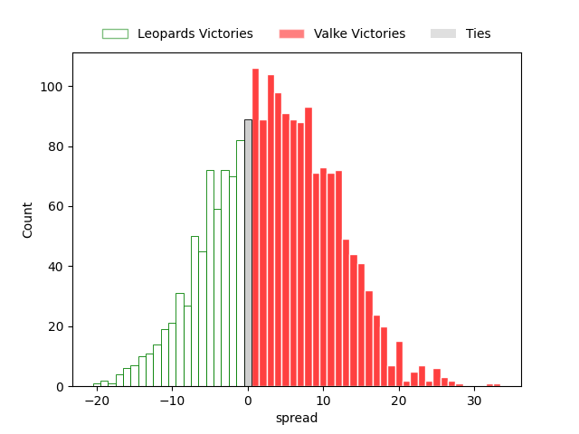
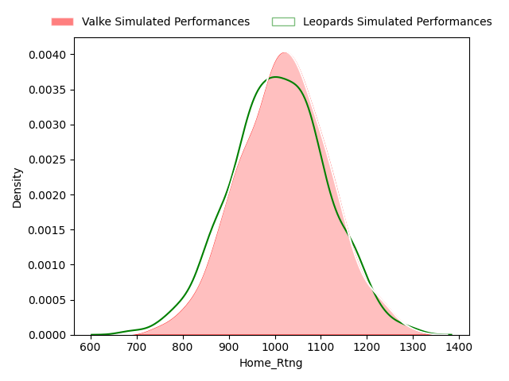
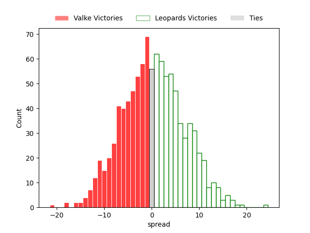

---  
layout: page  
title: Currie Cup First Division Status  
date:   
categories: model review projection  
---
# Currie Cup First Division Status

# Completed Match Review

| Match                                             |   Result |   Lineup Prediction |   Minutes Prediction |   Club Prediction |
|:--------------------------------------------------|---------:|--------------------:|---------------------:|------------------:|
| Eastern Province Kings V SWD Eagles on 2023/02/11 |       10 |               111.4 |                111.3 |              10.4 |
| Boland Cavaliers V Valke on 2023/02/11            |       26 |               nan   |                nan   |               3   |
| Boland Cavaliers V Border Bulldogs on 2023/02/25  |       51 |               nan   |                nan   |              24.6 |
| Leopards V Border Bulldogs on 2023/02/11          |       31 |               nan   |                nan   |              27.5 |
| Leopards V Eastern Province Kings on 2023/02/18   |      -14 |               nan   |                nan   |               2.6 |
| Eastern Province Kings V Valke on 2023/02/25      |        4 |               nan   |                nan   |               7.8 |
| Border Bulldogs V Valke on 2023/02/18             |      -16 |               nan   |                nan   |             -17.1 |
| SWD Eagles V Boland Cavaliers on 2023/02/18       |      -17 |               nan   |                nan   |               3.4 |
| SWD Eagles V Leopards on 2023/02/24               |       33 |               nan   |                nan   |               0.5 |
| ------ | ------ | ------ | ------ | ------ |
| Average Error |       - | 101.4 | 101.3 | 14.2 |
| Correct Winner |       - | 100.0% | 100.0% | 77.8% |

## Future Club-Level Match Predictions

### Week 4

#### Valke V Leopards on 2023/03/04

Average Margin: Valke by 2.0

#### Border Bulldogs V SWD Eagles on 2023/03/04

Average Margin: SWD Eagles by 19.7

#### Boland Cavaliers V Eastern Province Kings on 2023/03/04

Average Margin: Eastern Province Kings by 0.9

### Week 5

#### Eastern Province Kings V Border Bulldogs on 2023/03/11

Average Margin: Eastern Province Kings by 30.6

#### Valke V SWD Eagles on 2023/03/11

Average Margin: Valke by 0.7

#### Leopards V Boland Cavaliers on 2023/03/11

Average Margin: Boland Cavaliers by 8.2

### Week 6

#### SWD Eagles V Eastern Province Kings on 2023/03/24

Average Margin: Eastern Province Kings by 4.4

### Week 7

#### Valke V Border Bulldogs on 2023/04/01

Average Margin: Valke by 23.7

### Week 8

#### SWD Eagles V Valke on 2023/04/14

Average Margin: Valke by 0.7

#### Eastern Province Kings V Leopards on 2023/04/15

Average Margin: Eastern Province Kings by 12.3

### Week 9

#### Valke V Boland Cavaliers on 2023/04/22

Average Margin: Boland Cavaliers by 2.7

#### Leopards V SWD Eagles on 2023/04/22

Average Margin: Leopards by 2.0

### Week 10

#### SWD Eagles V Border Bulldogs on 2023/04/28

Average Margin: SWD Eagles by 19.7

#### Boland Cavaliers V Leopards on 2023/04/29

Average Margin: Boland Cavaliers by 8.2

### Week 11

#### Eastern Province Kings V Boland Cavaliers on 2023/05/13

Average Margin: Eastern Province Kings by 0.9

### Week 13

#### Leopards V Valke on 2023/06/03

Average Margin: Valke by 2.0

### Week 12

#### Boland Cavaliers V SWD Eagles on 2023/05/20

Average Margin: Boland Cavaliers by 10.1

#### Valke V Eastern Province Kings on 2023/05/20

Average Margin: Eastern Province Kings by 2.9

