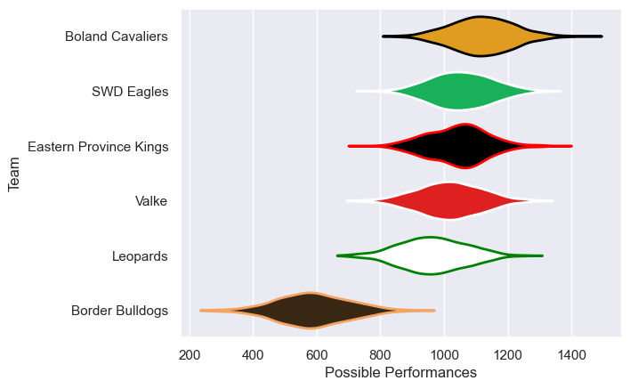
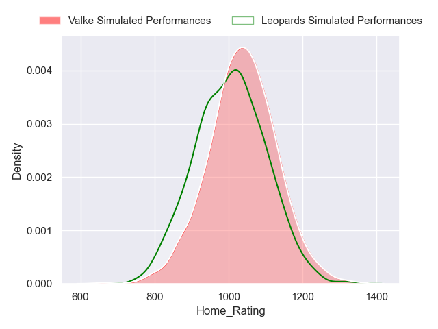
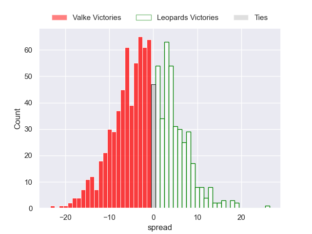

---  
title: "Currie Cup First Division Status"  
date: 2023-04-28 6:00:00 -0500  
categories: model review projection  
layout: article  
aside:  
    toc: true  
---
# Current Team Rankings

# Standings

## Current Standings

| Club                   |   Played |   Wins |   Point Differential |   Losing Bonus Points |   Try Bonus Points |   Competition Points |
|:-----------------------|---------:|-------:|---------------------:|----------------------:|-------------------:|---------------------:|
| SWD Eagles             |        8 |      5 |                   68 |                     1 |                nan |                   21 |
| Valke                  |        8 |      5 |                   55 |                     1 |                nan |                   21 |
| Eastern Province Kings |        7 |      5 |                   17 |                     0 |                nan |                   20 |
| Boland Cavaliers       |        6 |      4 |                   93 |                     1 |                nan |                   17 |
| Leopards               |        7 |      2 |                  -43 |                     1 |                nan |                    9 |
| Border Bulldogs        |        6 |      0 |                 -190 |                     1 |                nan |                    1 |

## Projected Remaining Table

| Club                   |   Matches Remaining |   Wins |   Point Differential |   Losing Bonus Points |   Try Bonus Points |   Competition Points |
|:-----------------------|--------------------:|-------:|---------------------:|----------------------:|-------------------:|---------------------:|
| Boland Cavaliers       |                   3 |    2.2 |                 14.7 |                   0.6 |                2.1 |                 11.4 |
| Valke                  |                   2 |    1.3 |                  4.4 |                   0.6 |                1.2 |                  6.9 |
| SWD Eagles             |                   2 |    1.2 |                 21.3 |                   0.4 |                1.2 |                  6.6 |
| Eastern Province Kings |                   2 |    0.9 |                 -2.3 |                   0.7 |                0.8 |                  5   |
| Leopards               |                   2 |    0.5 |                -12.2 |                   0.6 |                0.5 |                  2.9 |
| Border Bulldogs        |                   1 |    0   |                -26   |                   0   |                0   |                  0   |

## Projected Total Table

| Club                   |   Total Matches |   Wins |   Point Differential |   Losing Bonus Points |   Try Bonus Points |   Competition Points |
|:-----------------------|----------------:|-------:|---------------------:|----------------------:|-------------------:|---------------------:|
| Boland Cavaliers       |               9 |    6.2 |                107.7 |                   1.6 |                2.1 |                 28.4 |
| Valke                  |              10 |    6.3 |                 59.4 |                   1.6 |                1.2 |                 27.9 |
| SWD Eagles             |              10 |    6.2 |                 89.3 |                   1.4 |                1.2 |                 27.6 |
| Eastern Province Kings |               9 |    5.9 |                 14.7 |                   0.7 |                0.8 |                 25   |
| Leopards               |               9 |    2.5 |                -55.2 |                   1.6 |                0.5 |                 11.9 |
| Border Bulldogs        |               7 |    0   |               -216   |                   1   |                0   |                  1   |

# Completed Match Review

| Model | Percent Correct Predictions | Spread Error |
| ------ | ------ | ------ |
| Club Level | 71.4% | 12.4 |
| Player Level: Lineup | 75.0% | 15.3 |
| Player Level: Minutes | 75.0% | 16.7 |

# Future Predictions

## Week 7

### SWD Eagles V Border Bulldogs on 2023/04/28

Average Margin: SWD Eagles by 26.5

### Boland Cavaliers V Leopards on 2023/04/29

Average Margin: Boland Cavaliers by 11.0

## Week 8

### Eastern Province Kings V Boland Cavaliers on 2023/05/13

Average Margin: Eastern Province Kings by 0.5

## Week 9

### Valke V Eastern Province Kings on 2023/05/20

Average Margin: Valke by 3.0

### Boland Cavaliers V SWD Eagles on 2023/05/20

Average Margin: Boland Cavaliers by 4.7

## Week 10

### Leopards V Valke on 2023/06/03

Average Margin: Valke by 1.6

