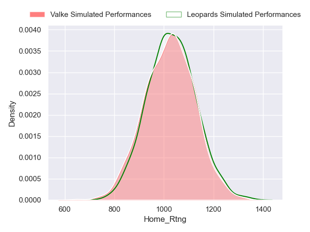
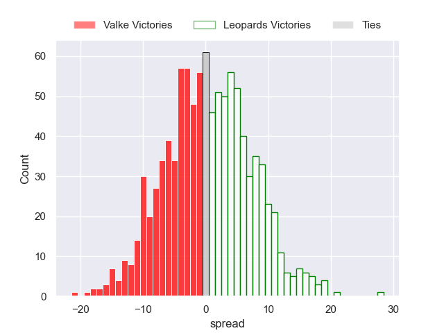

---  
title: "Currie Cup First Division Status"  
date: 2023-04-19 6:00:00 -0500  
categories: model review projection  
layout: article  
aside:  
    toc: true  
---
# Team Rankings

# Standings

## Current Standings

| Club                   |   Played |   Wins |   Point Differential |   Losing Bonus Points |   Try Bonus Points |   Competition Points |
|:-----------------------|---------:|-------:|---------------------:|----------------------:|-------------------:|---------------------:|
| Boland Cavaliers       |        7 |      5 |                  110 |                     2 |                  0 |                   22 |
| SWD Eagles             |        7 |      4 |                   89 |                     1 |                  0 |                   17 |
| Eastern Province Kings |        7 |      4 |                    4 |                     0 |                  0 |                   16 |
| Valke                  |        5 |      3 |                    8 |                     1 |                  0 |                   13 |
| Leopards               |        6 |      3 |                  -30 |                     0 |                  0 |                   12 |
| Border Bulldogs        |        6 |      0 |                 -181 |                     1 |                  0 |                    1 |

## Projected Remaining Table

| Club                   |   Matches Remaining |   Wins |   Point Differential |   Losing Bonus Points |   Try Bonus Points |   Competition Points |
|:-----------------------|--------------------:|-------:|---------------------:|----------------------:|-------------------:|---------------------:|
| Boland Cavaliers       |                   4 |    2.8 |                 20.3 |                   0.8 |                0.3 |                 12.6 |
| SWD Eagles             |                   3 |    1.7 |                 20.5 |                   0.6 |                0.2 |                  7.7 |
| Valke                  |                   3 |    1.4 |                 -0.6 |                   1   |                0.1 |                  7   |
| Leopards               |                   3 |    1   |                -11.7 |                   0.9 |                0.2 |                  5.2 |
| Eastern Province Kings |                   2 |    0.8 |                 -2   |                   0.7 |                0.1 |                  4.4 |
| Border Bulldogs        |                   1 |    0   |                -26.6 |                   0   |                0   |                  0   |

## Projected Total Table

| Club                   |   Total Matches |   Wins |   Point Differential |   Losing Bonus Points |   Try Bonus Points |   Competition Points |
|:-----------------------|----------------:|-------:|---------------------:|----------------------:|-------------------:|---------------------:|
| Boland Cavaliers       |              11 |    7.8 |                130.3 |                   2.8 |                0.3 |                 34.6 |
| SWD Eagles             |              10 |    5.7 |                109.5 |                   1.6 |                0.2 |                 24.7 |
| Eastern Province Kings |               9 |    4.8 |                  2   |                   0.7 |                0.1 |                 20.4 |
| Valke                  |               8 |    4.4 |                  7.4 |                   2   |                0.1 |                 20   |
| Leopards               |               9 |    4   |                -41.7 |                   0.9 |                0.2 |                 17.2 |
| Border Bulldogs        |               7 |    0   |               -207.6 |                   1   |                0   |                  1   |

# Completed Match Review

| Match                                                   |   Result |   Lineup Prediction |   Minutes Prediction |   Club Prediction |
|:--------------------------------------------------------|---------:|--------------------:|---------------------:|------------------:|
| Boland Cavaliers V Valke on 2023/02/11                  |       26 |                 1.4 |                 -0.6 |               3   |
| Eastern Province Kings V SWD Eagles on 2023/02/11       |       10 |                 7.3 |                 -5.2 |              10.4 |
| Leopards V Border Bulldogs on 2023/02/11                |       31 |                29.7 |                 29.8 |              27.5 |
| Border Bulldogs V Valke on 2023/02/18                   |      -16 |                -4.9 |                 -3.1 |             -17.1 |
| Leopards V Eastern Province Kings on 2023/02/18         |      -14 |                16.1 |                 16.1 |               2.6 |
| SWD Eagles V Boland Cavaliers on 2023/02/18             |      -17 |                 0.3 |                  7.3 |               3.4 |
| SWD Eagles V Leopards on 2023/02/24                     |       33 |                -0.9 |                 -6   |               0.5 |
| Boland Cavaliers V Border Bulldogs on 2023/02/25        |       51 |                32.4 |                 22.8 |              24.6 |
| Eastern Province Kings V Valke on 2023/02/25            |        4 |                16   |                 14.1 |               7.8 |
| Boland Cavaliers V Eastern Province Kings on 2023/03/04 |        9 |                 9.6 |                  7.7 |               3.7 |
| Border Bulldogs V SWD Eagles on 2023/03/04              |      -38 |               -20.8 |                -18.7 |             -15.1 |
| Valke V Leopards on 2023/03/04                          |       16 |                25.8 |                 25.4 |               6.7 |
| Eastern Province Kings V Border Bulldogs on 2023/03/11  |        7 |                37.8 |                 38.5 |              31.9 |
| Leopards V Boland Cavaliers on 2023/03/11               |        1 |               -18.6 |                -11.1 |              -3.8 |
| Valke V SWD Eagles on 2023/03/11                        |        6 |                -4.9 |                 -2.4 |               5.4 |
| SWD Eagles V Eastern Province Kings on 2023/03/25       |       13 |                 7.2 |                  7.2 |              -3.3 |
| ------ | ------ | ------ | ------ | ------ |
| Average Error |       - | 15.4 | 17.2 | 13.2 |
| Correct Winner |       - | 68.8% | 56.2% | 75.0% |

# Future Predictions

## Week 7

### Valke V Boland Cavaliers on 2023/04/22

Average Margin: Boland Cavaliers by 1.8

### Leopards V SWD Eagles on 2023/04/22

Average Margin: SWD Eagles by 0.9

## Week 8

### SWD Eagles V Border Bulldogs on 2023/04/28

Average Margin: SWD Eagles by 26.6

### Boland Cavaliers V Leopards on 2023/04/29

Average Margin: Boland Cavaliers by 11.3

## Week 9

### Eastern Province Kings V Boland Cavaliers on 2023/05/13

Average Margin: Boland Cavaliers by 0.3

## Week 11

### Leopards V Valke on 2023/06/03

Average Margin: Leopards by 0.4

## Week 10

### Boland Cavaliers V SWD Eagles on 2023/05/20

Average Margin: Boland Cavaliers by 6.9

### Valke V Eastern Province Kings on 2023/05/20

Average Margin: Valke by 1.7

