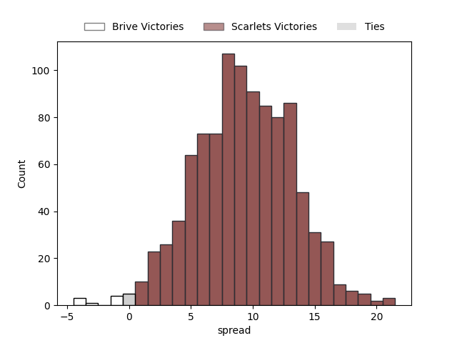
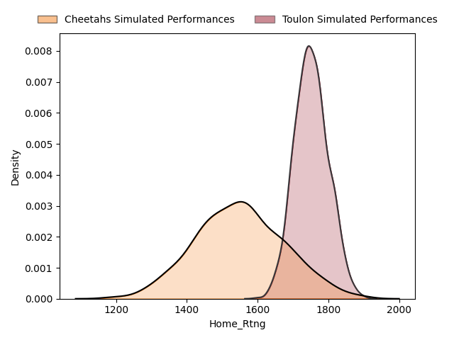
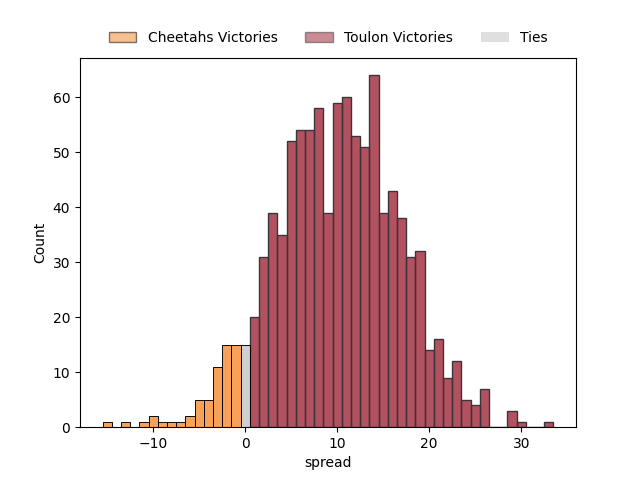

---  
title: "European Rugby Challenge Cup Status"  
date: 2023-03-30 6:00:00 -0500  
categories: model review projection  
layout: article  
aside:  
    toc: true  
---
# Standings

## Current Standings

| Club                 |   Wins |   Point Differential |   Losing Bonus Points |   Try Bonus Points |   Competition Points |
|:---------------------|-------:|---------------------:|----------------------:|-------------------:|---------------------:|
| Bristol Rugby        |      4 |                   67 |                     0 |                  3 |                   19 |
| Toulon               |      4 |                   46 |                     0 |                  3 |                   19 |
| Scarlets             |      4 |                   67 |                     0 |                  2 |                   18 |
| Glasgow Warriors     |      3 |                   25 |                     0 |                  2 |                   16 |
| Cardiff Blues        |      3 |                   97 |                     0 |                  3 |                   15 |
| Benetton Treviso     |      3 |                   50 |                     0 |                  3 |                   15 |
| Connacht             |      3 |                   63 |                     0 |                  2 |                   14 |
| Lions                |      2 |                   13 |                     0 |                  2 |                   12 |
| Stade Francais Paris |      2 |                   -1 |                     1 |                  1 |                   10 |
| Dragons              |      1 |                   -5 |                     2 |                  2 |                   10 |
| Cheetahs             |      2 |                  -14 |                     1 |                  1 |                   10 |
| Pau                  |      1 |                   -8 |                     3 |                  0 |                    7 |
| Brive                |      1 |                  -91 |                     1 |                  1 |                    6 |
| Newcastle Falcons    |      1 |                  -69 |                     0 |                  1 |                    5 |
| Bath Rugby           |      0 |                  -37 |                     1 |                  0 |                    3 |
| Perpignan            |      0 |                  -50 |                     0 |                  1 |                    1 |
| Zebre                |      0 |                  -51 |                     1 |                  0 |                    1 |
| Bayonne              |      0 |                 -102 |                     0 |                  0 |                    0 |

## Projected Remaining Table

| Club                 |   Wins |   Point Differential |   Losing Bonus Points |   Try Bonus Points |   Competition Points |
|:---------------------|-------:|---------------------:|----------------------:|-------------------:|---------------------:|
| Glasgow Warriors     |    1   |                 13.9 |                   0   |                0.7 |                  4.7 |
| Toulon               |    0.9 |                 10.3 |                   0   |                0.6 |                  4.4 |
| Scarlets             |    1   |                  9.3 |                   0   |                0.5 |                  4.4 |
| Bristol Rugby        |    0.9 |                  4.7 |                   0.1 |                0.7 |                  4.4 |
| Sale Sharks          |    0.9 |                  5.7 |                   0.1 |                0.4 |                  4.2 |
| Racing 92            |    0.7 |                  2   |                   0.3 |                0.4 |                  3.4 |
| Connacht             |    0.6 |                  1.2 |                   0.3 |                0.2 |                  3   |
| Stade Francais Paris |    0.5 |                  0.6 |                   0.4 |                0.2 |                  2.8 |
| Lyon                 |    0.4 |                 -0.6 |                   0.5 |                0.2 |                  2.4 |
| Benetton Treviso     |    0.3 |                 -1.2 |                   0.5 |                0.1 |                  2.2 |
| Lions                |    0.3 |                 -2   |                   0.6 |                0.2 |                  2   |
| Clermont Auvergne    |    0.1 |                 -4.7 |                   0.7 |                0.2 |                  1.3 |
| Cardiff Blues        |    0.1 |                 -5.7 |                   0.6 |                0.2 |                  1.1 |
| Cheetahs             |    0   |                -10.3 |                   0.3 |                0.1 |                  0.6 |
| Brive                |    0   |                 -9.3 |                   0.3 |                0.1 |                  0.5 |
| Dragons              |    0   |                -13.9 |                   0.1 |                0.1 |                  0.1 |

## Projected Total Table

| Club                 |   Wins |   Point Differential |   Losing Bonus Points |   Try Bonus Points |   Competition Points |
|:---------------------|-------:|---------------------:|----------------------:|-------------------:|---------------------:|
| Scarlets             |    4.5 |                 67.6 |                   0.4 |                2.2 |                 20.8 |
| Bristol Rugby        |    4.1 |                 61.3 |                   0.6 |                3.2 |                 20.1 |
| Glasgow Warriors     |    3.3 |                 23   |                   0.6 |                2.2 |                 18   |
| Cardiff Blues        |    3.1 |                 92.3 |                   0.7 |                3.2 |                 16.3 |
| Benetton Treviso     |    3   |                 40.7 |                   0.3 |                3.1 |                 15.5 |
| Dragons              |    2   |                  8.9 |                   2   |                2.7 |                 14.7 |
| Lions                |    2.4 |                 12.4 |                   0.5 |                2.2 |                 14.4 |
| Stade Francais Paris |    2.9 |                  9.3 |                   1   |                1.6 |                 14.4 |
| Connacht             |    3   |                 49.1 |                   0.1 |                2.1 |                 14.1 |
| Cheetahs             |    2.6 |                -12.8 |                   1.3 |                1.2 |                 13   |
| Pau                  |    1.9 |                 -2.3 |                   3.1 |                0.4 |                 11.2 |
| Newcastle Falcons    |    1.7 |                -67   |                   0.3 |                1.4 |                  8.4 |
| Brive                |    1   |               -101.3 |                   1.3 |                1.1 |                  6.6 |
| Perpignan            |    1   |                -40.7 |                   0   |                1.5 |                  5.4 |
| Bath Rugby           |    0.3 |                -38.2 |                   1.5 |                0.1 |                  5.2 |
| Bayonne              |    0.9 |                -97.3 |                   0.1 |                0.7 |                  4.4 |
| Toulon               |  nan   |                nan   |                 nan   |              nan   |                nan   |
| Zebre                |  nan   |                nan   |                 nan   |              nan   |                nan   |

# Completed Match Review

| Match                                                 |   Result |   Lineup Prediction |   Minutes Prediction |   Club Prediction |
|:------------------------------------------------------|---------:|--------------------:|---------------------:|------------------:|
| Perpignan V Bristol Rugby on 2022/12/09               |      -14 |               -13.8 |                -18.4 |               0.7 |
| Stade Francais Paris V Benetton Treviso on 2022/12/09 |       10 |                11.9 |                 12.1 |               9.6 |
| Bath Rugby V Glasgow Warriors on 2022/12/10           |       -3 |                 7.5 |                  8.3 |               2.4 |
| Lions V Dragons on 2022/12/10                         |        0 |                -5.4 |                -11.7 |              10   |
| Pau V Cheetahs on 2022/12/10                          |       -5 |                -9.1 |                 -9.9 |               4.8 |
| Cardiff Blues V Brive on 2022/12/10                   |       41 |                 7.3 |                 10   |               5.9 |
| Connacht V Newcastle Falcons on 2022/12/10            |       14 |                 8.4 |                  4.8 |               7.7 |
| Zebre V Toulon on 2022/12/10                          |       -3 |                 0.5 |                  0.5 |             -11.9 |
| Scarlets V Bayonne on 2022/12/11                      |       32 |                -4.9 |                 -5.2 |               0   |
| Lions V Stade Francais Paris on 2022/12/16            |       18 |                 4.1 |                  6.4 |               1.8 |
| Brive V Connacht on 2022/12/16                        |       -7 |                -7.1 |                 -5.2 |               0.5 |
| Glasgow Warriors V Perpignan on 2022/12/16            |        8 |                 1.2 |                  4.8 |               7.8 |
| Toulon V Bath Rugby on 2022/12/17                     |       22 |                 4.5 |                  6.1 |               9.9 |
| Cheetahs V Scarlets on 2022/12/17                     |      -19 |                -3.2 |                  4.9 |               9.3 |
| Bayonne V Benetton Treviso on 2022/12/17              |      -38 |                 4.1 |                  4.9 |               7.6 |
| Dragons V Pau on 2022/12/17                           |       -6 |                 9.4 |                 12.5 |              -2.4 |
| Newcastle Falcons V Cardiff Blues on 2022/12/17       |      -37 |               -11.3 |                 -7.5 |               4   |
| Bristol Rugby V Zebre on 2022/12/18                   |       16 |                21.8 |                 16.4 |              18.2 |
| Pau V Dragons on 2023/01/13                           |       -6 |                15.8 |                 13.3 |              10.1 |
| Scarlets V Cheetahs on 2023/01/13                     |        3 |                18.9 |                 14.7 |               5.6 |
| Benetton Treviso V Bayonne on 2023/01/14              |       19 |                 0.7 |                  1.9 |               4   |
| Stade Francais Paris V Lions on 2023/01/14            |       10 |                28.3 |                 23.1 |               7.5 |
| Connacht V Brive on 2023/01/14                        |       56 |                 8.6 |                  9.8 |              10   |
| Perpignan V Glasgow Warriors on 2023/01/14            |      -14 |                -8   |                 -8.5 |              -1.2 |
| Zebre V Bristol Rugby on 2023/01/14                   |      -23 |                 3.1 |                  3.9 |             -10.5 |
| Cardiff Blues V Newcastle Falcons on 2023/01/15       |       32 |               -10.5 |                 -9.3 |               8.3 |
| Bath Rugby V Toulon on 2023/01/15                     |      -12 |                 3.8 |                  5.4 |              -0.5 |
| Bristol Rugby V Perpignan on 2023/01/20               |       14 |                17   |                 18.1 |               9.9 |
| Glasgow Warriors V Bath Rugby on 2023/01/20           |        0 |                16.7 |                 18.7 |               8.6 |
| Toulon V Zebre on 2023/01/20                          |        9 |                16.4 |                 15.3 |              20.8 |
| Bayonne V Scarlets on 2023/01/21                      |      -13 |                 1.5 |                 -1.2 |               6   |
| Benetton Treviso V Stade Francais Paris on 2023/01/21 |        3 |                -2   |                  9.1 |               0.6 |
| Newcastle Falcons V Connacht on 2023/01/21            |       14 |                -6.7 |                 -8.1 |              -1.3 |
| Brive V Cardiff Blues on 2023/01/21                   |       13 |                -6.2 |                 -6.2 |               1   |
| Dragons V Lions on 2023/01/22                         |       -5 |                 6.3 |                  1.8 |              -0.5 |
| Cheetahs V Pau on 2023/01/22                          |        3 |                19   |                 21.7 |               0.9 |
| ------ | ------ | ------ | ------ | ------ |
| Average Error |       - | 15.9 | 16.0 | 13.9 |
| Correct Winner |       - | 55.6% | 58.3% | 63.9% |

# Future Predictions

## Week 3

### Scarlets V Brive on 2023/03/31

Average Margin: Scarlets by 9.3

### Bristol Rugby V Clermont Auvergne on 2023/03/31

Average Margin: Bristol Rugby by 4.7

### Toulon V Cheetahs on 2023/04/01

Average Margin: Toulon by 10.3

### Benetton Treviso V Connacht on 2023/04/01

Average Margin: Connacht by 1.2

### Stade Francais Paris V Lyon on 2023/04/01

Average Margin: Stade Francais Paris by 0.6

### Glasgow Warriors V Dragons on 2023/04/01

Average Margin: Glasgow Warriors by 13.9

### Lions V Racing 92 on 2023/04/01

Average Margin: Racing 92 by 2.0

### Cardiff Blues V Sale Sharks on 2023/04/01

Average Margin: Sale Sharks by 5.7

