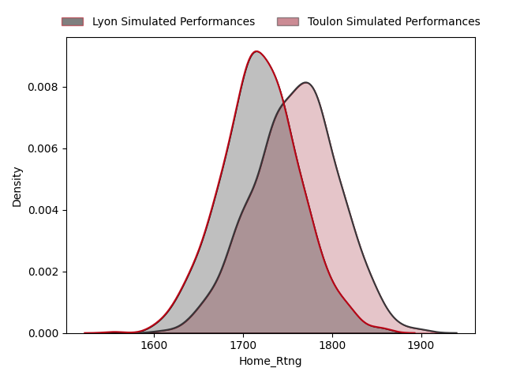
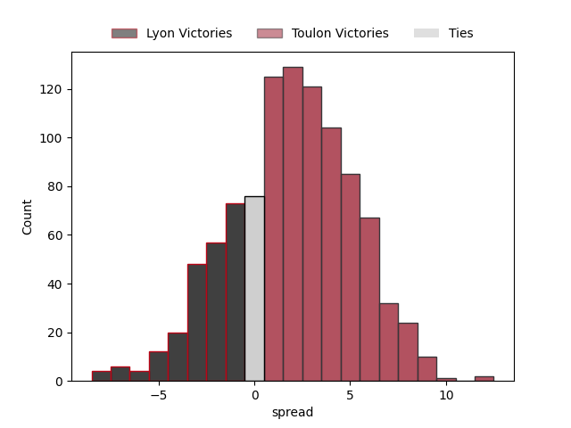

---  
title: "European Rugby Challenge Cup Status"  
date: 2023-04-03 6:00:00 -0500  
categories: model review projection  
layout: article  
aside:  
    toc: true  
---
# Standings

## Current Standings

| Club                 |   Wins |   Point Differential |   Losing Bonus Points |   Try Bonus Points |   Competition Points |
|:---------------------|-------:|---------------------:|----------------------:|-------------------:|---------------------:|
| Benetton Treviso     |      5 |                   94 |                     0 |                  5 |                   25 |
| Toulon               |      5 |                   61 |                     0 |                  4 |                   24 |
| Scarlets             |      5 |                   79 |                     0 |                  2 |                   22 |
| Glasgow Warriors     |      4 |                   65 |                     0 |                  3 |                   21 |
| Bristol Rugby        |      4 |                   60 |                     1 |                  3 |                   20 |
| Cardiff Blues        |      4 |                   98 |                     0 |                  3 |                   19 |
| Lions                |      3 |                   36 |                     0 |                  3 |                   17 |
| Connacht             |      3 |                   19 |                     0 |                  2 |                   14 |
| Dragons              |      1 |                  -45 |                     2 |                  3 |                   11 |
| Lyon                 |      2 |                   34 |                     0 |                  2 |                   10 |
| Cheetahs             |      2 |                  -29 |                     1 |                  1 |                   10 |
| Stade Francais Paris |      2 |                  -35 |                     1 |                  1 |                   10 |
| Pau                  |      1 |                   -8 |                     3 |                  0 |                    7 |
| Brive                |      1 |                 -103 |                     1 |                  1 |                    6 |
| Clermont Auvergne    |      1 |                    7 |                     0 |                  1 |                    5 |
| Newcastle Falcons    |      1 |                  -69 |                     0 |                  1 |                    5 |
| Bath Rugby           |      0 |                  -37 |                     1 |                  0 |                    3 |
| Sale Sharks          |      0 |                   -1 |                     1 |                  0 |                    1 |
| Racing 92            |      0 |                  -23 |                     0 |                  1 |                    1 |
| Perpignan            |      0 |                  -50 |                     0 |                  1 |                    1 |
| Zebre                |      0 |                  -51 |                     1 |                  0 |                    1 |
| Bayonne              |      0 |                 -102 |                     0 |                  0 |                    0 |

## Projected Remaining Table

| Club              |   Wins |   Point Differential |   Losing Bonus Points |   Try Bonus Points |   Competition Points |
|:------------------|-------:|---------------------:|----------------------:|-------------------:|---------------------:|
| Glasgow Warriors  |    0.9 |                  6.4 |                   0   |                0.5 |                  4.3 |
| Benetton Treviso  |    0.8 |                  4   |                   0.1 |                0.2 |                  3.7 |
| Toulon            |    0.7 |                  2   |                   0.2 |                0.1 |                  3.2 |
| Scarlets          |    0.6 |                  1.3 |                   0.3 |                0.2 |                  3   |
| Clermont Auvergne |    0.3 |                 -1.3 |                   0.5 |                0.1 |                  2.2 |
| Lyon              |    0.2 |                 -2   |                   0.7 |                0.1 |                  1.8 |
| Cardiff Blues     |    0.1 |                 -4   |                   0.6 |                0.1 |                  1.4 |
| Lions             |    0   |                 -6.4 |                   0.5 |                0.3 |                  1.1 |

## Projected Total Table

| Club                 |   Wins |   Point Differential |   Losing Bonus Points |   Try Bonus Points |   Competition Points |
|:---------------------|-------:|---------------------:|----------------------:|-------------------:|---------------------:|
| Benetton Treviso     |    5.3 |                 92.7 |                   0.5 |                5.1 |                 27.2 |
| Bristol Rugby        |    4.9 |                 66.4 |                   1   |                3.5 |                 24.3 |
| Cardiff Blues        |    4.2 |                 96   |                   0.7 |                3.1 |                 20.8 |
| Cheetahs             |    2.6 |                -27.7 |                   1.3 |                1.2 |                 13   |
| Clermont Auvergne    |    1.7 |                  9   |                   0.2 |                1.1 |                  8.2 |
| Brive                |    1   |               -109.4 |                   1.5 |                1.3 |                  7.1 |
| Bath Rugby           |    0.8 |                -33   |                   1.1 |                0.2 |                  6.7 |
| Bayonne              |    0.1 |               -106   |                   0.6 |                0.1 |                  1.4 |
| Connacht             |  nan   |                nan   |                 nan   |              nan   |                nan   |
| Dragons              |  nan   |                nan   |                 nan   |              nan   |                nan   |
| Glasgow Warriors     |  nan   |                nan   |                 nan   |              nan   |                nan   |
| Lions                |  nan   |                nan   |                 nan   |              nan   |                nan   |
| Lyon                 |  nan   |                nan   |                 nan   |              nan   |                nan   |
| Newcastle Falcons    |  nan   |                nan   |                 nan   |              nan   |                nan   |
| Pau                  |  nan   |                nan   |                 nan   |              nan   |                nan   |
| Perpignan            |  nan   |                nan   |                 nan   |              nan   |                nan   |
| Racing 92            |  nan   |                nan   |                 nan   |              nan   |                nan   |
| Sale Sharks          |  nan   |                nan   |                 nan   |              nan   |                nan   |
| Scarlets             |  nan   |                nan   |                 nan   |              nan   |                nan   |
| Stade Francais Paris |  nan   |                nan   |                 nan   |              nan   |                nan   |
| Toulon               |  nan   |                nan   |                 nan   |              nan   |                nan   |
| Zebre                |  nan   |                nan   |                 nan   |              nan   |                nan   |

# Completed Match Review

| Match                                                 |   Result |   Lineup Prediction |   Minutes Prediction |   Club Prediction |
|:------------------------------------------------------|---------:|--------------------:|---------------------:|------------------:|
| Perpignan V Bristol Rugby on 2022/12/09               |      -14 |               -13.8 |                -18.4 |               0.7 |
| Stade Francais Paris V Benetton Treviso on 2022/12/09 |       10 |                11.9 |                 12.1 |               9.6 |
| Bath Rugby V Glasgow Warriors on 2022/12/10           |       -3 |                 7.5 |                  8.3 |               2.4 |
| Lions V Dragons on 2022/12/10                         |        0 |                -5.4 |                -11.7 |              10   |
| Pau V Cheetahs on 2022/12/10                          |       -5 |                -9.1 |                 -9.9 |               4.8 |
| Cardiff Blues V Brive on 2022/12/10                   |       41 |                 7.3 |                 10   |               5.9 |
| Connacht V Newcastle Falcons on 2022/12/10            |       14 |                 8.4 |                  4.8 |               7.7 |
| Zebre V Toulon on 2022/12/10                          |       -3 |                 0.5 |                  0.5 |             -11.9 |
| Scarlets V Bayonne on 2022/12/11                      |       32 |                -4.9 |                 -5.2 |               0   |
| Lions V Stade Francais Paris on 2022/12/16            |       18 |                 4.1 |                  6.4 |               1.8 |
| Brive V Connacht on 2022/12/16                        |       -7 |                -7.1 |                 -5.2 |               0.5 |
| Glasgow Warriors V Perpignan on 2022/12/16            |        8 |                 1.2 |                  4.8 |               7.8 |
| Toulon V Bath Rugby on 2022/12/17                     |       22 |                 4.5 |                  6.1 |               9.9 |
| Cheetahs V Scarlets on 2022/12/17                     |      -19 |                -3.2 |                  4.9 |               9.3 |
| Bayonne V Benetton Treviso on 2022/12/17              |      -38 |                 4.1 |                  4.9 |               7.6 |
| Dragons V Pau on 2022/12/17                           |       -6 |                 9.4 |                 12.5 |              -2.4 |
| Newcastle Falcons V Cardiff Blues on 2022/12/17       |      -37 |               -11.3 |                 -7.5 |               4   |
| Bristol Rugby V Zebre on 2022/12/18                   |       16 |                21.8 |                 16.4 |              18.2 |
| Pau V Dragons on 2023/01/13                           |       -6 |                14.2 |                 11.7 |              10.6 |
| Scarlets V Cheetahs on 2023/01/13                     |        3 |                17.5 |                 13.5 |               5.6 |
| Benetton Treviso V Bayonne on 2023/01/14              |       19 |                 4.5 |                  5.3 |               3.6 |
| Stade Francais Paris V Lions on 2023/01/14            |       10 |                24.8 |                 19.2 |               6.5 |
| Connacht V Brive on 2023/01/14                        |       56 |                 8.9 |                 10.2 |              10.6 |
| Perpignan V Glasgow Warriors on 2023/01/14            |      -14 |                -3.6 |                 -4   |              -0.2 |
| Zebre V Bristol Rugby on 2023/01/14                   |      -23 |                11.6 |                 12.3 |              -9.7 |
| Cardiff Blues V Newcastle Falcons on 2023/01/15       |       32 |                -7.3 |                 -6   |               8.3 |
| Bath Rugby V Toulon on 2023/01/15                     |      -12 |                 9   |                 10.8 |              -0.8 |
| Bristol Rugby V Perpignan on 2023/01/20               |       14 |                16.8 |                 18   |               9.5 |
| Glasgow Warriors V Bath Rugby on 2023/01/20           |        0 |                11   |                 12.9 |               8   |
| Toulon V Zebre on 2023/01/20                          |        9 |                11.5 |                 10.3 |              20.2 |
| Bayonne V Scarlets on 2023/01/21                      |      -13 |                -0.3 |                 -2.4 |               5.8 |
| Benetton Treviso V Stade Francais Paris on 2023/01/21 |        3 |                -1.4 |                  9.3 |               0.5 |
| Newcastle Falcons V Connacht on 2023/01/21            |       14 |                -8.5 |                -10   |              -1.2 |
| Brive V Cardiff Blues on 2023/01/21                   |       13 |                -5.1 |                 -4.8 |               0.4 |
| Dragons V Lions on 2023/01/22                         |       -5 |                 8.2 |                  3.6 |              -1   |
| Cheetahs V Pau on 2023/01/22                          |        3 |                15.7 |                 18.5 |               0.4 |
| Bristol Rugby V Clermont Auvergne on 2023/03/31       |       -7 |                 7.4 |                 12.9 |               4.3 |
| Scarlets V Brive on 2023/03/31                        |       12 |                22.6 |                 28.2 |               9.3 |
| Toulon V Cheetahs on 2023/04/01                       |       15 |                 7.7 |                  8.3 |              11.5 |
| Benetton Treviso V Connacht on 2023/04/01             |       22 |                 0.1 |                 -3   |              -0.4 |
| Stade Francais Paris V Lyon on 2023/04/01             |      -17 |                 0.7 |                  1.8 |               0.9 |
| Glasgow Warriors V Dragons on 2023/04/01              |       40 |                21.4 |                 18.6 |              14.2 |
| Lions V Racing 92 on 2023/04/01                       |       23 |                 6   |                  6.7 |              -0.5 |
| Cardiff Blues V Sale Sharks on 2023/04/01             |        1 |                 0.7 |                  0.8 |              -3.8 |
| ------ | ------ | ------ | ------ | ------ |
| Average Error |       - | 15.2 | 15.7 | 14.0 |
| Correct Winner |       - | 61.4% | 59.1% | 59.1% |

# Future Predictions

## Week 4

### Scarlets V Clermont Auvergne on 2023/04/07

Average Margin: Scarlets by 1.3

### Toulon V Lyon on 2023/04/08

Average Margin: Toulon by 2.0

### Benetton Treviso V Cardiff Blues on 2023/04/08

Average Margin: Benetton Treviso by 4.0

### Glasgow Warriors V Lions on 2023/04/08

Average Margin: Glasgow Warriors by 6.4

