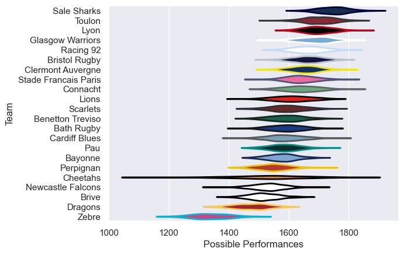

---  
title: "European Rugby Challenge Cup Status"  
date: 2023-04-15 6:00:00 -0500  
categories: model review projection  
layout: article  
aside:  
    toc: true  
---
# Team Rankings

# Standings

## Current Standings

| Club                 |   Played |   Wins |   Point Differential |   Losing Bonus Points |   Try Bonus Points |   Competition Points |
|:---------------------|---------:|-------:|---------------------:|----------------------:|-------------------:|---------------------:|
| Benetton Treviso     |        7 |      6 |                   98 |                     0 |                  5 |                   29 |
| Toulon               |        6 |      6 |                   86 |                     0 |                  5 |                   29 |
| Scarlets             |        6 |      6 |                   81 |                     0 |                  3 |                   27 |
| Glasgow Warriors     |        6 |      5 |                   75 |                     0 |                  4 |                   26 |
| Cardiff Blues        |        6 |      4 |                   94 |                     1 |                  3 |                   20 |
| Bristol Rugby        |        5 |      4 |                   60 |                     1 |                  3 |                   20 |
| Lions                |        6 |      3 |                   26 |                     0 |                  3 |                   17 |
| Connacht             |        6 |      3 |                   19 |                     0 |                  2 |                   14 |
| Dragons              |        5 |      1 |                  -45 |                     2 |                  3 |                   11 |
| Lyon                 |        3 |      2 |                    9 |                     0 |                  2 |                   10 |
| Cheetahs             |        5 |      2 |                  -29 |                     1 |                  1 |                   10 |
| Stade Francais Paris |        6 |      2 |                  -35 |                     1 |                  1 |                   10 |
| Clermont Auvergne    |        2 |      1 |                    5 |                     1 |                  2 |                    7 |
| Pau                  |        4 |      1 |                   -8 |                     3 |                  0 |                    7 |
| Brive                |        5 |      1 |                 -103 |                     1 |                  1 |                    6 |
| Newcastle Falcons    |        4 |      1 |                  -69 |                     0 |                  1 |                    5 |
| Bath Rugby           |        4 |      0 |                  -37 |                     1 |                  0 |                    3 |
| Sale Sharks          |        1 |      0 |                   -1 |                     1 |                  0 |                    1 |
| Racing 92            |        1 |      0 |                  -23 |                     0 |                  1 |                    1 |
| Perpignan            |        4 |      0 |                  -50 |                     0 |                  1 |                    1 |
| Zebre                |        4 |      0 |                  -51 |                     1 |                  0 |                    1 |
| Bayonne              |        4 |      0 |                 -102 |                     0 |                  0 |                    0 |

## Projected Remaining Table

| Club             |   Matches Remaining |   Wins |   Point Differential |   Losing Bonus Points |   Try Bonus Points |   Competition Points |
|:-----------------|--------------------:|-------:|---------------------:|----------------------:|-------------------:|---------------------:|
| Toulon           |                   1 |    1   |                  9.2 |                   0   |                0.4 |                  4.4 |
| Scarlets         |                   1 |    0.5 |                  0.3 |                   0.4 |                0.1 |                  2.7 |
| Glasgow Warriors |                   1 |    0.4 |                 -0.3 |                   0.4 |                0.1 |                  2.5 |
| Benetton Treviso |                   1 |    0   |                 -9.2 |                   0.3 |                0.1 |                  0.4 |

## Projected Total Table

| Club                 |   Total Matches |   Wins |   Point Differential |   Losing Bonus Points |   Try Bonus Points |   Competition Points |
|:---------------------|----------------:|-------:|---------------------:|----------------------:|-------------------:|---------------------:|
| Benetton Treviso     |               8 |    6.5 |                 98.3 |                   0.4 |                5.1 |                 31.7 |
| Bristol Rugby        |               6 |    5   |                 69.2 |                   1   |                3.4 |                 24.4 |
| Bath Rugby           |               5 |    0   |                -46.2 |                   1.3 |                0.1 |                  3.4 |
| Bayonne              |               5 |    0.4 |               -102.3 |                   0.4 |                0.1 |                  2.5 |
| Brive                |             nan |  nan   |                nan   |                 nan   |              nan   |                nan   |
| Cardiff Blues        |             nan |  nan   |                nan   |                 nan   |              nan   |                nan   |
| Cheetahs             |             nan |  nan   |                nan   |                 nan   |              nan   |                nan   |
| Clermont Auvergne    |             nan |  nan   |                nan   |                 nan   |              nan   |                nan   |
| Connacht             |             nan |  nan   |                nan   |                 nan   |              nan   |                nan   |
| Dragons              |             nan |  nan   |                nan   |                 nan   |              nan   |                nan   |
| Glasgow Warriors     |             nan |  nan   |                nan   |                 nan   |              nan   |                nan   |
| Lions                |             nan |  nan   |                nan   |                 nan   |              nan   |                nan   |
| Lyon                 |             nan |  nan   |                nan   |                 nan   |              nan   |                nan   |
| Newcastle Falcons    |             nan |  nan   |                nan   |                 nan   |              nan   |                nan   |
| Pau                  |             nan |  nan   |                nan   |                 nan   |              nan   |                nan   |
| Perpignan            |             nan |  nan   |                nan   |                 nan   |              nan   |                nan   |
| Racing 92            |             nan |  nan   |                nan   |                 nan   |              nan   |                nan   |
| Sale Sharks          |             nan |  nan   |                nan   |                 nan   |              nan   |                nan   |
| Scarlets             |             nan |  nan   |                nan   |                 nan   |              nan   |                nan   |
| Stade Francais Paris |             nan |  nan   |                nan   |                 nan   |              nan   |                nan   |
| Toulon               |             nan |  nan   |                nan   |                 nan   |              nan   |                nan   |
| Zebre                |             nan |  nan   |                nan   |                 nan   |              nan   |                nan   |

# Completed Match Review

| Match                                                 |   Result |   Lineup Prediction |   Minutes Prediction |   Club Prediction |
|:------------------------------------------------------|---------:|--------------------:|---------------------:|------------------:|
| Perpignan V Bristol Rugby on 2022/12/09               |      -14 |               -13.8 |                -18.4 |               0.7 |
| Stade Francais Paris V Benetton Treviso on 2022/12/09 |       10 |                11.9 |                 12.1 |               9.6 |
| Bath Rugby V Glasgow Warriors on 2022/12/10           |       -3 |                 7.5 |                  8.3 |               2.4 |
| Lions V Dragons on 2022/12/10                         |        0 |                -5.4 |                -11.7 |              10   |
| Pau V Cheetahs on 2022/12/10                          |       -5 |                -9.1 |                 -9.9 |               4.8 |
| Cardiff Blues V Brive on 2022/12/10                   |       41 |                 7.3 |                 10   |               5.9 |
| Connacht V Newcastle Falcons on 2022/12/10            |       14 |                 8.4 |                  4.8 |               7.7 |
| Zebre V Toulon on 2022/12/10                          |       -3 |                 0.5 |                  0.5 |             -11.9 |
| Scarlets V Bayonne on 2022/12/11                      |       32 |                -4.9 |                 -5.2 |               0   |
| Lions V Stade Francais Paris on 2022/12/16            |       18 |                 4.1 |                  6.4 |               1.8 |
| Brive V Connacht on 2022/12/16                        |       -7 |                -7.1 |                 -5.2 |               0.5 |
| Glasgow Warriors V Perpignan on 2022/12/16            |        8 |                 1.2 |                  4.8 |               7.8 |
| Toulon V Bath Rugby on 2022/12/17                     |       22 |                 4.5 |                  6.1 |               9.9 |
| Cheetahs V Scarlets on 2022/12/17                     |      -19 |                -3.2 |                  4.9 |               9.3 |
| Bayonne V Benetton Treviso on 2022/12/17              |      -38 |                 4.1 |                  4.9 |               7.6 |
| Dragons V Pau on 2022/12/17                           |       -6 |                 9.4 |                 12.5 |              -2.4 |
| Newcastle Falcons V Cardiff Blues on 2022/12/17       |      -37 |               -11.3 |                 -7.5 |               4   |
| Bristol Rugby V Zebre on 2022/12/18                   |       16 |                21.8 |                 16.4 |              18.2 |
| Pau V Dragons on 2023/01/13                           |       -6 |                 9.3 |                  7   |              10.6 |
| Scarlets V Cheetahs on 2023/01/13                     |        3 |                11.1 |                  7   |               5.6 |
| Benetton Treviso V Bayonne on 2023/01/14              |       19 |                 4.4 |                  5.1 |               3.6 |
| Stade Francais Paris V Lions on 2023/01/14            |       10 |                17.1 |                 10.8 |               6.5 |
| Connacht V Brive on 2023/01/14                        |       56 |                 7.6 |                  8.8 |              10.6 |
| Perpignan V Glasgow Warriors on 2023/01/14            |      -14 |                -1.9 |                 -2.6 |              -0.2 |
| Zebre V Bristol Rugby on 2023/01/14                   |      -23 |                 1.6 |                  3.1 |              -9.7 |
| Cardiff Blues V Newcastle Falcons on 2023/01/15       |       32 |                -3   |                 -0.5 |               8.3 |
| Bath Rugby V Toulon on 2023/01/15                     |      -12 |                 5.6 |                  7.2 |              -0.8 |
| Bristol Rugby V Perpignan on 2023/01/20               |       14 |                17.9 |                 19.2 |               9.5 |
| Glasgow Warriors V Bath Rugby on 2023/01/20           |        0 |                 8.8 |                 10.6 |               8   |
| Toulon V Zebre on 2023/01/20                          |        9 |                16.5 |                 15.8 |              20.2 |
| Bayonne V Scarlets on 2023/01/21                      |      -13 |                 4.9 |                  2.9 |               5.8 |
| Benetton Treviso V Stade Francais Paris on 2023/01/21 |        3 |                 1.3 |                 11.9 |               0.5 |
| Newcastle Falcons V Connacht on 2023/01/21            |       14 |                -7.9 |                 -9.2 |              -1.2 |
| Brive V Cardiff Blues on 2023/01/21                   |       13 |               -11.6 |                -11.6 |               0.4 |
| Dragons V Lions on 2023/01/22                         |       -5 |                11.5 |                  6.3 |              -1   |
| Cheetahs V Pau on 2023/01/22                          |        3 |                 9.6 |                 12.9 |               0.4 |
| Bristol Rugby V Clermont Auvergne on 2023/03/31       |       -7 |                 8.4 |                 14.6 |               4.5 |
| Scarlets V Brive on 2023/03/31                        |       12 |                21.1 |                 26.4 |               9.1 |
| Toulon V Cheetahs on 2023/04/01                       |       15 |                 6.6 |                  7.2 |              11.9 |
| Benetton Treviso V Connacht on 2023/04/01             |       22 |                 1.2 |                 -1.6 |              -0.4 |
| Stade Francais Paris V Lyon on 2023/04/01             |      -17 |                 4.2 |                  4.6 |               0.9 |
| Glasgow Warriors V Dragons on 2023/04/01              |       40 |                18.5 |                 16.2 |              13.7 |
| Lions V Racing 92 on 2023/04/01                       |       23 |                 6.5 |                  7.3 |              -0.1 |
| Cardiff Blues V Sale Sharks on 2023/04/01             |        1 |                 4.2 |                  4.7 |              -2.8 |
| Scarlets V Clermont Auvergne on 2023/04/07            |        2 |                -5.2 |                 -2.7 |               2   |
| Toulon V Lyon on 2023/04/08                           |       25 |                21.4 |                 20.2 |               4.4 |
| Benetton Treviso V Cardiff Blues on 2023/04/08        |        4 |                10.6 |                 12.6 |               3.1 |
| Glasgow Warriors V Lions on 2023/04/08                |       10 |                 8.4 |                  3.4 |               7.7 |
| ------ | ------ | ------ | ------ | ------ |
| Average Error |       - | 14.0 | 14.7 | 13.3 |
| Correct Winner |       - | 62.5% | 58.3% | 62.5% |

# Future Predictions

## Week 5

### Toulon V Benetton Treviso on 2023/04/29

Average Margin: Toulon by 9.2

### Scarlets V Glasgow Warriors on 2023/04/29

Average Margin: Scarlets by 0.3

