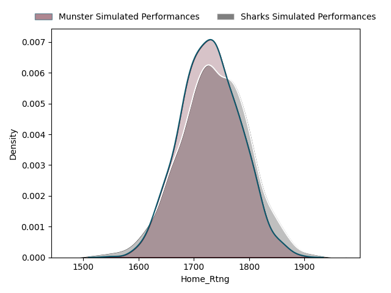
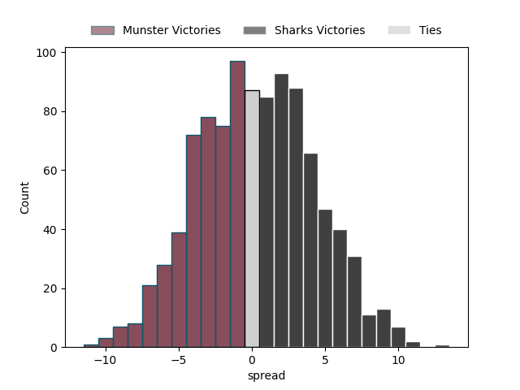

---  
"title: European Rugby Champions Cup Status"  
date: 2023-03-29 6:00:00 -0500  
categories: model review projection  
layout: article  
aside:  
    toc: true  
---
# Standings

## Current Standings

| Club                |   Wins |   Point Differential |   Losing Bonus Points |   Try Bonus Points |   Competition Points |
|:--------------------|-------:|---------------------:|----------------------:|-------------------:|---------------------:|
| Leinster            |      4 |                  150 |                     0 |                  4 |                   20 |
| La Rochelle         |      4 |                   63 |                     0 |                  2 |                   18 |
| Stade Toulousain    |      4 |                   57 |                     0 |                  1 |                   17 |
| Exeter Chiefs       |      3 |                   71 |                     0 |                  4 |                   16 |
| Stormers            |      3 |                   38 |                     0 |                  3 |                   15 |
| Sharks              |      3 |                   30 |                     0 |                  3 |                   15 |
| Edinburgh           |      3 |                   26 |                     1 |                  2 |                   15 |
| Saracens            |      3 |                   26 |                     1 |                  2 |                   15 |
| Leicester Tigers    |      3 |                   27 |                     1 |                  1 |                   14 |
| Ospreys             |      3 |                   12 |                     1 |                  1 |                   14 |
| Harlequins          |      2 |                    5 |                     1 |                  3 |                   12 |
| Munster             |      2 |                    6 |                     2 |                  0 |                   10 |
| Bulls               |      2 |                  -37 |                     0 |                  2 |                   10 |
| Montpellier Herault |      1 |                  -12 |                     1 |                  2 |                    9 |
| Gloucester Rugby    |      2 |                  -78 |                     0 |                  1 |                    9 |
| Lyon                |      1 |                  -10 |                     1 |                  3 |                    8 |
| Ulster              |      1 |                  -39 |                     2 |                  1 |                    7 |
| Clermont Auvergne   |      1 |                  -26 |                     1 |                  1 |                    6 |
| Sale Sharks         |      1 |                  -20 |                     0 |                  1 |                    5 |
| Racing 92           |      1 |                  -61 |                     1 |                  0 |                    5 |
| London Irish        |      0 |                  -39 |                     1 |                  0 |                    3 |
| Bordeaux Begles     |      0 |                  -46 |                     2 |                  0 |                    2 |
| Northampton Saints  |      0 |                  -67 |                     1 |                  0 |                    1 |
| Castres Olympique   |      0 |                  -76 |                     0 |                  0 |                    0 |

## Projected Remaining Table

| Club                |   Wins |   Point Differential |   Losing Bonus Points |   Try Bonus Points |   Competition Points |
|:--------------------|-------:|---------------------:|----------------------:|-------------------:|---------------------:|
| Stade Toulousain    |    1   |                  8.5 |                   0   |                0.6 |                  4.5 |
| Saracens            |    1   |                 13.7 |                   0   |                0.4 |                  4.4 |
| Leinster            |    1   |                 11   |                   0   |                0.4 |                  4.4 |
| Leicester Tigers    |    1   |                  9   |                   0   |                0.3 |                  4.3 |
| La Rochelle         |    1   |                  8.4 |                   0   |                0.3 |                  4.3 |
| Stormers            |    1   |                  7.4 |                   0   |                0.5 |                  4.3 |
| Exeter Chiefs       |    1   |                  6.5 |                   0   |                0.2 |                  4.1 |
| Sharks              |    0.5 |                  0.4 |                   0.4 |                0.1 |                  2.6 |
| Munster             |    0.4 |                 -0.4 |                   0.4 |                0.1 |                  2.4 |
| Montpellier Herault |    0   |                 -6.5 |                   0.6 |                0.1 |                  0.8 |
| Harlequins          |    0   |                 -7.4 |                   0.5 |                0.1 |                  0.7 |
| Gloucester Rugby    |    0   |                 -8.4 |                   0.4 |                0.1 |                  0.5 |
| Bulls               |    0   |                 -8.5 |                   0.4 |                0.1 |                  0.5 |
| Edinburgh           |    0   |                 -9   |                   0.3 |                0   |                  0.4 |
| Ulster              |    0   |                -11   |                   0.2 |                0.1 |                  0.3 |
| Ospreys             |    0   |                -13.7 |                   0.1 |                0   |                  0.1 |

## Projected Total Table

| Club                |   Wins |   Point Differential |   Losing Bonus Points |   Try Bonus Points |   Competition Points |
|:--------------------|-------:|---------------------:|----------------------:|-------------------:|---------------------:|
| Exeter Chiefs       |    4   |                 79.4 |                   0   |                4.3 |                 20.3 |
| Leinster            |    4   |                136.3 |                   0.1 |                4   |                 20.1 |
| La Rochelle         |    4   |                 56.5 |                   0.6 |                2.1 |                 18.8 |
| Leicester Tigers    |    3.4 |                 26.6 |                   1.4 |                1.1 |                 16.4 |
| Harlequins          |    3   |                 16   |                   1   |                3.4 |                 16.4 |
| Edinburgh           |    3   |                 18.6 |                   1.5 |                2.1 |                 15.7 |
| Munster             |    3   |                 13.4 |                   2   |                0.5 |                 14.3 |
| Montpellier Herault |    2   |                 -3.5 |                   1   |                2.6 |                 13.5 |
| Gloucester Rugby    |    3   |                -69   |                   0   |                1.3 |                 13.3 |
| Lyon                |    1.5 |                 -9.6 |                   1.4 |                3.1 |                 10.6 |
| Bulls               |    2   |                -46   |                   0.3 |                2   |                 10.4 |
| London Irish        |    1   |                -25.3 |                   1   |                0.4 |                  7.4 |
| Clermont Auvergne   |    1   |                -34.4 |                   1.4 |                1.1 |                  6.5 |
| Castres Olympique   |    1   |                -69.5 |                   0   |                0.2 |                  4.1 |
| Bordeaux Begles     |    0   |                -54.5 |                   2.4 |                0.1 |                  2.5 |
| Northampton Saints  |    0   |                -78   |                   1.2 |                0.1 |                  1.3 |
| Ospreys             |  nan   |                nan   |                 nan   |              nan   |                nan   |
| Racing 92           |  nan   |                nan   |                 nan   |              nan   |                nan   |
| Sale Sharks         |  nan   |                nan   |                 nan   |              nan   |                nan   |
| Saracens            |  nan   |                nan   |                 nan   |              nan   |                nan   |
| Sharks              |  nan   |                nan   |                 nan   |              nan   |                nan   |
| Stade Toulousain    |  nan   |                nan   |                 nan   |              nan   |                nan   |
| Stormers            |  nan   |                nan   |                 nan   |              nan   |                nan   |
| Ulster              |  nan   |                nan   |                 nan   |              nan   |                nan   |

# Completed Match Review

| Match                                              |   Result |   Lineup Prediction |   Minutes Prediction |   Club Prediction |
|:---------------------------------------------------|---------:|--------------------:|---------------------:|------------------:|
| London Irish V Montpellier Herault on 2022/12/09   |       -5 |                 4.6 |                  3.9 |               2   |
| Racing 92 V Leinster on 2022/12/10                 |      -32 |                -7.8 |                -10.2 |              -3.5 |
| Sharks V Harlequins on 2022/12/10                  |        8 |                 3   |                  0   |              -0.7 |
| Clermont Auvergne V Stormers on 2022/12/10         |       10 |                 1.4 |                  1.3 |               1   |
| Gloucester Rugby V Bordeaux Begles on 2022/12/10   |        5 |                13.7 |                 17.4 |               5.7 |
| Bulls V Lyon on 2022/12/10                         |        6 |                 1.8 |                  4   |               6.7 |
| La Rochelle V Northampton Saints on 2022/12/10     |       34 |                19   |                 14.4 |               7.5 |
| Castres Olympique V Exeter Chiefs on 2022/12/10    |      -15 |                 0.7 |                  0.5 |               1.3 |
| Sale Sharks V Ulster on 2022/12/11                 |       39 |                 0.8 |                 -5   |               3   |
| Munster V Stade Toulousain on 2022/12/11           |       -5 |                 3   |                  4.9 |               1.8 |
| Saracens V Edinburgh on 2022/12/11                 |        4 |                26.8 |                 20.9 |              12.3 |
| Ospreys V Leicester Tigers on 2022/12/11           |       -6 |                 0.4 |                  0   |              -5.4 |
| Bordeaux Begles V Sharks on 2022/12/16             |       -3 |                 4.6 |                 -0.1 |               6.7 |
| Leinster V Gloucester Rugby on 2022/12/16          |       57 |                30.2 |                 31.2 |              13.9 |
| Edinburgh V Castres Olympique on 2022/12/17        |       11 |                22.7 |                 23.6 |               5.2 |
| Exeter Chiefs V Bulls on 2022/12/17                |       30 |                11.5 |                 15.5 |               3.9 |
| Leicester Tigers V Clermont Auvergne on 2022/12/17 |        7 |                 9.6 |                  8.8 |               8.9 |
| Lyon V Saracens on 2022/12/17                      |       -8 |               -11.4 |                -15.1 |              -2.5 |
| Stormers V London Irish on 2022/12/17              |       20 |                15.3 |                 10.6 |               8.6 |
| Ulster V La Rochelle on 2022/12/17                 |       -7 |                 4.6 |                  4.9 |               6.2 |
| Montpellier Herault V Ospreys on 2022/12/17        |      -11 |                23.1 |                 19.7 |              11.9 |
| Northampton Saints V Munster on 2022/12/18         |      -11 |                -7   |                 -7   |               3.2 |
| Stade Toulousain V Sale Sharks on 2022/12/18       |       26 |                 3.6 |                  3.6 |               5.2 |
| Harlequins V Racing 92 on 2022/12/18               |        4 |                11.6 |                 11.6 |               4.9 |
| Clermont Auvergne V Leicester Tigers on 2023/01/13 |      -15 |               -10.5 |                 -8.2 |               1.2 |
| Gloucester Rugby V Leinster on 2023/01/14          |      -35 |                -4.6 |                 -5.1 |              -6   |
| Sale Sharks V Stade Toulousain on 2023/01/14       |      -22 |                12.9 |                  8.3 |               3.7 |
| Munster V Northampton Saints on 2023/01/14         |        4 |                 1.6 |                  2.7 |               8.3 |
| Sharks V Bordeaux Begles on 2023/01/14             |       29 |                 8.4 |                  7.7 |               4.8 |
| Bulls V Exeter Chiefs on 2023/01/14                |       11 |               -15.8 |                -16.6 |               2.8 |
| La Rochelle V Ulster on 2023/01/14                 |        4 |                16.5 |                 14.5 |               5   |
| Ospreys V Montpellier Herault on 2023/01/14        |        6 |                 1.3 |                  3   |              -0.9 |
| Saracens V Lyon on 2023/01/14                      |       20 |                27.8 |                 28.7 |              12.9 |
| Castres Olympique V Edinburgh on 2023/01/15        |      -13 |               -11.7 |                -15.7 |               3.9 |
| London Irish V Stormers on 2023/01/15              |      -14 |                11.7 |                 12.5 |               0.3 |
| Racing 92 V Harlequins on 2023/01/15               |        1 |                 0.6 |                 -8.4 |               4.5 |
| Leicester Tigers V Ospreys on 2023/01/20           |       -1 |                10.3 |                  7.9 |              12.9 |
| Lyon V Bulls on 2023/01/20                         |       24 |                 7.2 |                  4.5 |               2.7 |
| Harlequins V Sharks on 2023/01/21                  |       10 |                 8.8 |                 10.2 |               6.5 |
| Northampton Saints V La Rochelle on 2023/01/21     |      -18 |                -5.8 |                 -5.8 |              -0.6 |
| Bordeaux Begles V Gloucester Rugby on 2023/01/21   |       -9 |                15   |                  1   |               3.9 |
| Leinster V Racing 92 on 2023/01/21                 |       26 |                27.2 |                 26.3 |              13.4 |
| Exeter Chiefs V Castres Olympique on 2023/01/21    |       37 |                16.9 |                 22.9 |               9.3 |
| Stormers V Clermont Auvergne on 2023/01/21         |       14 |                23   |                 22.9 |               7.5 |
| Ulster V Sale Sharks on 2023/01/21                 |       11 |                 8.8 |                 10.4 |               3.9 |
| Montpellier Herault V London Irish on 2023/01/22   |        0 |                -0   |                  1.8 |               6   |
| Stade Toulousain V Munster on 2023/01/22           |        4 |                 5.4 |                  8.8 |               6.7 |
| Edinburgh V Saracens on 2023/01/22                 |        6 |               -10   |                  0.2 |              -4.6 |
| ------ | ------ | ------ | ------ | ------ |
| Average Error |       - | 12.7 | 12.3 | 13.0 |
| Correct Winner |       - | 70.8% | 68.8% | 64.6% |

# Future Predictions

## Week 3

### Leicester Tigers V Edinburgh on 2023/03/31

Average Margin: Leicester Tigers by 9.0

### Sharks V Munster on 2023/04/01

Average Margin: Sharks by 0.4

### Stormers V Harlequins on 2023/04/01

Average Margin: Stormers by 7.4

### La Rochelle V Gloucester Rugby on 2023/04/01

Average Margin: La Rochelle by 8.4

### Leinster V Ulster on 2023/04/01

Average Margin: Leinster by 11.0

### Exeter Chiefs V Montpellier Herault on 2023/04/02

Average Margin: Exeter Chiefs by 6.5

### Saracens V Ospreys on 2023/04/02

Average Margin: Saracens by 13.7

### Stade Toulousain V Bulls on 2023/04/02

Average Margin: Stade Toulousain by 8.5

