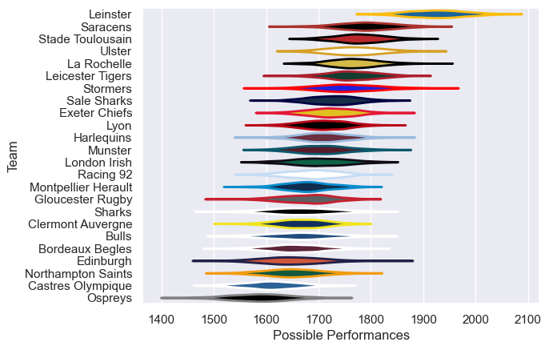

---  
title: "European Rugby Champions Cup Status"  
date: 2023-04-11 6:00:00 -0500  
categories: model review projection  
layout: article  
aside:  
    toc: true  
---
# Team Rankings

# Standings

## Current Standings

| Club                |   Played |   Wins |   Point Differential |   Losing Bonus Points |   Try Bonus Points |   Competition Points |
|:--------------------|---------:|-------:|---------------------:|----------------------:|-------------------:|---------------------:|
| Leinster            |        6 |      6 |                  196 |                     0 |                  5 |                   29 |
| La Rochelle         |        6 |      6 |                   80 |                     0 |                  3 |                   27 |
| Stade Toulousain    |        6 |      6 |                  115 |                     0 |                  2 |                   26 |
| Exeter Chiefs       |        6 |      4 |                   96 |                     0 |                  6 |                   24 |
| Saracens            |        6 |      4 |                   27 |                     1 |                  3 |                   20 |
| Stormers            |        6 |      4 |                   17 |                     0 |                  4 |                   20 |
| Sharks              |        6 |      4 |                   11 |                     0 |                  4 |                   20 |
| Leicester Tigers    |        6 |      4 |                    6 |                     1 |                  1 |                   18 |
| Edinburgh           |        5 |      3 |                   16 |                     1 |                  2 |                   15 |
| Harlequins          |        5 |      2 |                    1 |                     2 |                  4 |                   14 |
| Ospreys             |        5 |      3 |                   -3 |                     1 |                  1 |                   14 |
| Montpellier Herault |        5 |      2 |                  -12 |                     1 |                  3 |                   12 |
| Munster             |        5 |      2 |                   -9 |                     2 |                  1 |                   11 |
| Bulls               |        5 |      2 |                  -61 |                     0 |                  2 |                   10 |
| Gloucester Rugby    |        5 |      2 |                  -81 |                     1 |                  1 |                   10 |
| Lyon                |        4 |      1 |                  -10 |                     1 |                  3 |                    8 |
| Ulster              |        5 |      1 |                  -54 |                     2 |                  1 |                    7 |
| Clermont Auvergne   |        4 |      1 |                  -26 |                     1 |                  1 |                    6 |
| Sale Sharks         |        4 |      1 |                  -20 |                     0 |                  1 |                    5 |
| Racing 92           |        4 |      1 |                  -61 |                     1 |                  0 |                    5 |
| London Irish        |        4 |      0 |                  -39 |                     1 |                  0 |                    3 |
| Bordeaux Begles     |        4 |      0 |                  -46 |                     2 |                  0 |                    2 |
| Northampton Saints  |        4 |      0 |                  -67 |                     1 |                  0 |                    1 |
| Castres Olympique   |        4 |      0 |                  -76 |                     0 |                  0 |                    0 |

## Projected Remaining Table

| Club             |   Matches Remaining |   Wins |   Point Differential |   Losing Bonus Points |   Try Bonus Points |   Competition Points |
|:-----------------|--------------------:|-------:|---------------------:|----------------------:|-------------------:|---------------------:|
| Leinster         |                   1 |    1   |                 10.6 |                   0   |                0.2 |                  4.2 |
| La Rochelle      |                   1 |    0.9 |                  5.5 |                   0   |                0.3 |                  4.2 |
| Exeter Chiefs    |                   1 |    0   |                 -5.5 |                   0.7 |                0.1 |                  1   |
| Stade Toulousain |                   1 |    0   |                -10.6 |                   0.2 |                0.2 |                  0.4 |

## Projected Total Table

| Club                |   Total Matches |   Wins |   Point Differential |   Losing Bonus Points |   Try Bonus Points |   Competition Points |
|:--------------------|----------------:|-------:|---------------------:|----------------------:|-------------------:|---------------------:|
| Bulls               |               6 |    2.9 |                -55.5 |                   0   |                2.3 |                 14.2 |
| Clermont Auvergne   |               5 |    1   |                -36.6 |                   1.2 |                1.2 |                  6.4 |
| Castres Olympique   |               5 |    1   |                -65.4 |                   0   |                0.2 |                  4.2 |
| Bordeaux Begles     |               5 |    0   |                -51.5 |                   2.7 |                0.1 |                  3   |
| Edinburgh           |             nan |  nan   |                nan   |                 nan   |              nan   |                nan   |
| Exeter Chiefs       |             nan |  nan   |                nan   |                 nan   |              nan   |                nan   |
| Gloucester Rugby    |             nan |  nan   |                nan   |                 nan   |              nan   |                nan   |
| Harlequins          |             nan |  nan   |                nan   |                 nan   |              nan   |                nan   |
| La Rochelle         |             nan |  nan   |                nan   |                 nan   |              nan   |                nan   |
| Leicester Tigers    |             nan |  nan   |                nan   |                 nan   |              nan   |                nan   |
| Leinster            |             nan |  nan   |                nan   |                 nan   |              nan   |                nan   |
| London Irish        |             nan |  nan   |                nan   |                 nan   |              nan   |                nan   |
| Lyon                |             nan |  nan   |                nan   |                 nan   |              nan   |                nan   |
| Montpellier Herault |             nan |  nan   |                nan   |                 nan   |              nan   |                nan   |
| Munster             |             nan |  nan   |                nan   |                 nan   |              nan   |                nan   |
| Northampton Saints  |             nan |  nan   |                nan   |                 nan   |              nan   |                nan   |
| Ospreys             |             nan |  nan   |                nan   |                 nan   |              nan   |                nan   |
| Racing 92           |             nan |  nan   |                nan   |                 nan   |              nan   |                nan   |
| Sale Sharks         |             nan |  nan   |                nan   |                 nan   |              nan   |                nan   |
| Saracens            |             nan |  nan   |                nan   |                 nan   |              nan   |                nan   |
| Sharks              |             nan |  nan   |                nan   |                 nan   |              nan   |                nan   |
| Stade Toulousain    |             nan |  nan   |                nan   |                 nan   |              nan   |                nan   |
| Stormers            |             nan |  nan   |                nan   |                 nan   |              nan   |                nan   |
| Ulster              |             nan |  nan   |                nan   |                 nan   |              nan   |                nan   |

# Completed Match Review

| Match                                              |   Result |   Lineup Prediction |   Minutes Prediction |   Club Prediction |
|:---------------------------------------------------|---------:|--------------------:|---------------------:|------------------:|
| London Irish V Montpellier Herault on 2022/12/09   |       -5 |                 4.6 |                  3.9 |               2   |
| Racing 92 V Leinster on 2022/12/10                 |      -32 |                -7.8 |                -10.2 |              -3.5 |
| Sharks V Harlequins on 2022/12/10                  |        8 |                 3   |                  0   |              -0.7 |
| Clermont Auvergne V Stormers on 2022/12/10         |       10 |                 1.4 |                  1.3 |               1   |
| Gloucester Rugby V Bordeaux Begles on 2022/12/10   |        5 |                13.7 |                 17.4 |               5.7 |
| Bulls V Lyon on 2022/12/10                         |        6 |                 1.8 |                  4   |               6.7 |
| La Rochelle V Northampton Saints on 2022/12/10     |       34 |                19   |                 14.4 |               7.5 |
| Castres Olympique V Exeter Chiefs on 2022/12/10    |      -15 |                 0.7 |                  0.5 |               1.3 |
| Sale Sharks V Ulster on 2022/12/11                 |       39 |                 0.8 |                 -5   |               3   |
| Munster V Stade Toulousain on 2022/12/11           |       -5 |                 3   |                  4.9 |               1.8 |
| Saracens V Edinburgh on 2022/12/11                 |        4 |                26.8 |                 20.9 |              12.3 |
| Ospreys V Leicester Tigers on 2022/12/11           |       -6 |                 0.4 |                  0   |              -5.4 |
| Bordeaux Begles V Sharks on 2022/12/16             |       -3 |                 4.6 |                 -0.1 |               6.7 |
| Leinster V Gloucester Rugby on 2022/12/16          |       57 |                30.2 |                 31.2 |              13.9 |
| Edinburgh V Castres Olympique on 2022/12/17        |       11 |                22.7 |                 23.6 |               5.2 |
| Exeter Chiefs V Bulls on 2022/12/17                |       30 |                11.5 |                 15.5 |               3.9 |
| Leicester Tigers V Clermont Auvergne on 2022/12/17 |        7 |                 9.6 |                  8.8 |               8.9 |
| Lyon V Saracens on 2022/12/17                      |       -8 |               -11.4 |                -15.1 |              -2.5 |
| Stormers V London Irish on 2022/12/17              |       20 |                15.3 |                 10.6 |               8.6 |
| Ulster V La Rochelle on 2022/12/17                 |       -7 |                 4.6 |                  4.9 |               6.2 |
| Montpellier Herault V Ospreys on 2022/12/17        |      -11 |                23.1 |                 19.7 |              11.9 |
| Northampton Saints V Munster on 2022/12/18         |      -11 |                -7   |                 -7   |               3.2 |
| Stade Toulousain V Sale Sharks on 2022/12/18       |       26 |                 3.6 |                  3.6 |               5.2 |
| Harlequins V Racing 92 on 2022/12/18               |        4 |                11.6 |                 11.6 |               4.9 |
| Clermont Auvergne V Leicester Tigers on 2023/01/13 |      -15 |               -14.7 |                -12   |               0.7 |
| Gloucester Rugby V Leinster on 2023/01/14          |      -35 |                 0.7 |                  0.6 |              -5.9 |
| Sale Sharks V Stade Toulousain on 2023/01/14       |      -22 |                 9.4 |                  7   |               3.1 |
| Munster V Northampton Saints on 2023/01/14         |        4 |                 0.1 |                  0.1 |               8.3 |
| Sharks V Bordeaux Begles on 2023/01/14             |       29 |                 3.6 |                  3.8 |               4.2 |
| Bulls V Exeter Chiefs on 2023/01/14                |       11 |               -11.8 |                -13.1 |               3.5 |
| La Rochelle V Ulster on 2023/01/14                 |        4 |                 7.6 |                  5.7 |               4.6 |
| Ospreys V Montpellier Herault on 2023/01/14        |        6 |                 1.3 |                  3.3 |              -1.4 |
| Saracens V Lyon on 2023/01/14                      |       20 |                26.8 |                 27.9 |              12   |
| Castres Olympique V Edinburgh on 2023/01/15        |      -13 |               -12   |                -17   |               3.3 |
| London Irish V Stormers on 2023/01/15              |      -14 |                 6.2 |                  7.5 |               0.5 |
| Racing 92 V Harlequins on 2023/01/15               |        1 |                 3.3 |                 -5.7 |               4.5 |
| Leicester Tigers V Ospreys on 2023/01/20           |       -1 |                18.5 |                 16.1 |              13.4 |
| Lyon V Bulls on 2023/01/20                         |       24 |                 5.7 |                  3.4 |               2.2 |
| Harlequins V Sharks on 2023/01/21                  |       10 |                12.6 |                 14.6 |               7.7 |
| Northampton Saints V La Rochelle on 2023/01/21     |      -18 |                 1.1 |                 -0.2 |              -0.2 |
| Bordeaux Begles V Gloucester Rugby on 2023/01/21   |       -9 |                10   |                 -4.1 |               3.1 |
| Leinster V Racing 92 on 2023/01/21                 |       26 |                23.5 |                 22.7 |              13.4 |
| Exeter Chiefs V Castres Olympique on 2023/01/21    |       37 |                 8.9 |                 14.6 |               9.6 |
| Stormers V Clermont Auvergne on 2023/01/21         |       14 |                18.3 |                 18.3 |               7   |
| Ulster V Sale Sharks on 2023/01/21                 |       11 |                 5.8 |                  7.1 |               4.4 |
| Montpellier Herault V London Irish on 2023/01/22   |        0 |                 3.7 |                  5.6 |               6.7 |
| Stade Toulousain V Munster on 2023/01/22           |        4 |                 9.2 |                 12.8 |               6.7 |
| Edinburgh V Saracens on 2023/01/22                 |        6 |                -1.5 |                  9.4 |              -3.5 |
| Leicester Tigers V Edinburgh on 2023/03/31         |       10 |                15.7 |                 15.9 |               8.9 |
| Sharks V Munster on 2023/04/01                     |       15 |                 9.5 |                  9.3 |               1.9 |
| Stormers V Harlequins on 2023/04/01                |        4 |                 1.3 |                  0.7 |               7.9 |
| La Rochelle V Gloucester Rugby on 2023/04/01       |        3 |                10.6 |                 14.1 |               9.1 |
| Leinster V Ulster on 2023/04/01                    |       15 |                22.7 |                 22.8 |              11.9 |
| Exeter Chiefs V Montpellier Herault on 2023/04/02  |        0 |                 0.6 |                 29.8 |               6.7 |
| Saracens V Ospreys on 2023/04/02                   |       15 |                17.5 |                 19.6 |              15.1 |
| Stade Toulousain V Bulls on 2023/04/02             |       24 |                21.9 |                 23.3 |               9.3 |
| Leinster V Leicester Tigers on 2023/04/07          |       31 |                13.4 |                 12.4 |              11.9 |
| Stade Toulousain V Sharks on 2023/04/08            |       34 |                 7.8 |                 11.8 |               9.7 |
| Exeter Chiefs V Stormers on 2023/04/08             |       25 |                -4.4 |                 -5.3 |               1.7 |
| La Rochelle V Saracens on 2023/04/09               |       14 |               -11   |                -11.3 |               2.9 |
| ------ | ------ | ------ | ------ | ------ |
| Average Error |       - | 12.5 | 12.9 | 12.5 |
| Correct Winner |       - | 68.3% | 70.0% | 70.0% |

# Future Predictions

## Week 5

### Leinster V Stade Toulousain on 2023/04/29

Average Margin: Leinster by 10.6

### La Rochelle V Exeter Chiefs on 2023/04/30

Average Margin: La Rochelle by 5.5

