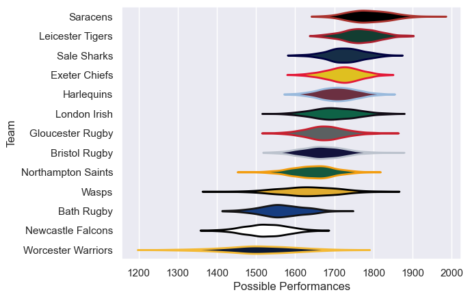

---  
title: "Gallagher Premiership Status"  
date: 2023-05-06 6:00:00 -0500  
categories: model review projection  
layout: article  
aside:  
    toc: true  
---
# Current Team Rankings

# Standings

## Current Standings

| Club               |   Played |   Wins |   Point Differential |   Losing Bonus Points |   Try Bonus Points |   Competition Points |
|:-------------------|---------:|-------:|---------------------:|----------------------:|-------------------:|---------------------:|
| Saracens           |       20 |     16 |                  161 |                     1 |                 12 |                   77 |
| Sale Sharks        |       20 |     14 |                  129 |                     3 |                 10 |                   69 |
| Northampton Saints |       21 |     12 |                   13 |                     3 |                 12 |                   63 |
| London Irish       |       21 |     11 |                  128 |                     7 |                 10 |                   61 |
| Leicester Tigers   |       19 |     11 |                   73 |                     3 |                  9 |                   58 |
| Exeter Chiefs      |       20 |     11 |                  -45 |                     3 |                  5 |                   52 |
| Harlequins         |       20 |      8 |                  -38 |                     4 |                nan |                   47 |
| Bristol Rugby      |       20 |      8 |                  -21 |                     4 |                  8 |                   46 |
| Gloucester Rugby   |       20 |      8 |                  -48 |                     7 |                  7 |                   46 |
| Bath Rugby         |       21 |      7 |                  -72 |                     7 |                nan |                   43 |
| Newcastle Falcons  |       20 |      6 |                 -209 |                     3 |                  4 |                   31 |
| Wasps              |        5 |      1 |                  -59 |                     2 |                nan |                    8 |
| Worcester Warriors |        3 |      1 |                  -12 |                     0 |                  1 |                    5 |

## Projected Remaining Table

| Club              |   Matches Remaining |   Wins |   Point Differential |   Losing Bonus Points |   Try Bonus Points |   Competition Points |
|:------------------|--------------------:|-------:|---------------------:|----------------------:|-------------------:|---------------------:|
| Sale Sharks       |                   1 |    1   |                 13.8 |                   0   |                1   |                  5   |
| Leicester Tigers  |                   1 |    1   |                  6.6 |                   0   |                0.9 |                  4.9 |
| Saracens          |                   1 |    0.9 |                  5.8 |                   0.1 |                0.9 |                  4.8 |
| London Irish      |                   1 |    0.9 |                  3.6 |                   0.1 |                0.8 |                  4.4 |
| Bristol Rugby     |                   1 |    0.8 |                  3.4 |                   0.2 |                0.8 |                  4.3 |
| Gloucester Rugby  |                   1 |    0.2 |                 -3.4 |                   0.6 |                0.1 |                  1.4 |
| Exeter Chiefs     |                   1 |    0.1 |                 -3.6 |                   0.7 |                0.1 |                  1.3 |
| Bath Rugby        |                   1 |    0.1 |                 -5.8 |                   0.5 |                0   |                  0.8 |
| Harlequins        |                   1 |    0   |                 -6.6 |                   0.5 |                0   |                  0.6 |
| Newcastle Falcons |                   1 |    0   |                -13.8 |                   0   |                0   |                  0   |

## Projected Total Table

| Club               |   Total Matches |   Wins |   Point Differential |   Losing Bonus Points |   Try Bonus Points |   Competition Points |
|:-------------------|----------------:|-------:|---------------------:|----------------------:|-------------------:|---------------------:|
| Saracens           |              21 |   16.9 |                166.8 |                   1.1 |               12.9 |                 81.8 |
| Sale Sharks        |              21 |   15   |                142.8 |                   3   |               11   |                 74   |
| London Irish       |              22 |   11.9 |                131.6 |                   7.1 |               10.8 |                 65.4 |
| Northampton Saints |              21 |   12   |                 13   |                   3   |               12   |                 63   |
| Leicester Tigers   |              20 |   12   |                 79.6 |                   3   |                9.9 |                 62.9 |
| Exeter Chiefs      |              21 |   11.1 |                -48.6 |                   3.7 |                5.1 |                 53.3 |
| Bristol Rugby      |              21 |    8.8 |                -17.6 |                   4.2 |                8.8 |                 50.3 |
| Harlequins         |              21 |    8   |                -44.6 |                   4.5 |                0   |                 47.6 |
| Gloucester Rugby   |              21 |    8.2 |                -51.4 |                   7.6 |                7.1 |                 47.4 |
| Bath Rugby         |              22 |    7.1 |                -77.8 |                   7.5 |                0   |                 43.8 |
| Newcastle Falcons  |              21 |    6   |               -222.8 |                   3   |                4   |                 31   |
| Wasps              |               5 |    1   |                -59   |                   2   |                0   |                  8   |
| Worcester Warriors |               3 |    1   |                -12   |                   0   |                1   |                  5   |

## Projected Playoff Results

|                    | Reach Semifinals   | Reach Final   | Win Final   |
|:-------------------|:-------------------|:--------------|:------------|
| Saracens           | 100.0 %            | 99.3 %        | 68.4 %      |
| Sale Sharks        | 100.0 %            | 82.0 %        | 25.6 %      |
| Leicester Tigers   | 100.0 %            | 18.0 %        | 6.0 %       |
| Northampton Saints | 100.0 %            | 0.7 %         | 0.0 %       |

# Completed Match Review

| Model | Percent Correct Predictions | Spread Error |
| ------ | ------ | ------ |
| Club Level | 70.4% | 11.9 |
| Player Level: Lineup | 69.6% | 12.1 |
| Player Level: Minutes | 67.0% | 12.1 |

# Future Predictions

## Week 4

### London Irish V Exeter Chiefs on 2023/05/06

Average Margin: London Irish by 4.0

### Leicester Tigers V Harlequins on 2023/05/06

Average Margin: Leicester Tigers by 7.1

### Bristol Rugby V Gloucester Rugby on 2023/05/06

Average Margin: Bristol Rugby by 3.7

### Bath Rugby V Saracens on 2023/05/06

Average Margin: Saracens by 6.3

### Sale Sharks V Newcastle Falcons on 2023/05/06

Average Margin: Sale Sharks by 14.3

