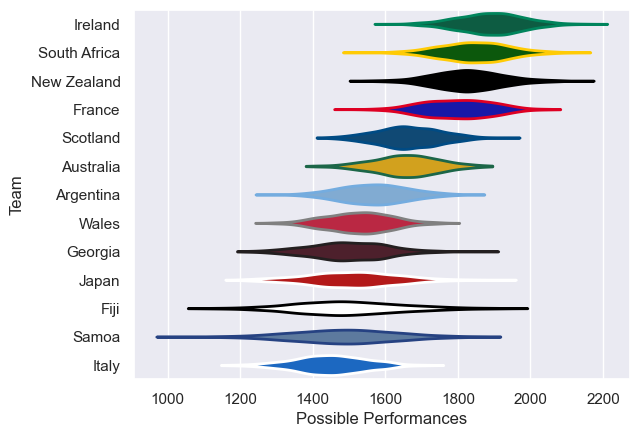

---  
title: "International Test Match Status"  
date: 2023-04-21 6:00:00 -0500  
categories: model review projection  
layout: article  
aside:  
    toc: true  
---
# Current Team Rankings

# Standings

## Current Standings

| Club         |   Played |   Wins |   Point Differential |   Losing Bonus Points |   Try Bonus Points |   Competition Points |
|:-------------|---------:|-------:|---------------------:|----------------------:|-------------------:|---------------------:|
| New Zealand  |        4 |      3 |                   47 |                     0 |                  4 |                   18 |
| Tonga        |        3 |      3 |                   87 |                     0 |                  3 |                   15 |
| France       |        3 |      3 |                   23 |                     0 |                  3 |                   15 |
| South Africa |        4 |      2 |                   49 |                     2 |                  4 |                   14 |
| Ireland      |        3 |      3 |                   24 |                     0 |                  2 |                   14 |
| Australia    |        5 |      2 |                    1 |                     3 |                  3 |                   14 |
| Scotland     |        4 |      2 |                   30 |                     1 |                  4 |                   13 |
| Italy        |        3 |      2 |                   -9 |                     0 |                  3 |                   11 |
| England      |        4 |      1 |                   24 |                     1 |                  3 |                   10 |
| Georgia      |        3 |      2 |                   16 |                     1 |                  1 |                   10 |
| Wales        |        4 |      1 |                  -31 |                     2 |                  4 |                   10 |
| Samoa        |        3 |      2 |                   -9 |                     0 |                  1 |                    9 |
| Canada       |        2 |      1 |                    6 |                     1 |                  2 |                    7 |
| Argentina    |        3 |      1 |                  -29 |                     1 |                  2 |                    7 |
| Namibia      |        2 |      1 |                  -13 |                     0 |                  1 |                    5 |
| Spain        |        2 |      1 |                  -15 |                     0 |                  1 |                    5 |
| Romania      |        3 |      1 |                  -20 |                     1 |                  0 |                    5 |
| Uruguay      |        3 |      1 |                  -35 |                     0 |                  0 |                    4 |
| Japan        |        3 |      0 |                  -64 |                     1 |                  2 |                    3 |
| Fiji         |        2 |      0 |                  -34 |                     0 |                  2 |                    2 |
| Chile        |        2 |      0 |                  -36 |                     1 |                  0 |                    1 |
| Netherlands  |        1 |      0 |                  -12 |                     0 |                  0 |                    0 |

# Completed Match Review

| Model | Percent Correct Predictions | Spread Error |
| ------ | ------ | ------ |
| Club Level | 66.7% | 12.5 |
| Player Level: Lineup | 63.6% | 13.5 |
| Player Level: Minutes | 63.6% | 13.0 |

