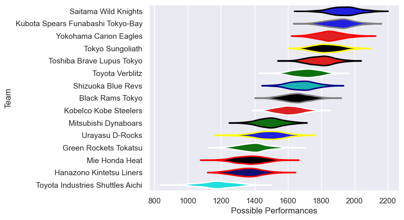

---  
title: "Japan Rugby League One Status"  
date: 2023-04-21 6:00:00 -0500  
categories: model review projection  
layout: article  
aside:  
    toc: true  
---
# Current Team Rankings

# Standings

## Current Standings

| Club                              |   Played |   Wins |   Point Differential |   Losing Bonus Points |   Try Bonus Points |   Competition Points |
|:----------------------------------|---------:|-------:|---------------------:|----------------------:|-------------------:|---------------------:|
| Saitama Wild Knights              |       11 |     10 |                  185 |                     0 |                nan |                   45 |
| Tokyo Sungoliath                  |       11 |      9 |                  172 |                     1 |                nan |                   44 |
| Toshiba Brave Lupus Tokyo         |       12 |      8 |                  157 |                     2 |                  9 |                   43 |
| Kubota Spears Funabashi Tokyo-Bay |       10 |      9 |                  166 |                     0 |                nan |                   42 |
| Yokohama Canon Eagles             |       10 |      6 |                  150 |                     2 |                nan |                   34 |
| Toyota Verblitz                   |       12 |      7 |                   30 |                     1 |                nan |                   34 |
| Shizuoka Blue Revs                |       12 |      6 |                   37 |                     2 |                nan |                   31 |
| Black Rams Tokyo                  |       11 |      3 |                   35 |                     4 |                nan |                   20 |
| Kobelco Kobe Steelers             |       10 |      3 |                  -72 |                     1 |                  5 |                   18 |
| Mitsubishi Dynaboars              |       12 |      2 |                 -210 |                     1 |                  5 |                   16 |
| Green Rockets Tokatsu             |       10 |      1 |                 -266 |                     1 |                nan |                    7 |
| Hanazono Kintetsu Liners          |       11 |      1 |                 -384 |                     0 |                  2 |                    6 |

## Projected Remaining Table

| Club                              |   Matches Remaining |   Wins |   Point Differential |   Losing Bonus Points |   Try Bonus Points |   Competition Points |
|:----------------------------------|--------------------:|-------:|---------------------:|----------------------:|-------------------:|---------------------:|
| Yokohama Canon Eagles             |                   1 |    0.9 |                  6.8 |                   0.1 |                0.9 |                  4.5 |
| Kubota Spears Funabashi Tokyo-Bay |                   1 |    0.8 |                  5.9 |                   0.1 |                0.8 |                  4.3 |
| Shizuoka Blue Revs                |                   1 |    0.8 |                  4.1 |                   0.2 |                0.7 |                  4   |
| Black Rams Tokyo                  |                   1 |    0.7 |                  3.2 |                   0.2 |                0.7 |                  3.8 |
| Hanazono Kintetsu Liners          |                   1 |    0.7 |                  2.8 |                   0.3 |                0.7 |                  3.6 |
| Saitama Wild Knights              |                   1 |    0.7 |                  2.3 |                   0.3 |                0.6 |                  3.5 |
| Toshiba Brave Lupus Tokyo         |                   1 |    0.3 |                 -2.3 |                   0.4 |                0.3 |                  2.1 |
| Green Rockets Tokatsu             |                   1 |    0.3 |                 -2.8 |                   0.4 |                0.3 |                  2   |
| Mitsubishi Dynaboars              |                   1 |    0.3 |                 -3.2 |                   0.4 |                0.2 |                  1.8 |
| Toyota Verblitz                   |                   1 |    0.2 |                 -4.1 |                   0.4 |                0.2 |                  1.5 |
| Tokyo Sungoliath                  |                   1 |    0.2 |                 -5.9 |                   0.4 |                0.1 |                  1.1 |
| Kobelco Kobe Steelers             |                   1 |    0.1 |                 -6.8 |                   0.4 |                0.1 |                  0.9 |

## Projected Total Table

| Club                              |   Total Matches |   Wins |   Point Differential |   Losing Bonus Points |   Try Bonus Points |   Competition Points |
|:----------------------------------|----------------:|-------:|---------------------:|----------------------:|-------------------:|---------------------:|
| Saitama Wild Knights              |              12 |   10.7 |                187.3 |                   0.3 |                0.6 |                 48.5 |
| Kubota Spears Funabashi Tokyo-Bay |              11 |    9.8 |                171.9 |                   0.1 |                0.8 |                 46.3 |
| Tokyo Sungoliath                  |              12 |    9.2 |                166.1 |                   1.4 |                0.1 |                 45.1 |
| Toshiba Brave Lupus Tokyo         |              13 |    8.3 |                154.7 |                   2.4 |                9.3 |                 45.1 |
| Yokohama Canon Eagles             |              11 |    6.9 |                156.8 |                   2.1 |                0.9 |                 38.5 |
| Toyota Verblitz                   |              13 |    7.2 |                 25.9 |                   1.4 |                0.2 |                 35.5 |
| Shizuoka Blue Revs                |              13 |    6.8 |                 41.1 |                   2.2 |                0.7 |                 35   |
| Black Rams Tokyo                  |              12 |    3.7 |                 38.2 |                   4.2 |                0.7 |                 23.8 |
| Kobelco Kobe Steelers             |              11 |    3.1 |                -78.8 |                   1.4 |                5.1 |                 18.9 |
| Mitsubishi Dynaboars              |              13 |    2.3 |               -213.2 |                   1.4 |                5.2 |                 17.8 |
| Hanazono Kintetsu Liners          |              12 |    1.7 |               -381.2 |                   0.3 |                2.7 |                  9.6 |
| Green Rockets Tokatsu             |              11 |    1.3 |               -268.8 |                   1.4 |                0.3 |                  9   |

# Completed Match Review

| Model | Percent Correct Predictions | Spread Error |
| ------ | ------ | ------ |
| Club Level | 78.8% | 15.1 |
| Player Level: Lineup | 74.2% | 17.6 |
| Player Level: Minutes | 75.8% | 17.6 |

# Future Predictions

## Week 12

### Toshiba Brave Lupus Tokyo V Saitama Wild Knights on 2023/04/21

Average Margin: Saitama Wild Knights by 2.5

### Kubota Spears Funabashi Tokyo-Bay V Tokyo Sungoliath on 2023/04/22

Average Margin: Kubota Spears Funabashi Tokyo-Bay by 6.3

### Mitsubishi Dynaboars V Black Rams Tokyo on 2023/04/22

Average Margin: Black Rams Tokyo by 3.4

### Hanazono Kintetsu Liners V Green Rockets Tokatsu on 2023/04/22

Average Margin: Hanazono Kintetsu Liners by 3.0

### Kobelco Kobe Steelers V Yokohama Canon Eagles on 2023/04/23

Average Margin: Yokohama Canon Eagles by 7.2

### Shizuoka Blue Revs V Toyota Verblitz on 2023/04/23

Average Margin: Shizuoka Blue Revs by 4.3

