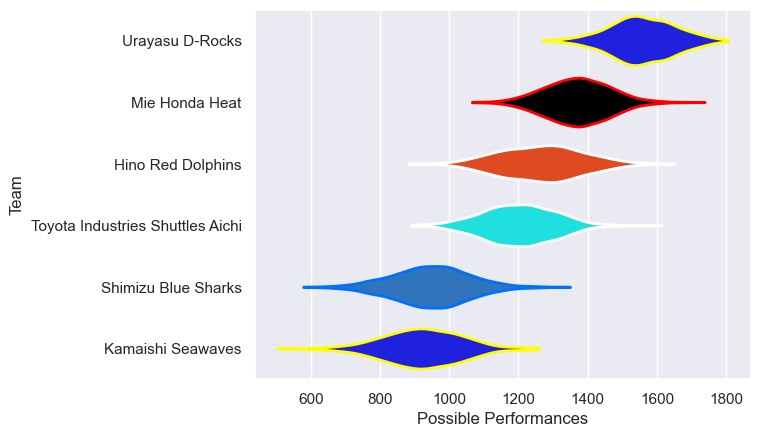

---  
title: "Japan Rugby League One Division 2 Status"  
date: 2023-04-21 6:00:00 -0500  
categories: model review projection  
layout: article  
aside:  
    toc: true  
---
# Current Team Rankings

# Standings

## Current Standings

| Club                             |   Played |   Wins |   Point Differential |   Losing Bonus Points |   Try Bonus Points |   Competition Points |
|:---------------------------------|---------:|-------:|---------------------:|----------------------:|-------------------:|---------------------:|
| Urayasu D-Rocks                  |        7 |      7 |                  308 |                     0 |                  6 |                   34 |
| Mie Honda Heat                   |        7 |      5 |                  105 |                     0 |                  5 |                   25 |
| Toyota Industries Shuttles Aichi |        6 |      3 |                  -10 |                     0 |                  3 |                   15 |
| Kamaishi Seawaves                |        8 |      0 |                 -284 |                     1 |                  5 |                    6 |
| Hino Red Dolphins                |        1 |      1 |                   20 |                     0 |                  1 |                    5 |
| Shimizu Blue Sharks              |        5 |      1 |                 -139 |                     0 |                  1 |                    5 |

# Completed Match Review

| Model | Percent Correct Predictions | Spread Error |
| ------ | ------ | ------ |
| Club Level | 80.0% | 19.1 |
| Player Level: Lineup | 57.1% | 26.6 |
| Player Level: Minutes | 57.1% | 26.5 |

