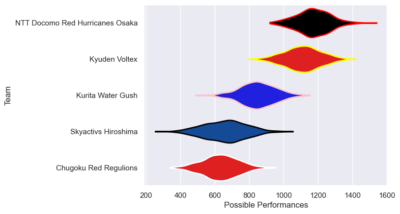

---  
title: "Japan Rugby League One Division 3 Status"  
date: 2023-04-28 6:00:00 -0500  
categories: model review projection  
layout: article  
aside:  
    toc: true  
---
# Current Team Rankings

# Standings

## Current Standings

| Club                            |   Played |   Wins |   Point Differential |   Losing Bonus Points |   Try Bonus Points |   Competition Points |
|:--------------------------------|---------:|-------:|---------------------:|----------------------:|-------------------:|---------------------:|
| NTT Docomo Red Hurricanes Osaka |       13 |     12 |                  254 |                     1 |                 11 |                   60 |
| Kyuden Voltex                   |       13 |      9 |                  174 |                     3 |                 10 |                   49 |
| Kurita Water Gush               |       12 |      5 |                   -8 |                     2 |                  7 |                   29 |
| Skyactivs Hiroshima             |       13 |      4 |                 -193 |                     1 |                  5 |                   22 |
| Chugoku Red Regulions           |       13 |      2 |                 -227 |                     2 |                  3 |                   13 |

# Completed Match Review

| Model | Percent Correct Predictions | Spread Error |
| ------ | ------ | ------ |
| Club Level | 86.7% | 14.6 |
| Player Level: Lineup | 83.3% | 15.3 |
| Player Level: Minutes | 83.3% | 15.2 |

