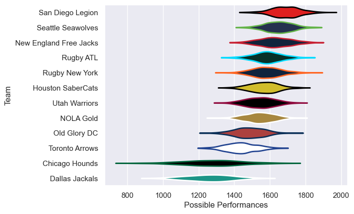

---  
title: "Major League Rugby Status"  
date: 2023-04-28 6:00:00 -0500  
categories: model review projection  
layout: article  
aside:  
    toc: true  
---
# Current Team Rankings

# Standings

## Current Standings

| Club                   |   Played |   Wins |   Point Differential |   Losing Bonus Points |   Try Bonus Points |   Competition Points |
|:-----------------------|---------:|-------:|---------------------:|----------------------:|-------------------:|---------------------:|
| San Diego Legion       |       11 |     10 |                  179 |                     1 |                  9 |                   50 |
| Houston SaberCats      |       11 |      9 |                  106 |                     1 |                  9 |                   46 |
| Seattle Seawolves      |       11 |      8 |                   75 |                     3 |                  6 |                   41 |
| New England Free Jacks |       11 |      8 |                  194 |                     2 |                  6 |                   40 |
| Utah Warriors          |       11 |      8 |                    9 |                     0 |                  5 |                   37 |
| Old Glory DC           |       11 |      5 |                   -7 |                     2 |                  9 |                   31 |
| Rugby New York         |       11 |      5 |                    2 |                     1 |                  8 |                   29 |
| Rugby ATL              |       11 |      5 |                  -15 |                     1 |                  3 |                   24 |
| NOLA Gold              |       11 |      4 |                  -27 |                     2 |                  6 |                   24 |
| Dallas Jackals         |       11 |      2 |                 -106 |                     2 |                  3 |                   13 |
| Chicago Hounds         |       11 |      1 |                 -147 |                     2 |                  3 |                    9 |
| Toronto Arrows         |       11 |      1 |                 -263 |                     4 |                  1 |                    9 |

## Projected Remaining Table

| Club                   |   Matches Remaining |   Wins |   Point Differential |   Losing Bonus Points |   Try Bonus Points |   Competition Points |
|:-----------------------|--------------------:|-------:|---------------------:|----------------------:|-------------------:|---------------------:|
| San Diego Legion       |                   7 |    6.4 |                 65.6 |                   0.6 |                6.2 |                 32.3 |
| New England Free Jacks |                   7 |    5.6 |                 51.1 |                   1.2 |                5.4 |                 28.8 |
| Rugby ATL              |                   7 |    5.4 |                 54   |                   1.3 |                5.2 |                 28.1 |
| Seattle Seawolves      |                   7 |    4.5 |                 37.8 |                   1.7 |                4.3 |                 24.2 |
| Utah Warriors          |                   7 |    3.9 |                 19.4 |                   2.1 |                3.7 |                 21.6 |
| Houston SaberCats      |                   7 |    3.8 |                 14.8 |                   1.7 |                3.6 |                 20.4 |
| Rugby New York         |                   7 |    3.5 |                  3.2 |                   1.4 |                3.5 |                 19   |
| NOLA Gold              |                   7 |    3.3 |                 -6.1 |                   1.9 |                3.1 |                 18.3 |
| Old Glory DC           |                   7 |    3.1 |                 -4.3 |                   2.7 |                2.9 |                 18.1 |
| Dallas Jackals         |                   7 |    1.6 |                -48.6 |                   1.6 |                1.5 |                  9.8 |
| Toronto Arrows         |                   7 |    0.6 |                -64.2 |                   2.1 |                0.6 |                  5.2 |
| Chicago Hounds         |                   7 |    0.2 |               -123.5 |                   0.6 |                0.2 |                  1.7 |

## Projected Total Table

| Club                   |   Total Matches |   Wins |   Point Differential |   Losing Bonus Points |   Try Bonus Points |   Competition Points |
|:-----------------------|----------------:|-------:|---------------------:|----------------------:|-------------------:|---------------------:|
| San Diego Legion       |              18 |   16.4 |                244.6 |                   1.6 |               15.2 |                 82.3 |
| New England Free Jacks |              18 |   13.6 |                245.1 |                   3.2 |               11.4 |                 68.8 |
| Houston SaberCats      |              18 |   12.8 |                120.8 |                   2.7 |               12.6 |                 66.4 |
| Seattle Seawolves      |              18 |   12.5 |                112.8 |                   4.7 |               10.3 |                 65.2 |
| Utah Warriors          |              18 |   11.9 |                 28.4 |                   2.1 |                8.7 |                 58.6 |
| Rugby ATL              |              18 |   10.4 |                 39   |                   2.3 |                8.2 |                 52.1 |
| Old Glory DC           |              18 |    8.1 |                -11.3 |                   4.7 |               11.9 |                 49.1 |
| Rugby New York         |              18 |    8.5 |                  5.2 |                   2.4 |               11.5 |                 48   |
| NOLA Gold              |              18 |    7.3 |                -33.1 |                   3.9 |                9.1 |                 42.3 |
| Dallas Jackals         |              18 |    3.6 |               -154.6 |                   3.6 |                4.5 |                 22.8 |
| Toronto Arrows         |              18 |    1.6 |               -327.2 |                   6.1 |                1.6 |                 14.2 |
| Chicago Hounds         |              18 |    1.2 |               -270.5 |                   2.6 |                3.2 |                 10.7 |

## Projected Playoff Results

|                        | Reach Quarterfinals   | Reach Semifinals   | Reach Final   | Win Final   |
|:-----------------------|:----------------------|:-------------------|:--------------|:------------|
| San Diego Legion       | 100.0 %               | 100.0 %            | 92.2 %        | 49.2 %      |
| New England Free Jacks | 100.0 %               | 99.9 %             | 92.2 %        | 46.2 %      |
| Rugby ATL              | 84.9 %                | 68.7 %             | 6.8 %         | 2.0 %       |
| Seattle Seawolves      | 88.0 %                | 50.7 %             | 5.3 %         | 2.0 %       |
| Houston SaberCats      | 91.2 %                | 42.4 %             | 2.4 %         | 0.5 %       |
| Old Glory DC           | 55.6 %                | 17.8 %             | 0.6 %         | 0.1 %       |
| Rugby New York         | 50.7 %                | 12.3 %             | 0.3 %         | 0.0 %       |
| Utah Warriors          | 20.8 %                | 6.9 %              | 0.1 %         | 0.0 %       |
| NOLA Gold              | 8.8 %                 | 1.3 %              | 0.1 %         | 0.0 %       |

# Completed Match Review

| Model | Percent Correct Predictions | Spread Error |
| ------ | ------ | ------ |
| Club Level | 74.1% | 12.4 |
| Player Level: Lineup | 74.1% | 15.8 |
| Player Level: Minutes | 75.9% | 16.3 |

# Future Predictions

## Week 12

### Seattle Seawolves V Dallas Jackals on 2023/04/29

Average Margin: Seattle Seawolves by 16.2

### New England Free Jacks V Rugby New York on 2023/04/30

Average Margin: New England Free Jacks by 10.3

### San Diego Legion V Houston SaberCats on 2023/04/30

Average Margin: San Diego Legion by 8.9

### NOLA Gold V Toronto Arrows on 2023/04/30

Average Margin: NOLA Gold by 9.8

## Week 13

### Dallas Jackals V Old Glory DC on 2023/05/06

Average Margin: Old Glory DC by 4.7

### Utah Warriors V San Diego Legion on 2023/05/06

Average Margin: San Diego Legion by 2.6

### Rugby ATL V Chicago Hounds on 2023/05/06

Average Margin: Rugby ATL by 22.2

### Rugby New York V NOLA Gold on 2023/05/07

Average Margin: Rugby New York by 5.6

## Week 14

### Toronto Arrows V Rugby ATL on 2023/05/12

Average Margin: Rugby ATL by 9.2

### NOLA Gold V San Diego Legion on 2023/05/13

Average Margin: San Diego Legion by 6.1

### Chicago Hounds V Rugby New York on 2023/05/13

Average Margin: Rugby New York by 12.3

### Dallas Jackals V Utah Warriors on 2023/05/13

Average Margin: Utah Warriors by 6.9

### Houston SaberCats V Seattle Seawolves on 2023/05/13

Average Margin: Houston SaberCats by 1.4

### Old Glory DC V New England Free Jacks on 2023/05/14

Average Margin: New England Free Jacks by 3.8

## Week 15

### Toronto Arrows V Old Glory DC on 2023/05/18

Average Margin: Old Glory DC by 4.8

### Seattle Seawolves V Chicago Hounds on 2023/05/20

Average Margin: Seattle Seawolves by 22.4

### Utah Warriors V Houston SaberCats on 2023/05/20

Average Margin: Utah Warriors by 3.0

### Rugby ATL V Dallas Jackals on 2023/05/20

Average Margin: Rugby ATL by 15.5

### New England Free Jacks V NOLA Gold on 2023/05/21

Average Margin: New England Free Jacks by 12.4

## Week 16

### Utah Warriors V Rugby ATL on 2023/05/27

Average Margin: Utah Warriors by 0.7

### Old Glory DC V Seattle Seawolves on 2023/05/27

Average Margin: Seattle Seawolves by 1.2

### New England Free Jacks V Toronto Arrows on 2023/05/27

Average Margin: New England Free Jacks by 18.6

### Houston SaberCats V Chicago Hounds on 2023/05/27

Average Margin: Houston SaberCats by 20.2

### San Diego Legion V Rugby New York on 2023/05/28

Average Margin: San Diego Legion by 10.9

## Week 17

### Rugby ATL V New England Free Jacks on 2023/06/02

Average Margin: Rugby ATL by 0.4

### Toronto Arrows V Houston SaberCats on 2023/06/03

Average Margin: Houston SaberCats by 7.1

### Chicago Hounds V San Diego Legion on 2023/06/03

Average Margin: San Diego Legion by 18.5

### NOLA Gold V Old Glory DC on 2023/06/03

Average Margin: NOLA Gold by 1.8

### Rugby New York V Dallas Jackals on 2023/06/04

Average Margin: Rugby New York by 11.8

### Seattle Seawolves V Utah Warriors on 2023/06/04

Average Margin: Seattle Seawolves by 5.7

## Week 18

### Houston SaberCats V Old Glory DC on 2023/06/09

Average Margin: Houston SaberCats by 6.1

### Rugby ATL V Rugby New York on 2023/06/10

Average Margin: Rugby ATL by 7.0

### Dallas Jackals V NOLA Gold on 2023/06/10

Average Margin: NOLA Gold by 3.2

### Utah Warriors V Chicago Hounds on 2023/06/10

Average Margin: Utah Warriors by 19.3

### Seattle Seawolves V New England Free Jacks on 2023/06/11

Average Margin: Seattle Seawolves by 0.9

### Toronto Arrows V San Diego Legion on 2023/06/11

Average Margin: San Diego Legion by 12.3

## Week 19

### Old Glory DC V Rugby ATL on 2023/06/17

Average Margin: Rugby ATL by 1.0

### New England Free Jacks V Houston SaberCats on 2023/06/17

Average Margin: New England Free Jacks by 7.8

### Toronto Arrows V NOLA Gold on 2023/06/17

Average Margin: NOLA Gold by 3.0

### Dallas Jackals V Chicago Hounds on 2023/06/17

Average Margin: Dallas Jackals by 9.2

### San Diego Legion V Seattle Seawolves on 2023/06/18

Average Margin: San Diego Legion by 6.7

### Rugby New York V Utah Warriors on 2023/06/18

Average Margin: Rugby New York by 1.8

