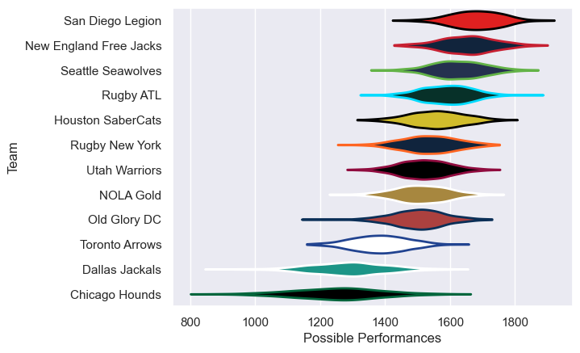

---  
title: "Major League Rugby 2023 Status"  
date: 2023-05-11 6:00:00 -0500  
categories: model review projection  
layout: article  
aside:  
    toc: true  
---
# Current Team Rankings

# Standings

## Current Standings

| Club                   |   Played |   Wins |   Point Differential |   Losing Bonus Points |   Try Bonus Points |   Competition Points |
|:-----------------------|---------:|-------:|---------------------:|----------------------:|-------------------:|---------------------:|
| San Diego Legion       |       10 |      9 |                  146 |                     1 |                  8 |                   45 |
| Seattle Seawolves      |       10 |      8 |                  122 |                     2 |                  5 |                   39 |
| New England Free Jacks |       10 |      8 |                  129 |                     1 |                  5 |                   38 |
| Houston SaberCats      |       10 |      7 |                   64 |                     1 |                  7 |                   36 |
| Utah Warriors          |        9 |      6 |                    1 |                     0 |                  4 |                   28 |
| NOLA Gold              |       10 |      5 |                    6 |                     1 |                  6 |                   27 |
| Old Glory DC           |        9 |      4 |                    4 |                     2 |                  7 |                   25 |
| Rugby ATL              |       10 |      5 |                   -5 |                     1 |                  3 |                   24 |
| Rugby New York         |       10 |      4 |                   -6 |                     1 |                  6 |                   23 |
| Dallas Jackals         |       10 |      1 |                 -139 |                     2 |                  3 |                    9 |
| Chicago Hounds         |       10 |      1 |                 -121 |                     2 |                nan |                    8 |
| Toronto Arrows         |       10 |      1 |                 -201 |                     3 |                  1 |                    8 |

## Projected Remaining Table

| Club                   |   Matches Remaining |   Wins |   Point Differential |   Losing Bonus Points |   Try Bonus Points |   Competition Points |
|:-----------------------|--------------------:|-------:|---------------------:|----------------------:|-------------------:|---------------------:|
| San Diego Legion       |                   5 |    4.6 |                 50   |                   0.3 |                4.5 |                 23.4 |
| New England Free Jacks |                   6 |    4.4 |                 35   |                   1.3 |                4.2 |                 23.1 |
| Rugby ATL              |                   6 |    4.3 |                 30.7 |                   1.4 |                4.1 |                 22.7 |
| Seattle Seawolves      |                   6 |    3.9 |                 28.5 |                   1.4 |                3.8 |                 20.9 |
| Houston SaberCats      |                   6 |    3.6 |                 20.3 |                   1.5 |                3.5 |                 19.5 |
| Utah Warriors          |                   6 |    3.2 |                 12.1 |                   1.7 |                3.1 |                 17.7 |
| Rugby New York         |                   5 |    2.9 |                 13.9 |                   0.9 |                2.8 |                 15.2 |
| NOLA Gold              |                   5 |    2.6 |                 -0.9 |                   1.2 |                2.4 |                 14   |
| Old Glory DC           |                   6 |    2.1 |                -14.1 |                   2.5 |                1.9 |                 12.6 |
| Toronto Arrows         |                   6 |    0.9 |                -44.5 |                   2   |                0.8 |                  6.6 |
| Dallas Jackals         |                   5 |    1   |                -43.2 |                   1   |                1   |                  6   |
| Chicago Hounds         |                   6 |    0.4 |                -89   |                   0.8 |                0.4 |                  2.9 |

## Projected Total Table

| Club                   |   Total Matches |   Wins |   Point Differential |   Losing Bonus Points |   Try Bonus Points |   Competition Points |
|:-----------------------|----------------:|-------:|---------------------:|----------------------:|-------------------:|---------------------:|
| San Diego Legion       |              15 |   13.6 |                196   |                   1.3 |               12.5 |                 68.4 |
| New England Free Jacks |              16 |   12.4 |                164   |                   2.3 |                9.2 |                 61.1 |
| Seattle Seawolves      |              16 |   11.9 |                150.5 |                   3.4 |                8.8 |                 59.9 |
| Houston SaberCats      |              16 |   10.6 |                 84.3 |                   2.5 |               10.5 |                 55.5 |
| Rugby ATL              |              16 |    9.3 |                 25.7 |                   2.4 |                7.1 |                 46.7 |
| Utah Warriors          |              15 |    9.2 |                 13.1 |                   1.7 |                7.1 |                 45.7 |
| NOLA Gold              |              15 |    7.6 |                  5.1 |                   2.2 |                8.4 |                 41   |
| Rugby New York         |              15 |    6.9 |                  7.9 |                   1.9 |                8.8 |                 38.2 |
| Old Glory DC           |              15 |    6.1 |                -10.1 |                   4.5 |                8.9 |                 37.6 |
| Dallas Jackals         |              15 |    2   |               -182.2 |                   3   |                4   |                 15   |
| Toronto Arrows         |              16 |    1.9 |               -245.5 |                   5   |                1.8 |                 14.6 |
| Chicago Hounds         |              16 |    1.4 |               -210   |                   2.8 |                0.4 |                 10.9 |

## Projected Playoff Results

|                        | Reach Quarterfinals   | Reach Semifinals   | Reach Final   | Win Final   |
|:-----------------------|:----------------------|:-------------------|:--------------|:------------|
| San Diego Legion       | 100.0 %               | 99.8 %             | 87.6 %        | 58.0 %      |
| New England Free Jacks | 100.0 %               | 99.9 %             | 89.1 %        | 33.0 %      |
| Seattle Seawolves      | 99.0 %                | 77.8 %             | 11.1 %        | 5.9 %       |
| Rugby ATL              | 91.3 %                | 74.1 %             | 9.0 %         | 2.1 %       |
| Houston SaberCats      | 94.0 %                | 21.5 %             | 1.2 %         | 0.6 %       |
| Rugby New York         | 22.6 %                | 6.7 %              | 0.7 %         | 0.1 %       |
| NOLA Gold              | 58.6 %                | 12.1 %             | 0.6 %         | 0.1 %       |
| Old Glory DC           | 27.5 %                | 7.2 %              | 0.6 %         | 0.1 %       |
| Utah Warriors          | 7.0 %                 | 0.9 %              | 0.1 %         | 0.1 %       |

# Completed Match Review

| Model | Percent Correct Predictions | Spread Error |
| ------ | ------ | ------ |
| Club Level | 76.3% | 12.0 |
| Player Level: Lineup | 76.3% | 15.4 |
| Player Level: Minutes | 76.3% | 15.9 |

# Future Predictions

## Week 11

### Toronto Arrows V Rugby ATL on 2023/05/13

Average Margin: Rugby ATL by 6.4

### Houston SaberCats V Seattle Seawolves on 2023/05/14

Average Margin: Seattle Seawolves by 0.0

### Dallas Jackals V Utah Warriors on 2023/05/14

Average Margin: Utah Warriors by 8.1

### Chicago Hounds V Rugby New York on 2023/05/14

Average Margin: Rugby New York by 10.8

### NOLA Gold V San Diego Legion on 2023/05/14

Average Margin: San Diego Legion by 5.2

### Old Glory DC V New England Free Jacks on 2023/05/14

Average Margin: New England Free Jacks by 3.6

## Week 12

### Toronto Arrows V Old Glory DC on 2023/05/18

Average Margin: Old Glory DC by 2.6

### Rugby ATL V Dallas Jackals on 2023/05/20

Average Margin: Rugby ATL by 17.8

### Utah Warriors V Houston SaberCats on 2023/05/20

Average Margin: Utah Warriors by 1.6

### Seattle Seawolves V Chicago Hounds on 2023/05/20

Average Margin: Seattle Seawolves by 21.5

### New England Free Jacks V NOLA Gold on 2023/05/21

Average Margin: New England Free Jacks by 10.2

## Week 13

### Old Glory DC V Seattle Seawolves on 2023/05/27

Average Margin: Seattle Seawolves by 2.9

### New England Free Jacks V Toronto Arrows on 2023/05/27

Average Margin: New England Free Jacks by 16.5

### Houston SaberCats V Chicago Hounds on 2023/05/27

Average Margin: Houston SaberCats by 18.9

### Utah Warriors V Rugby ATL on 2023/05/27

Average Margin: Rugby ATL by 0.3

### San Diego Legion V Rugby New York on 2023/05/28

Average Margin: San Diego Legion by 10.5

## Week 14

### Rugby ATL V New England Free Jacks on 2023/06/02

Average Margin: Rugby ATL by 0.3

### Toronto Arrows V Houston SaberCats on 2023/06/03

Average Margin: Houston SaberCats by 5.2

### Chicago Hounds V San Diego Legion on 2023/06/03

Average Margin: San Diego Legion by 17.6

### NOLA Gold V Old Glory DC on 2023/06/03

Average Margin: NOLA Gold by 3.9

### Rugby New York V Dallas Jackals on 2023/06/04

Average Margin: Rugby New York by 15.2

### Seattle Seawolves V Utah Warriors on 2023/06/04

Average Margin: Seattle Seawolves by 8.6

## Week 15

### Houston SaberCats V Old Glory DC on 2023/06/09

Average Margin: Houston SaberCats by 5.8

### Rugby ATL V Rugby New York on 2023/06/10

Average Margin: Rugby ATL by 5.6

### Dallas Jackals V NOLA Gold on 2023/06/10

Average Margin: NOLA Gold by 7.5

### Utah Warriors V Chicago Hounds on 2023/06/10

Average Margin: Utah Warriors by 15.9

### Seattle Seawolves V New England Free Jacks on 2023/06/11

Average Margin: Seattle Seawolves by 2.1

### Toronto Arrows V San Diego Legion on 2023/06/11

Average Margin: San Diego Legion by 11.2

## Week 16

### Dallas Jackals V Chicago Hounds on 2023/06/17

Average Margin: Dallas Jackals by 4.9

### Toronto Arrows V NOLA Gold on 2023/06/17

Average Margin: NOLA Gold by 3.2

### New England Free Jacks V Houston SaberCats on 2023/06/17

Average Margin: New England Free Jacks by 7.7

### Old Glory DC V Rugby ATL on 2023/06/17

Average Margin: Rugby ATL by 0.8

### Rugby New York V Utah Warriors on 2023/06/18

Average Margin: Rugby New York by 4.3

### San Diego Legion V Seattle Seawolves on 2023/06/18

Average Margin: San Diego Legion by 5.9

