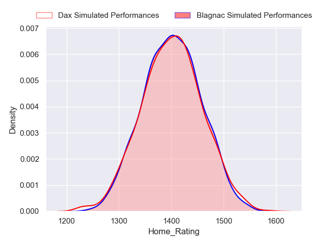
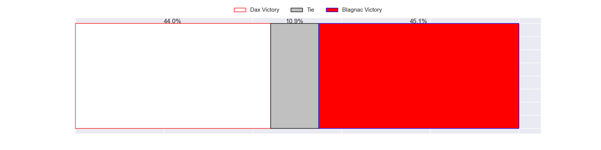
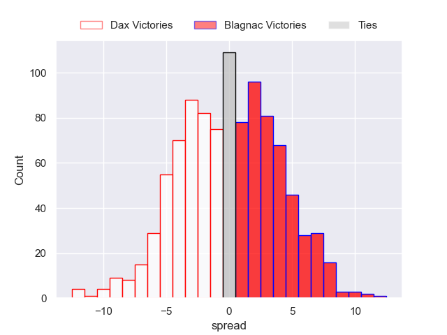
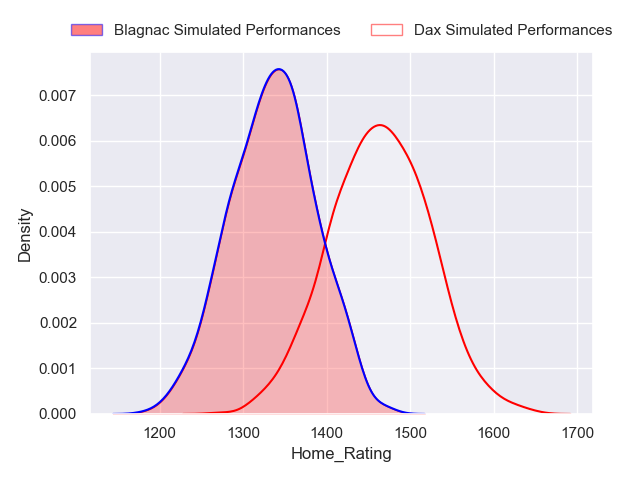
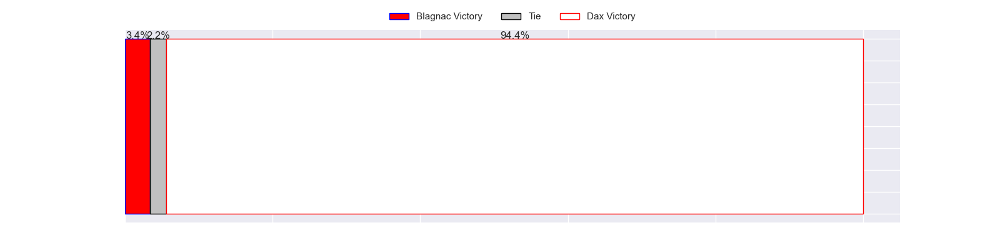
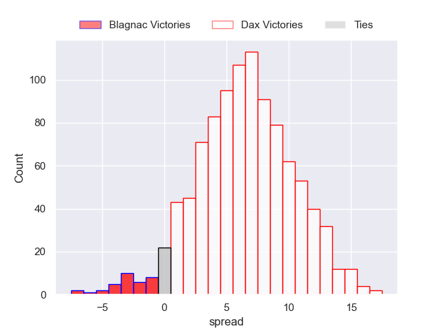

---  
title: "Nationale Status"  
date: 2023-05-07 6:00:00 -0500  
categories: model review projection  
layout: article  
aside:  
    toc: true  
---
# Current Team Rankings

# Standings

## Current Standings

| Club                       |   Played |   Wins |   Point Differential |   Losing Bonus Points |   Try Bonus Points |   Competition Points |
|:---------------------------|---------:|-------:|---------------------:|----------------------:|-------------------:|---------------------:|
| Dax                        |       26 |     21 |                  280 |                     2 |                 11 |                   97 |
| Albi                       |       27 |     19 |                  235 |                     4 |                  6 |                   88 |
| Valence Romans Drome Rugby |       26 |     17 |                  290 |                     7 |                nan |                   86 |
| Blagnac                    |       27 |     19 |                   79 |                     3 |                  4 |                   83 |
| Bourgoin-Jallieu           |       27 |     17 |                   62 |                     3 |                  2 |                   73 |
| US Bressane                |       27 |     15 |                   29 |                     5 |                  6 |                   71 |
| Narbonne                   |       26 |     14 |                   25 |                     5 |                  6 |                   69 |
| Nice                       |       26 |     13 |                   63 |                     9 |                  5 |                   66 |
| Chambery                   |       26 |     13 |                   67 |                     6 |                  5 |                   63 |
| Tarbes                     |       26 |     13 |                   -2 |                     6 |                  4 |                   62 |
| Suresnes                   |       26 |      9 |                 -257 |                     3 |                  3 |                   44 |
| Carqueiranne-Hyères        |       26 |      8 |                 -111 |                     7 |                  4 |                   43 |
| Rennes                     |       26 |      4 |                 -298 |                     6 |                  2 |                   24 |
| Cognac Saint Jean d'Angély |       26 |      0 |                 -462 |                     9 |                nan |                    9 |

## Projected Remaining Table

| Club                       |   Matches Remaining |   Wins |   Point Differential |   Losing Bonus Points |   Try Bonus Points |   Competition Points |
|:---------------------------|--------------------:|-------:|---------------------:|----------------------:|-------------------:|---------------------:|
| Dax                        |                   2 |    1.4 |                  5.9 |                   0.5 |                1.4 |                  7.6 |
| Valence Romans Drome Rugby |                   2 |    1.1 |                  1.7 |                   0.7 |                1   |                  6.3 |
| Albi                       |                   2 |    0.9 |                 -1.7 |                   0.9 |                0.7 |                  5.1 |
| Blagnac                    |                   2 |    0.6 |                 -5.9 |                   0.9 |                0.5 |                  3.7 |

## Projected Total Table

| Club                       |   Total Matches |   Wins |   Point Differential |   Losing Bonus Points |   Try Bonus Points |   Competition Points |
|:---------------------------|----------------:|-------:|---------------------:|----------------------:|-------------------:|---------------------:|
| Dax                        |              28 |   22.4 |                285.9 |                   2.5 |               12.4 |                104.6 |
| Albi                       |              29 |   19.9 |                233.3 |                   4.9 |                6.7 |                 93.1 |
| Valence Romans Drome Rugby |              28 |   18.1 |                291.7 |                   7.7 |                1   |                 92.3 |
| Blagnac                    |              29 |   19.6 |                 73.1 |                   3.9 |                4.5 |                 86.7 |
| Bourgoin-Jallieu           |              27 |   17   |                 62   |                   3   |                2   |                 73   |
| US Bressane                |              27 |   15   |                 29   |                   5   |                6   |                 71   |
| Narbonne                   |              26 |   14   |                 25   |                   5   |                6   |                 69   |
| Nice                       |              26 |   13   |                 63   |                   9   |                5   |                 66   |
| Chambery                   |              26 |   13   |                 67   |                   6   |                5   |                 63   |
| Tarbes                     |              26 |   13   |                 -2   |                   6   |                4   |                 62   |
| Suresnes                   |              26 |    9   |               -257   |                   3   |                3   |                 44   |
| Carqueiranne-Hyères        |              26 |    8   |               -111   |                   7   |                4   |                 43   |
| Rennes                     |              26 |    4   |               -298   |                   6   |                2   |                 24   |
| Cognac Saint Jean d'Angély |              26 |    0   |               -462   |                   9   |                0   |                  9   |

# Completed Match Review

| Model | Percent Correct Predictions | Spread Error |
| ------ | ------ | ------ |
| Club Level | 69.6% | 10.3 |
| Player Level: Lineup | 66.7% | 11.7 |
| Player Level: Minutes | 67.8% | 11.9 |

# Future Predictions

## Week 27

### Albi V Valence Romans Drome Rugby on 2023/05/13

Average Margin: Albi by 2.4

### Blagnac V Dax on 2023/05/13

Average Margin: Blagnac by 0.1

## Week 28

### Valence Romans Drome Rugby V Albi on 2023/05/20

Average Margin: Valence Romans Drome Rugby by 4.2

### Dax V Blagnac on 2023/05/20

Average Margin: Dax by 6.5

