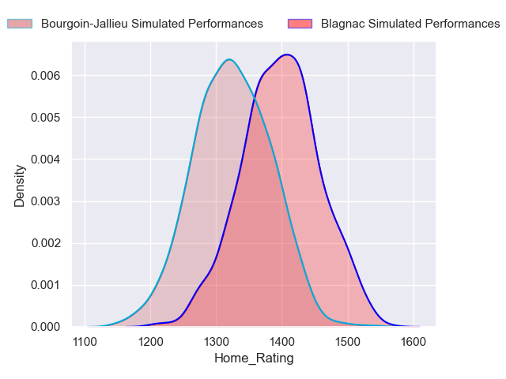
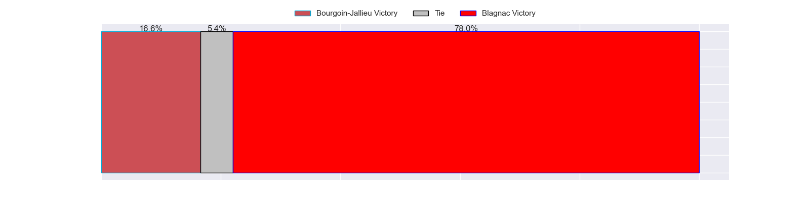

---  
title: "Nationale Status"  
date: 2023-05-06 6:00:00 -0500  
categories: model review projection  
layout: article  
aside:  
    toc: true  
---
# Current Team Rankings

# Standings

## Current Standings

| Club                       |   Played |   Wins |   Point Differential |   Losing Bonus Points |   Try Bonus Points |   Competition Points |
|:---------------------------|---------:|-------:|---------------------:|----------------------:|-------------------:|---------------------:|
| Dax                        |       26 |     21 |                  280 |                     2 |                 11 |                   97 |
| Valence Romans Drome Rugby |       26 |     17 |                  290 |                     7 |                nan |                   86 |
| Albi                       |       26 |     18 |                  222 |                     4 |                  6 |                   84 |
| Blagnac                    |       26 |     18 |                   68 |                     3 |                  4 |                   79 |
| Bourgoin-Jallieu           |       26 |     17 |                   73 |                     3 |                  2 |                   73 |
| US Bressane                |       26 |     15 |                   42 |                     5 |                  6 |                   71 |
| Narbonne                   |       26 |     14 |                   25 |                     5 |                  6 |                   69 |
| Nice                       |       26 |     13 |                   63 |                     9 |                  5 |                   66 |
| Chambery                   |       26 |     13 |                   67 |                     6 |                  5 |                   63 |
| Tarbes                     |       26 |     13 |                   -2 |                     6 |                  4 |                   62 |
| Suresnes                   |       26 |      9 |                 -257 |                     3 |                  3 |                   44 |
| Carqueiranne-Hyères        |       26 |      8 |                 -111 |                     7 |                  4 |                   43 |
| Rennes                     |       26 |      4 |                 -298 |                     6 |                  2 |                   24 |
| Cognac Saint Jean d'Angély |       26 |      0 |                 -462 |                     9 |                nan |                    9 |

## Projected Remaining Table

| Club             |   Matches Remaining |   Wins |   Point Differential |   Losing Bonus Points |   Try Bonus Points |   Competition Points |
|:-----------------|--------------------:|-------:|---------------------:|----------------------:|-------------------:|---------------------:|
| Albi             |                   1 |    1   |                  7.1 |                   0   |                0.9 |                  4.8 |
| Blagnac          |                   1 |    0.8 |                  3.4 |                   0.2 |                0.8 |                  4.2 |
| Bourgoin-Jallieu |                   1 |    0.2 |                 -3.4 |                   0.6 |                0.1 |                  1.5 |
| US Bressane      |                   1 |    0   |                 -7.1 |                   0.4 |                0   |                  0.6 |

## Projected Total Table

| Club                       |   Total Matches |   Wins |   Point Differential |   Losing Bonus Points |   Try Bonus Points |   Competition Points |
|:---------------------------|----------------:|-------:|---------------------:|----------------------:|-------------------:|---------------------:|
| Dax                        |              26 |   21   |                280   |                   2   |               11   |                 97   |
| Albi                       |              27 |   19   |                229.1 |                   4   |                6.9 |                 88.8 |
| Valence Romans Drome Rugby |              26 |   17   |                290   |                   7   |                0   |                 86   |
| Blagnac                    |              27 |   18.8 |                 71.4 |                   3.2 |                4.8 |                 83.2 |
| Bourgoin-Jallieu           |              27 |   17.2 |                 69.6 |                   3.6 |                2.1 |                 74.5 |
| US Bressane                |              27 |   15   |                 34.9 |                   5.4 |                6   |                 71.6 |
| Narbonne                   |              26 |   14   |                 25   |                   5   |                6   |                 69   |
| Nice                       |              26 |   13   |                 63   |                   9   |                5   |                 66   |
| Chambery                   |              26 |   13   |                 67   |                   6   |                5   |                 63   |
| Tarbes                     |              26 |   13   |                 -2   |                   6   |                4   |                 62   |
| Suresnes                   |              26 |    9   |               -257   |                   3   |                3   |                 44   |
| Carqueiranne-Hyères        |              26 |    8   |               -111   |                   7   |                4   |                 43   |
| Rennes                     |              26 |    4   |               -298   |                   6   |                2   |                 24   |
| Cognac Saint Jean d'Angély |              26 |    0   |               -462   |                   9   |                0   |                  9   |

# Completed Match Review

| Model | Percent Correct Predictions | Spread Error |
| ------ | ------ | ------ |
| Club Level | 69.2% | 10.4 |
| Player Level: Lineup | 66.9% | 11.7 |
| Player Level: Minutes | 68.0% | 11.9 |

# Future Predictions

## Week 27

### Blagnac V Bourgoin-Jallieu on 2023/05/06

Average Margin: Blagnac by 3.7

### Albi V US Bressane on 2023/05/06

Average Margin: Albi by 7.6

