---  
title: "Nationale Status"  
date: 2023-04-21 6:00:00 -0500  
categories: model review projection  
layout: article  
aside:  
    toc: true  
---
# Current Team Rankings

# Standings

## Current Standings

| Club                       |   Played |   Wins |   Point Differential |   Losing Bonus Points |   Try Bonus Points |   Competition Points |
|:---------------------------|---------:|-------:|---------------------:|----------------------:|-------------------:|---------------------:|
| Dax                        |       24 |     20 |                  285 |                     2 |                 10 |                   92 |
| Valence Romans Drome Rugby |       24 |     17 |                  299 |                     5 |                nan |                   84 |
| Albi                       |       23 |     15 |                  187 |                     4 |                  6 |                   72 |
| Blagnac                    |       23 |     16 |                   56 |                     3 |                  4 |                   71 |
| Bourgoin-Jallieu           |       23 |     15 |                   73 |                     3 |                  2 |                   65 |
| US Bressane                |       23 |     14 |                   36 |                     4 |                  3 |                   63 |
| Nice                       |       23 |     12 |                   71 |                     7 |                  4 |                   59 |
| Narbonne                   |       23 |     11 |                   -7 |                     5 |                  6 |                   57 |
| Chambery                   |       23 |     11 |                   56 |                     5 |                  5 |                   54 |
| Tarbes                     |       23 |     10 |                  -33 |                     6 |                  3 |                   49 |
| Suresnes                   |       23 |      8 |                 -218 |                     3 |                  3 |                   40 |
| Carqueiranne-Hyères        |       23 |      7 |                 -123 |                     5 |                  2 |                   35 |
| Rennes                     |       23 |      4 |                 -272 |                     5 |                  2 |                   23 |
| Cognac Saint Jean d'Angély |       23 |      0 |                 -410 |                     9 |                nan |                    9 |

## Projected Remaining Table

| Club                       |   Matches Remaining |   Wins |   Point Differential |   Losing Bonus Points |   Try Bonus Points |   Competition Points |
|:---------------------------|--------------------:|-------:|---------------------:|----------------------:|-------------------:|---------------------:|
| Albi                       |                   1 |    1   |                 11.9 |                   0   |                1   |                  5   |
| Blagnac                    |                   1 |    1   |                 10.6 |                   0   |                1   |                  5   |
| Bourgoin-Jallieu           |                   1 |    1   |                  8.5 |                   0   |                0.9 |                  4.8 |
| US Bressane                |                   1 |    1   |                  6.4 |                   0   |                0.9 |                  4.8 |
| Dax                        |                   1 |    0.8 |                  3.3 |                   0.2 |                0.8 |                  4.3 |
| Valence Romans Drome Rugby |                   1 |    0.8 |                  3.1 |                   0.2 |                0.8 |                  4.1 |
| Nice                       |                   1 |    0.7 |                  2.3 |                   0.3 |                0.6 |                  3.7 |
| Carqueiranne-Hyères        |                   1 |    0.3 |                 -2.3 |                   0.5 |                0.3 |                  2   |
| Chambery                   |                   1 |    0.2 |                 -3.1 |                   0.6 |                0.2 |                  1.6 |
| Narbonne                   |                   1 |    0.2 |                 -3.3 |                   0.6 |                0.1 |                  1.5 |
| Tarbes                     |                   1 |    0   |                 -6.4 |                   0.5 |                0.1 |                  0.7 |
| Rennes                     |                   1 |    0   |                 -8.5 |                   0.3 |                0.1 |                  0.6 |
| Suresnes                   |                   1 |    0   |                -10.6 |                   0.1 |                0   |                  0.2 |
| Cognac Saint Jean d'Angély |                   1 |    0   |                -11.9 |                   0.1 |                0   |                  0.1 |

## Projected Total Table

| Club                       |   Total Matches |   Wins |   Point Differential |   Losing Bonus Points |   Try Bonus Points |   Competition Points |
|:---------------------------|----------------:|-------:|---------------------:|----------------------:|-------------------:|---------------------:|
| Dax                        |              25 |   20.8 |                288.3 |                   2.2 |               10.8 |                 96.3 |
| Valence Romans Drome Rugby |              25 |   17.8 |                302.1 |                   5.2 |                0.8 |                 88.1 |
| Albi                       |              24 |   16   |                198.9 |                   4   |                7   |                 77   |
| Blagnac                    |              24 |   17   |                 66.6 |                   3   |                5   |                 76   |
| Bourgoin-Jallieu           |              24 |   16   |                 81.5 |                   3   |                2.9 |                 69.8 |
| US Bressane                |              24 |   15   |                 42.4 |                   4   |                3.9 |                 67.8 |
| Nice                       |              24 |   12.7 |                 73.3 |                   7.3 |                4.6 |                 62.7 |
| Narbonne                   |              24 |   11.2 |                -10.3 |                   5.6 |                6.1 |                 58.5 |
| Chambery                   |              24 |   11.2 |                 52.9 |                   5.6 |                5.2 |                 55.6 |
| Tarbes                     |              24 |   10   |                -39.4 |                   6.5 |                3.1 |                 49.7 |
| Suresnes                   |              24 |    8   |               -228.6 |                   3.1 |                3   |                 40.2 |
| Carqueiranne-Hyères        |              24 |    7.3 |               -125.3 |                   5.5 |                2.3 |                 37   |
| Rennes                     |              24 |    4   |               -280.5 |                   5.3 |                2.1 |                 23.6 |
| Cognac Saint Jean d'Angély |              24 |    0   |               -421.9 |                   9.1 |                0   |                  9.1 |

# Completed Match Review

| Model | Percent Correct Predictions | Spread Error |
| ------ | ------ | ------ |
| Club Level | 69.1% | 10.7 |
| Player Level: Lineup | 70.8% | 11.3 |
| Player Level: Minutes | 68.3% | 11.2 |

# Future Predictions

## Week 11

### Chambery V Valence Romans Drome Rugby on 2023/04/29

Average Margin: Valence Romans Drome Rugby by 3.4

### Rennes V Bourgoin-Jallieu on 2023/04/29

Average Margin: Bourgoin-Jallieu by 9.0

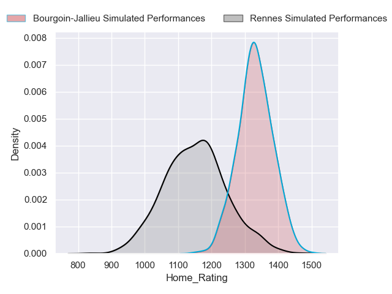
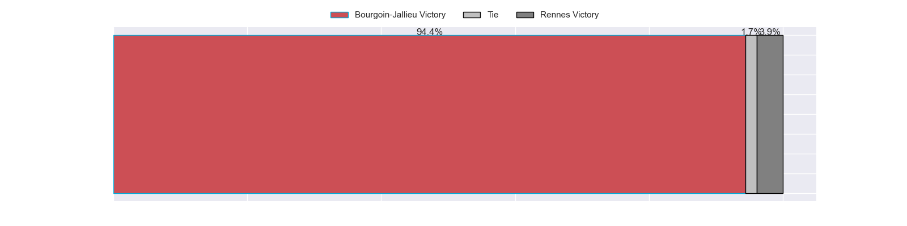
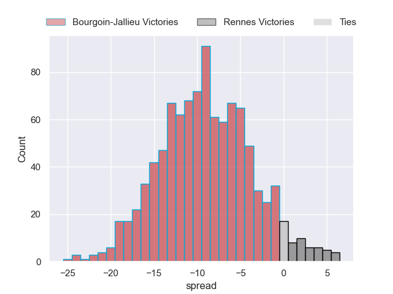

### Carqueiranne-Hyères V Nice on 2023/04/29

Average Margin: Nice by 2.5

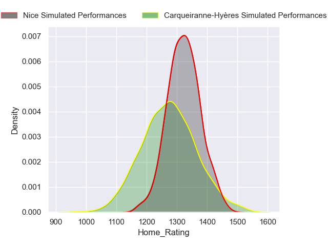
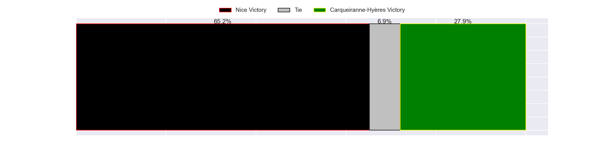
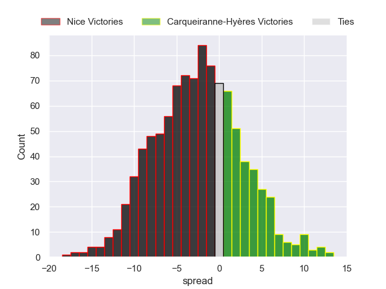

### Blagnac V Suresnes on 2023/04/29

Average Margin: Blagnac by 11.1

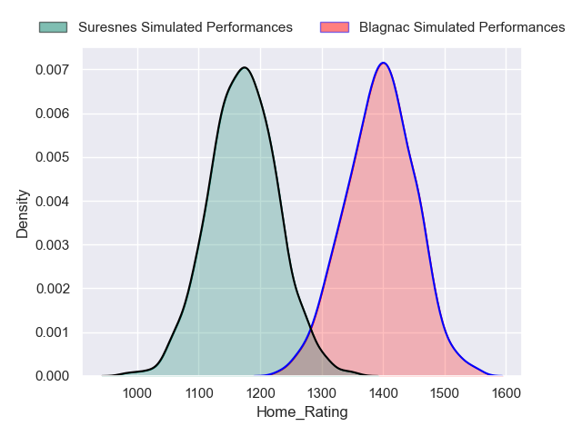
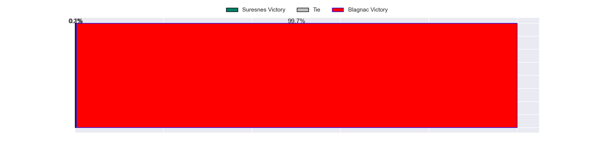
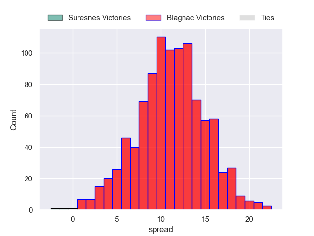

### Cognac Saint Jean d'Angély V Albi on 2023/04/29

Average Margin: Albi by 12.4

### Narbonne V Dax on 2023/04/29

Average Margin: Dax by 3.6

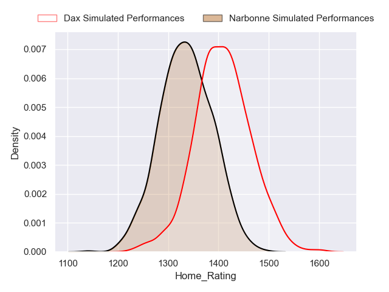
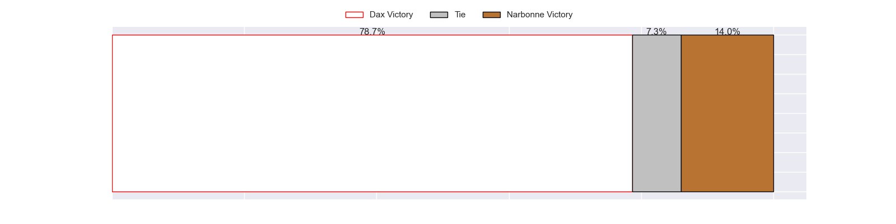
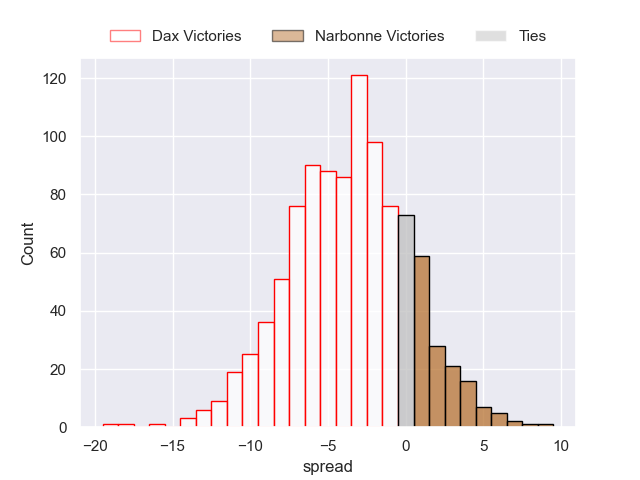

### US Bressane V Tarbes on 2023/04/29

Average Margin: US Bressane by 6.8

