---  
title: "Nationale Status"  
date: 2023-04-28 6:00:00 -0500  
categories: model review projection  
layout: article  
aside:  
    toc: true  
---
# Current Team Rankings

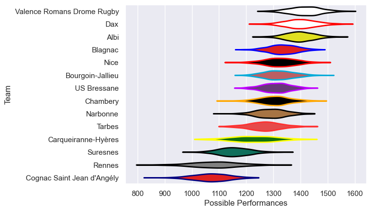
# Standings

## Current Standings

| Club                       |   Played |   Wins |   Point Differential |   Losing Bonus Points |   Try Bonus Points |   Competition Points |
|:---------------------------|---------:|-------:|---------------------:|----------------------:|-------------------:|---------------------:|
| Dax                        |       25 |     21 |                  289 |                     2 |                 11 |                   97 |
| Valence Romans Drome Rugby |       25 |     17 |                  297 |                     6 |                nan |                   85 |
| Albi                       |       25 |     17 |                  211 |                     4 |                  6 |                   80 |
| Blagnac                    |       25 |     17 |                   47 |                     3 |                  4 |                   75 |
| Bourgoin-Jallieu           |       25 |     16 |                   62 |                     3 |                  2 |                   69 |
| US Bressane                |       25 |     15 |                   44 |                     4 |                  4 |                   68 |
| Narbonne                   |       25 |     13 |                   16 |                     5 |                  6 |                   65 |
| Nice                       |       25 |     12 |                   60 |                     9 |                  4 |                   61 |
| Chambery                   |       25 |     12 |                   60 |                     6 |                  5 |                   59 |
| Tarbes                     |       25 |     12 |                   -4 |                     6 |                  4 |                   58 |
| Suresnes                   |       25 |      9 |                 -236 |                     3 |                  3 |                   44 |
| Carqueiranne-Hyères        |       25 |      8 |                 -108 |                     6 |                  3 |                   41 |
| Rennes                     |       25 |      4 |                 -287 |                     6 |                  2 |                   24 |
| Cognac Saint Jean d'Angély |       25 |      0 |                 -451 |                     9 |                nan |                    9 |

## Projected Remaining Table

| Club                       |   Matches Remaining |   Wins |   Point Differential |   Losing Bonus Points |   Try Bonus Points |   Competition Points |
|:---------------------------|--------------------:|-------:|---------------------:|----------------------:|-------------------:|---------------------:|
| Albi                       |                   1 |    1   |                 12.5 |                   0   |                1   |                  5   |
| Blagnac                    |                   1 |    1   |                 11.2 |                   0   |                1   |                  5   |
| Bourgoin-Jallieu           |                   1 |    0.9 |                  7.3 |                   0.1 |                0.9 |                  4.7 |
| US Bressane                |                   1 |    0.9 |                  5.6 |                   0.1 |                0.9 |                  4.7 |
| Dax                        |                   1 |    0.8 |                  2.6 |                   0.2 |                0.7 |                  4   |
| Valence Romans Drome Rugby |                   1 |    0.8 |                  2.6 |                   0.2 |                0.7 |                  4   |
| Nice                       |                   1 |    0.6 |                  0.9 |                   0.4 |                0.5 |                  3.2 |
| Carqueiranne-Hyères        |                   1 |    0.4 |                 -0.9 |                   0.5 |                0.4 |                  2.5 |
| Chambery                   |                   1 |    0.2 |                 -2.6 |                   0.6 |                0.2 |                  1.7 |
| Narbonne                   |                   1 |    0.2 |                 -2.6 |                   0.6 |                0.2 |                  1.7 |
| Tarbes                     |                   1 |    0.1 |                 -5.6 |                   0.5 |                0   |                  0.8 |
| Rennes                     |                   1 |    0.1 |                 -7.3 |                   0.4 |                0.1 |                  0.7 |
| Suresnes                   |                   1 |    0   |                -11.2 |                   0.1 |                0   |                  0.1 |
| Cognac Saint Jean d'Angély |                   1 |    0   |                -12.5 |                   0.1 |                0   |                  0.1 |

## Projected Total Table

| Club                       |   Total Matches |   Wins |   Point Differential |   Losing Bonus Points |   Try Bonus Points |   Competition Points |
|:---------------------------|----------------:|-------:|---------------------:|----------------------:|-------------------:|---------------------:|
| Dax                        |              26 |   21.8 |                291.6 |                   2.2 |               11.7 |                101   |
| Valence Romans Drome Rugby |              26 |   17.8 |                299.6 |                   6.2 |                0.7 |                 89   |
| Albi                       |              26 |   18   |                223.5 |                   4   |                7   |                 85   |
| Blagnac                    |              26 |   18   |                 58.2 |                   3   |                5   |                 80   |
| Bourgoin-Jallieu           |              26 |   16.9 |                 69.3 |                   3.1 |                2.9 |                 73.7 |
| US Bressane                |              26 |   15.9 |                 49.6 |                   4.1 |                4.9 |                 72.7 |
| Narbonne                   |              26 |   13.2 |                 13.4 |                   5.6 |                6.2 |                 66.7 |
| Nice                       |              26 |   12.6 |                 60.9 |                   9.4 |                4.5 |                 64.2 |
| Chambery                   |              26 |   12.2 |                 57.4 |                   6.6 |                5.2 |                 60.7 |
| Tarbes                     |              26 |   12.1 |                 -9.6 |                   6.5 |                4   |                 58.8 |
| Suresnes                   |              26 |    9   |               -247.2 |                   3.1 |                3   |                 44.1 |
| Carqueiranne-Hyères        |              26 |    8.4 |               -108.9 |                   6.5 |                3.4 |                 43.5 |
| Rennes                     |              26 |    4.1 |               -294.3 |                   6.4 |                2.1 |                 24.7 |
| Cognac Saint Jean d'Angély |              26 |    0   |               -463.5 |                   9.1 |                0   |                  9.1 |

# Completed Match Review

| Model | Percent Correct Predictions | Spread Error |
| ------ | ------ | ------ |
| Club Level | 70.3% | 10.5 |
| Player Level: Lineup | 66.7% | 11.8 |
| Player Level: Minutes | 67.8% | 12.0 |

# Future Predictions

## Week 26

### US Bressane V Tarbes on 2023/04/29

Average Margin: US Bressane by 6.1

### Rennes V Bourgoin-Jallieu on 2023/04/29

Average Margin: Bourgoin-Jallieu by 7.8

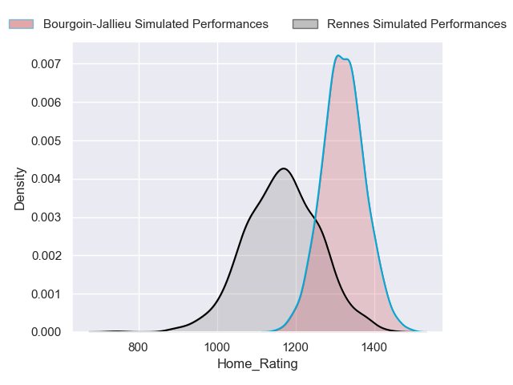
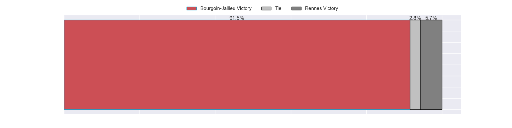
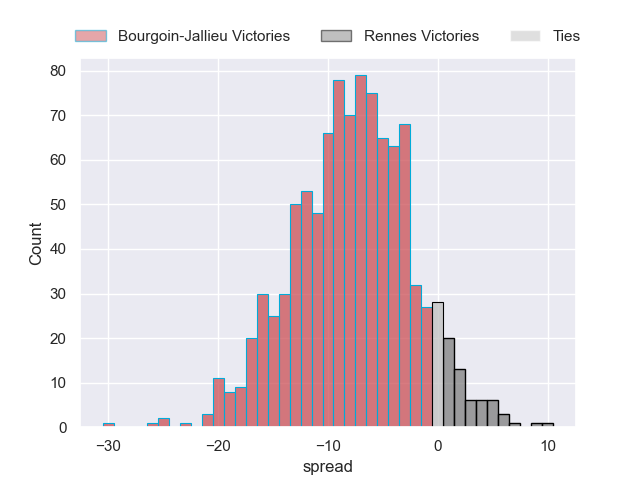

### Carqueiranne-Hyères V Nice on 2023/04/29

Average Margin: Nice by 1.0

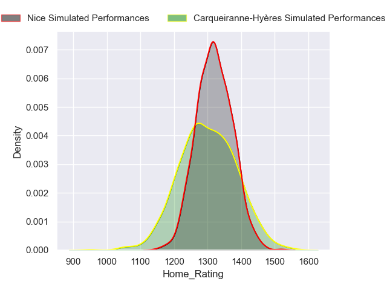
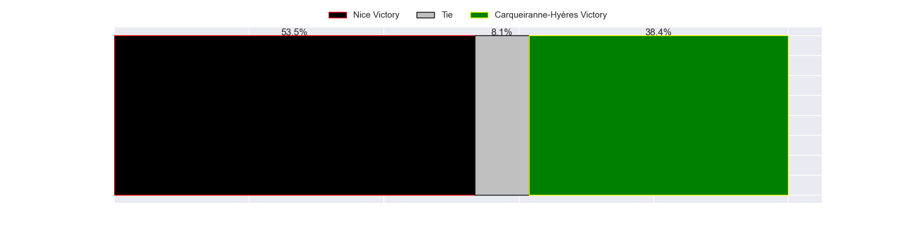
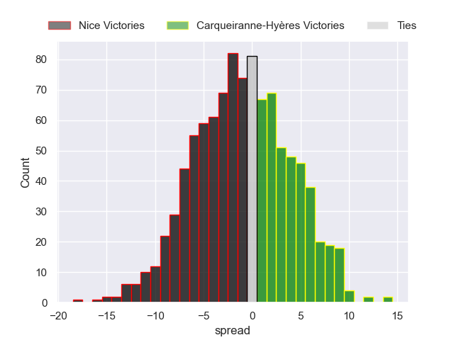

### Blagnac V Suresnes on 2023/04/29

Average Margin: Blagnac by 11.7

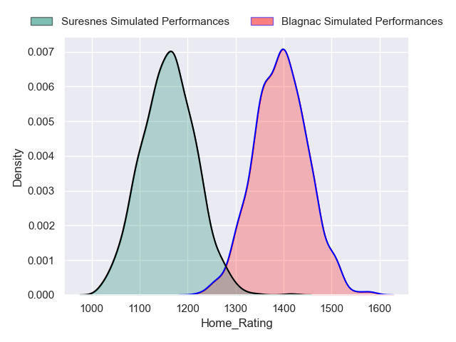
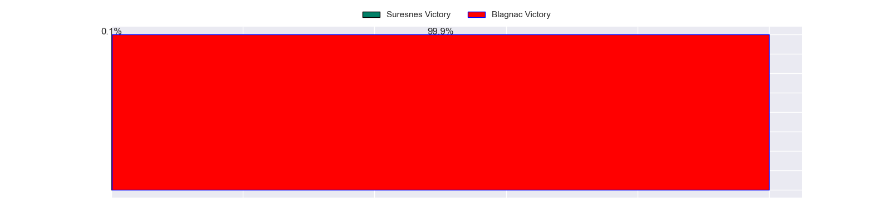
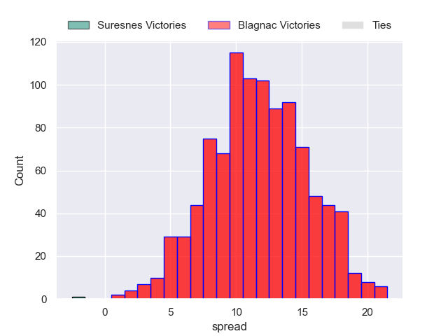

### Cognac Saint Jean d'Angély V Albi on 2023/04/29

Average Margin: Albi by 13.0

### Narbonne V Dax on 2023/04/29

Average Margin: Dax by 2.9

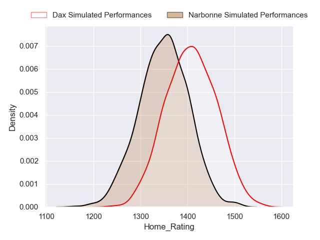
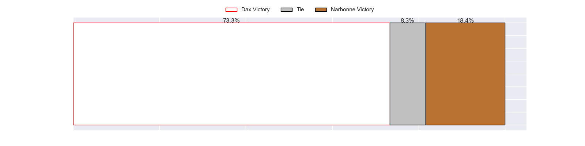
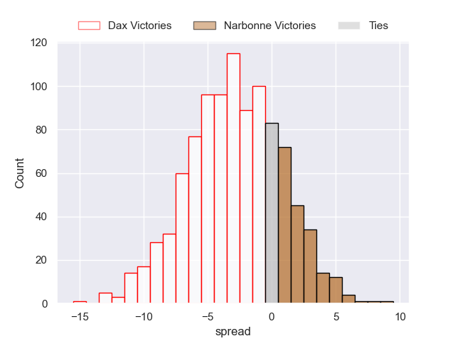

### Chambery V Valence Romans Drome Rugby on 2023/04/29

Average Margin: Valence Romans Drome Rugby by 2.9

