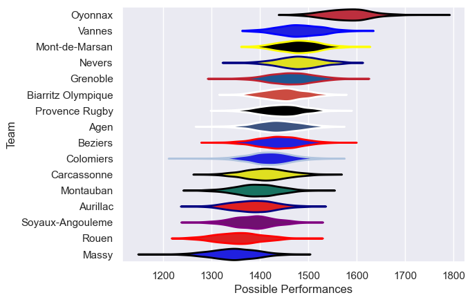
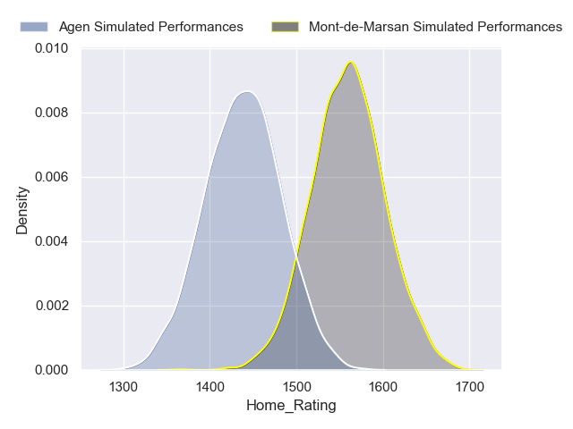
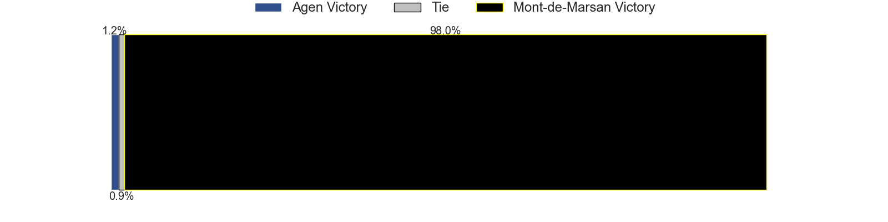
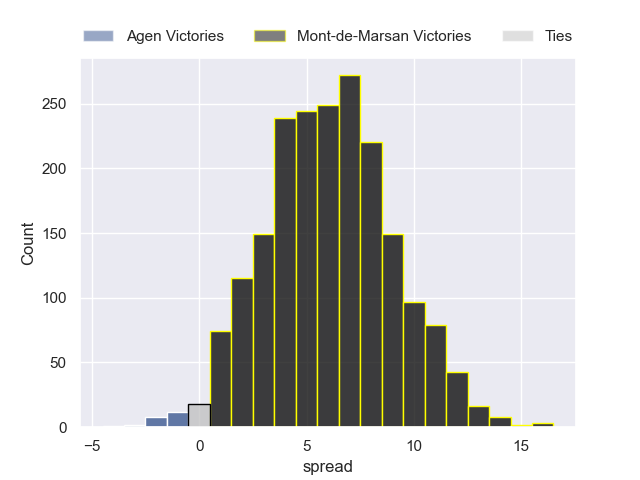
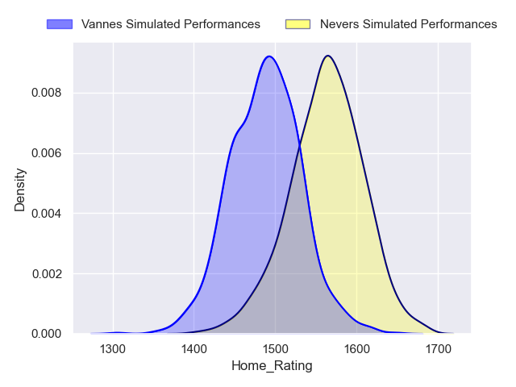
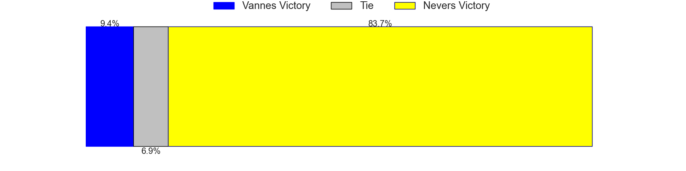
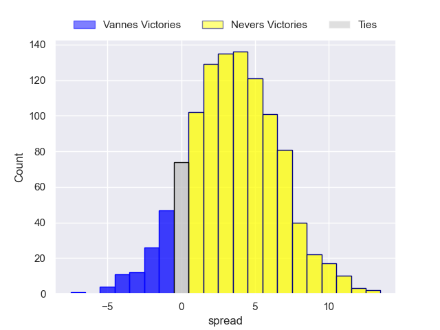

---  
title: "Pro D2 2022 Status"  
date: 2023-05-11 6:00:00 -0500  
categories: model review projection  
layout: article  
aside:  
    toc: true  
---
# Current Team Rankings

# Standings

## Current Standings

| Club               |   Played |   Wins |   Point Differential |   Losing Bonus Points |   Try Bonus Points |   Competition Points |
|:-------------------|---------:|-------:|---------------------:|----------------------:|-------------------:|---------------------:|
| Oyonnax            |       30 |     23 |                  449 |                     4 |                 15 |                  113 |
| Vannes             |       31 |     18 |                   88 |                     8 |                nan |                   92 |
| Grenoble           |       30 |     20 |                   84 |                     3 |                  6 |                   91 |
| Nevers             |       31 |     18 |                  164 |                     7 |                nan |                   89 |
| Mont-de-Marsan     |       30 |     19 |                  115 |                     5 |                  7 |                   88 |
| Agen               |       30 |     15 |                   70 |                    10 |                  7 |                   79 |
| Colomiers          |       30 |     15 |                   -4 |                     9 |                  6 |                   75 |
| Provence Rugby     |       30 |     15 |                   14 |                     5 |                  5 |                   70 |
| Beziers            |       30 |     13 |                  -18 |                     9 |                  6 |                   69 |
| Biarritz Olympique |       30 |     13 |                   -9 |                     7 |                  9 |                   68 |
| Aurillac           |       30 |     15 |                 -120 |                     3 |                  3 |                   66 |
| Rouen              |       30 |     13 |                 -173 |                     3 |                  5 |                   60 |
| Montauban          |       30 |     12 |                 -106 |                     4 |                  4 |                   58 |
| Soyaux-Angouleme   |       30 |     11 |                 -128 |                    11 |                  2 |                   57 |
| Carcassonne        |       30 |     10 |                 -124 |                     7 |                  2 |                   51 |
| Massy              |       30 |      7 |                 -302 |                     8 |                  6 |                   42 |

## Projected Remaining Table

| Club           |   Matches Remaining |   Wins |   Point Differential |   Losing Bonus Points |   Try Bonus Points |   Competition Points |
|:---------------|--------------------:|-------:|---------------------:|----------------------:|-------------------:|---------------------:|
| Mont-de-Marsan |                   1 |      1 |                  5.5 |                   0   |                  1 |                  4.9 |
| Agen           |                   1 |      0 |                 -5.5 |                   0.6 |                  0 |                  0.7 |

## Projected Total Table

| Club               |   Total Matches |   Wins |   Point Differential |   Losing Bonus Points |   Try Bonus Points |   Competition Points |
|:-------------------|----------------:|-------:|---------------------:|----------------------:|-------------------:|---------------------:|
| Oyonnax            |              30 |     23 |                449   |                   4   |                 15 |                113   |
| Mont-de-Marsan     |              31 |     20 |                120.5 |                   5   |                  8 |                 92.9 |
| Vannes             |              31 |     18 |                 88   |                   8   |                  0 |                 92   |
| Grenoble           |              30 |     20 |                 84   |                   3   |                  6 |                 91   |
| Nevers             |              31 |     18 |                164   |                   7   |                  0 |                 89   |
| Agen               |              31 |     15 |                 64.5 |                  10.6 |                  7 |                 79.7 |
| Colomiers          |              30 |     15 |                 -4   |                   9   |                  6 |                 75   |
| Provence Rugby     |              30 |     15 |                 14   |                   5   |                  5 |                 70   |
| Beziers            |              30 |     13 |                -18   |                   9   |                  6 |                 69   |
| Biarritz Olympique |              30 |     13 |                 -9   |                   7   |                  9 |                 68   |
| Aurillac           |              30 |     15 |               -120   |                   3   |                  3 |                 66   |
| Rouen              |              30 |     13 |               -173   |                   3   |                  5 |                 60   |
| Montauban          |              30 |     12 |               -106   |                   4   |                  4 |                 58   |
| Soyaux-Angouleme   |              30 |     11 |               -128   |                  11   |                  2 |                 57   |
| Carcassonne        |              30 |     10 |               -124   |                   7   |                  2 |                 51   |
| Massy              |              30 |      7 |               -302   |                   8   |                  6 |                 42   |

## Projected Playoff Results

|                | Reach Quarterfinals   | Reach Semifinals   | Reach Final   | Win Final   |
|:---------------|:----------------------|:-------------------|:--------------|:------------|
| Oyonnax        | 100.0 %               | 100.0 %            | 99.6 %        | 95.9 %      |
| Mont-de-Marsan | 197.1 %               | 195.7 %            | 97.1 %        | 3.4 %       |
| Nevers         | 102.8 %               | 92.7 %             | 3.2 %         | 0.7 %       |
| Vannes         | 100.1 %               | 10.2 %             | 0.1 %         | 0.0 %       |
| Agen           | 100.0 %               | 1.4 %              | 0.0 %         | 0.0 %       |

## Projected Promotion and Relegation Results

| Club           | Current Competition   | To Top 14   | To Pro D2   |
|:---------------|:----------------------|:------------|:------------|
| Perpignan      | Top 14                | 71.1 %      | 29.1 %      |
| Brive          | Top 14                | 9.8 %       | 90.0 %      |
| Oyonnax        | Pro D2                | 98.6 %      | 1.0 %       |
| Mont-de-Marsan | Pro D2                | 19.5 %      | 77.6 %      |
| Nevers         | Pro D2                | 1.0 %       | 2.2 %       |
| Vannes         | Pro D2                | 0.0 %       | 0.1 %       |

# Completed Match Review

| Model | Percent Correct Predictions | Spread Error |
| ------ | ------ | ------ |
| Club Level | 67.6% | 9.8 |
| Player Level: Lineup | 61.4% | 12.0 |
| Player Level: Minutes | 63.1% | 12.4 |

# Future Predictions

## Week 32

### Mont-de-Marsan V Agen on 2023/05/12

Average Margin: Mont-de-Marsan by 6.1

### Mont-de-Marsan V Agen on 2023/05/11

Average Margin: Mont-de-Marsan by 6.1

### Nevers V Vannes on 2023/05/12

Average Margin: Nevers by 3.7

