---  
title: "Pro D2 Status"  
date: 2023-05-04 6:00:00 -0500  
categories: model review projection  
layout: article  
aside:  
    toc: true  
---
# Current Team Rankings

# Standings

## Current Standings

| Club               |   Played |   Wins |   Point Differential |   Losing Bonus Points |   Try Bonus Points |   Competition Points |
|:-------------------|---------:|-------:|---------------------:|----------------------:|-------------------:|---------------------:|
| Oyonnax            |       29 |     22 |                  447 |                     4 |                 14 |                  108 |
| Vannes             |       29 |     17 |                   88 |                     7 |                 10 |                   87 |
| Grenoble           |       29 |     19 |                   81 |                     3 |                  6 |                   87 |
| Nevers             |       29 |     17 |                  132 |                     6 |                  7 |                   83 |
| Mont-de-Marsan     |       29 |     18 |                   85 |                     5 |                  6 |                   83 |
| Agen               |       29 |     15 |                   97 |                    10 |                  7 |                   79 |
| Provence Rugby     |       29 |     15 |                   34 |                     5 |                  5 |                   70 |
| Colomiers          |       29 |     14 |                  -37 |                     9 |                  5 |                   70 |
| Biarritz Olympique |       29 |     13 |                   17 |                     7 |                  9 |                   68 |
| Beziers            |       29 |     12 |                  -45 |                     9 |                  5 |                   64 |
| Aurillac           |       29 |     14 |                 -146 |                     3 |                  2 |                   61 |
| Rouen              |       29 |     13 |                 -143 |                     3 |                  5 |                   60 |
| Montauban          |       29 |     12 |                  -71 |                     4 |                  4 |                   58 |
| Soyaux-Angouleme   |       29 |     11 |                 -126 |                    10 |                  1 |                   55 |
| Carcassonne        |       29 |      9 |                 -144 |                     7 |                  1 |                   46 |
| Massy              |       29 |      7 |                 -269 |                     8 |                  6 |                   42 |

## Projected Remaining Table

| Club               |   Matches Remaining |   Wins |   Point Differential |   Losing Bonus Points |   Try Bonus Points |   Competition Points |
|:-------------------|--------------------:|-------:|---------------------:|----------------------:|-------------------:|---------------------:|
| Oyonnax            |                   1 |    1   |                 13.4 |                   0   |                1   |                  5   |
| Mont-de-Marsan     |                   1 |    1   |                  8.9 |                   0   |                1   |                  5   |
| Nevers             |                   1 |    1   |                  7.5 |                   0   |                1   |                  4.9 |
| Colomiers          |                   1 |    1   |                  6.9 |                   0   |                1   |                  4.9 |
| Grenoble           |                   1 |    0.7 |                  2.2 |                   0.2 |                0.7 |                  3.9 |
| Beziers            |                   1 |    0.7 |                  1.4 |                   0.3 |                0.6 |                  3.6 |
| Carcassonne        |                   1 |    0.6 |                  0.7 |                   0.4 |                0.5 |                  3.2 |
| Aurillac           |                   1 |    0.5 |                  0.3 |                   0.4 |                0.5 |                  3.1 |
| Biarritz Olympique |                   1 |    0.5 |                 -0.3 |                   0.5 |                0.4 |                  2.8 |
| Provence Rugby     |                   1 |    0.4 |                 -0.7 |                   0.5 |                0.3 |                  2.6 |
| Agen               |                   1 |    0.3 |                 -1.4 |                   0.6 |                0.3 |                  2.2 |
| Vannes             |                   1 |    0.3 |                 -2.2 |                   0.6 |                0.2 |                  1.8 |
| Massy              |                   1 |    0   |                 -6.9 |                   0.4 |                0   |                  0.6 |
| Montauban          |                   1 |    0   |                 -7.5 |                   0.4 |                0   |                  0.4 |
| Rouen              |                   1 |    0   |                 -8.9 |                   0.2 |                0   |                  0.3 |
| Soyaux-Angouleme   |                   1 |    0   |                -13.4 |                   0   |                0   |                  0   |

## Projected Total Table

| Club               |   Total Matches |   Wins |   Point Differential |   Losing Bonus Points |   Try Bonus Points |   Competition Points |
|:-------------------|----------------:|-------:|---------------------:|----------------------:|-------------------:|---------------------:|
| Oyonnax            |              30 |   23   |                460.4 |                   4   |               15   |                113   |
| Grenoble           |              30 |   19.7 |                 83.2 |                   3.2 |                6.7 |                 90.9 |
| Vannes             |              30 |   17.3 |                 85.8 |                   7.6 |               10.2 |                 88.8 |
| Mont-de-Marsan     |              30 |   19   |                 93.9 |                   5   |                7   |                 88   |
| Nevers             |              30 |   18   |                139.5 |                   6   |                8   |                 87.9 |
| Agen               |              30 |   15.3 |                 95.6 |                  10.6 |                7.3 |                 81.2 |
| Colomiers          |              30 |   15   |                -30.1 |                   9   |                6   |                 74.9 |
| Provence Rugby     |              30 |   15.4 |                 33.3 |                   5.5 |                5.3 |                 72.6 |
| Biarritz Olympique |              30 |   13.5 |                 16.7 |                   7.5 |                9.4 |                 70.8 |
| Beziers            |              30 |   12.7 |                -43.6 |                   9.3 |                5.6 |                 67.6 |
| Aurillac           |              30 |   14.5 |               -145.7 |                   3.4 |                2.5 |                 64.1 |
| Rouen              |              30 |   13   |               -151.9 |                   3.2 |                5   |                 60.3 |
| Montauban          |              30 |   12   |                -78.5 |                   4.4 |                4   |                 58.4 |
| Soyaux-Angouleme   |              30 |   11   |               -139.4 |                  10   |                1   |                 55   |
| Carcassonne        |              30 |    9.6 |               -143.3 |                   7.4 |                1.5 |                 49.2 |
| Massy              |              30 |    7   |               -275.9 |                   8.4 |                6   |                 42.6 |

## Projected Playoff Results

|                | Reach Quarterfinals   | Reach Semifinals   | Reach Final   | Win Final   |
|:---------------|:----------------------|:-------------------|:--------------|:------------|
| Oyonnax        | 100.0 %               | 100.0 %            | 99.5 %        | 96.4 %      |
| Nevers         | 100.0 %               | 93.1 %             | 21.1 %        | 1.3 %       |
| Grenoble       | 100.0 %               | 77.0 %             | 55.8 %        | 1.1 %       |
| Vannes         | 100.0 %               | 37.2 %             | 21.2 %        | 0.9 %       |
| Mont-de-Marsan | 100.0 %               | 87.4 %             | 2.4 %         | 0.3 %       |
| Agen           | 100.0 %               | 5.3 %              | 0.0 %         | 0.0 %       |

## Projected Promotion and Relegation Results

| Club           | Current Competition   | To Top 14   | To Pro D2   |
|:---------------|:----------------------|:------------|:------------|
| Perpignan      | Top 14                | 79.4 %      | 20.4 %      |
| Pau            | Top 14                | 0.2 %       | 0.0 %       |
| Brive          | Top 14                | 0.0 %       | 100.0 %     |
| Oyonnax        | Pro D2                | 98.5 %      | 1.0 %       |
| Grenoble       | Pro D2                | 8.8 %       | 47.0 %      |
| Vannes         | Pro D2                | 6.2 %       | 15.0 %      |
| Nevers         | Pro D2                | 6.1 %       | 15.0 %      |
| Mont-de-Marsan | Pro D2                | 0.8 %       | 1.6 %       |

# Completed Match Review

| Model | Percent Correct Predictions | Spread Error |
| ------ | ------ | ------ |
| Club Level | 66.8% | 9.5 |
| Player Level: Lineup | 62.5% | 11.6 |
| Player Level: Minutes | 61.2% | 12.0 |

# Future Predictions

## Week 30

### Beziers V Agen on 2023/05/05

Average Margin: Beziers by 1.6

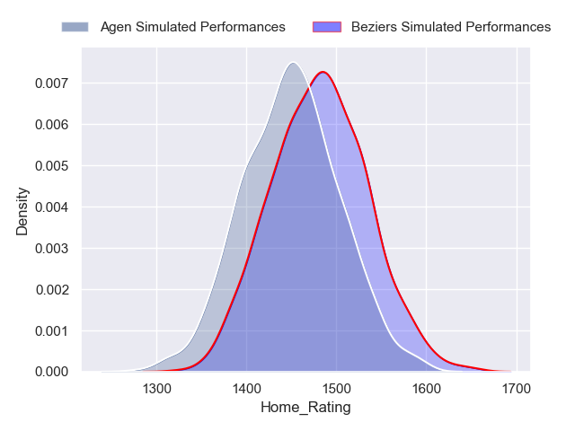
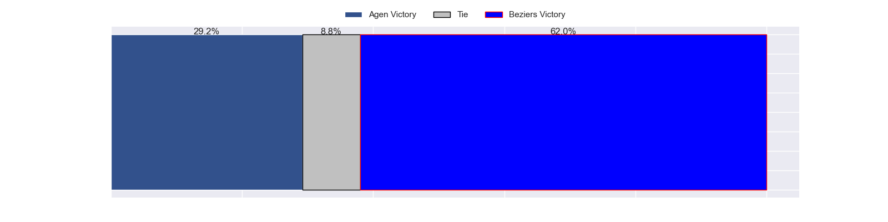
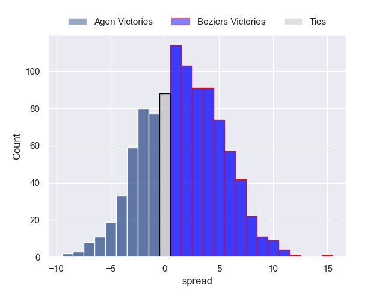

### Grenoble V Vannes on 2023/05/05

Average Margin: Grenoble by 2.4

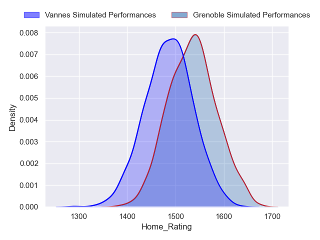
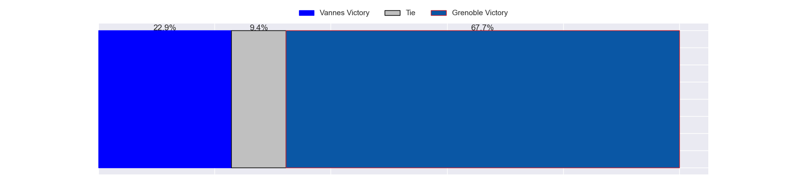
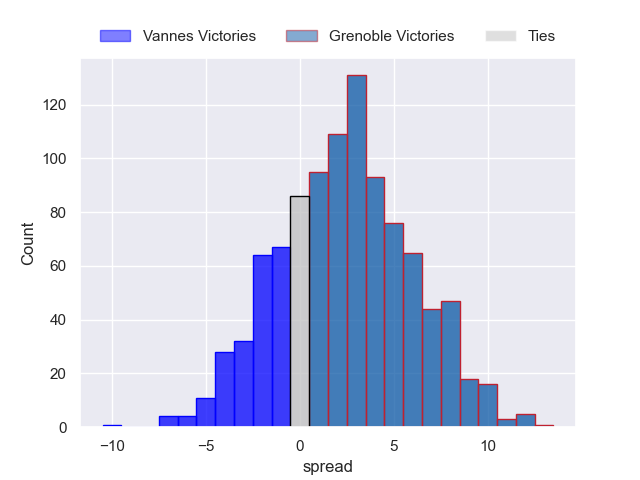

### Nevers V Montauban on 2023/05/05

Average Margin: Nevers by 8.0

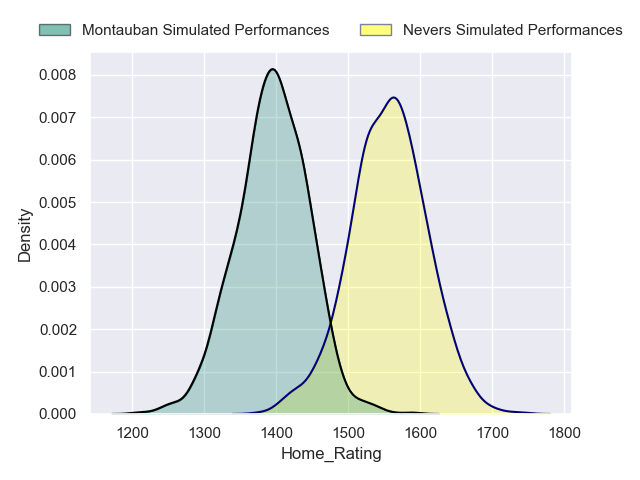
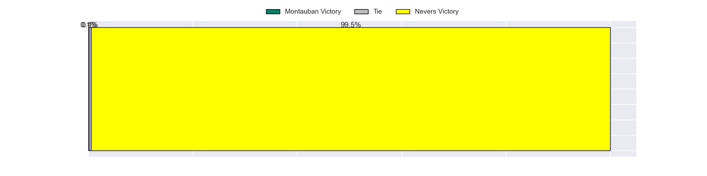
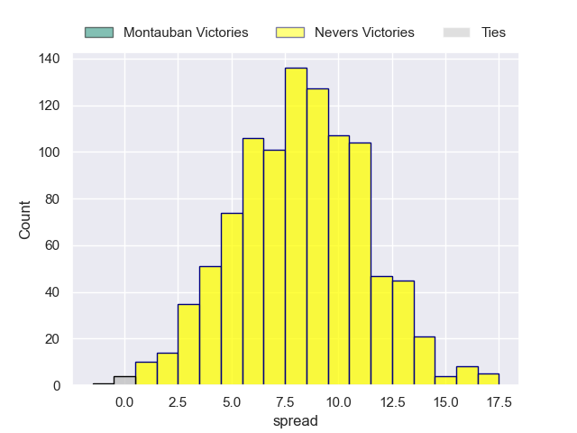

### Mont-de-Marsan V Rouen on 2023/05/05

Average Margin: Mont-de-Marsan by 9.4

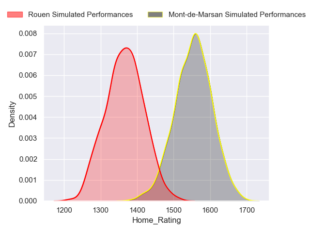
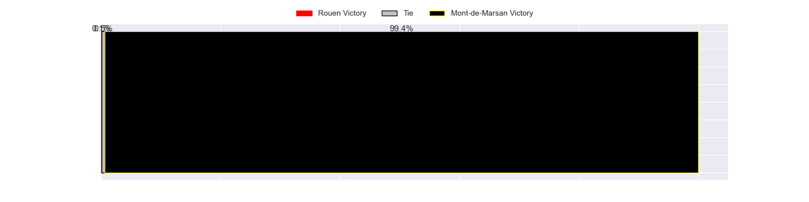
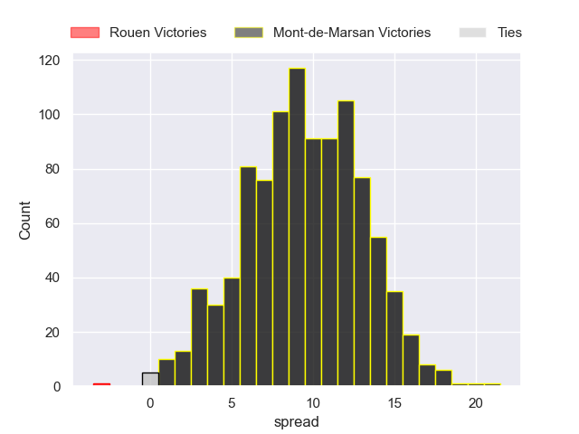

### Aurillac V Biarritz Olympique on 2023/05/05

Average Margin: Aurillac by 0.4

### Carcassonne V Provence Rugby on 2023/05/05

Average Margin: Carcassonne by 0.8

### Colomiers V Massy on 2023/05/05

Average Margin: Colomiers by 7.4

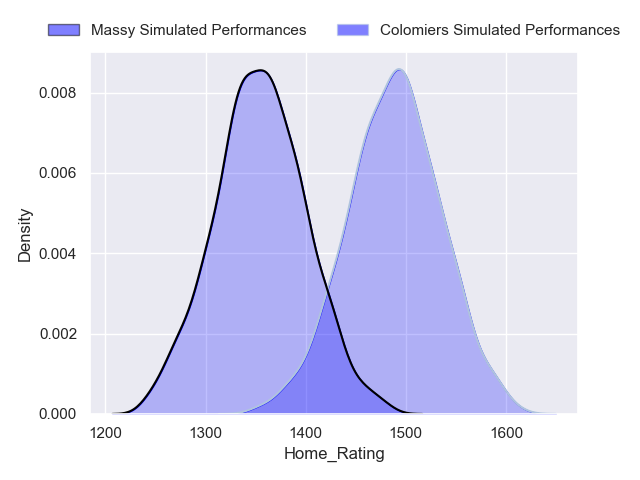
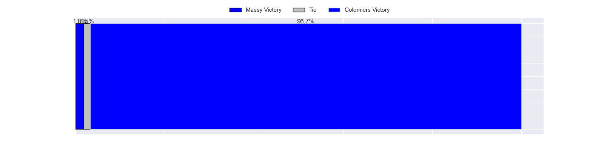
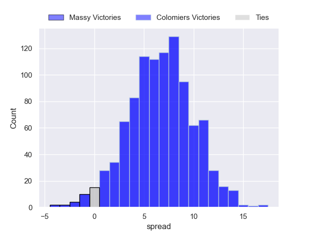

### Oyonnax V Soyaux-Angouleme on 2023/05/05

Average Margin: Oyonnax by 13.9

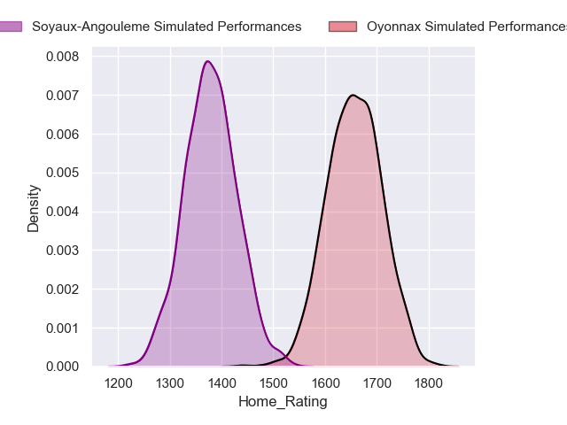
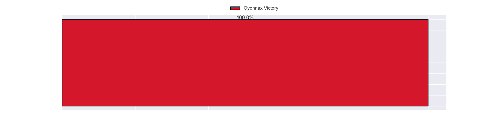
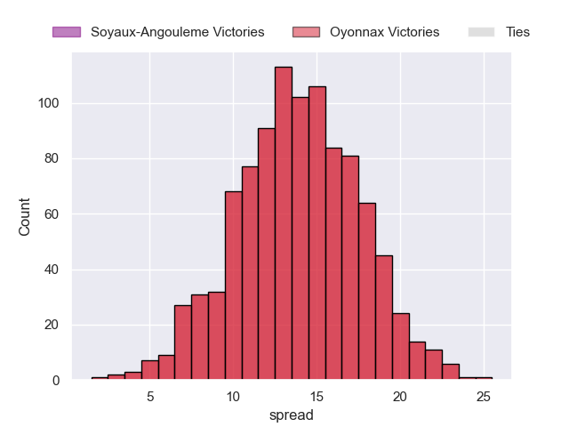

