---  
title: "Pro D2 Status"  
date: 2023-04-28 6:00:00 -0500  
categories: model review projection  
layout: article  
aside:  
    toc: true  
---
# Current Team Rankings

# Standings

## Current Standings

| Club               |   Played |   Wins |   Point Differential |   Losing Bonus Points |   Try Bonus Points |   Competition Points |
|:-------------------|---------:|-------:|---------------------:|----------------------:|-------------------:|---------------------:|
| Oyonnax            |       28 |     21 |                  419 |                     4 |                 13 |                  103 |
| Nevers             |       29 |     17 |                  132 |                     6 |                  7 |                   83 |
| Vannes             |       28 |     16 |                   84 |                     7 |                  9 |                   82 |
| Grenoble           |       28 |     18 |                   72 |                     3 |                  5 |                   82 |
| Agen               |       29 |     15 |                   97 |                    10 |                  7 |                   79 |
| Mont-de-Marsan     |       28 |     17 |                   73 |                     5 |                  5 |                   78 |
| Colomiers          |       28 |     14 |                  -33 |                     8 |                  5 |                   69 |
| Biarritz Olympique |       28 |     13 |                   26 |                     7 |                  8 |                   67 |
| Provence Rugby     |       28 |     14 |                   15 |                     5 |                  4 |                   65 |
| Beziers            |       28 |     12 |                  -28 |                     9 |                  5 |                   64 |
| Aurillac           |       28 |     14 |                 -127 |                     3 |                  2 |                   61 |
| Soyaux-Angouleme   |       28 |     11 |                 -114 |                    10 |                  1 |                   55 |
| Rouen              |       28 |     12 |                 -160 |                     3 |                  4 |                   55 |
| Montauban          |       28 |     11 |                  -76 |                     4 |                  4 |                   54 |
| Carcassonne        |       28 |      9 |                 -139 |                     6 |                  1 |                   45 |
| Massy              |       28 |      7 |                 -241 |                     8 |                  6 |                   42 |

## Projected Remaining Table

| Club               |   Matches Remaining |   Wins |   Point Differential |   Losing Bonus Points |   Try Bonus Points |   Competition Points |
|:-------------------|--------------------:|-------:|---------------------:|----------------------:|-------------------:|---------------------:|
| Oyonnax            |                   2 |    2   |                 20.9 |                   0   |                2   |                 10   |
| Mont-de-Marsan     |                   2 |    1.7 |                 10.5 |                   0.3 |                1.6 |                  8.5 |
| Provence Rugby     |                   2 |    1.3 |                  5   |                   0.7 |                1.2 |                  7.2 |
| Biarritz Olympique |                   2 |    1.3 |                  2.5 |                   0.7 |                1.1 |                  7.1 |
| Vannes             |                   2 |    1.3 |                  4.3 |                   0.7 |                1.2 |                  6.9 |
| Beziers            |                   2 |    1.3 |                  2   |                   0.7 |                1.1 |                  6.9 |
| Colomiers          |                   2 |    1   |                  0.1 |                   0.6 |                1   |                  5.5 |
| Grenoble           |                   2 |    0.9 |                 -0.6 |                   1   |                0.8 |                  5.5 |
| Nevers             |                   1 |    1   |                  7.7 |                   0   |                1   |                  5   |
| Carcassonne        |                   2 |    0.8 |                 -2.1 |                   1.1 |                0.6 |                  4.9 |
| Montauban          |                   2 |    0.9 |                 -4.4 |                   0.5 |                0.8 |                  4.7 |
| Aurillac           |                   2 |    0.5 |                 -6.2 |                   1.1 |                0.4 |                  3.5 |
| Rouen              |                   2 |    0.5 |                 -9.1 |                   0.7 |                0.4 |                  3.1 |
| Soyaux-Angouleme   |                   2 |    0.3 |                -14.1 |                   0.6 |                0.3 |                  2.3 |
| Agen               |                   1 |    0.2 |                 -1.9 |                   0.7 |                0.2 |                  1.8 |
| Massy              |                   2 |    0   |                -14.3 |                   0.9 |                0   |                  1   |

## Projected Total Table

| Club               |   Total Matches |   Wins |   Point Differential |   Losing Bonus Points |   Try Bonus Points |   Competition Points |
|:-------------------|----------------:|-------:|---------------------:|----------------------:|-------------------:|---------------------:|
| Oyonnax            |              30 |   23   |                439.9 |                   4   |               15   |                113   |
| Vannes             |              30 |   17.3 |                 88.3 |                   7.7 |               10.2 |                 88.9 |
| Nevers             |              30 |   18   |                139.7 |                   6   |                8   |                 88   |
| Grenoble           |              30 |   18.9 |                 71.4 |                   4   |                5.8 |                 87.5 |
| Mont-de-Marsan     |              30 |   18.7 |                 83.5 |                   5.3 |                6.6 |                 86.5 |
| Agen               |              30 |   15.2 |                 95.1 |                  10.7 |                7.2 |                 80.8 |
| Colomiers          |              30 |   15   |                -32.9 |                   8.6 |                6   |                 74.5 |
| Biarritz Olympique |              30 |   14.3 |                 28.5 |                   7.7 |                9.1 |                 74.1 |
| Provence Rugby     |              30 |   15.3 |                 20   |                   5.7 |                5.2 |                 72.2 |
| Beziers            |              30 |   13.3 |                -26   |                   9.7 |                6.1 |                 70.9 |
| Aurillac           |              30 |   14.5 |               -133.2 |                   4.1 |                2.4 |                 64.5 |
| Montauban          |              30 |   11.9 |                -80.4 |                   4.5 |                4.8 |                 58.7 |
| Rouen              |              30 |   12.5 |               -169.1 |                   3.7 |                4.4 |                 58.1 |
| Soyaux-Angouleme   |              30 |   11.3 |               -128.1 |                  10.6 |                1.3 |                 57.3 |
| Carcassonne        |              30 |    9.8 |               -141.1 |                   7.1 |                1.6 |                 49.9 |
| Massy              |              30 |    7   |               -255.3 |                   8.9 |                6   |                 43   |

## Projected Playoff Results

|                | Reach Quarterfinals   | Reach Semifinals   | Reach Final   | Win Final   |
|:---------------|:----------------------|:-------------------|:--------------|:------------|
| Oyonnax        | 100.0 %               | 100.0 %            | 99.8 %        | 95.9 %      |
| Nevers         | 100.0 %               | 98.0 %             | 56.9 %        | 2.7 %       |
| Vannes         | 100.0 %               | 89.2 %             | 28.7 %        | 1.1 %       |
| Grenoble       | 100.0 %               | 43.2 %             | 12.8 %        | 0.3 %       |
| Mont-de-Marsan | 100.0 %               | 64.9 %             | 1.8 %         | 0.0 %       |
| Agen           | 100.0 %               | 4.7 %              | 0.0 %         | 0.0 %       |

## Projected Promotion and Relegation Results

| Club           | Current Competition   | To Top 14   | To Pro D2   |
|:---------------|:----------------------|:------------|:------------|
| Perpignan      | Top 14                | 81.6 %      | 18.2 %      |
| Pau            | Top 14                | 0.2 %       | 0.0 %       |
| Brive          | Top 14                | 0.0 %       | 100.0 %     |
| Oyonnax        | Pro D2                | 98.9 %      | 0.9 %       |
| Nevers         | Pro D2                | 12.8 %      | 44.1 %      |
| Vannes         | Pro D2                | 5.0 %       | 23.7 %      |
| Grenoble       | Pro D2                | 1.2 %       | 11.6 %      |
| Mont-de-Marsan | Pro D2                | 0.3 %       | 1.5 %       |

# Completed Match Review

| Model | Percent Correct Predictions | Spread Error |
| ------ | ------ | ------ |
| Club Level | 66.2% | 9.5 |
| Player Level: Lineup | 62.2% | 11.6 |
| Player Level: Minutes | 60.4% | 12.0 |

# Future Predictions

## Week 29

### Massy V Oyonnax on 2023/04/28

Average Margin: Oyonnax by 8.2

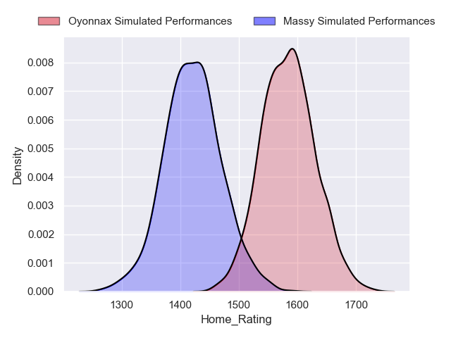

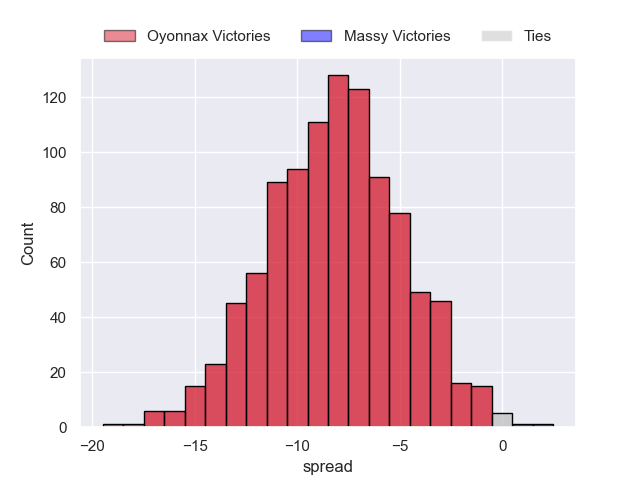

### Rouen V Beziers on 2023/04/28

Average Margin: Rouen by 0.1

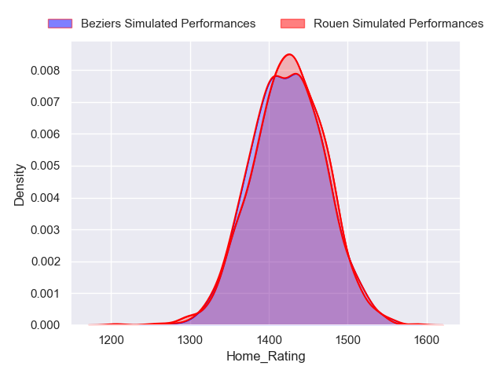
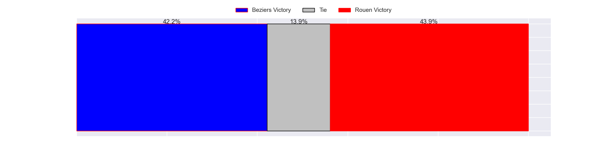
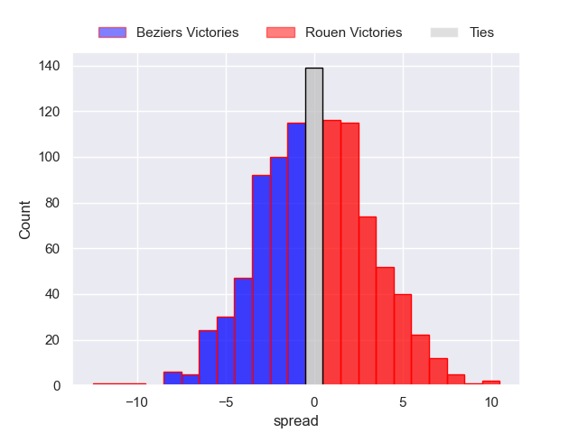

### Montauban V Carcassonne on 2023/04/28

Average Margin: Montauban by 3.4

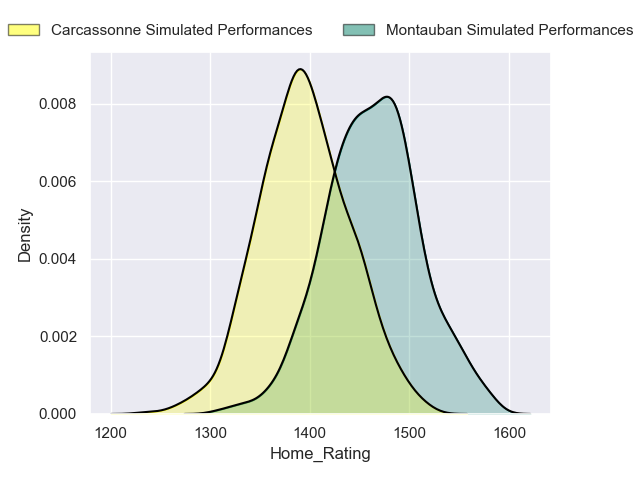
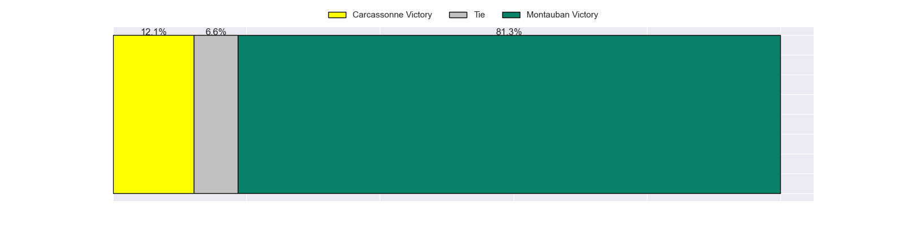
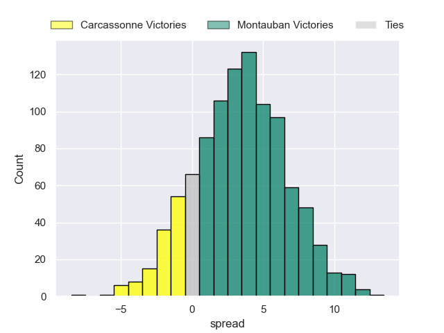

### Soyaux-Angouleme V Mont-de-Marsan on 2023/04/28

Average Margin: Mont-de-Marsan by 1.3

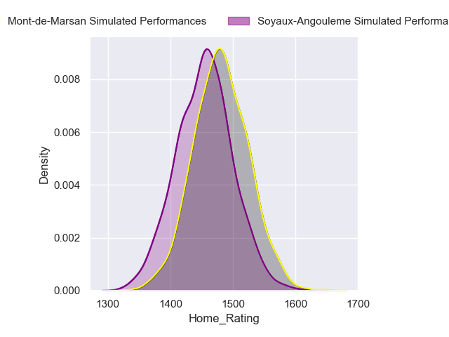

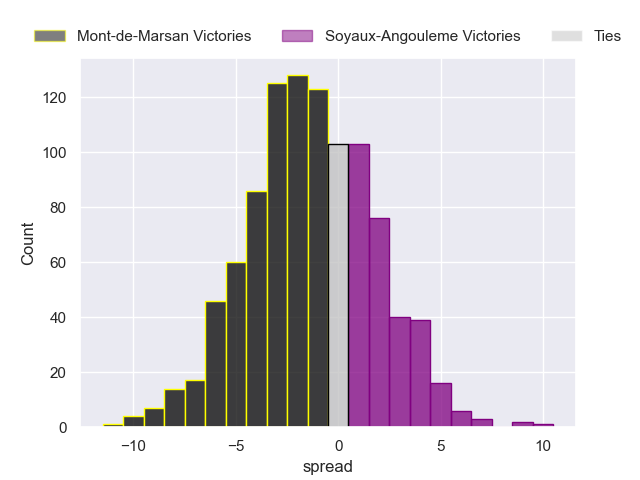

### Biarritz Olympique V Grenoble on 2023/04/28

Average Margin: Biarritz Olympique by 2.6

### Provence Rugby V Aurillac on 2023/04/28

Average Margin: Provence Rugby by 6.6

### Vannes V Colomiers on 2023/04/28

Average Margin: Vannes by 6.6

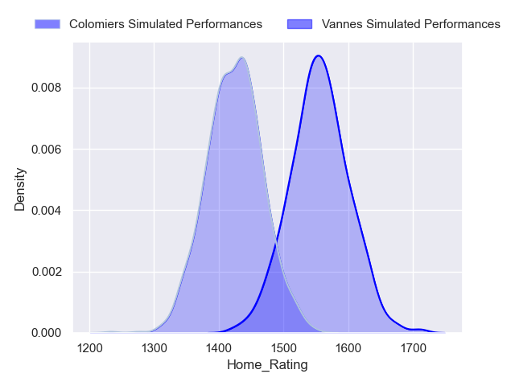
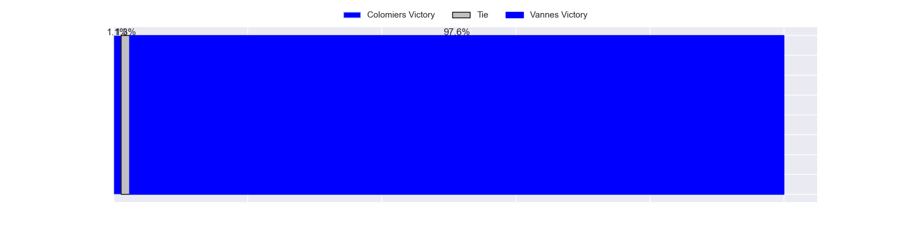
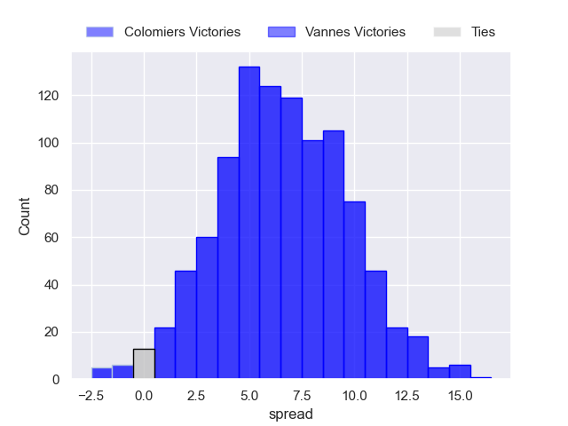

## Week 30

### Beziers V Agen on 2023/05/05

Average Margin: Beziers by 2.2

### Grenoble V Vannes on 2023/05/05

Average Margin: Grenoble by 2.0

### Mont-de-Marsan V Rouen on 2023/05/05

Average Margin: Mont-de-Marsan by 9.7

### Oyonnax V Soyaux-Angouleme on 2023/05/05

Average Margin: Oyonnax by 13.3

### Carcassonne V Provence Rugby on 2023/05/05

Average Margin: Carcassonne by 1.1

### Colomiers V Massy on 2023/05/05

Average Margin: Colomiers by 6.7

### Nevers V Montauban on 2023/05/05

Average Margin: Nevers by 8.2

### Aurillac V Biarritz Olympique on 2023/05/05

Average Margin: Biarritz Olympique by 0.1

