---  
title: "Pro D2 Status"  
date: 2023-04-21 6:00:00 -0500  
categories: model review projection  
layout: article  
aside:  
    toc: true  
---
# Current Team Rankings

# Standings

## Current Standings

| Club               |   Played |   Wins |   Point Differential |   Losing Bonus Points |   Try Bonus Points |   Competition Points |
|:-------------------|---------:|-------:|---------------------:|----------------------:|-------------------:|---------------------:|
| Oyonnax            |       26 |     19 |                  368 |                     4 |                 12 |                   94 |
| Vannes             |       26 |     16 |                   89 |                     5 |                  9 |                   80 |
| Grenoble           |       26 |     17 |                   72 |                     3 |                  5 |                   78 |
| Nevers             |       26 |     15 |                  131 |                     6 |                  7 |                   75 |
| Mont-de-Marsan     |       26 |     15 |                   56 |                     5 |                  5 |                   70 |
| Agen               |       26 |     13 |                   83 |                     9 |                  6 |                   69 |
| Biarritz Olympique |       26 |     12 |                   29 |                     6 |                  8 |                   62 |
| Provence Rugby     |       26 |     13 |                   19 |                     4 |                  4 |                   62 |
| Colomiers          |       26 |     12 |                  -51 |                     8 |                  5 |                   61 |
| Aurillac           |       26 |     14 |                 -102 |                     2 |                  2 |                   60 |
| Beziers            |       26 |     11 |                  -10 |                     9 |                  4 |                   59 |
| Soyaux-Angouleme   |       26 |     11 |                  -82 |                     9 |                  1 |                   54 |
| Rouen              |       26 |     11 |                 -169 |                     3 |                  3 |                   50 |
| Montauban          |       26 |     10 |                  -77 |                     3 |                  4 |                   49 |
| Carcassonne        |       26 |      9 |                 -127 |                     6 |                  1 |                   43 |
| Massy              |       26 |      6 |                 -229 |                     8 |                  6 |                   38 |

## Projected Remaining Table

| Club               |   Matches Remaining |   Wins |   Point Differential |   Losing Bonus Points |   Try Bonus Points |   Competition Points |
|:-------------------|--------------------:|-------:|---------------------:|----------------------:|-------------------:|---------------------:|
| Oyonnax            |                   2 |    2   |                 20   |                   0   |                2   |                 10   |
| Mont-de-Marsan     |                   2 |    1.6 |                  9.8 |                   0.4 |                1.5 |                  8.2 |
| Nevers             |                   2 |    1.3 |                  6.5 |                   0.6 |                1.3 |                  7.2 |
| Provence Rugby     |                   2 |    1.3 |                  4.8 |                   0.6 |                1.2 |                  7.2 |
| Biarritz Olympique |                   2 |    1.3 |                  2.5 |                   0.7 |                1.2 |                  7.1 |
| Beziers            |                   2 |    1.3 |                  2.2 |                   0.7 |                1.1 |                  7   |
| Vannes             |                   2 |    1.2 |                  4.9 |                   0.7 |                1.2 |                  6.8 |
| Grenoble           |                   2 |    1   |                 -0.3 |                   0.9 |                0.8 |                  5.7 |
| Colomiers          |                   2 |    1   |                 -1   |                   0.4 |                1   |                  5.4 |
| Agen               |                   2 |    0.9 |                 -0.9 |                   1   |                0.7 |                  5.3 |
| Carcassonne        |                   2 |    0.8 |                 -1.7 |                   1.1 |                0.7 |                  5   |
| Montauban          |                   2 |    0.8 |                 -4.9 |                   0.5 |                0.8 |                  4.6 |
| Aurillac           |                   2 |    0.5 |                 -6.3 |                   1.1 |                0.4 |                  3.4 |
| Rouen              |                   2 |    0.5 |                 -9.2 |                   0.7 |                0.4 |                  3   |
| Soyaux-Angouleme   |                   2 |    0.4 |                -12.7 |                   0.6 |                0.3 |                  2.6 |
| Massy              |                   2 |    0   |                -13.9 |                   0.9 |                0   |                  1.1 |

## Projected Total Table

| Club               |   Total Matches |   Wins |   Point Differential |   Losing Bonus Points |   Try Bonus Points |   Competition Points |
|:-------------------|----------------:|-------:|---------------------:|----------------------:|-------------------:|---------------------:|
| Oyonnax            |              28 |   21   |                388   |                   4   |               14   |                104   |
| Vannes             |              28 |   17.2 |                 93.9 |                   5.7 |               10.2 |                 86.8 |
| Grenoble           |              28 |   18   |                 71.7 |                   3.9 |                5.8 |                 83.7 |
| Nevers             |              28 |   16.3 |                137.5 |                   6.6 |                8.3 |                 82.2 |
| Mont-de-Marsan     |              28 |   16.6 |                 65.8 |                   5.4 |                6.5 |                 78.2 |
| Agen               |              28 |   13.9 |                 82.1 |                  10   |                6.7 |                 74.3 |
| Provence Rugby     |              28 |   14.3 |                 23.8 |                   4.6 |                5.2 |                 69.2 |
| Biarritz Olympique |              28 |   13.3 |                 31.5 |                   6.7 |                9.2 |                 69.1 |
| Colomiers          |              28 |   13   |                -52   |                   8.4 |                6   |                 66.4 |
| Beziers            |              28 |   12.3 |                 -7.8 |                   9.7 |                5.1 |                 66   |
| Aurillac           |              28 |   14.5 |               -108.3 |                   3.1 |                2.4 |                 63.4 |
| Soyaux-Angouleme   |              28 |   11.4 |                -94.7 |                   9.6 |                1.3 |                 56.6 |
| Montauban          |              28 |   10.8 |                -81.9 |                   3.5 |                4.8 |                 53.6 |
| Rouen              |              28 |   11.5 |               -178.2 |                   3.7 |                3.4 |                 53   |
| Carcassonne        |              28 |    9.8 |               -128.7 |                   7.1 |                1.7 |                 48   |
| Massy              |              28 |    6   |               -242.9 |                   8.9 |                6   |                 39.1 |

## Projected Playoff Results

|                    | Reach Quarterfinals   | Reach Semifinals   | Reach Final   | Win Final   |
|:-------------------|:----------------------|:-------------------|:--------------|:------------|
| Oyonnax            | 100.0 %               | 100.0 %            | 99.8 %        | 93.9 %      |
| Vannes             | 100.0 %               | 99.6 %             | 78.7 %        | 5.1 %       |
| Grenoble           | 100.0 %               | 85.2 %             | 14.8 %        | 0.5 %       |
| Nevers             | 100.0 %               | 91.9 %             | 6.6 %         | 0.5 %       |
| Mont-de-Marsan     | 100.0 %               | 18.6 %             | 0.1 %         | 0.0 %       |
| Agen               | 85.2 %                | 4.4 %              | 0.0 %         | 0.0 %       |
| Biarritz Olympique | 8.5 %                 | 0.3 %              | 0.0 %         | 0.0 %       |
| Provence Rugby     | 6.3 %                 | 0.0 %              | 0.0 %         | 0.0 %       |

# Completed Match Review

| Model | Percent Correct Predictions | Spread Error |
| ------ | ------ | ------ |
| Club Level | 67.3% | 9.5 |
| Player Level: Lineup | 62.5% | 10.7 |
| Player Level: Minutes | 63.0% | 10.4 |

# Future Predictions

## Week 13

### Biarritz Olympique V Grenoble on 2023/04/28

Average Margin: Biarritz Olympique by 2.4

### Provence Rugby V Aurillac on 2023/04/28

Average Margin: Provence Rugby by 6.4

### Massy V Oyonnax on 2023/04/28

Average Margin: Oyonnax by 8.0

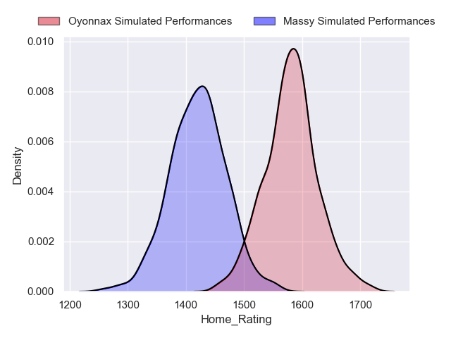
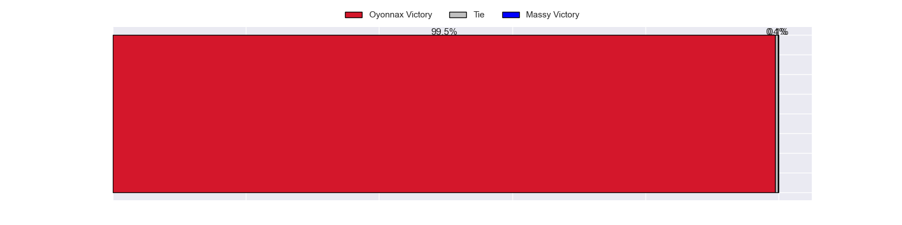
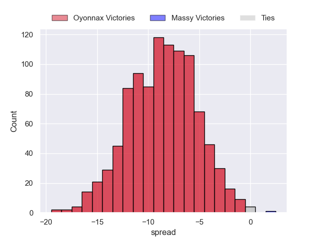

### Vannes V Colomiers on 2023/04/28

Average Margin: Vannes by 7.5

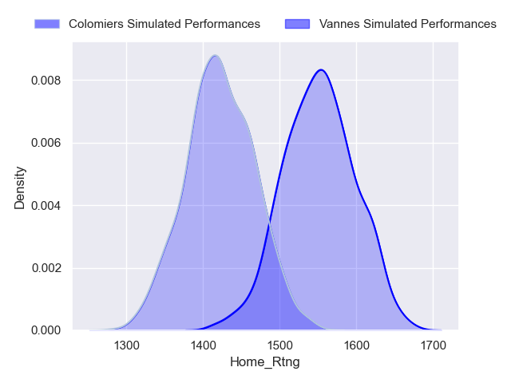
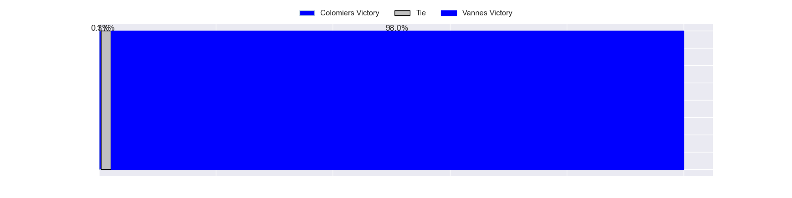
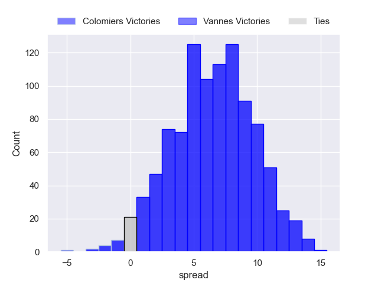

### Rouen V Beziers on 2023/04/28

Average Margin: Beziers by 0.1

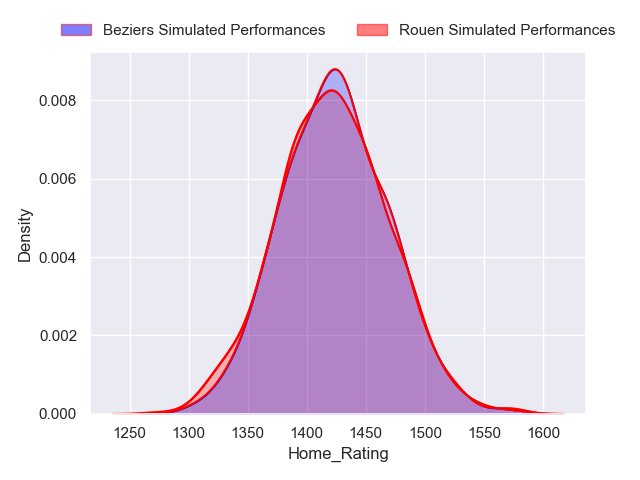
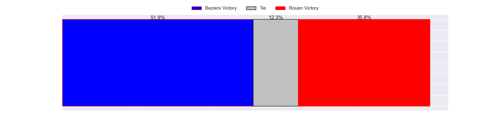
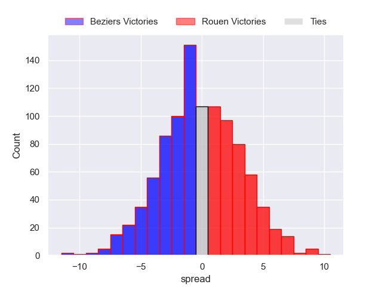

### Agen V Nevers on 2023/04/28

Average Margin: Agen by 1.3

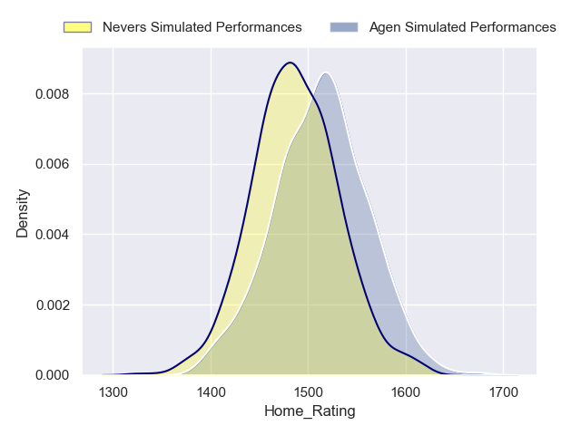
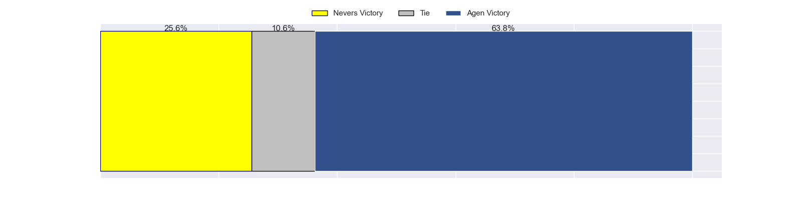
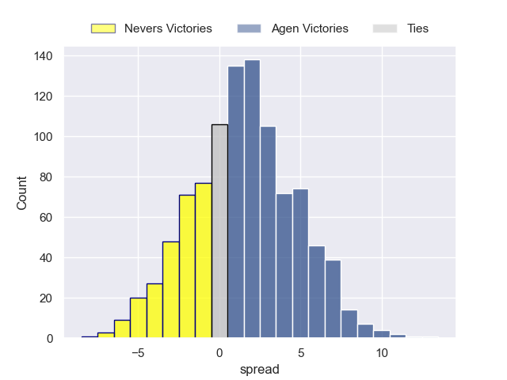

### Montauban V Carcassonne on 2023/04/28

Average Margin: Montauban by 3.0

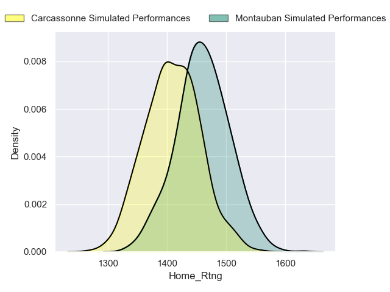
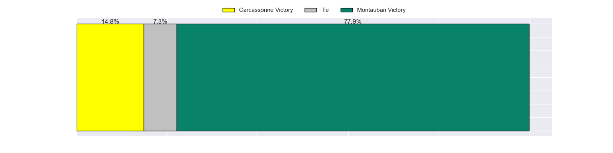
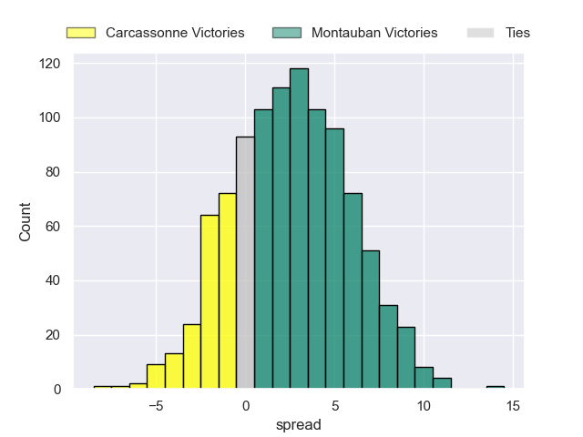

### Soyaux-Angouleme V Mont-de-Marsan on 2023/04/28

Average Margin: Mont-de-Marsan by 0.8

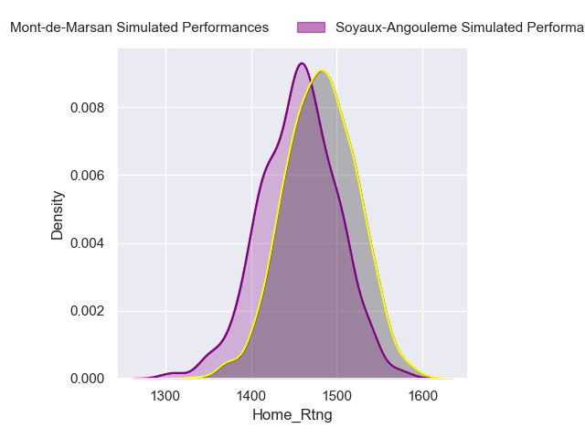
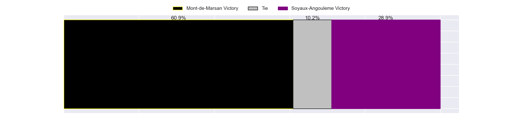
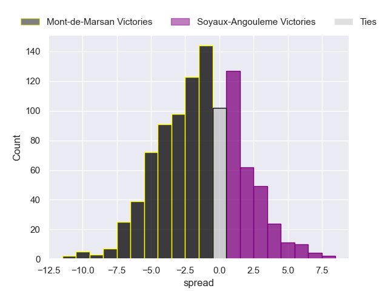

## Week 14

### Beziers V Agen on 2023/05/04

Average Margin: Beziers by 2.3

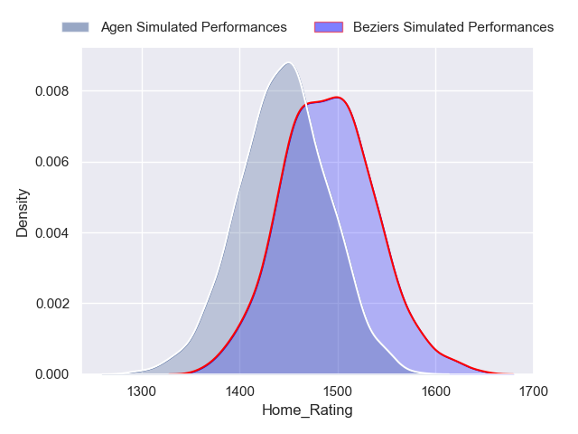
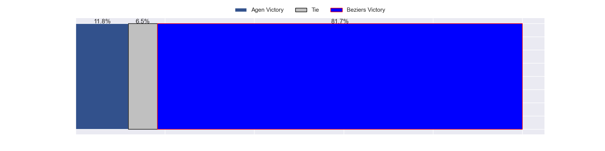
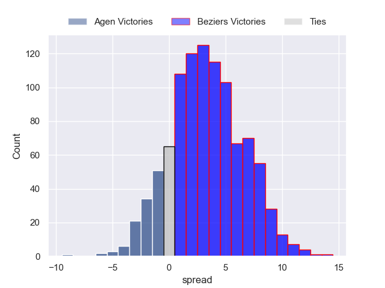

### Oyonnax V Soyaux-Angouleme on 2023/05/04

Average Margin: Oyonnax by 12.5

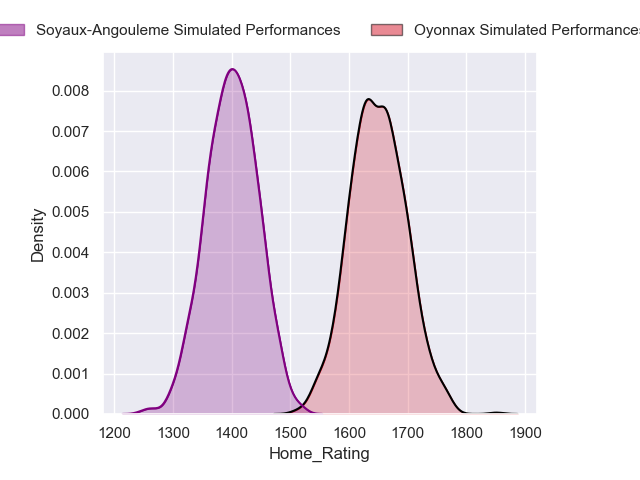
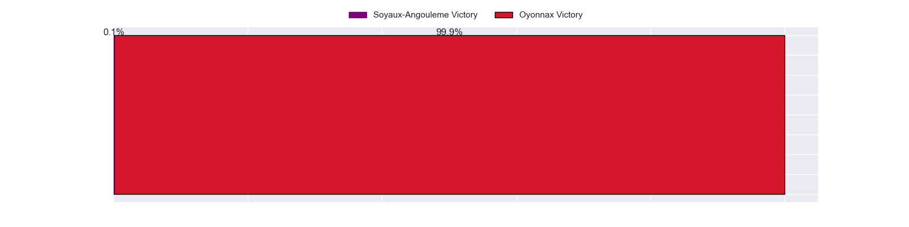

### Mont-de-Marsan V Rouen on 2023/05/04

Average Margin: Mont-de-Marsan by 9.6

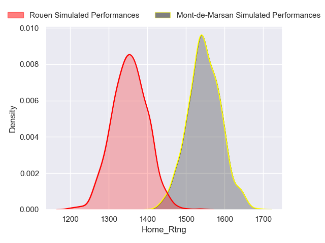
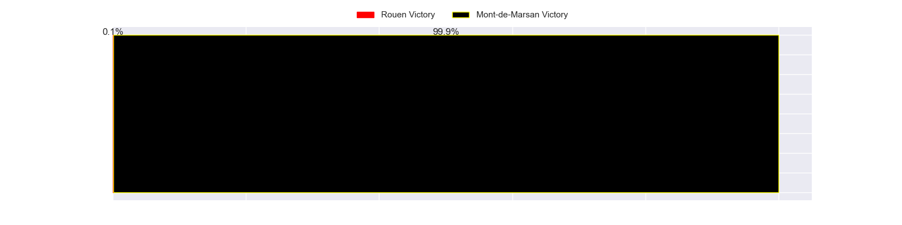
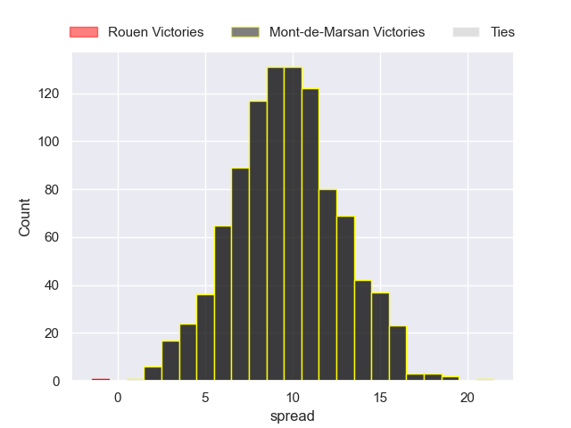

### Carcassonne V Provence Rugby on 2023/05/04

Average Margin: Carcassonne by 1.2

### Nevers V Montauban on 2023/05/04

Average Margin: Nevers by 8.3

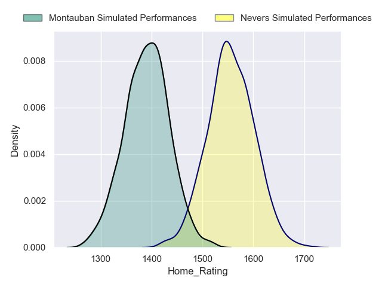
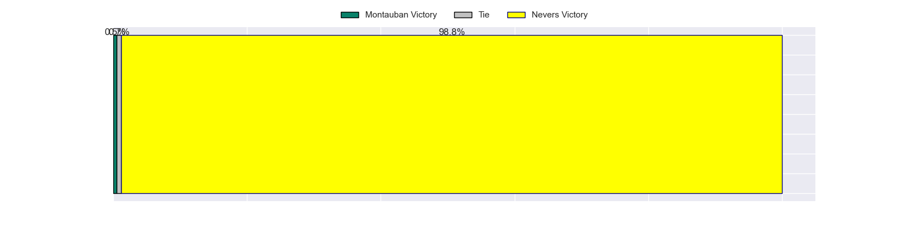
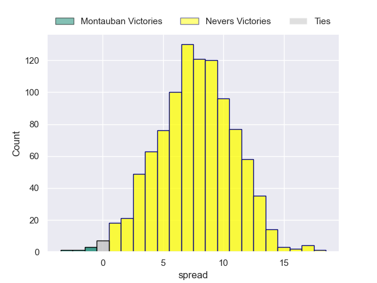

### Colomiers V Massy on 2023/05/04

Average Margin: Colomiers by 6.4

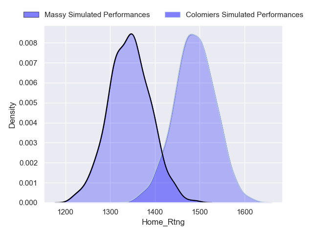
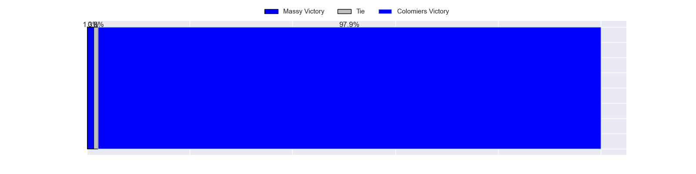
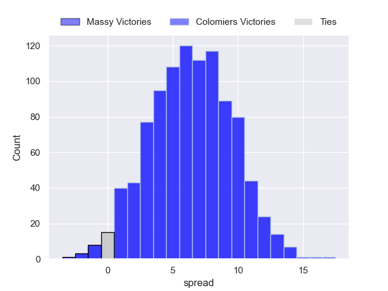

### Aurillac V Biarritz Olympique on 2023/05/04

Average Margin: Biarritz Olympique by 0.3

### Grenoble V Vannes on 2023/05/04

Average Margin: Grenoble by 2.1

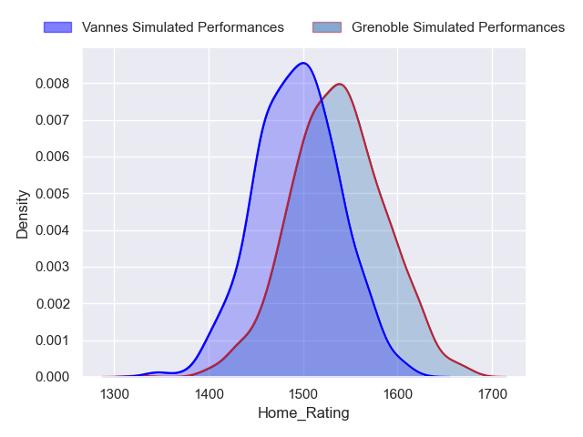
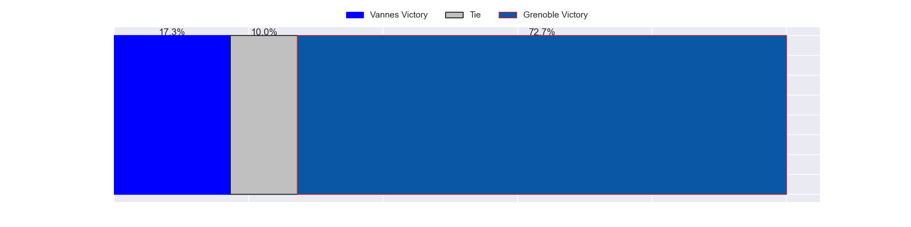
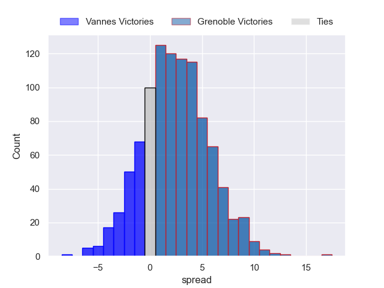

