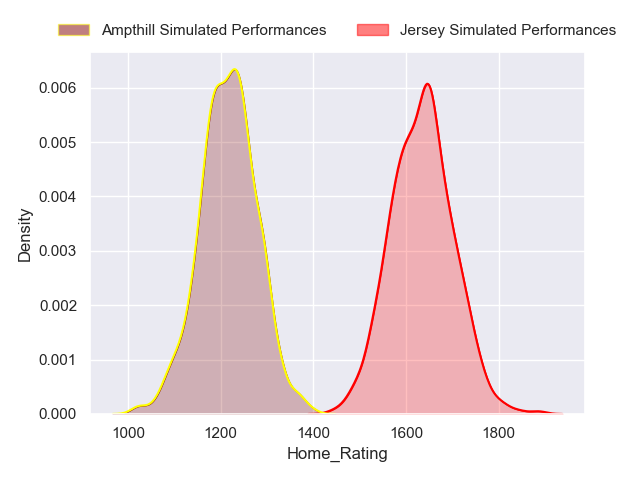
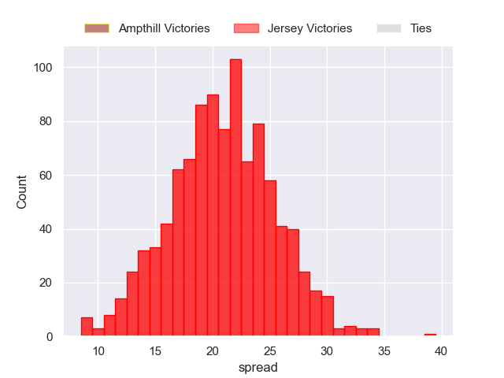
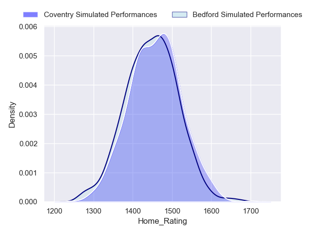
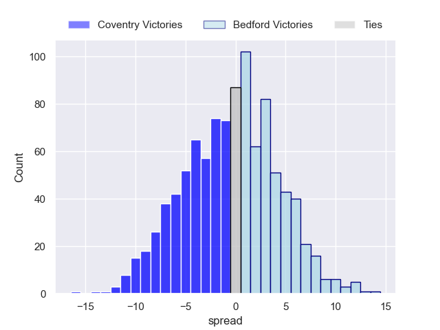

---  
title: "RFU Championship Status"  
date: 2023-04-28 6:00:00 -0500  
categories: model review projection  
layout: article  
aside:  
    toc: true  
---
# Current Team Rankings

# Standings

## Current Standings

| Club                |   Played |   Wins |   Point Differential |   Losing Bonus Points |   Try Bonus Points |   Competition Points |
|:--------------------|---------:|-------:|---------------------:|----------------------:|-------------------:|---------------------:|
| Jersey              |       23 |     21 |                  418 |                     0 |                 19 |                  105 |
| Ealing Trailfinders |       22 |     19 |                  591 |                     3 |                 19 |                   98 |
| Coventry            |       23 |     18 |                  214 |                     1 |                 17 |                   92 |
| Bedford             |       22 |     12 |                   95 |                     4 |                 16 |                   68 |
| Cornish Pirates     |       22 |     13 |                  -10 |                     2 |                  6 |                   60 |
| Doncaster           |       23 |     10 |                  -26 |                     4 |                  9 |                   53 |
| Nottingham          |       22 |      8 |                  -67 |                     2 |                 13 |                   47 |
| Ampthill            |       23 |      8 |                 -149 |                     3 |                 10 |                   47 |
| Hartpury College    |       22 |      9 |                  -96 |                     3 |                  6 |                   45 |
| Caldy               |       22 |      7 |                 -304 |                     3 |                  8 |                   39 |
| London Scottish     |       22 |      4 |                 -278 |                     5 |                  5 |                   26 |
| Richmond            |       22 |      3 |                 -388 |                     4 |                  4 |                   22 |

## Projected Remaining Table

| Club                |   Matches Remaining |   Wins |   Point Differential |   Losing Bonus Points |   Try Bonus Points |   Competition Points |
|:--------------------|--------------------:|-------:|---------------------:|----------------------:|-------------------:|---------------------:|
| Jersey              |                   1 |    1   |                 20.4 |                   0   |                1   |                  5   |
| Ealing Trailfinders |                   1 |    1   |                 12   |                   0   |                1   |                  5   |
| Cornish Pirates     |                   1 |    1   |                  7.7 |                   0   |                0.9 |                  4.8 |
| Nottingham          |                   1 |    0.9 |                  5.9 |                   0.1 |                0.9 |                  4.6 |
| Hartpury College    |                   1 |    0.8 |                  5.3 |                   0.2 |                0.8 |                  4.2 |
| Coventry            |                   1 |    0.5 |                  0.5 |                   0.4 |                0.5 |                  3   |
| Bedford             |                   1 |    0.5 |                 -0.5 |                   0.4 |                0.4 |                  2.7 |
| Caldy               |                   1 |    0.2 |                 -5.3 |                   0.4 |                0.1 |                  1.3 |
| London Scottish     |                   1 |    0.1 |                 -5.9 |                   0.5 |                0.1 |                  0.9 |
| Richmond            |                   1 |    0   |                 -7.7 |                   0.4 |                0   |                  0.6 |
| Doncaster           |                   1 |    0   |                -12   |                   0.1 |                0   |                  0.2 |
| Ampthill            |                   1 |    0   |                -20.4 |                   0   |                0   |                  0   |

## Projected Total Table

| Club                |   Total Matches |   Wins |   Point Differential |   Losing Bonus Points |   Try Bonus Points |   Competition Points |
|:--------------------|----------------:|-------:|---------------------:|----------------------:|-------------------:|---------------------:|
| Jersey              |              24 |   22   |                438.4 |                   0   |               20   |                110   |
| Ealing Trailfinders |              23 |   20   |                603   |                   3   |               20   |                103   |
| Coventry            |              24 |   18.5 |                214.5 |                   1.4 |               17.5 |                 95   |
| Bedford             |              23 |   12.5 |                 94.5 |                   4.4 |               16.4 |                 70.7 |
| Cornish Pirates     |              23 |   14   |                 -2.3 |                   2   |                6.9 |                 64.8 |
| Doncaster           |              24 |   10   |                -38   |                   4.1 |                9   |                 53.2 |
| Nottingham          |              23 |    8.9 |                -61.1 |                   2.1 |               13.9 |                 51.6 |
| Hartpury College    |              23 |    9.8 |                -90.7 |                   3.2 |                6.8 |                 49.2 |
| Ampthill            |              24 |    8   |               -169.4 |                   3   |               10   |                 47   |
| Caldy               |              23 |    7.2 |               -309.3 |                   3.4 |                8.1 |                 40.3 |
| London Scottish     |              23 |    4.1 |               -283.9 |                   5.5 |                5.1 |                 26.9 |
| Richmond            |              23 |    3   |               -395.7 |                   4.4 |                4   |                 22.6 |

# Completed Match Review

| Model | Percent Correct Predictions | Spread Error |
| ------ | ------ | ------ |
| Club Level | 74.6% | 14.7 |
| Player Level: Lineup | 68.3% | 15.5 |
| Player Level: Minutes | 68.3% | 15.6 |

# Future Predictions

## Week 23

### Nottingham V London Scottish on 2023/04/28

Average Margin: Nottingham by 6.4

### Doncaster V Ealing Trailfinders on 2023/04/29

Average Margin: Ealing Trailfinders by 12.5

### Jersey V Ampthill on 2023/04/29

Average Margin: Jersey by 20.9

### Bedford V Coventry on 2023/04/29

Average Margin: Coventry by 0.5

### Richmond V Cornish Pirates on 2023/04/29

Average Margin: Cornish Pirates by 8.2

### Hartpury College V Caldy on 2023/04/29

Average Margin: Hartpury College by 5.6

