---  
title: "RFU Championship Status"  
date: 2023-04-03 6:00:00 -0500  
categories: model review projection  
layout: article  
aside:  
    toc: true  
---
# Standings

## Current Standings

| Club                |   Wins |   Point Differential |   Losing Bonus Points |   Try Bonus Points |   Competition Points |
|:--------------------|-------:|---------------------:|----------------------:|-------------------:|---------------------:|
| Ealing Trailfinders |     16 |                  458 |                     2 |                 16 |                   82 |
| Jersey              |     15 |                  323 |                     0 |                 13 |                   75 |
| Coventry            |     11 |                   80 |                     1 |                 12 |                   59 |
| Bedford             |     10 |                  119 |                     2 |                 14 |                   56 |
| Cornish Pirates     |     10 |                  -15 |                     1 |                nan |                   46 |
| Ampthill            |      8 |                    7 |                     2 |                  9 |                   45 |
| Doncaster           |      8 |                  -37 |                     2 |                  7 |                   41 |
| Hartpury College    |      8 |                  -73 |                     3 |                  6 |                   41 |
| Caldy               |      7 |                 -117 |                     3 |                nan |                   39 |
| Nottingham          |      6 |                 -103 |                     2 |                 10 |                   36 |
| Richmond            |      2 |                 -312 |                     2 |                  4 |                   16 |
| London Scottish     |      1 |                 -330 |                     5 |                  4 |                   13 |

## Projected Remaining Table

| Club                |   Wins |   Point Differential |   Losing Bonus Points |   Try Bonus Points |   Competition Points |
|:--------------------|-------:|---------------------:|----------------------:|-------------------:|---------------------:|
| Coventry            |    2.9 |                 23.6 |                   0.8 |                2.6 |                 15.2 |
| Jersey              |    2.9 |                 21.3 |                   0.8 |                1.9 |                 14.6 |
| Ealing Trailfinders |    2.6 |                 34.2 |                   0.3 |                2   |                 12.7 |
| Cornish Pirates     |    2.1 |                 11.3 |                   0.7 |                1.6 |                 11   |
| Hartpury College    |    1.8 |                 12   |                   0.7 |                1.7 |                  9.8 |
| Bedford             |    1.4 |                  0.1 |                   1.2 |                1.3 |                  8.4 |
| Ampthill            |    1.2 |                -16.2 |                   1.4 |                1.4 |                  8   |
| Nottingham          |    1.4 |                 -3.5 |                   0.6 |                1.5 |                  7.8 |
| Doncaster           |    1.1 |                -17.6 |                   1.3 |                1.1 |                  7.1 |
| Caldy               |    0.8 |                -24.6 |                   0.7 |                0.9 |                  4.9 |
| Richmond            |    0.5 |                -18.2 |                   1.1 |                1   |                  4.3 |
| London Scottish     |    0.6 |                -22.3 |                   0.7 |                1   |                  4.2 |

## Projected Total Table

| Club                |   Wins |   Point Differential |   Losing Bonus Points |   Try Bonus Points |   Competition Points |
|:--------------------|-------:|---------------------:|----------------------:|-------------------:|---------------------:|
| Ealing Trailfinders |   18.6 |                492.2 |                   2.3 |               18   |                 94.7 |
| Jersey              |   17.9 |                344.3 |                   0.8 |               14.9 |                 89.6 |
| Coventry            |   13.9 |                103.6 |                   1.8 |               14.6 |                 74.2 |
| Bedford             |   11.4 |                119.1 |                   3.2 |               15.3 |                 64.4 |
| Cornish Pirates     |   12.1 |                 -3.7 |                   1.7 |              nan   |                 57   |
| Ampthill            |    9.2 |                 -9.2 |                   3.4 |               10.4 |                 53   |
| Hartpury College    |    9.8 |                -61   |                   3.7 |                7.7 |                 50.8 |
| Doncaster           |    9.1 |                -54.6 |                   3.3 |                8.1 |                 48.1 |
| Caldy               |    7.8 |               -141.6 |                   3.7 |              nan   |                 43.9 |
| Nottingham          |    7.4 |               -106.5 |                   2.6 |               11.5 |                 43.8 |
| Richmond            |    2.5 |               -330.2 |                   3.1 |                5   |                 20.3 |
| London Scottish     |    1.6 |               -352.3 |                   5.7 |                5   |                 17.2 |

# Completed Match Review

| Match                                                |   Result |   Lineup Prediction |   Minutes Prediction |   Club Prediction |
|:-----------------------------------------------------|---------:|--------------------:|---------------------:|------------------:|
| Cornish Pirates V Richmond on 2022/09/09             |        7 |                 7.8 |                  6.2 |              14.1 |
| Coventry V Bedford on 2022/09/09                     |        8 |                -1.5 |                 -1   |               2.3 |
| Ampthill V Jersey on 2022/09/10                      |      -15 |                 2.9 |                 -0.3 |              -2.5 |
| Caldy V Hartpury College on 2022/09/10               |      -11 |                12.2 |                 13.4 |              14.6 |
| Ealing Trailfinders V Doncaster on 2022/09/10        |       19 |                15.3 |                 18.3 |              10.4 |
| London Scottish V Nottingham on 2022/09/10           |      -21 |                 0   |                 -3.5 |              -1.1 |
| Hartpury College V Doncaster on 2022/09/17           |      -18 |                 6.6 |                  4.4 |              -4.7 |
| Ampthill V Ealing Trailfinders on 2022/09/17         |      -15 |               -35.8 |                -35.6 |             -10.8 |
| Bedford V London Scottish on 2022/09/17              |       13 |                28.6 |                 25.9 |              18.1 |
| Jersey V Coventry on 2022/09/17                      |       26 |                 5.1 |                  4.9 |              11.8 |
| Richmond V Caldy on 2022/09/17                       |       -2 |                 6.1 |                  8.2 |              -7.8 |
| Nottingham V Cornish Pirates on 2022/09/18           |       -4 |                 5.8 |                 -4.1 |              -9.2 |
| London Scottish V Jersey on 2022/09/24               |      -34 |               -19.2 |                -21.1 |             -14.2 |
| Cornish Pirates V Bedford on 2022/09/24              |      -20 |                 6.9 |                  7   |              10.2 |
| Doncaster V Richmond on 2022/09/24                   |       24 |                24.9 |                 21.8 |              16   |
| Caldy V Nottingham on 2022/09/24                     |       -8 |                 0.2 |                  5.5 |              20.9 |
| Coventry V Ampthill on 2022/09/24                    |        2 |                 0.4 |                 -5.8 |               4.2 |
| Ealing Trailfinders V Hartpury College on 2022/09/24 |       35 |                21.3 |                 20.9 |              19.5 |
| Jersey V Cornish Pirates on 2022/09/30               |       11 |                28.5 |                 36   |               4   |
| Nottingham V Doncaster on 2022/09/30                 |       15 |                -3.7 |                 -1.3 |             -11   |
| Ampthill V London Scottish on 2022/10/01             |       52 |                18.6 |                 16.6 |              17.2 |
| Bedford V Caldy on 2022/10/01                        |       23 |                15.6 |                 15.3 |              40   |
| Coventry V Ealing Trailfinders on 2022/10/01         |      -45 |                -8.7 |                -11.1 |             -12.6 |
| Richmond V Hartpury College on 2022/10/01            |        4 |                 6.6 |                  5.7 |               2.7 |
| Doncaster V Bedford on 2022/10/08                    |       31 |                 0   |                 -3.7 |               9.1 |
| Hartpury College V Nottingham on 2022/10/08          |        8 |               -11.8 |                 -9.9 |               5.9 |
| Caldy V Jersey on 2022/10/08                         |      -13 |               -22.4 |                -21.3 |             -37.2 |
| Ealing Trailfinders V Richmond on 2022/10/08         |       37 |                29.3 |                 24   |              22.7 |
| London Scottish V Coventry on 2022/10/08             |      -14 |               -12.6 |                -13.9 |              -8.7 |
| Cornish Pirates V Ampthill on 2022/10/09             |        2 |                 8.6 |                 -1.5 |               9.5 |
| Jersey V Doncaster on 2022/10/21                     |        2 |                -3.5 |                 -6   |               6.1 |
| Nottingham V Richmond on 2022/10/21                  |       19 |                28   |                 28.6 |               4.8 |
| Ampthill V Caldy on 2022/10/22                       |        2 |                15.5 |                 15.4 |              35.5 |
| Bedford V Hartpury College on 2022/10/22             |        7 |                 0.5 |                  7.7 |               7.9 |
| Coventry V Cornish Pirates on 2022/10/22             |       13 |                 6.2 |                 11.1 |              -0   |
| London Scottish V Ealing Trailfinders on 2022/10/22  |      -36 |               -36.3 |                -37.6 |             -25.8 |
| Hartpury College V Jersey on 2022/10/29              |      -10 |                -6   |                 -1.2 |              -5.1 |
| Cornish Pirates V London Scottish on 2022/10/29      |       32 |                25.5 |                 20.5 |              22.3 |
| Doncaster V Ampthill on 2022/10/29                   |       16 |                20.1 |                 18.9 |              13.7 |
| Caldy V Coventry on 2022/10/29                       |       -9 |                -3.9 |                 -3.8 |             -27   |
| Ealing Trailfinders V Nottingham on 2022/10/29       |       31 |                25.2 |                 19.9 |              22.4 |
| Richmond V Bedford on 2022/10/29                     |        3 |                 1.9 |                  6.1 |              -0.7 |
| Ampthill V Hartpury College on 2022/12/03            |       -8 |                14   |                 10.7 |               3.4 |
| Coventry V Doncaster on 2022/12/03                   |       40 |                21.1 |                 17.9 |              -5   |
| Cornish Pirates V Ealing Trailfinders on 2022/12/03  |      -13 |               -22.7 |                -23.9 |             -10.7 |
| Bedford V Nottingham on 2022/12/03                   |        1 |                 3.9 |                  3.9 |               7.6 |
| Jersey V Richmond on 2022/12/03                      |       15 |                20.2 |                 19.1 |              16.1 |
| London Scottish V Caldy on 2022/12/03                |        9 |               -11.3 |                 -9.1 |              -1.2 |
| Nottingham V Jersey on 2022/12/09                    |       -9 |                -6.9 |                -10.1 |              -5.7 |
| Caldy V Cornish Pirates on 2022/12/10                |        1 |               -26   |                -16   |              -7.5 |
| Doncaster V London Scottish on 2022/12/10            |        1 |                 5.2 |                  2.6 |              28.8 |
| Hartpury College V Coventry on 2022/12/10            |        9 |               -16.2 |                -17.4 |               4.6 |
| Ealing Trailfinders V Bedford on 2022/12/10          |       25 |                32.7 |                 29.5 |              20.1 |
| Richmond V Ampthill on 2022/12/10                    |        0 |                 7   |                  6   |               3.5 |
| Caldy V Ealing Trailfinders on 2023/01/07            |        2 |                -4.7 |                 -2.8 |             -23.7 |
| Cornish Pirates V Doncaster on 2023/01/07            |       22 |                 9.1 |                  9.3 |               0.5 |
| London Scottish V Hartpury College on 2023/01/07     |       -1 |                -4.5 |                -12   |              -9.1 |
| Cornish Pirates V Nottingham on 2023/01/13           |       11 |                18.7 |                 15.5 |               7   |
| Caldy V Richmond on 2023/01/14                       |       20 |                15.4 |                 13.2 |              -2.9 |
| Doncaster V Hartpury College on 2023/01/14           |      -15 |                -0.7 |                 -4   |               9.3 |
| Coventry V Jersey on 2023/01/14                      |        0 |                 8   |                 12.3 |              -3.7 |
| Ealing Trailfinders V Ampthill on 2023/01/14         |       11 |                 1.3 |                  6.1 |              24.7 |
| London Scottish V Bedford on 2023/01/14              |      -21 |                 3.1 |                  5.7 |              -9.4 |
| Nottingham V Caldy on 2023/01/20                     |      -12 |                 4.8 |                  5.6 |              13.9 |
| Hartpury College V Ealing Trailfinders on 2023/01/21 |      -13 |                 1.8 |                 11.9 |             -12.5 |
| Bedford V Cornish Pirates on 2023/01/21              |       42 |                 9.3 |                  9   |               4.1 |
| Jersey V London Scottish on 2023/01/21               |        2 |                21.6 |                 24.1 |              26.5 |
| Richmond V Doncaster on 2023/01/21                   |      -10 |                 3.8 |                  1   |              -4   |
| Caldy V Bedford on 2023/01/28                        |        8 |                 6.4 |                  3.9 |              -7   |
| Cornish Pirates V Jersey on 2023/01/28               |       -9 |                -3   |                 -2.2 |              -3.2 |
| Doncaster V Nottingham on 2023/01/28                 |       15 |                -0.2 |                  4.1 |              11.1 |
| Hartpury College V Richmond on 2023/01/28            |       12 |                22   |                 22.9 |               8.2 |
| Ealing Trailfinders V Coventry on 2023/01/28         |       -3 |                22.7 |                 16.7 |              21.3 |
| London Scottish V Ampthill on 2023/01/28             |       -9 |                15.3 |                 10.4 |              -5.9 |
| Ampthill V Nottingham on 2023/02/25                  |       12 |                 3.6 |                  7.9 |               5.9 |
| Bedford V Doncaster on 2023/03/03                    |       23 |                13   |                 15.6 |               2.8 |
| Nottingham V Hartpury College on 2023/03/03          |      -14 |                 5.7 |                  7.2 |              -1   |
| Ampthill V Cornish Pirates on 2023/03/04             |      -39 |                 9.7 |                 11.2 |               1.8 |
| Coventry V London Scottish on 2023/03/04             |       18 |                11.7 |                 11.7 |              18.9 |
| Jersey V Caldy on 2023/03/04                         |       57 |                 3.5 |                  0.3 |               3   |
| Richmond V Ealing Trailfinders on 2023/03/04         |      -50 |               -15.2 |                -14.6 |             -14.4 |
| Hartpury College V Bedford on 2023/03/10             |      -21 |               -10.7 |                 -7.8 |               4.8 |
| Cornish Pirates V Coventry on 2023/03/11             |        5 |                 3.3 |                 -1.4 |               3.2 |
| Richmond V Nottingham on 2023/03/11                  |      -11 |                -1.2 |                 -0.5 |               3   |
| Caldy V Ampthill on 2023/03/11                       |       -1 |                27.6 |                 16.1 |              15.4 |
| Ealing Trailfinders V London Scottish on 2023/03/11  |       66 |                32.7 |                 31.2 |              30.1 |
| Bedford V Richmond on 2023/03/17                     |       34 |                46.1 |                 45.3 |              11.3 |
| Coventry V Caldy on 2023/03/18                       |       29 |                 5.7 |                  6.4 |              -2.4 |
| Jersey V Hartpury College on 2023/03/18              |       14 |                24.5 |                 24.9 |              10.6 |
| Nottingham V Ealing Trailfinders on 2023/03/18       |      -20 |               -24.4 |                -24.4 |             -12.9 |
| Ampthill V Doncaster on 2023/03/18                   |       19 |                14.3 |                 15.5 |              -0.2 |
| London Scottish V Cornish Pirates on 2023/03/18      |       -3 |               -16.8 |                -21.8 |              -8.6 |
| Hartpury College V Ampthill on 2023/03/24            |       -6 |                -7.8 |                 -1.5 |               7.8 |
| Richmond V Jersey on 2023/03/25                      |      -64 |                -7.8 |                 -7.8 |              -8.7 |
| Doncaster V Coventry on 2023/03/25                   |       -6 |                -7.9 |                -13.4 |               5.1 |
| Caldy V London Scottish on 2023/03/25                |        7 |                -1.9 |                 -1.3 |              25.8 |
| Ealing Trailfinders V Cornish Pirates on 2023/03/25  |       38 |                17.7 |                 15.9 |              17   |
| Nottingham V Bedford on 2023/03/26                   |        2 |                -9.2 |                 -5   |              -0.7 |
| Coventry V Hartpury College on 2023/03/31            |       23 |                 4.2 |                  3.5 |               5.2 |
| Ampthill V Richmond on 2023/04/01                    |       14 |                33.3 |                 38   |              12.7 |
| Bedford V Ealing Trailfinders on 2023/04/01          |       -9 |                 7.5 |                 -0   |              -6.2 |
| Jersey V Nottingham on 2023/04/01                    |       42 |                 8.3 |                 14.3 |              18.3 |
| London Scottish V Doncaster on 2023/04/01            |       -9 |                -4.1 |                 -9   |              -6.4 |
| Cornish Pirates V Caldy on 2023/04/02                |        7 |               nan   |                nan   |               9   |
| ------ | ------ | ------ | ------ | ------ |
| Average Error |       - | 14.1 | 13.9 | 14.3 |
| Correct Winner |       - | 68.0% | 68.9% | 74.0% |

# Future Predictions

## Week 11

### Ampthill V Coventry on 2023/04/08

Average Margin: Coventry by 2.3

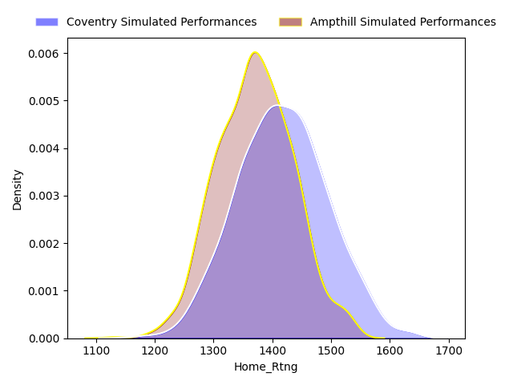

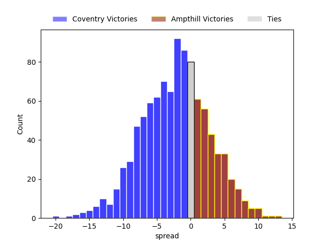

### Doncaster V Jersey on 2023/04/08

Average Margin: Jersey by 6.6

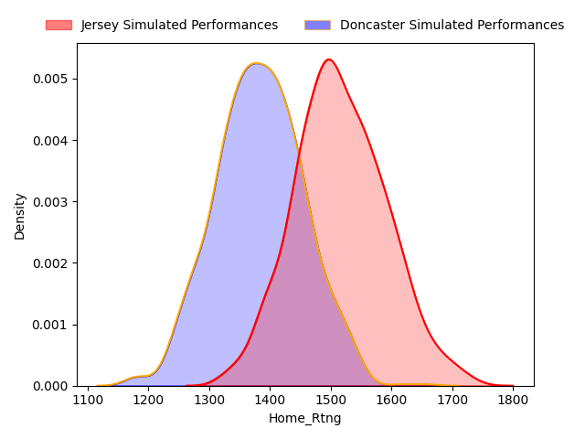

## Week 12

### Nottingham V Ampthill on 2023/04/15

Average Margin: Ampthill by 0.6

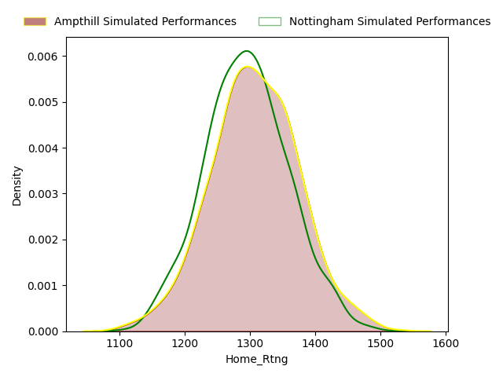

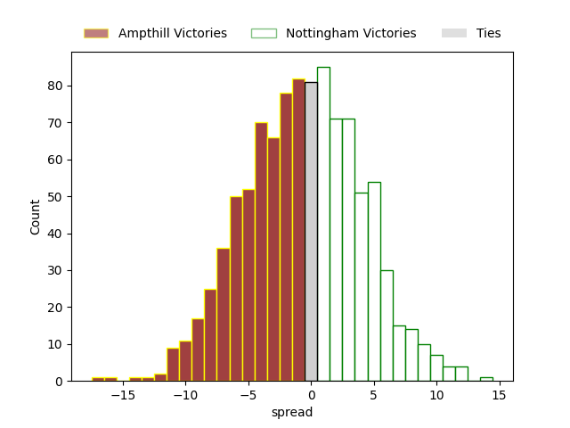

### Bedford V Jersey on 2023/04/15

Average Margin: Jersey by 2.8

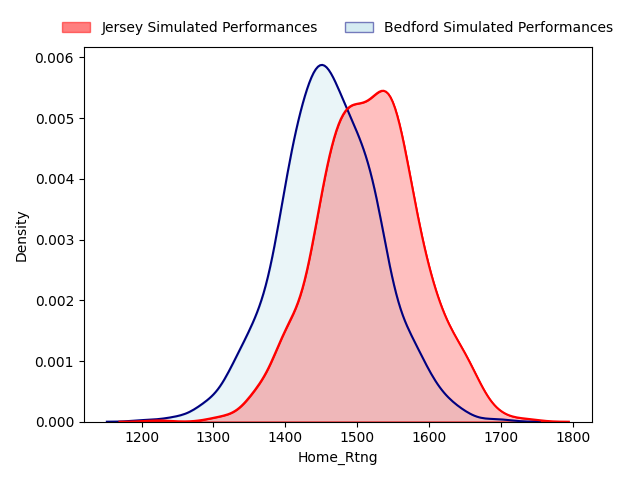

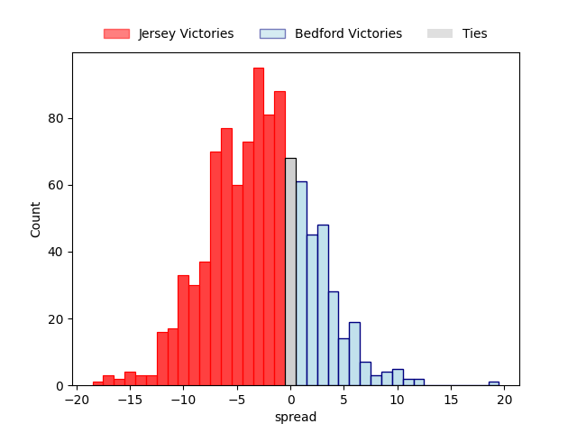

### Richmond V Coventry on 2023/04/15

Average Margin: Coventry by 10.5

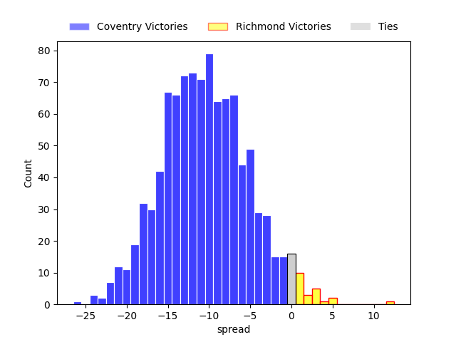

### Hartpury College V London Scottish on 2023/04/15

Average Margin: Hartpury College by 13.2

### Ealing Trailfinders V Caldy on 2023/04/15

Average Margin: Ealing Trailfinders by 20.9

### Doncaster V Cornish Pirates on 2023/04/15

Average Margin: Doncaster by 1.5

## Week 13

### Caldy V Doncaster on 2023/04/22

Average Margin: Caldy by 0.9

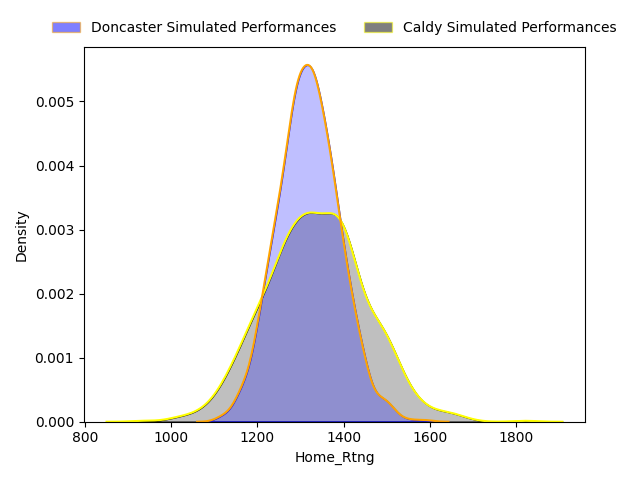

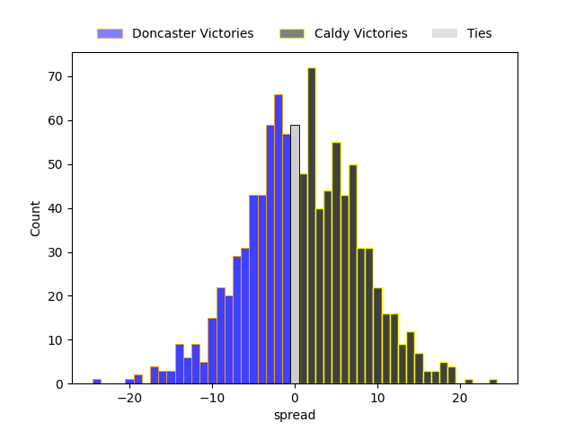

### Cornish Pirates V Hartpury College on 2023/04/22

Average Margin: Cornish Pirates by 6.0

### London Scottish V Richmond on 2023/04/22

Average Margin: London Scottish by 0.9

### Coventry V Nottingham on 2023/04/22

Average Margin: Coventry by 12.9

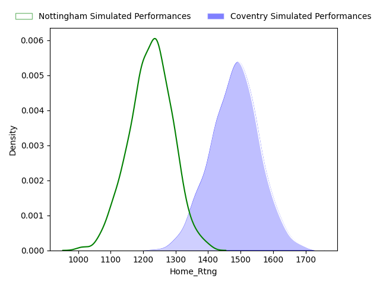

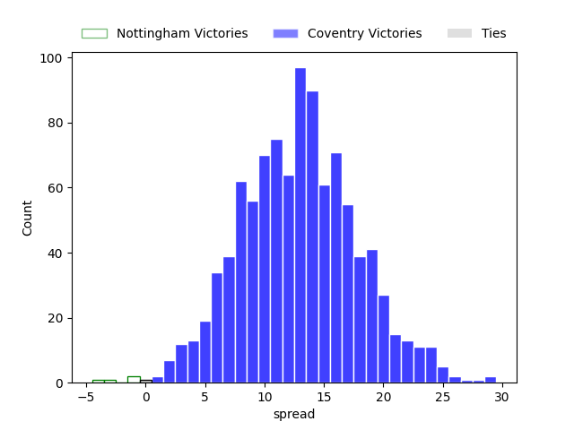

### Ampthill V Bedford on 2023/04/22

Average Margin: Bedford by 0.8

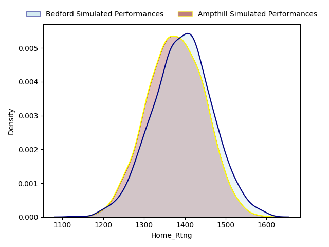

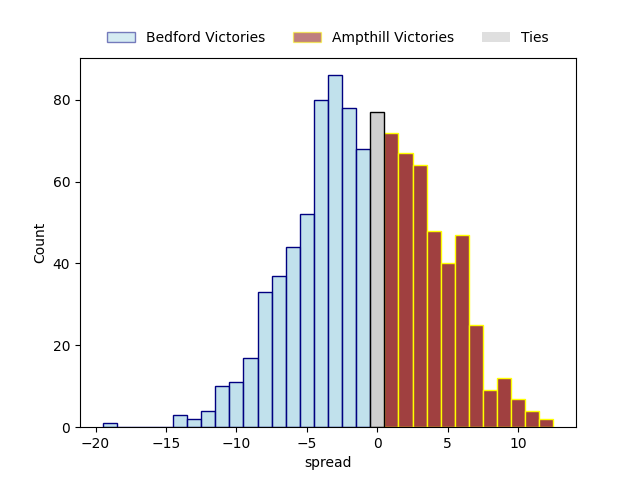

### Jersey V Ealing Trailfinders on 2023/04/22

Average Margin: Ealing Trailfinders by 1.9

## Week 14

### Jersey V Ampthill on 2023/04/29

Average Margin: Jersey by 13.8

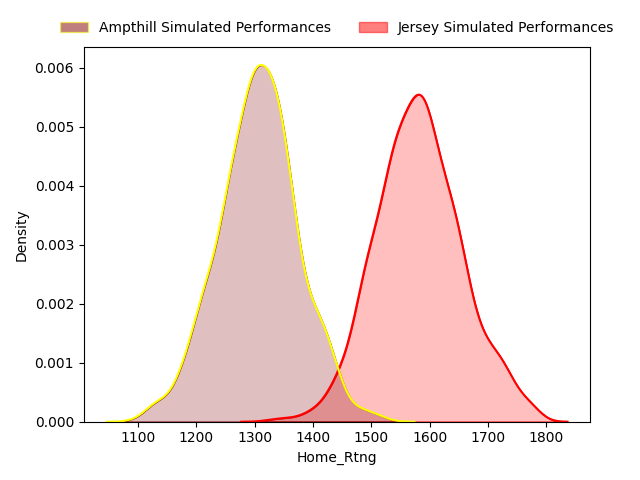

### Bedford V Coventry on 2023/04/29

Average Margin: Bedford by 2.1

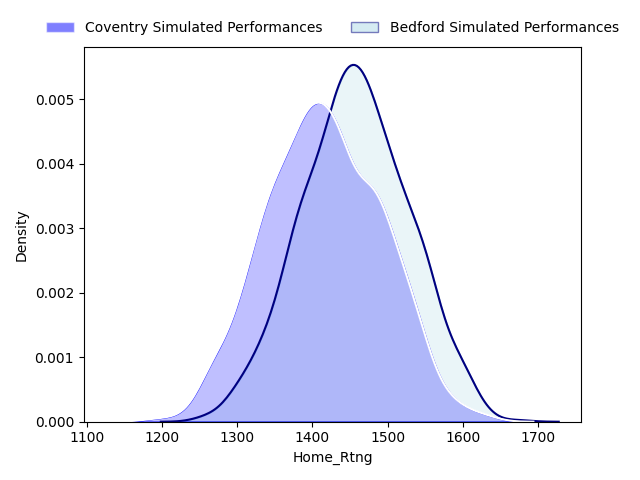

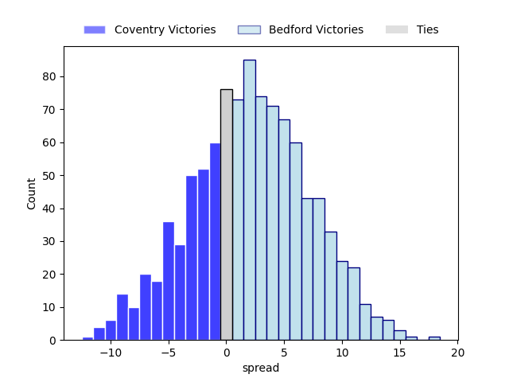

### Nottingham V London Scottish on 2023/04/29

Average Margin: Nottingham by 10.0

### Richmond V Cornish Pirates on 2023/04/29

Average Margin: Cornish Pirates by 6.9

### Hartpury College V Caldy on 2023/04/29

Average Margin: Hartpury College by 4.7

### Doncaster V Ealing Trailfinders on 2023/04/29

Average Margin: Ealing Trailfinders by 11.5

