---  
layout: page  
title: RFU Championship Status  
date:   
categories: model review projection  
---
# RFU Championship Status

# Completed Match Review

| Match                                                |   Result |   Lineup Prediction |   Minutes Prediction |   Club Prediction |
|:-----------------------------------------------------|---------:|--------------------:|---------------------:|------------------:|
| Cornish Pirates V Richmond on 2022/09/09             |        7 |                 7.8 |                  6.2 |              14.1 |
| Coventry V Bedford on 2022/09/09                     |        8 |                -1.5 |                 -1   |               2.3 |
| Ampthill V Jersey on 2022/09/10                      |      -15 |                 2.9 |                 -0.3 |              -2.5 |
| Caldy V Hartpury College on 2022/09/10               |      -11 |                12.2 |                 13.4 |              14.6 |
| Ealing Trailfinders V Doncaster on 2022/09/10        |       19 |                15.3 |                 18.3 |              10.4 |
| London Scottish V Nottingham on 2022/09/10           |      -21 |                 0   |                 -3.5 |              -1.1 |
| Hartpury College V Doncaster on 2022/09/17           |      -18 |                 6.6 |                  4.4 |              -4.7 |
| Ampthill V Ealing Trailfinders on 2022/09/17         |      -15 |               -35.8 |                -35.6 |             -10.8 |
| Bedford V London Scottish on 2022/09/17              |       13 |                28.6 |                 25.9 |              18.1 |
| Jersey V Coventry on 2022/09/17                      |       26 |                 5.1 |                  4.9 |              11.8 |
| Richmond V Caldy on 2022/09/17                       |       -2 |                 6.1 |                  8.2 |              -7.8 |
| Nottingham V Cornish Pirates on 2022/09/18           |       -4 |                 5.8 |                 -4.1 |              -9.2 |
| London Scottish V Jersey on 2022/09/24               |      -34 |               -19.2 |                -21.1 |             -14.2 |
| Cornish Pirates V Bedford on 2022/09/24              |      -20 |                 6.9 |                  7   |              10.2 |
| Doncaster V Richmond on 2022/09/24                   |       24 |                24.9 |                 21.8 |              16   |
| Caldy V Nottingham on 2022/09/24                     |       -8 |                 0.2 |                  5.5 |              20.9 |
| Coventry V Ampthill on 2022/09/24                    |        2 |                 0.4 |                 -5.8 |               4.2 |
| Ealing Trailfinders V Hartpury College on 2022/09/24 |       35 |                21.3 |                 20.9 |              19.5 |
| Jersey V Cornish Pirates on 2022/09/30               |       11 |                28.5 |                 36   |               4   |
| Nottingham V Doncaster on 2022/09/30                 |       15 |                -3.7 |                 -1.3 |             -11   |
| Ampthill V London Scottish on 2022/10/01             |       52 |                18.6 |                 16.6 |              17.2 |
| Bedford V Caldy on 2022/10/01                        |       23 |                15.6 |                 15.3 |              40   |
| Coventry V Ealing Trailfinders on 2022/10/01         |      -45 |                -8.7 |                -11.1 |             -12.6 |
| Richmond V Hartpury College on 2022/10/01            |        4 |                 6.6 |                  5.7 |               2.7 |
| Doncaster V Bedford on 2022/10/08                    |       31 |                 0   |                 -3.7 |               9.1 |
| Hartpury College V Nottingham on 2022/10/08          |        8 |               -11.8 |                 -9.9 |               5.9 |
| Caldy V Jersey on 2022/10/08                         |      -13 |               -22.4 |                -21.3 |             -37.2 |
| Ealing Trailfinders V Richmond on 2022/10/08         |       37 |                29.3 |                 24   |              22.7 |
| London Scottish V Coventry on 2022/10/08             |      -14 |               -12.6 |                -13.9 |              -8.7 |
| Cornish Pirates V Ampthill on 2022/10/09             |        2 |                 8.6 |                 -1.5 |               9.5 |
| Jersey V Doncaster on 2022/10/21                     |        2 |                -3.5 |                 -6   |               6.1 |
| Nottingham V Richmond on 2022/10/21                  |       19 |                28   |                 28.6 |               4.8 |
| Ampthill V Caldy on 2022/10/22                       |        2 |                15.5 |                 15.4 |              35.5 |
| Bedford V Hartpury College on 2022/10/22             |        7 |                 0.5 |                  7.7 |               7.9 |
| Coventry V Cornish Pirates on 2022/10/22             |       13 |                 6.2 |                 11.1 |              -0   |
| London Scottish V Ealing Trailfinders on 2022/10/22  |      -36 |               -36.3 |                -37.6 |             -25.8 |
| Hartpury College V Jersey on 2022/10/29              |      -10 |                -6   |                 -1.2 |              -5.1 |
| Cornish Pirates V London Scottish on 2022/10/29      |       32 |                25.5 |                 20.5 |              22.3 |
| Doncaster V Ampthill on 2022/10/29                   |       16 |                20.1 |                 18.9 |              13.7 |
| Caldy V Coventry on 2022/10/29                       |       -9 |                -3.9 |                 -3.8 |             -27   |
| Ealing Trailfinders V Nottingham on 2022/10/29       |       31 |                25.2 |                 19.9 |              22.4 |
| Richmond V Bedford on 2022/10/29                     |        3 |                 1.9 |                  6.1 |              -0.7 |
| Ampthill V Hartpury College on 2022/12/03            |       -8 |                14   |                 10.7 |               3.4 |
| Coventry V Doncaster on 2022/12/03                   |       40 |                21.1 |                 17.9 |              -5   |
| Cornish Pirates V Ealing Trailfinders on 2022/12/03  |      -13 |               -22.7 |                -23.9 |             -10.7 |
| Bedford V Nottingham on 2022/12/03                   |        1 |                 3.9 |                  3.9 |               7.6 |
| Jersey V Richmond on 2022/12/03                      |       15 |                20.2 |                 19.1 |              16.1 |
| London Scottish V Caldy on 2022/12/03                |        9 |               -11.3 |                 -9.1 |              -1.2 |
| Nottingham V Jersey on 2022/12/09                    |       -9 |                 3.6 |                  1.5 |              -5.7 |
| Caldy V Cornish Pirates on 2022/12/10                |        1 |               -23.9 |                -14.7 |              -7.5 |
| Doncaster V London Scottish on 2022/12/10            |        1 |                 6.9 |                  5.3 |              28.8 |
| Hartpury College V Coventry on 2022/12/10            |        9 |                -6.5 |                 -6.4 |               4.6 |
| Ealing Trailfinders V Bedford on 2022/12/10          |       25 |                14.5 |                 13.1 |              20.1 |
| Richmond V Ampthill on 2022/12/10                    |        0 |                 7.3 |                  7   |               3.5 |
| Jersey V Bedford on 2022/12/17                       |       40 |                24   |                 24.5 |              11.6 |
| Coventry V Richmond on 2022/12/17                    |       36 |                19.7 |                 19.4 |               6.5 |
| Hartpury College V Cornish Pirates on 2022/12/23     |        6 |                 3   |                 10.6 |               1.7 |
| Ealing Trailfinders V Jersey on 2022/12/24           |       21 |                -0.4 |                  2.8 |              13   |
| Doncaster V Caldy on 2022/12/26                      |       38 |                15.2 |                 15.9 |              23.1 |
| Bedford V Ampthill on 2022/12/26                     |       24 |                -7.6 |                 -8.9 |               8   |
| Nottingham V Coventry on 2022/12/26                  |      -28 |               -10.2 |                -13   |               3.9 |
| Richmond V London Scottish on 2022/12/31             |       14 |               -10.5 |                -11.5 |              17.3 |
| Caldy V Ealing Trailfinders on 2023/01/07            |        2 |               -19.5 |                -19.1 |             -24.9 |
| Cornish Pirates V Doncaster on 2023/01/07            |       22 |                -4.4 |                 -6.1 |              -0.1 |
| London Scottish V Hartpury College on 2023/01/07     |       -1 |                -5.6 |                -12.7 |              -9.3 |
| Cornish Pirates V Nottingham on 2023/01/13           |       11 |                34.4 |                 31   |               8.4 |
| Caldy V Richmond on 2023/01/14                       |       20 |                12.5 |                 11.2 |              -2.7 |
| Doncaster V Hartpury College on 2023/01/14           |      -15 |                15.1 |                 13.5 |               9.3 |
| Coventry V Jersey on 2023/01/14                      |        0 |                18.1 |                 23.5 |              -1.6 |
| Ealing Trailfinders V Ampthill on 2023/01/14         |       11 |                13.2 |                 18.2 |              25.8 |
| London Scottish V Bedford on 2023/01/14              |      -21 |                -0.3 |                  1.5 |              -9.5 |
| Nottingham V Caldy on 2023/01/20                     |      -12 |                -0.4 |                  0.2 |              13   |
| Hartpury College V Ealing Trailfinders on 2023/01/21 |      -13 |                 1.3 |                 10.7 |             -12.6 |
| Bedford V Cornish Pirates on 2023/01/21              |       42 |                 7.6 |                  6.5 |               4.5 |
| Jersey V London Scottish on 2023/01/21               |        2 |                30.7 |                 33.8 |              26.7 |
| Richmond V Doncaster on 2023/01/21                   |      -10 |                11.1 |                  8.7 |              -5.4 |
| Caldy V Bedford on 2023/01/28                        |        8 |                 8.4 |                  5.5 |              -8   |
| Cornish Pirates V Jersey on 2023/01/28               |       -9 |                -3.6 |                 -2.8 |              -3.8 |
| Doncaster V Nottingham on 2023/01/28                 |       15 |                 1   |                  5.5 |              13   |
| Hartpury College V Richmond on 2023/01/28            |       12 |                19.7 |                 20.8 |               9.6 |
| Ealing Trailfinders V Coventry on 2023/01/28         |       -3 |                11.3 |                  4.1 |              19.3 |
| London Scottish V Ampthill on 2023/01/28             |       -9 |                 5.9 |                  1.7 |              -5.2 |
| Ampthill V Nottingham on 2023/02/25                  |       12 |                -2.4 |                  0.2 |               6.7 |
| Bedford V Doncaster on 2023/03/03                    |       23 |                11.2 |                 13.6 |               2.8 |
| Nottingham V Hartpury College on 2023/03/03          |      -14 |                -1.3 |                  0.8 |              -2.5 |
| Richmond V Ealing Trailfinders on 2023/03/04         |      -50 |               nan   |                nan   |             -15.7 |
| Ampthill V Cornish Pirates on 2023/03/04             |      -39 |               nan   |                nan   |               1.4 |
| ------ | ------ | ------ | ------ | ------ |
| Average Error |       - | 13.8 | 13.8 | 13.8 |
| Correct Winner |       - | 63.5% | 63.5% | 75.9% |

## Future Club-Level Match Predictions

### Week 6

#### Coventry V London Scottish on 2023/03/04

Average Margin: Coventry by 20.0

#### Jersey V Caldy on 2023/03/04

Average Margin: Jersey by 3.4

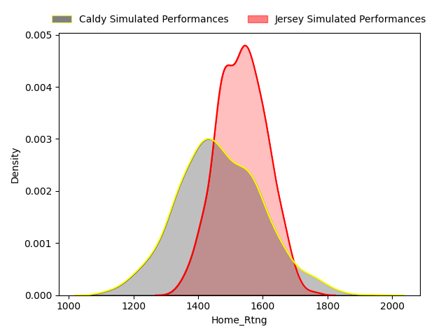

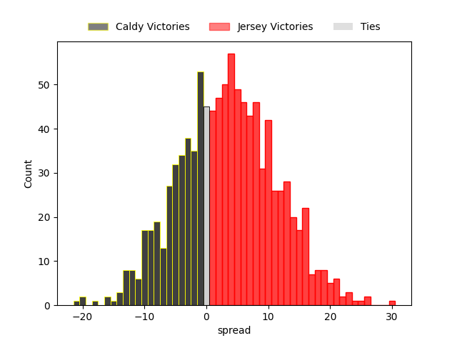

### Week 7

#### Richmond V Nottingham on 2023/03/11

Average Margin: Richmond by 2.5

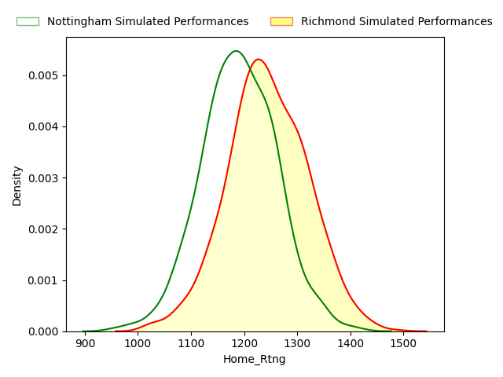

#### Hartpury College V Bedford on 2023/03/11

Average Margin: Hartpury College by 3.6

#### Doncaster V Jersey on 2023/03/11

Average Margin: Jersey by 2.8

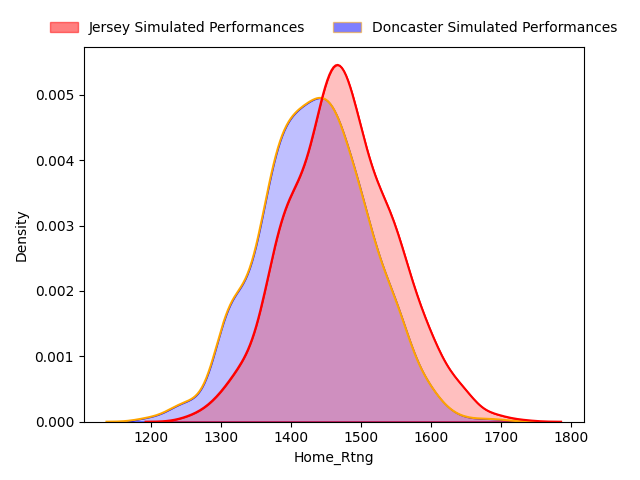

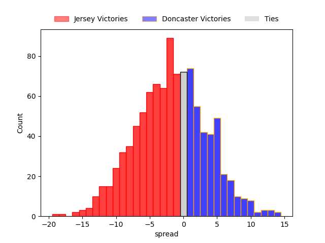

#### Caldy V Ampthill on 2023/03/11

Average Margin: Caldy by 15.2

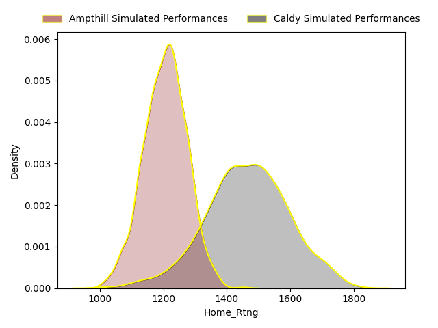

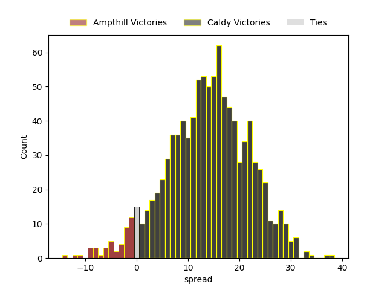

#### Ealing Trailfinders V London Scottish on 2023/03/11

Average Margin: Ealing Trailfinders by 30.0

#### Cornish Pirates V Coventry on 2023/03/11

Average Margin: Cornish Pirates by 1.5

### Week 8

#### Ampthill V Doncaster on 2023/03/18

Average Margin: Doncaster by 2.4

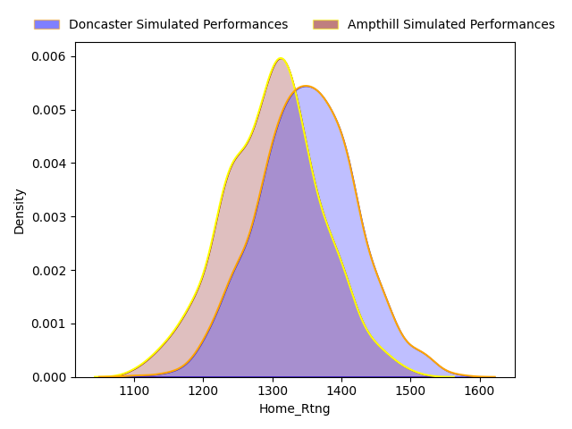

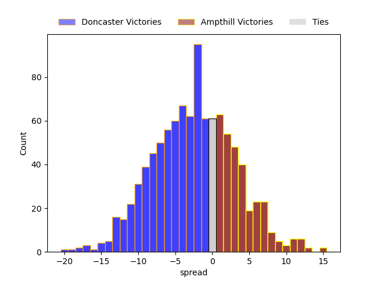

#### Bedford V Richmond on 2023/03/18

Average Margin: Bedford by 12.8

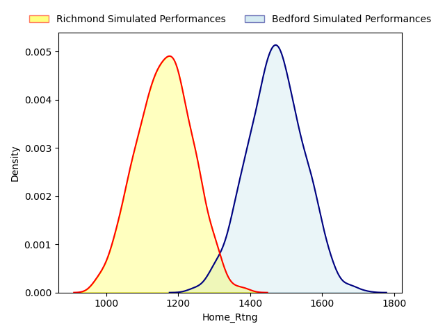

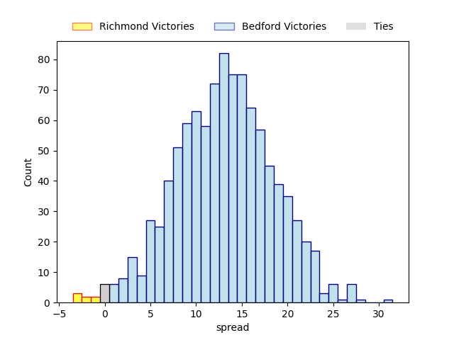

#### Jersey V Hartpury College on 2023/03/18

Average Margin: Jersey by 9.0

#### Coventry V Caldy on 2023/03/18

Average Margin: Caldy by 0.2

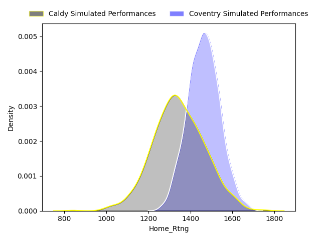

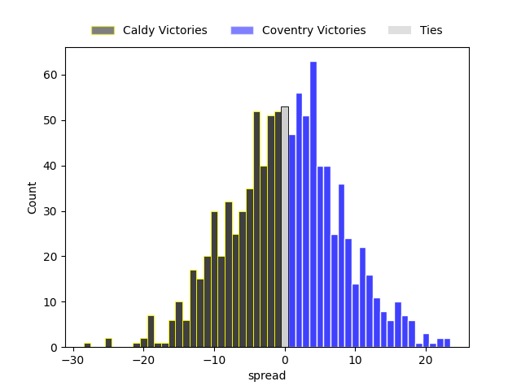

#### London Scottish V Cornish Pirates on 2023/03/18

Average Margin: Cornish Pirates by 11.0

#### Nottingham V Ealing Trailfinders on 2023/03/18

Average Margin: Ealing Trailfinders by 17.3

### Week 9

#### Nottingham V Bedford on 2023/03/25

Average Margin: Bedford by 4.8

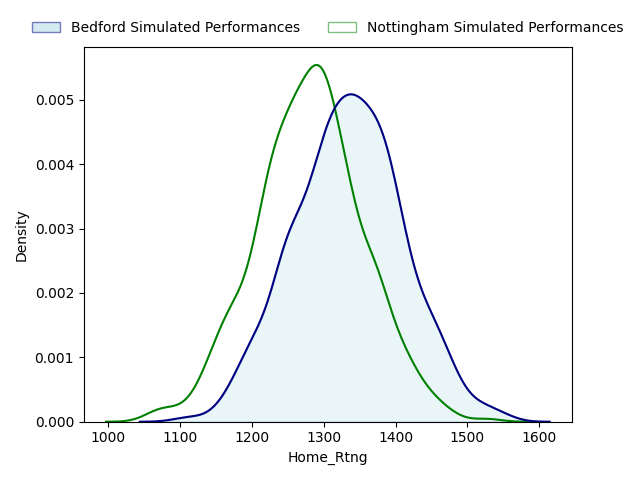

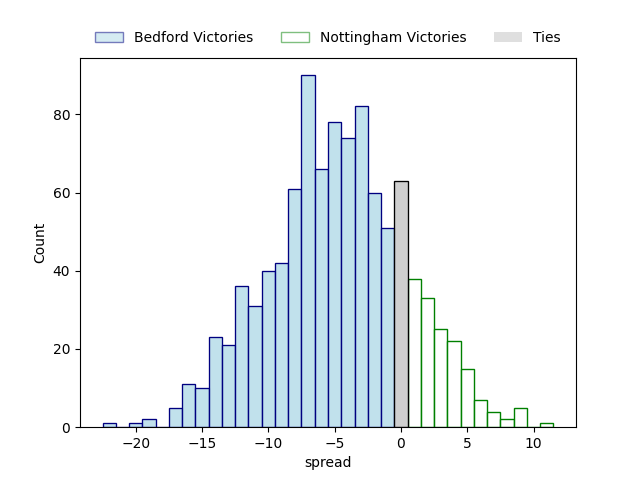

#### Hartpury College V Ampthill on 2023/03/25

Average Margin: Hartpury College by 9.8

#### Richmond V Jersey on 2023/03/25

Average Margin: Jersey by 11.7

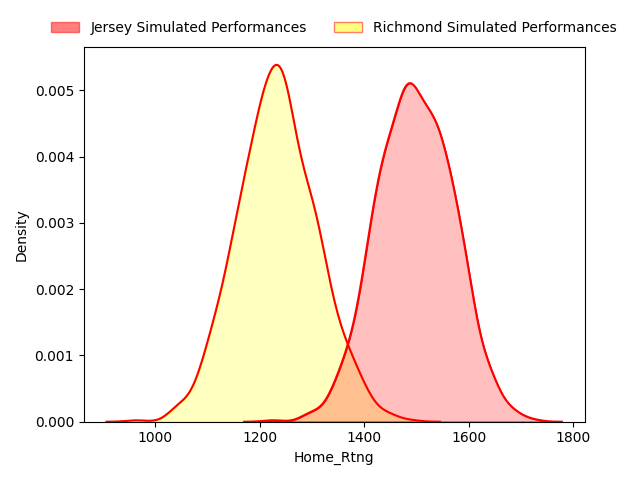

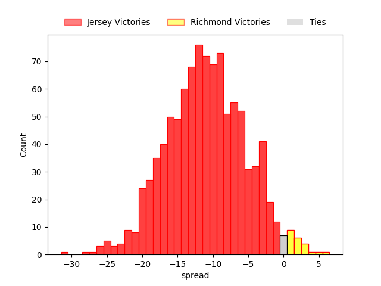

#### Caldy V London Scottish on 2023/03/25

Average Margin: Caldy by 23.5

#### Ealing Trailfinders V Cornish Pirates on 2023/03/25

Average Margin: Ealing Trailfinders by 15.6

#### Doncaster V Coventry on 2023/03/25

Average Margin: Doncaster by 0.9

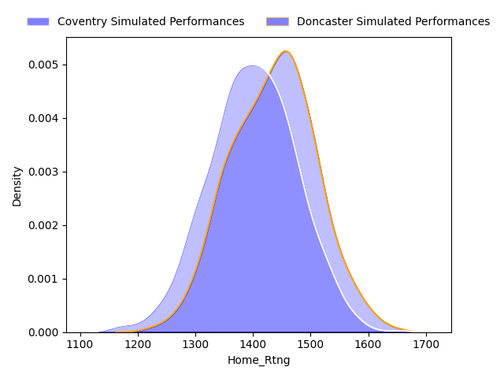

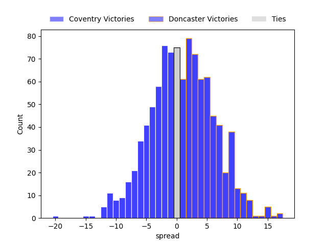

### Week 10

#### London Scottish V Doncaster on 2023/04/01

Average Margin: Doncaster by 10.7

#### Coventry V Hartpury College on 2023/04/01

Average Margin: Coventry by 5.2

#### Ampthill V Richmond on 2023/04/01

Average Margin: Ampthill by 6.2

#### Jersey V Nottingham on 2023/04/01

Average Margin: Jersey by 17.6

#### Bedford V Ealing Trailfinders on 2023/04/01

Average Margin: Ealing Trailfinders by 8.7

#### Cornish Pirates V Caldy on 2023/04/01

Average Margin: Caldy by 2.0

### Week 11

#### Nottingham V Ampthill on 2023/04/15

Average Margin: Nottingham by 1.3

#### Bedford V Jersey on 2023/04/15

Average Margin: Jersey by 2.6

#### Richmond V Coventry on 2023/04/15

Average Margin: Coventry by 7.7

#### Hartpury College V London Scottish on 2023/04/15

Average Margin: Hartpury College by 18.1

#### Ealing Trailfinders V Caldy on 2023/04/15

Average Margin: Ealing Trailfinders by 10.2

#### Doncaster V Cornish Pirates on 2023/04/15

Average Margin: Doncaster by 3.2

### Week 12

#### Caldy V Doncaster on 2023/04/22

Average Margin: Caldy by 8.7

#### Cornish Pirates V Hartpury College on 2023/04/22

Average Margin: Cornish Pirates by 3.3

#### London Scottish V Richmond on 2023/04/22

Average Margin: Richmond by 2.1

#### Coventry V Nottingham on 2023/04/22

Average Margin: Coventry by 13.4

#### Ampthill V Bedford on 2023/04/22

Average Margin: Bedford by 2.9

#### Jersey V Ealing Trailfinders on 2023/04/22

Average Margin: Ealing Trailfinders by 2.9

### Week 13

#### Jersey V Ampthill on 2023/04/29

Average Margin: Jersey by 15.2

#### Bedford V Coventry on 2023/04/29

Average Margin: Bedford by 1.2

#### Nottingham V London Scottish on 2023/04/29

Average Margin: Nottingham by 9.3

#### Richmond V Cornish Pirates on 2023/04/29

Average Margin: Cornish Pirates by 5.1

#### Hartpury College V Caldy on 2023/04/29

Average Margin: Caldy by 2.1

#### Doncaster V Ealing Trailfinders on 2023/04/29

Average Margin: Ealing Trailfinders by 9.1

