---  
title: RFU Championship Status  
date:   
categories: model review projection  
---
# RFU Championship Status

## Completed Match Review

| Match                                                |   Result |   Lineup Prediction |   Minutes Prediction |   Club Prediction |
|:-----------------------------------------------------|---------:|--------------------:|---------------------:|------------------:|
| Cornish Pirates V Richmond on 2022/09/09             |        7 |                 7.8 |                  6.2 |              14.1 |
| Coventry V Bedford on 2022/09/09                     |        8 |                -1.5 |                 -1   |               2.3 |
| Ampthill V Jersey on 2022/09/10                      |      -15 |                 2.9 |                 -0.3 |              -2.5 |
| Caldy V Hartpury College on 2022/09/10               |      -11 |                12.2 |                 13.4 |              14.6 |
| Ealing Trailfinders V Doncaster on 2022/09/10        |       19 |                15.3 |                 18.3 |              10.4 |
| London Scottish V Nottingham on 2022/09/10           |      -21 |                 0   |                 -3.5 |              -1.1 |
| Hartpury College V Doncaster on 2022/09/17           |      -18 |                 6.6 |                  4.4 |              -4.7 |
| Ampthill V Ealing Trailfinders on 2022/09/17         |      -15 |               -35.8 |                -35.6 |             -10.8 |
| Bedford V London Scottish on 2022/09/17              |       13 |                28.6 |                 25.9 |              18.1 |
| Jersey V Coventry on 2022/09/17                      |       26 |                 5.1 |                  4.9 |              11.8 |
| Richmond V Caldy on 2022/09/17                       |       -2 |                 6.1 |                  8.2 |              -7.8 |
| Nottingham V Cornish Pirates on 2022/09/18           |       -4 |                 5.8 |                 -4.1 |              -9.2 |
| London Scottish V Jersey on 2022/09/24               |      -34 |               -19.2 |                -21.1 |             -14.2 |
| Cornish Pirates V Bedford on 2022/09/24              |      -20 |                 6.9 |                  7   |              10.2 |
| Doncaster V Richmond on 2022/09/24                   |       24 |                24.9 |                 21.8 |              16   |
| Caldy V Nottingham on 2022/09/24                     |       -8 |                 0.2 |                  5.5 |              20.9 |
| Coventry V Ampthill on 2022/09/24                    |        2 |                 0.4 |                 -5.8 |               4.2 |
| Ealing Trailfinders V Hartpury College on 2022/09/24 |       35 |                21.3 |                 20.9 |              19.5 |
| Jersey V Cornish Pirates on 2022/09/30               |       11 |                28.5 |                 36   |               4   |
| Nottingham V Doncaster on 2022/09/30                 |       15 |                -3.7 |                 -1.3 |             -11   |
| Ampthill V London Scottish on 2022/10/01             |       52 |                18.6 |                 16.6 |              17.2 |
| Bedford V Caldy on 2022/10/01                        |       23 |                15.6 |                 15.3 |              40   |
| Coventry V Ealing Trailfinders on 2022/10/01         |      -45 |                -8.7 |                -11.1 |             -12.6 |
| Richmond V Hartpury College on 2022/10/01            |        4 |                 6.6 |                  5.7 |               2.7 |
| Doncaster V Bedford on 2022/10/08                    |       31 |                 0   |                 -3.7 |               9.1 |
| Hartpury College V Nottingham on 2022/10/08          |        8 |               -11.8 |                 -9.9 |               5.9 |
| Caldy V Jersey on 2022/10/08                         |      -13 |               -22.4 |                -21.3 |             -37.2 |
| Ealing Trailfinders V Richmond on 2022/10/08         |       37 |                29.3 |                 24   |              22.7 |
| London Scottish V Coventry on 2022/10/08             |      -14 |               -12.6 |                -13.9 |              -8.7 |
| Cornish Pirates V Ampthill on 2022/10/09             |        2 |                 8.6 |                 -1.5 |               9.5 |
| Jersey V Doncaster on 2022/10/21                     |        2 |                -3.5 |                 -6   |               6.1 |
| Nottingham V Richmond on 2022/10/21                  |       19 |                28   |                 28.6 |               4.8 |
| Ampthill V Caldy on 2022/10/22                       |        2 |                15.5 |                 15.4 |              35.5 |
| Bedford V Hartpury College on 2022/10/22             |        7 |                 0.5 |                  7.7 |               7.9 |
| Coventry V Cornish Pirates on 2022/10/22             |       13 |                 6.2 |                 11.1 |              -0   |
| London Scottish V Ealing Trailfinders on 2022/10/22  |      -36 |               -36.3 |                -37.6 |             -25.8 |
| Hartpury College V Jersey on 2022/10/29              |      -10 |                -6   |                 -1.2 |              -5.1 |
| Cornish Pirates V London Scottish on 2022/10/29      |       32 |                25.5 |                 20.5 |              22.3 |
| Doncaster V Ampthill on 2022/10/29                   |       16 |                20.1 |                 18.9 |              13.7 |
| Caldy V Coventry on 2022/10/29                       |       -9 |                -3.9 |                 -3.8 |             -27   |
| Ealing Trailfinders V Nottingham on 2022/10/29       |       31 |                25.2 |                 19.9 |              22.4 |
| Richmond V Bedford on 2022/10/29                     |        3 |                 1.9 |                  6.1 |              -0.7 |
| Ampthill V Hartpury College on 2022/12/03            |       -8 |                14   |                 10.7 |               3.4 |
| Coventry V Doncaster on 2022/12/03                   |       40 |                21.1 |                 17.9 |              -5   |
| Cornish Pirates V Ealing Trailfinders on 2022/12/03  |      -13 |               -22.7 |                -23.9 |             -10.7 |
| Bedford V Nottingham on 2022/12/03                   |        1 |                 3.9 |                  3.9 |               7.6 |
| Jersey V Richmond on 2022/12/03                      |       15 |                20.2 |                 19.1 |              16.1 |
| London Scottish V Caldy on 2022/12/03                |        9 |               -11.3 |                 -9.1 |              -1.2 |
| Nottingham V Jersey on 2022/12/09                    |       -9 |                -6.9 |                -10.1 |              -5.7 |
| Caldy V Cornish Pirates on 2022/12/10                |        1 |               -26   |                -16   |              -7.5 |
| Doncaster V London Scottish on 2022/12/10            |        1 |                 5.2 |                  2.6 |              28.8 |
| Hartpury College V Coventry on 2022/12/10            |        9 |               -16.2 |                -17.4 |               4.6 |
| Ealing Trailfinders V Bedford on 2022/12/10          |       25 |                32.7 |                 29.5 |              20.1 |
| Richmond V Ampthill on 2022/12/10                    |        0 |                 7   |                  6   |               3.5 |
| Richmond V London Scottish on 2022/12/31             |       14 |                -3.1 |                 -3.9 |              17.3 |
| Caldy V Ealing Trailfinders on 2023/01/07            |        2 |                -4.7 |                 -2.8 |             -23.7 |
| Cornish Pirates V Doncaster on 2023/01/07            |       22 |                 9.1 |                  9.3 |               0.5 |
| London Scottish V Hartpury College on 2023/01/07     |       -1 |               -10.2 |                -17.7 |              -9   |
| Cornish Pirates V Nottingham on 2023/01/13           |       11 |                18.7 |                 15.5 |               7   |
| Caldy V Richmond on 2023/01/14                       |       20 |                 7.4 |                  5.4 |              -2.8 |
| Doncaster V Hartpury College on 2023/01/14           |      -15 |                 0.8 |                 -2.5 |               9.3 |
| Coventry V Jersey on 2023/01/14                      |        0 |                 8   |                 12.3 |              -3.7 |
| Ealing Trailfinders V Ampthill on 2023/01/14         |       11 |                 1.3 |                  6.1 |              24.7 |
| London Scottish V Bedford on 2023/01/14              |      -21 |                -0.5 |                  1.7 |              -9.3 |
| Nottingham V Caldy on 2023/01/20                     |      -12 |                 2.9 |                  3.7 |              13.9 |
| Hartpury College V Ealing Trailfinders on 2023/01/21 |      -13 |                 0.8 |                 10.9 |             -12.5 |
| Bedford V Cornish Pirates on 2023/01/21              |       42 |                 8.5 |                  8.3 |               4.1 |
| Jersey V London Scottish on 2023/01/21               |        2 |                25   |                 27.8 |              26.4 |
| Richmond V Doncaster on 2023/01/21                   |      -10 |                10.8 |                  8.3 |              -4.2 |
| Caldy V Bedford on 2023/01/28                        |        8 |                 8.4 |                  5.9 |              -7   |
| Cornish Pirates V Jersey on 2023/01/28               |       -9 |                -2.6 |                 -1.7 |              -3.2 |
| Doncaster V Nottingham on 2023/01/28                 |       15 |                 1   |                  5.4 |              11.1 |
| Hartpury College V Richmond on 2023/01/28            |       12 |                17.7 |                 18.4 |               8.4 |
| Ealing Trailfinders V Coventry on 2023/01/28         |       -3 |                22.5 |                 16.5 |              21.3 |
| London Scottish V Ampthill on 2023/01/28             |       -9 |                12.1 |                  7.1 |              -5.9 |
| Ampthill V Nottingham on 2023/02/25                  |       12 |                 2.6 |                  6.9 |               5.9 |
| Bedford V Doncaster on 2023/03/03                    |       23 |                12.3 |                 14.9 |               2.9 |
| Nottingham V Hartpury College on 2023/03/03          |      -14 |                 5.3 |                  6.8 |              -1   |
| Ampthill V Cornish Pirates on 2023/03/04             |      -39 |                 9.6 |                 11   |               1.8 |
| Coventry V London Scottish on 2023/03/04             |       18 |                14.3 |                 14.4 |              18.9 |
| Jersey V Caldy on 2023/03/04                         |       57 |                 2.7 |                 -0.4 |               3   |
| Richmond V Ealing Trailfinders on 2023/03/04         |      -50 |               -12.1 |                -11.8 |             -14.5 |
| Hartpury College V Bedford on 2023/03/10             |      -21 |               -10.7 |                 -7.8 |               4.8 |
| Cornish Pirates V Coventry on 2023/03/11             |        5 |                 4   |                 -0.7 |               3.2 |
| Richmond V Nottingham on 2023/03/11                  |      -11 |                 0.9 |                  1.7 |               2.9 |
| Caldy V Ampthill on 2023/03/11                       |       -1 |                28.2 |                 16.9 |              15.4 |
| Ealing Trailfinders V London Scottish on 2023/03/11  |       66 |                34.2 |                 32.5 |              30   |
| Bedford V Richmond on 2023/03/17                     |       34 |                44.7 |                 44.2 |              11.3 |
| Coventry V Caldy on 2023/03/18                       |       29 |                 4.9 |                  5.6 |              -2.4 |
| Jersey V Hartpury College on 2023/03/18              |       14 |                23.9 |                 24.3 |              10.6 |
| Nottingham V Ealing Trailfinders on 2023/03/18       |      -20 |               -23.9 |                -23.9 |             -12.9 |
| Ampthill V Doncaster on 2023/03/18                   |       19 |                13.4 |                 14.7 |              -0.2 |
| London Scottish V Cornish Pirates on 2023/03/18      |       -3 |               -17.1 |                -22.2 |              -8.6 |
| Hartpury College V Ampthill on 2023/03/24            |       -6 |                -7.9 |                 -1.7 |               7.8 |
| Richmond V Jersey on 2023/03/25                      |      -64 |                -7.1 |                 -7.3 |              -8.7 |
| Doncaster V Coventry on 2023/03/25                   |       -6 |                -7.3 |                -12.8 |               5.1 |
| Caldy V London Scottish on 2023/03/25                |        7 |                -0.8 |                 -0.3 |              25.7 |
| Ealing Trailfinders V Cornish Pirates on 2023/03/25  |       38 |                18.5 |                 16.8 |              17   |
| Nottingham V Bedford on 2023/03/26                   |        2 |                -9.4 |                 -5.1 |              -0.7 |
| ------ | ------ | ------ | ------ | ------ |
| Average Error |       - | 14.0 | 14.0 | 14.6 |
| Correct Winner |       - | 66.7% | 65.7% | 72.7% |

## Current Standings

| Club                |   Wins |   Point Differential |   Losing Bonus Points |   Try Bonus Points |   Competition Points |
|:--------------------|-------:|---------------------:|----------------------:|-------------------:|---------------------:|
| Ealing Trailfinders |     15 |                  449 |                     2 |                 15 |                   77 |
| Jersey              |     14 |                  281 |                     0 |                 12 |                   70 |
| Bedford             |     10 |                  126 |                     3 |                 14 |                   57 |
| Coventry            |     10 |                   57 |                     1 |                 11 |                   54 |
| Cornish Pirates     |      9 |                  -22 |                     1 |                  5 |                   42 |
| Hartpury College    |      8 |                  -50 |                     3 |                  6 |                   41 |
| Nottingham          |      7 |                  -59 |                     2 |                 11 |                   41 |
| Ampthill            |      7 |                   -7 |                     2 |                  8 |                   40 |
| Caldy               |      7 |                 -110 |                     2 |                  8 |                   38 |
| Doncaster           |      7 |                  -46 |                     2 |                  6 |                   36 |
| Richmond            |      3 |                 -284 |                     2 |                  4 |                   20 |
| London Scottish     |      1 |                 -335 |                     5 |                  4 |                   13 |
## Projected Remaining Table

| Club                |   Wins |   Point Differential |   Losing Bonus Points |   Try Bonus Points |   Competition Points |
|:--------------------|-------:|---------------------:|----------------------:|-------------------:|---------------------:|
| Ealing Trailfinders |    3.5 |                 42.2 |                   0.4 |                2.7 |                 17.2 |
| Coventry            |    3.1 |                 26.1 |                   0.6 |                2.8 |                 16.1 |
| Jersey              |    3   |                 31.1 |                   0.7 |                2   |                 15   |
| Cornish Pirates     |    3   |                 19   |                   0.7 |                2   |                 14.9 |
| Hartpury College    |    1.9 |                  6.5 |                   1.1 |                1.5 |                 10.4 |
| Ampthill            |    1.8 |                 -2.8 |                   1   |                1.6 |                 10.2 |
| Doncaster           |    1.9 |                 -3.3 |                   1   |                1.3 |                 10.2 |
| Bedford             |    1.6 |                 -6.5 |                   1.5 |                1.6 |                  9.8 |
| Nottingham          |    1.4 |                -18   |                   0.6 |                1.5 |                  8.1 |
| Caldy               |    0.8 |                -34   |                   1   |                1.7 |                  6.3 |
| London Scottish     |    0.6 |                -31.2 |                   1.1 |                1.4 |                  5.2 |
| Richmond            |    0.5 |                -29.2 |                   1.4 |                1.5 |                  5.1 |
## Total Table

| Club                |   Wins |   Point Differential |   Losing Bonus Points |   Try Bonus Points |   Competition Points |
|:--------------------|-------:|---------------------:|----------------------:|-------------------:|---------------------:|
| Ealing Trailfinders |   18.5 |                491.2 |                   2.4 |               17.7 |                 94.2 |
| Jersey              |   17   |                312.1 |                   0.7 |               14   |                 85   |
| Coventry            |   13.1 |                 83.1 |                   1.6 |               13.8 |                 70.1 |
| Bedford             |   11.6 |                119.5 |                   4.5 |               15.6 |                 66.8 |
| Cornish Pirates     |   12   |                 -3   |                   1.7 |                7   |                 56.9 |
| Hartpury College    |    9.9 |                -43.5 |                   4.1 |                7.5 |                 51.4 |
| Ampthill            |    8.8 |                 -9.8 |                   3   |                9.6 |                 50.2 |
| Nottingham          |    8.4 |                -77   |                   2.6 |               12.5 |                 49.1 |
| Doncaster           |    8.9 |                -49.3 |                   3   |                7.3 |                 46.2 |
| Caldy               |    7.8 |               -144   |                   3   |                9.7 |                 44.3 |
| Richmond            |    3.5 |               -313.2 |                   3.4 |                5.5 |                 25.1 |
| London Scottish     |    1.6 |               -366.2 |                   6.1 |                5.4 |                 18.2 |
## Future Club-Level Match Predictions

### Week 10

#### Coventry V Hartpury College on 2023/03/31

Average Margin: Coventry by 8.0

#### Cornish Pirates V Caldy on 2023/04/01

Average Margin: Cornish Pirates by 7.8

#### London Scottish V Doncaster on 2023/04/01

Average Margin: Doncaster by 7.6

#### Ampthill V Richmond on 2023/04/01

Average Margin: Ampthill by 11.5

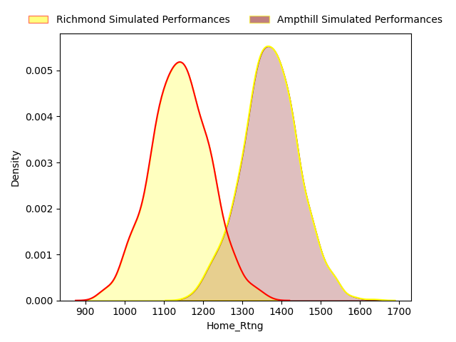

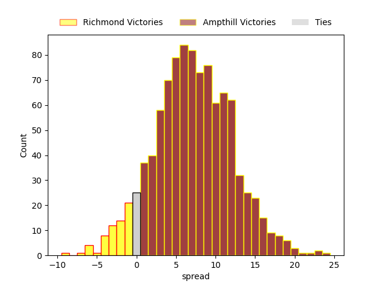

#### Jersey V Nottingham on 2023/04/01

Average Margin: Jersey by 17.0

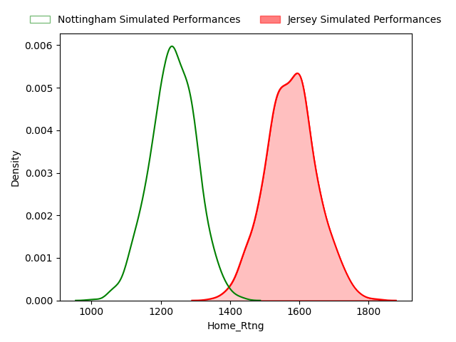

#### Bedford V Ealing Trailfinders on 2023/04/01

Average Margin: Ealing Trailfinders by 7.6

### Week 11

#### Nottingham V Ampthill on 2023/04/15

Average Margin: Ampthill by 0.0

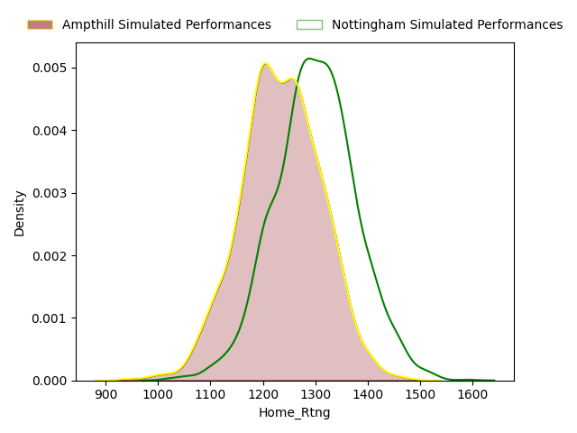

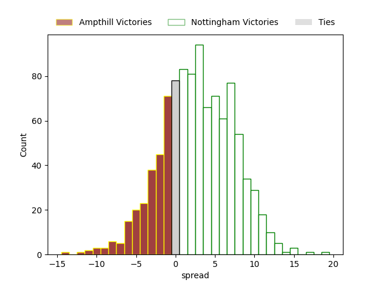

#### Bedford V Jersey on 2023/04/15

Average Margin: Jersey by 2.7

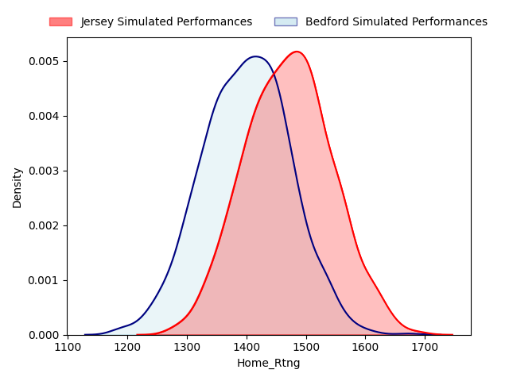

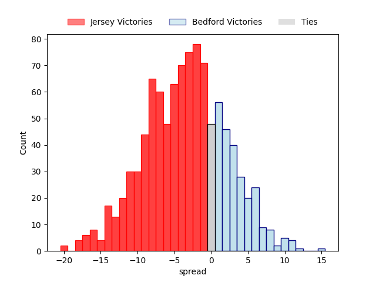

#### Richmond V Coventry on 2023/04/15

Average Margin: Coventry by 9.3

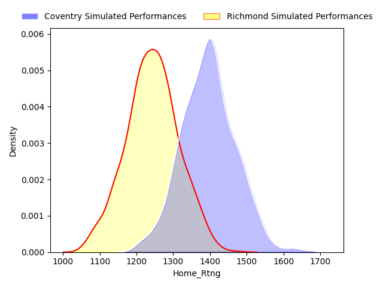

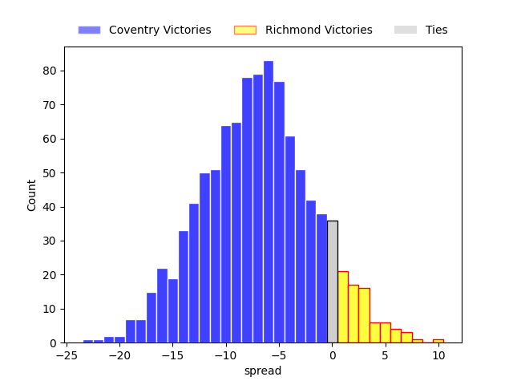

#### Hartpury College V London Scottish on 2023/04/15

Average Margin: Hartpury College by 14.0

#### Ealing Trailfinders V Caldy on 2023/04/15

Average Margin: Ealing Trailfinders by 21.0

#### Doncaster V Cornish Pirates on 2023/04/15

Average Margin: Doncaster by 1.5

### Week 12

#### Caldy V Doncaster on 2023/04/22

Average Margin: Caldy by 0.8

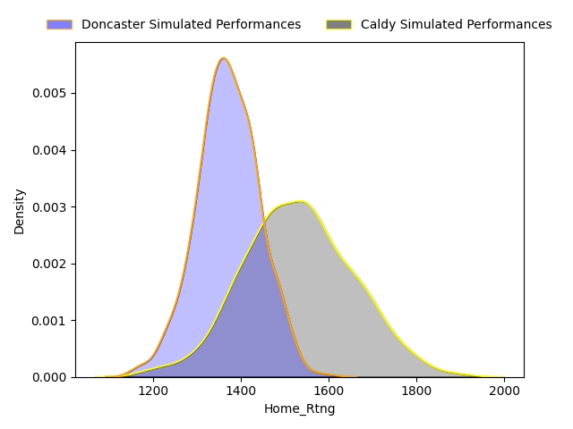

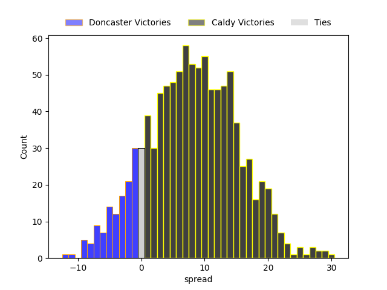

#### Cornish Pirates V Hartpury College on 2023/04/22

Average Margin: Cornish Pirates by 5.4

#### London Scottish V Richmond on 2023/04/22

Average Margin: London Scottish by 1.1

#### Coventry V Nottingham on 2023/04/22

Average Margin: Coventry by 11.7

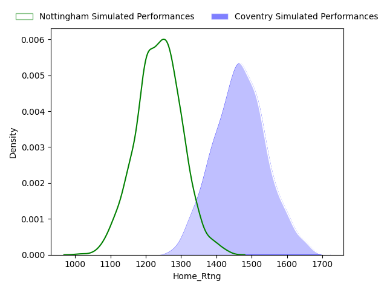

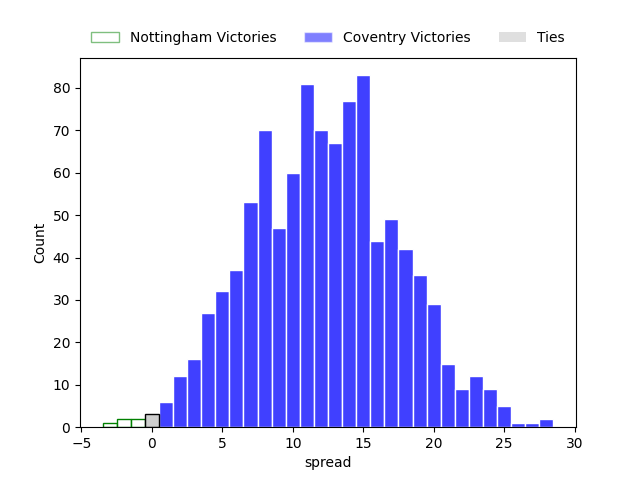

#### Ampthill V Bedford on 2023/04/22

Average Margin: Bedford by 0.9

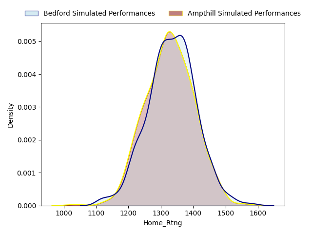

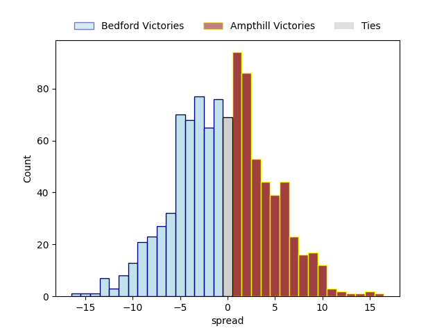

#### Jersey V Ealing Trailfinders on 2023/04/22

Average Margin: Ealing Trailfinders by 1.9

### Week 13

#### Jersey V Ampthill on 2023/04/29

Average Margin: Jersey by 13.3

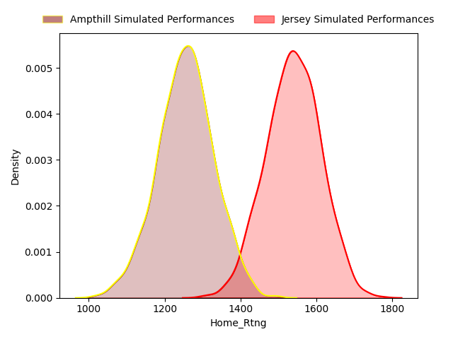

#### Bedford V Coventry on 2023/04/29

Average Margin: Bedford by 2.9

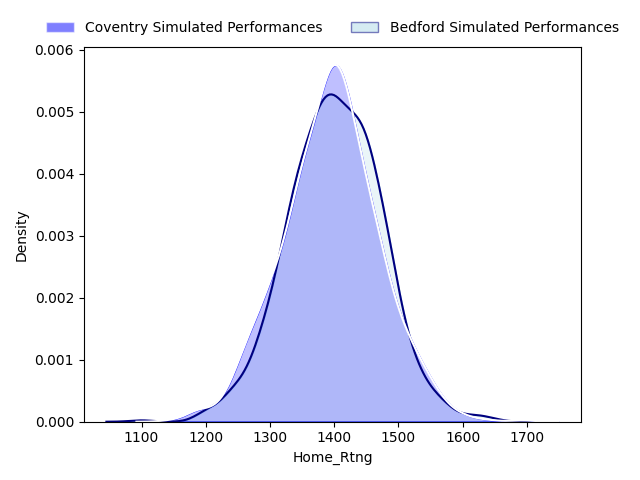

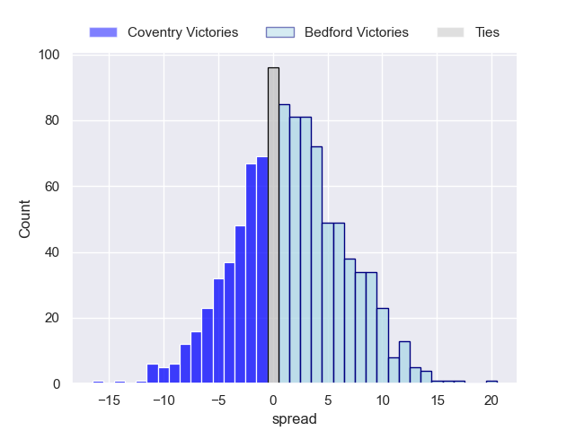

#### Nottingham V London Scottish on 2023/04/29

Average Margin: Nottingham by 10.7

#### Richmond V Cornish Pirates on 2023/04/29

Average Margin: Cornish Pirates by 7.3

#### Hartpury College V Caldy on 2023/04/29

Average Margin: Hartpury College by 5.9

#### Doncaster V Ealing Trailfinders on 2023/04/29

Average Margin: Ealing Trailfinders by 11.6

