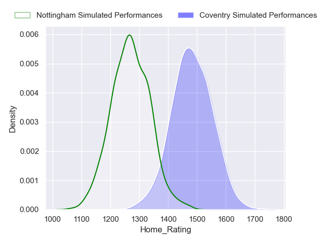
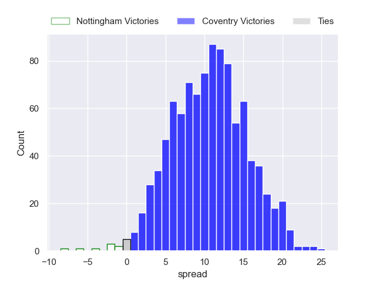
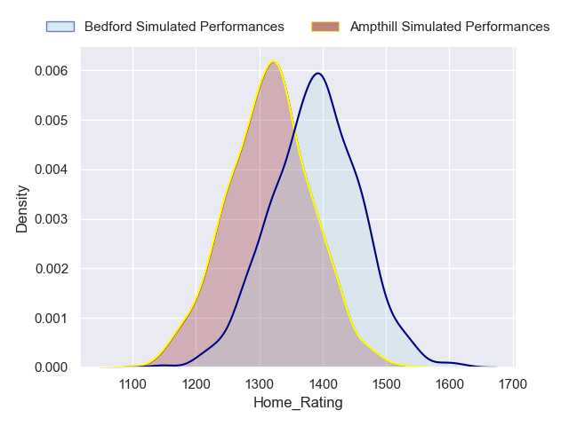
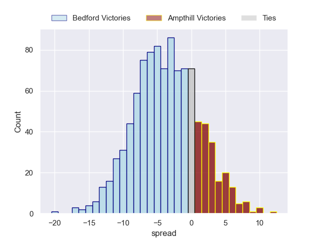
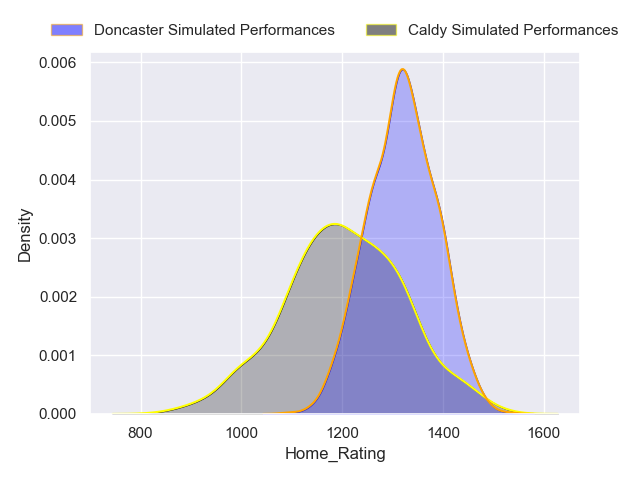
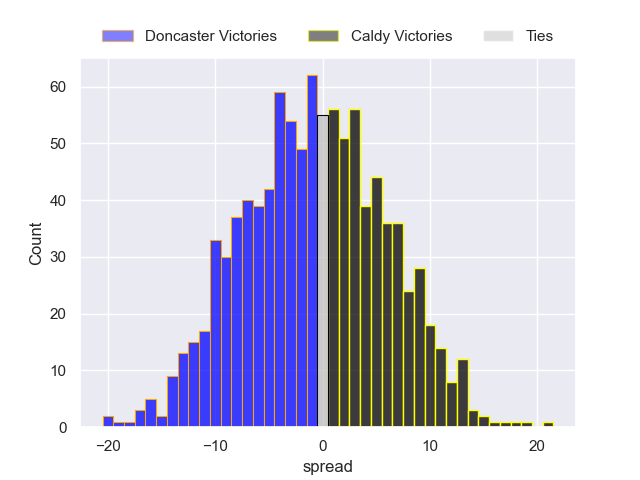
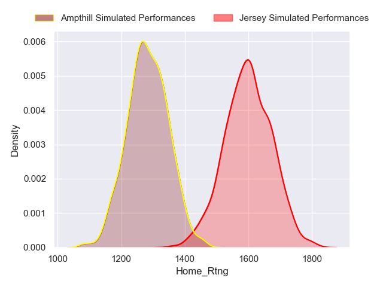
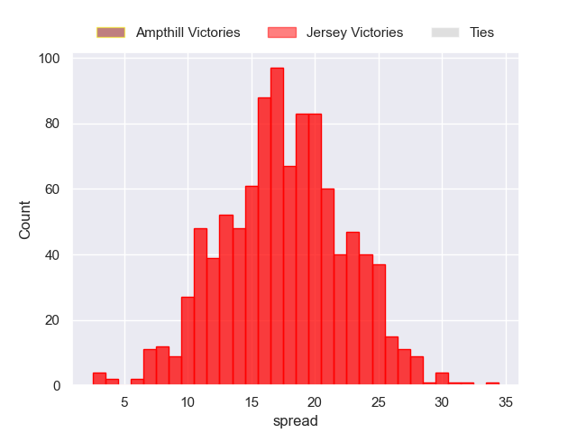
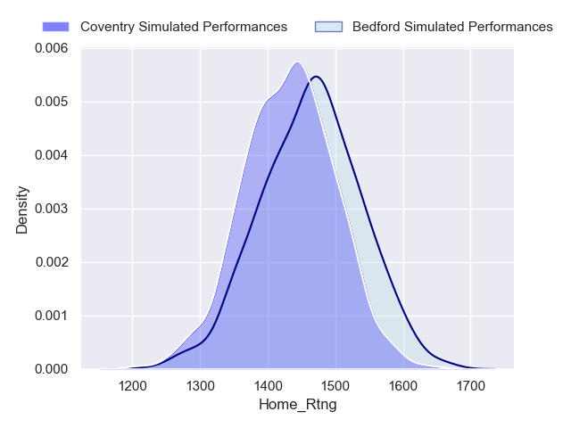
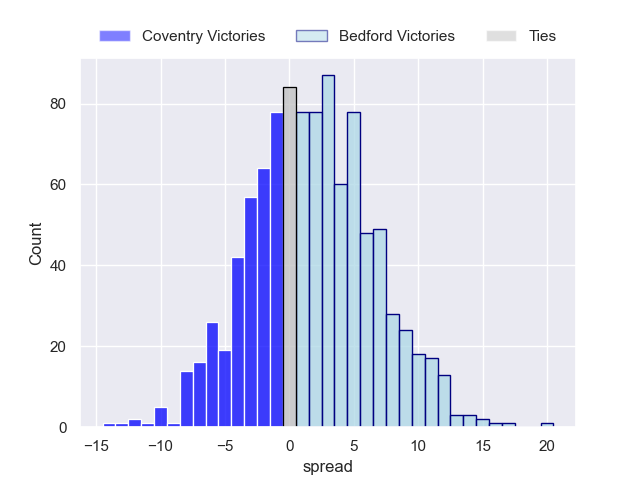

---  
title: "RFU Championship Status"  
date: 2023-04-21 6:00:00 -0500  
categories: model review projection  
layout: article  
aside:  
    toc: true  
---
# Current Team Rankings

# Standings

## Current Standings

| Club                |   Played |   Wins |   Point Differential |   Losing Bonus Points |   Try Bonus Points |   Competition Points |
|:--------------------|---------:|-------:|---------------------:|----------------------:|-------------------:|---------------------:|
| Jersey              |       17 |     17 |                  358 |                     0 |                nan |                   81 |
| Ealing Trailfinders |       17 |     16 |                  508 |                     1 |                nan |                   80 |
| Coventry            |       17 |     13 |                  108 |                     1 |                nan |                   65 |
| Bedford             |       17 |      9 |                   91 |                     3 |                nan |                   52 |
| Ampthill            |       18 |      8 |                  -45 |                     2 |                nan |                   44 |
| Doncaster           |       17 |      8 |                  -29 |                     3 |                nan |                   42 |
| Cornish Pirates     |       17 |      9 |                  -47 |                     1 |                nan |                   42 |
| Nottingham          |       17 |      7 |                  -41 |                     2 |                nan |                   40 |
| Hartpury College    |       17 |      6 |                  -99 |                     3 |                nan |                   33 |
| Caldy               |       16 |      4 |                 -210 |                     3 |                nan |                   25 |
| Richmond            |       17 |      2 |                 -296 |                     3 |                nan |                   17 |
| London Scottish     |       17 |      2 |                 -298 |                     4 |                nan |                   16 |

## Projected Remaining Table

| Club                |   Matches Remaining |   Wins |   Point Differential |   Losing Bonus Points |   Try Bonus Points |   Competition Points |
|:--------------------|--------------------:|-------:|---------------------:|----------------------:|-------------------:|---------------------:|
| Cornish Pirates     |                   2 |    1.8 |                 12.1 |                   0.2 |                1.8 |                  9.1 |
| Ealing Trailfinders |                   2 |    1.7 |                 15.2 |                   0.3 |                1.6 |                  8.6 |
| Bedford             |                   2 |    1.4 |                  5.1 |                   0.5 |                1.3 |                  7.5 |
| Coventry            |                   2 |    1.4 |                  8.5 |                   0.5 |                1.3 |                  7.2 |
| Jersey              |                   2 |    1.3 |                 14.6 |                   0.5 |                1.3 |                  7.1 |
| Hartpury College    |                   2 |    0.9 |                  0.6 |                   0.5 |                0.9 |                  5.2 |
| Nottingham          |                   2 |    1   |                  0.3 |                   0.2 |                1   |                  5.2 |
| Doncaster           |                   2 |    0.8 |                 -7.2 |                   0.3 |                0.8 |                  4.2 |
| Richmond            |                   2 |    0.6 |                 -5.5 |                   0.9 |                0.6 |                  3.9 |
| London Scottish     |                   2 |    0.6 |                 -9.7 |                   0.5 |                0.6 |                  3.5 |
| Caldy               |                   2 |    0.3 |                -13.6 |                   0.7 |                0.3 |                  2.3 |
| Ampthill            |                   2 |    0.2 |                -20.7 |                   0.5 |                0.2 |                  1.6 |

## Projected Total Table

| Club                |   Total Matches |   Wins |   Point Differential |   Losing Bonus Points |   Try Bonus Points |   Competition Points |
|:--------------------|----------------:|-------:|---------------------:|----------------------:|-------------------:|---------------------:|
| Ealing Trailfinders |              19 |   17.7 |                523.2 |                   1.3 |                1.6 |                 88.6 |
| Jersey              |              19 |   18.3 |                372.6 |                   0.5 |                1.3 |                 88.1 |
| Coventry            |              19 |   14.4 |                116.5 |                   1.5 |                1.3 |                 72.2 |
| Bedford             |              19 |   10.4 |                 96.1 |                   3.5 |                1.3 |                 59.5 |
| Cornish Pirates     |              19 |   10.8 |                -34.9 |                   1.2 |                1.8 |                 51.1 |
| Doncaster           |              19 |    8.8 |                -36.2 |                   3.3 |                0.8 |                 46.2 |
| Ampthill            |              20 |    8.2 |                -65.7 |                   2.5 |                0.2 |                 45.6 |
| Nottingham          |              19 |    8   |                -40.7 |                   2.2 |                1   |                 45.2 |
| Hartpury College    |              19 |    6.9 |                -98.4 |                   3.5 |                0.9 |                 38.2 |
| Caldy               |              18 |    4.3 |               -223.6 |                   3.7 |                0.3 |                 27.3 |
| Richmond            |              19 |    2.6 |               -301.5 |                   3.9 |                0.6 |                 20.9 |
| London Scottish     |              19 |    2.6 |               -307.7 |                   4.5 |                0.6 |                 19.5 |

# Completed Match Review

| Model | Percent Correct Predictions | Spread Error |
| ------ | ------ | ------ |
| Club Level | 76.5% | 14.1 |
| Player Level: Lineup | 64.9% | 14.1 |
| Player Level: Minutes | 68.1% | 13.8 |

# Future Predictions

## Week 11

### Coventry V Nottingham on 2023/04/22

Average Margin: Coventry by 10.6

### Ampthill V Bedford on 2023/04/22

Average Margin: Bedford by 3.6

### Cornish Pirates V Hartpury College on 2023/04/22

Average Margin: Cornish Pirates by 7.7

### Caldy V Doncaster on 2023/04/22

Average Margin: Doncaster by 5.7

### Jersey V Ealing Trailfinders on 2023/04/22

Average Margin: Ealing Trailfinders by 2.5

### London Scottish V Richmond on 2023/04/22

Average Margin: London Scottish by 0.9

## Week 12

### Jersey V Ampthill on 2023/04/29

Average Margin: Jersey by 17.6

### Nottingham V London Scottish on 2023/04/29

Average Margin: Nottingham by 11.0

### Bedford V Coventry on 2023/04/29

Average Margin: Bedford by 1.7

### Hartpury College V Caldy on 2023/04/29

Average Margin: Hartpury College by 8.3

### Richmond V Cornish Pirates on 2023/04/29

Average Margin: Cornish Pirates by 4.9

### Doncaster V Ealing Trailfinders on 2023/04/29

Average Margin: Ealing Trailfinders by 13.2

