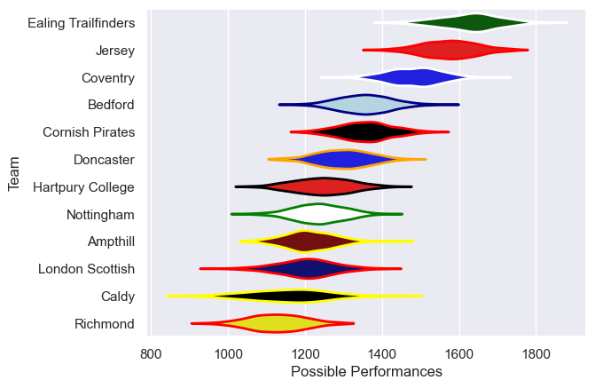

---  
title: "RFU Championship Status"  
date: 2023-04-15 6:00:00 -0500  
categories: model review projection  
layout: article  
aside:  
    toc: true  
---
# Team Rankings

# Standings

## Current Standings

| Club                |   Played |   Wins |   Point Differential |   Losing Bonus Points |   Try Bonus Points |   Competition Points |
|:--------------------|---------:|-------:|---------------------:|----------------------:|-------------------:|---------------------:|
| Ealing Trailfinders |       17 |     16 |                  460 |                     1 |                 16 |                   81 |
| Jersey              |       17 |     16 |                  351 |                     0 |                nan |                   79 |
| Coventry            |       17 |     12 |                  104 |                     1 |                nan |                   63 |
| Bedford             |       17 |     10 |                  119 |                     2 |                 14 |                   56 |
| Ampthill            |       18 |      8 |                  -17 |                     2 |                nan |                   45 |
| Cornish Pirates     |       17 |      9 |                  -37 |                     1 |                  5 |                   42 |
| Doncaster           |       17 |      8 |                  -43 |                     2 |                nan |                   41 |
| Hartpury College    |       17 |      7 |                  -74 |                     3 |                  6 |                   37 |
| Nottingham          |       18 |      6 |                 -103 |                     2 |                 10 |                   36 |
| Caldy               |       17 |      6 |                 -119 |                     3 |                  7 |                   34 |
| Richmond            |       17 |      2 |                 -312 |                     2 |                  4 |                   16 |
| London Scottish     |       17 |      1 |                 -329 |                     4 |                  4 |                   12 |

## Projected Remaining Table

| Club                |   Matches Remaining |   Wins |   Point Differential |   Losing Bonus Points |   Try Bonus Points |   Competition Points |
|:--------------------|--------------------:|-------:|---------------------:|----------------------:|-------------------:|---------------------:|
| Ealing Trailfinders |                   3 |    2.6 |                 39.3 |                   0.3 |                1.9 |                 12.8 |
| Coventry            |                   3 |    2.3 |                 23.1 |                   0.5 |                2.2 |                 12.1 |
| Hartpury College    |                   3 |    2   |                 16.9 |                   0.6 |                1.7 |                 10.4 |
| Jersey              |                   3 |    2   |                 16.5 |                   0.7 |                1.5 |                 10.4 |
| Cornish Pirates     |                   3 |    1.9 |                  8.1 |                   0.7 |                1.3 |                 10.1 |
| Bedford             |                   3 |    1.5 |                  0.5 |                   1.1 |                1.9 |                  9.2 |
| Nottingham          |                   3 |    1.5 |                 -1.4 |                   0.4 |                1.1 |                  7.8 |
| Doncaster           |                   3 |    1.1 |                -10.2 |                   0.7 |                1.2 |                  6.8 |
| Ampthill            |                   3 |    0.7 |                -18.7 |                   1   |                1   |                  5   |
| Richmond            |                   3 |    0.6 |                -16.9 |                   1.1 |                1.1 |                  4.8 |
| Caldy               |                   3 |    0.6 |                -31.6 |                   0.7 |                1   |                  4.2 |
| London Scottish     |                   3 |    0.5 |                -25.6 |                   0.7 |                1.4 |                  4.1 |

## Projected Total Table

| Club                |   Total Matches |   Wins |   Point Differential |   Losing Bonus Points |   Try Bonus Points |   Competition Points |
|:--------------------|----------------:|-------:|---------------------:|----------------------:|-------------------:|---------------------:|
| Ealing Trailfinders |              20 |   18.6 |                499.3 |                   1.3 |               17.9 |                 93.8 |
| Jersey              |              20 |   18   |                367.5 |                   0.7 |              nan   |                 89.4 |
| Coventry            |              20 |   14.3 |                127.1 |                   1.5 |              nan   |                 75.1 |
| Bedford             |              20 |   11.5 |                119.5 |                   3.1 |               15.9 |                 65.2 |
| Cornish Pirates     |              20 |   10.9 |                -28.9 |                   1.7 |                6.3 |                 52.1 |
| Ampthill            |              21 |    8.7 |                -35.7 |                   3   |              nan   |                 50   |
| Doncaster           |              20 |    9.1 |                -53.2 |                   2.7 |              nan   |                 47.8 |
| Hartpury College    |              20 |    9   |                -57.1 |                   3.6 |                7.7 |                 47.4 |
| Nottingham          |              21 |    7.5 |               -104.4 |                   2.4 |               11.1 |                 43.8 |
| Caldy               |              20 |    6.6 |               -150.6 |                   3.7 |                8   |                 38.2 |
| Richmond            |              20 |    2.6 |               -328.9 |                   3.1 |                5.1 |                 20.8 |
| London Scottish     |              20 |    1.5 |               -354.6 |                   4.7 |                5.4 |                 16.1 |

# Completed Match Review

| Match                                                |   Result |   Lineup Prediction |   Minutes Prediction |   Club Prediction |
|:-----------------------------------------------------|---------:|--------------------:|---------------------:|------------------:|
| Cornish Pirates V Richmond on 2022/09/09             |        7 |                 7.8 |                  6.2 |              14.1 |
| Coventry V Bedford on 2022/09/09                     |        8 |                -1.5 |                 -1   |               2.3 |
| Ampthill V Jersey on 2022/09/10                      |      -15 |                 2.9 |                 -0.3 |              -2.5 |
| Caldy V Hartpury College on 2022/09/10               |      -11 |                12.2 |                 13.4 |              14.6 |
| Ealing Trailfinders V Doncaster on 2022/09/10        |       19 |                15.3 |                 18.3 |              10.4 |
| London Scottish V Nottingham on 2022/09/10           |      -21 |                 0   |                 -3.5 |              -1.1 |
| Hartpury College V Doncaster on 2022/09/17           |      -18 |                 6.6 |                  4.4 |              -4.7 |
| Ampthill V Ealing Trailfinders on 2022/09/17         |      -15 |               -35.8 |                -35.6 |             -10.8 |
| Bedford V London Scottish on 2022/09/17              |       13 |                28.6 |                 25.9 |              18.1 |
| Jersey V Coventry on 2022/09/17                      |       26 |                 5.1 |                  4.9 |              11.8 |
| Richmond V Caldy on 2022/09/17                       |       -2 |                 6.1 |                  8.2 |              -7.8 |
| Nottingham V Cornish Pirates on 2022/09/18           |       -4 |                 5.8 |                 -4.1 |              -9.2 |
| London Scottish V Jersey on 2022/09/24               |      -34 |               -19.2 |                -21.1 |             -14.2 |
| Cornish Pirates V Bedford on 2022/09/24              |      -20 |                 6.9 |                  7   |              10.2 |
| Doncaster V Richmond on 2022/09/24                   |       24 |                24.9 |                 21.8 |              16   |
| Caldy V Nottingham on 2022/09/24                     |       -8 |                 0.2 |                  5.5 |              20.9 |
| Coventry V Ampthill on 2022/09/24                    |        2 |                 0.4 |                 -5.8 |               4.2 |
| Ealing Trailfinders V Hartpury College on 2022/09/24 |       35 |                21.3 |                 20.9 |              19.5 |
| Jersey V Cornish Pirates on 2022/09/30               |       11 |                28.5 |                 36   |               4   |
| Nottingham V Doncaster on 2022/09/30                 |       15 |                -3.7 |                 -1.3 |             -11   |
| Ampthill V London Scottish on 2022/10/01             |       52 |                18.6 |                 16.6 |              17.2 |
| Bedford V Caldy on 2022/10/01                        |       23 |                15.6 |                 15.3 |              40   |
| Coventry V Ealing Trailfinders on 2022/10/01         |      -45 |                -8.7 |                -11.1 |             -12.6 |
| Richmond V Hartpury College on 2022/10/01            |        4 |                 6.6 |                  5.7 |               2.7 |
| Doncaster V Bedford on 2022/10/08                    |       31 |                 0   |                 -3.7 |               9.1 |
| Hartpury College V Nottingham on 2022/10/08          |        8 |               -11.8 |                 -9.9 |               5.9 |
| Caldy V Jersey on 2022/10/08                         |      -13 |               -22.4 |                -21.3 |             -37.2 |
| Ealing Trailfinders V Richmond on 2022/10/08         |       37 |                29.3 |                 24   |              22.7 |
| London Scottish V Coventry on 2022/10/08             |      -14 |               -12.6 |                -13.9 |              -8.7 |
| Cornish Pirates V Ampthill on 2022/10/09             |        2 |                 8.6 |                 -1.5 |               9.5 |
| Jersey V Doncaster on 2022/10/21                     |        2 |                -3.5 |                 -6   |               6.1 |
| Nottingham V Richmond on 2022/10/21                  |       19 |                28   |                 28.6 |               4.8 |
| Ampthill V Caldy on 2022/10/22                       |        2 |                15.5 |                 15.4 |              35.5 |
| Bedford V Hartpury College on 2022/10/22             |        7 |                 0.5 |                  7.7 |               7.9 |
| Coventry V Cornish Pirates on 2022/10/22             |       13 |                 6.2 |                 11.1 |              -0   |
| London Scottish V Ealing Trailfinders on 2022/10/22  |      -36 |               -36.3 |                -37.6 |             -25.8 |
| Hartpury College V Jersey on 2022/10/29              |      -10 |                -6   |                 -1.2 |              -5.1 |
| Cornish Pirates V London Scottish on 2022/10/29      |       32 |                25.5 |                 20.5 |              22.3 |
| Doncaster V Ampthill on 2022/10/29                   |       16 |                20.1 |                 18.9 |              13.7 |
| Caldy V Coventry on 2022/10/29                       |       -9 |                -3.9 |                 -3.8 |             -27   |
| Ealing Trailfinders V Nottingham on 2022/10/29       |       31 |                25.2 |                 19.9 |              22.4 |
| Richmond V Bedford on 2022/10/29                     |        3 |                 1.9 |                  6.1 |              -0.7 |
| Ampthill V Hartpury College on 2022/12/03            |       -8 |                14   |                 10.7 |               3.4 |
| Coventry V Doncaster on 2022/12/03                   |       40 |                21.1 |                 17.9 |              -5   |
| Cornish Pirates V Ealing Trailfinders on 2022/12/03  |      -13 |               -22.7 |                -23.9 |             -10.7 |
| Bedford V Nottingham on 2022/12/03                   |        1 |                 3.9 |                  3.9 |               7.6 |
| Jersey V Richmond on 2022/12/03                      |       15 |                20.2 |                 19.1 |              16.1 |
| London Scottish V Caldy on 2022/12/03                |        9 |               -11.3 |                 -9.1 |              -1.2 |
| Nottingham V Jersey on 2022/12/09                    |       -9 |                -6.9 |                -10.1 |              -5.7 |
| Caldy V Cornish Pirates on 2022/12/10                |        1 |               -26   |                -16   |              -7.5 |
| Doncaster V London Scottish on 2022/12/10            |        1 |                 5.2 |                  2.6 |              28.8 |
| Hartpury College V Coventry on 2022/12/10            |        9 |               -16.2 |                -17.4 |               4.6 |
| Ealing Trailfinders V Bedford on 2022/12/10          |       25 |                32.7 |                 29.5 |              20.1 |
| Richmond V Ampthill on 2022/12/10                    |        0 |                 7   |                  6   |               3.5 |
| Cornish Pirates V Nottingham on 2023/01/13           |       11 |                13   |                  9.6 |               7   |
| Caldy V Richmond on 2023/01/14                       |       20 |                10.6 |                  8.3 |              -2.9 |
| Doncaster V Hartpury College on 2023/01/14           |      -15 |                -1.8 |                 -5   |               9.3 |
| Coventry V Jersey on 2023/01/14                      |        0 |                 8   |                 12.3 |              -3.7 |
| Ealing Trailfinders V Ampthill on 2023/01/14         |       11 |                 4.7 |                  9.7 |              24.7 |
| London Scottish V Bedford on 2023/01/14              |      -21 |                -4.6 |                 -1.7 |              -9.4 |
| Nottingham V Caldy on 2023/01/20                     |      -12 |                 2.2 |                  2.8 |              13.9 |
| Hartpury College V Ealing Trailfinders on 2023/01/21 |      -13 |                 6   |                 16.3 |             -12.5 |
| Bedford V Cornish Pirates on 2023/01/21              |       42 |                 4.8 |                  4.8 |               4.1 |
| Jersey V London Scottish on 2023/01/21               |        2 |                25.9 |                 28.6 |              26.5 |
| Richmond V Doncaster on 2023/01/21                   |      -10 |                -2.9 |                 -6.4 |              -4   |
| Caldy V Bedford on 2023/01/28                        |        8 |                 2.9 |                  0.5 |              -7   |
| Cornish Pirates V Jersey on 2023/01/28               |       -9 |                -1.6 |                 -0.7 |              -3.2 |
| Doncaster V Nottingham on 2023/01/28                 |       15 |                 7.9 |                 12.2 |              11.1 |
| Hartpury College V Richmond on 2023/01/28            |       12 |                26   |                 27.2 |               8.2 |
| Ealing Trailfinders V Coventry on 2023/01/28         |       -3 |                25.1 |                 19.3 |              21.3 |
| London Scottish V Ampthill on 2023/01/28             |       -9 |                10.4 |                  5.4 |              -5.9 |
| Ampthill V Nottingham on 2023/02/25                  |       12 |                 6.7 |                 11.5 |               5.9 |
| Bedford V Doncaster on 2023/03/03                    |       23 |                10.2 |                 12.8 |               1.8 |
| Nottingham V Hartpury College on 2023/03/03          |      -14 |                -0.4 |                  0.8 |              -1.6 |
| Ampthill V Cornish Pirates on 2023/03/04             |      -39 |                 7.8 |                  9.2 |               2.9 |
| Coventry V London Scottish on 2023/03/04             |       18 |                14.4 |                 14.5 |              19.6 |
| Jersey V Caldy on 2023/03/04                         |       57 |                 6   |                  3   |               7.4 |
| Richmond V Ealing Trailfinders on 2023/03/04         |      -50 |               -15.6 |                -15   |             -15.9 |
| Hartpury College V Bedford on 2023/03/10             |      -21 |                -6.9 |                 -4.1 |               5.4 |
| Cornish Pirates V Coventry on 2023/03/11             |        5 |                 4.3 |                 -0.2 |               2   |
| Richmond V Nottingham on 2023/03/11                  |      -11 |                 1.5 |                  2.5 |               3   |
| Caldy V Ampthill on 2023/03/11                       |       -1 |                26.1 |                 14.4 |              11.1 |
| Ealing Trailfinders V London Scottish on 2023/03/11  |       66 |                35.9 |                 34.2 |              32.3 |
| Bedford V Richmond on 2023/03/17                     |       34 |                45.1 |                 44.4 |              11.3 |
| Coventry V Caldy on 2023/03/18                       |       29 |                 9   |                  9.7 |               2   |
| Jersey V Hartpury College on 2023/03/18              |       14 |                22.3 |                 22.6 |              10   |
| Nottingham V Ealing Trailfinders on 2023/03/18       |      -20 |               -27   |                -27.1 |             -14.4 |
| Ampthill V Doncaster on 2023/03/18                   |       19 |                13.4 |                 14.3 |              -1.2 |
| London Scottish V Cornish Pirates on 2023/03/18      |       -3 |               -17.9 |                -23.1 |              -8.1 |
| Hartpury College V Ampthill on 2023/03/24            |       -6 |                -6.5 |                 -0.1 |               8.4 |
| Richmond V Jersey on 2023/03/25                      |      -64 |                -7.2 |                 -7.2 |              -8.7 |
| Doncaster V Coventry on 2023/03/25                   |       -6 |                -6.6 |                -12   |               6.2 |
| Caldy V London Scottish on 2023/03/25                |        7 |                -2.5 |                 -2   |              22.1 |
| Ealing Trailfinders V Cornish Pirates on 2023/03/25  |       38 |                17.6 |                 15.6 |              19.6 |
| Nottingham V Bedford on 2023/03/26                   |        2 |                -8.9 |                 -4.7 |              -0.7 |
| Coventry V Hartpury College on 2023/03/31            |       23 |                 4.1 |                  3.4 |               4.6 |
| Ampthill V Richmond on 2023/04/01                    |       14 |                32.8 |                 37.3 |              12.5 |
| Bedford V Ealing Trailfinders on 2023/04/01          |       -9 |                 6.6 |                 -1   |              -7.3 |
| Jersey V Nottingham on 2023/04/01                    |       42 |                 7.4 |                 13.3 |              17.9 |
| London Scottish V Doncaster on 2023/04/01            |       -9 |                -5.2 |                -10.2 |              -7.9 |
| Cornish Pirates V Caldy on 2023/04/02                |        7 |                 7.9 |                  7.6 |              10.2 |
| Doncaster V Jersey on 2023/04/08                     |      -28 |               nan   |                nan   |              -4.4 |
| Ampthill V Coventry on 2023/04/08                    |      -24 |               nan   |                nan   |              -0.9 |
| ------ | ------ | ------ | ------ | ------ |
| Average Error |       - | 13.9 | 13.7 | 14.2 |
| Correct Winner |       - | 71.3% | 71.3% | 75.7% |

# Future Predictions

## Week 11

### Nottingham V Ampthill on 2023/04/15

Average Margin: Nottingham by 0.9

### Bedford V Jersey on 2023/04/15

Average Margin: Jersey by 3.2

### Richmond V Coventry on 2023/04/15

Average Margin: Coventry by 11.4

### Hartpury College V London Scottish on 2023/04/15

Average Margin: Hartpury College by 14.3

### Ealing Trailfinders V Caldy on 2023/04/15

Average Margin: Ealing Trailfinders by 23.8

### Doncaster V Cornish Pirates on 2023/04/15

Average Margin: Doncaster by 2.4

## Week 12

### Caldy V Doncaster on 2023/04/22

Average Margin: Doncaster by 0.5

### Cornish Pirates V Hartpury College on 2023/04/22

Average Margin: Cornish Pirates by 4.8

### London Scottish V Richmond on 2023/04/22

Average Margin: Richmond by 0.3

### Coventry V Nottingham on 2023/04/22

Average Margin: Coventry by 13.3

### Ampthill V Bedford on 2023/04/22

Average Margin: Bedford by 2.1

### Jersey V Ealing Trailfinders on 2023/04/22

Average Margin: Ealing Trailfinders by 2.3

## Week 13

### Jersey V Ampthill on 2023/04/29

Average Margin: Jersey by 15.7

### Bedford V Coventry on 2023/04/29

Average Margin: Bedford by 1.6

### Nottingham V London Scottish on 2023/04/29

Average Margin: Nottingham by 11.0

### Richmond V Cornish Pirates on 2023/04/29

Average Margin: Cornish Pirates by 5.8

### Hartpury College V Caldy on 2023/04/29

Average Margin: Hartpury College by 7.4

### Doncaster V Ealing Trailfinders on 2023/04/29

Average Margin: Ealing Trailfinders by 13.1

