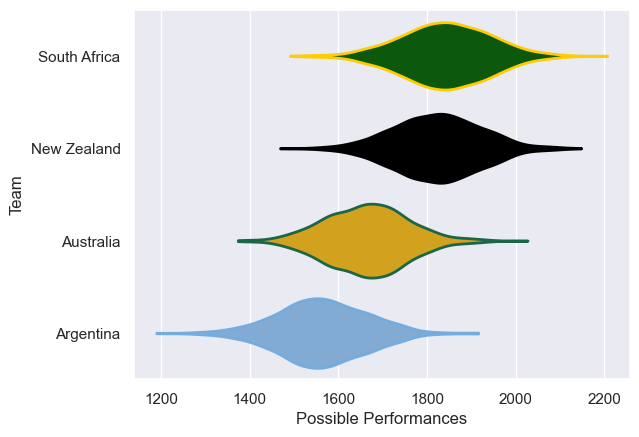
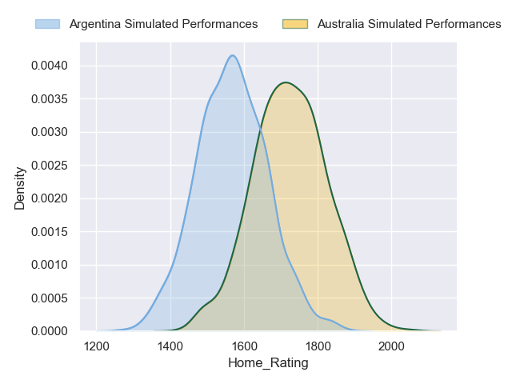
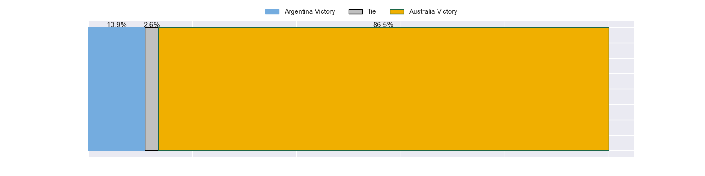
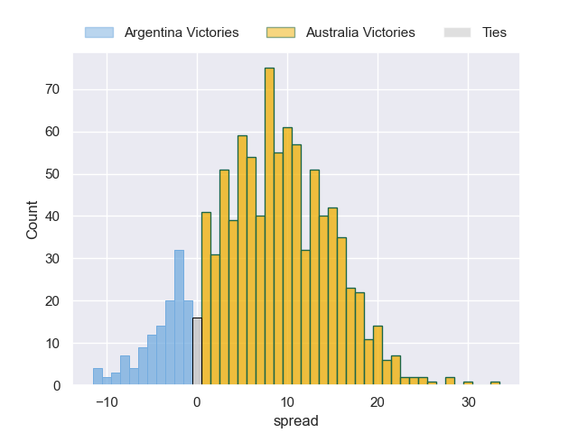

---  
title: "Rugby Championship 2023 Status"  
date: 2023-05-11 6:00:00 -0500  
categories: model review projection  
layout: article  
aside:  
    toc: true  
---
# Current Team Rankings

# Standings

## Projected Total Table

| Club         |   Total Matches |   Wins |   Point Differential |   Losing Bonus Points |   Try Bonus Points |   Competition Points |
|:-------------|----------------:|-------:|---------------------:|----------------------:|-------------------:|---------------------:|
| South Africa |               3 |    2.3 |                 27.6 |                   0.4 |                2.3 |                 12.1 |
| New Zealand  |               3 |    2.3 |                 15.9 |                   0.6 |                2.2 |                 11.8 |
| Australia    |               3 |    1.2 |                 -9.4 |                   0.6 |                1.1 |                  6.4 |
| Argentina    |               3 |    0.2 |                -34.2 |                   0.7 |                0.2 |                  1.8 |

# Future Predictions

## Week 1

### Argentina V New Zealand on 2023/07/08

Average Margin: New Zealand by 9.4

### South Africa V Australia on 2023/07/09

Average Margin: South Africa by 13.0

## Week 2

### Australia V Argentina on 2023/07/15

Average Margin: Australia by 8.0

### New Zealand V South Africa on 2023/07/15

Average Margin: New Zealand by 2.2

## Week 3

### South Africa V Argentina on 2023/07/29

Average Margin: South Africa by 17.3

### Australia V New Zealand on 2023/07/29

Average Margin: New Zealand by 4.7

