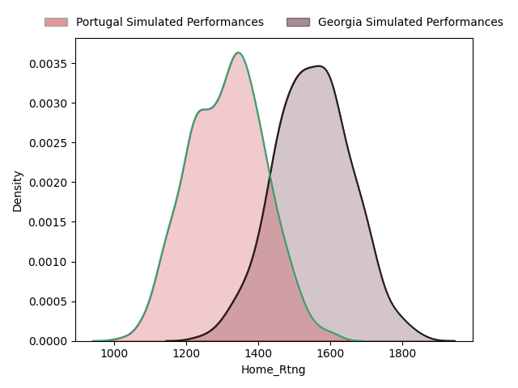
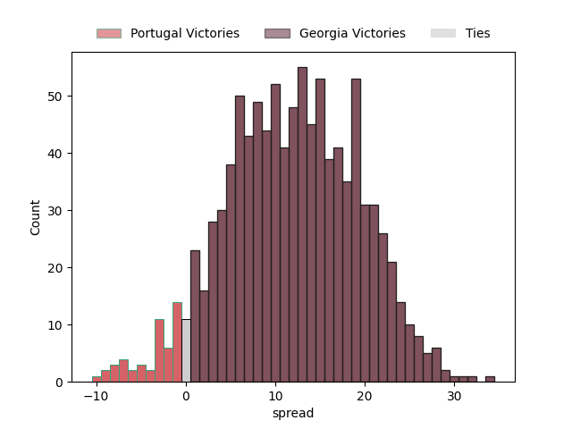
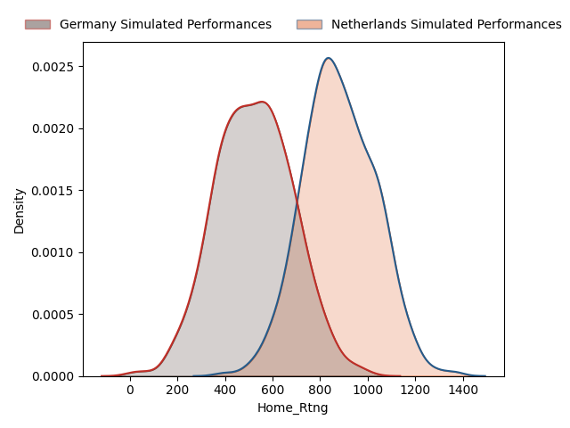
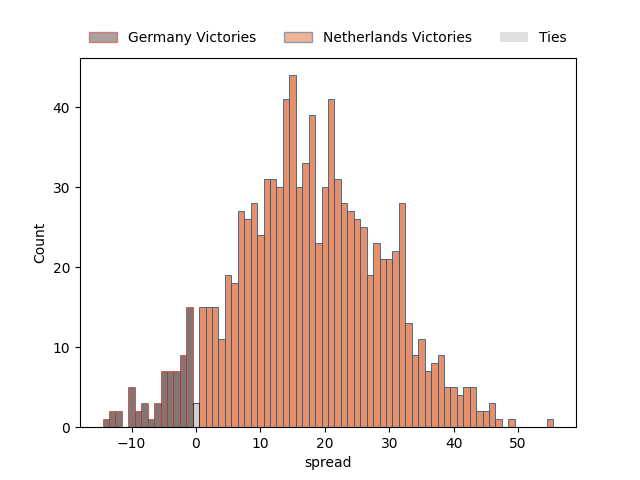
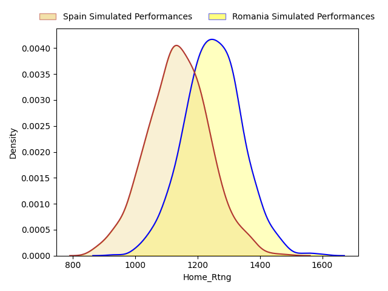
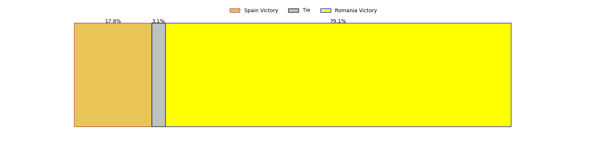
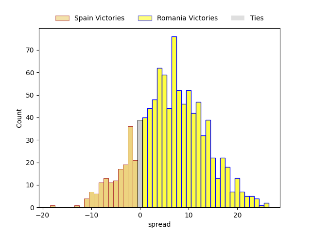
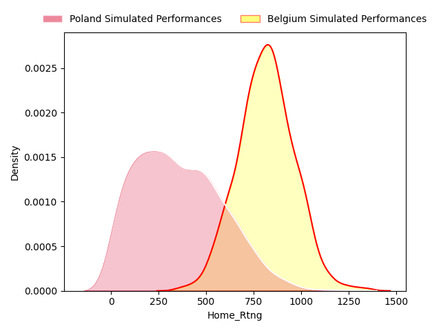
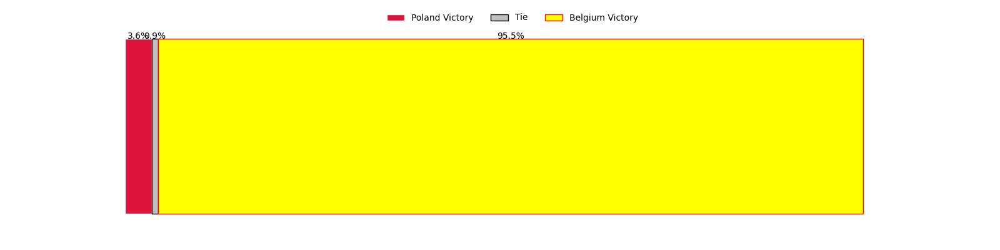
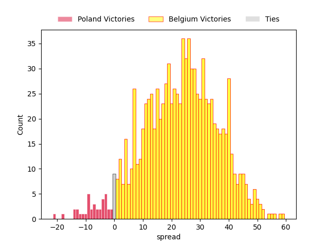

---  
layout: page  
title: Rugby Europe Championship Status  
date:   
categories: model review projection  
---
# Rugby Europe Championship Status

# Completed Match Review

| Match                               |   Result |   Lineup Prediction |   Minutes Prediction |   Club Prediction |
|:------------------------------------|---------:|--------------------:|---------------------:|------------------:|
| Romania V Poland on 2023/02/04      |       40 |                21.9 |                 21.8 |             -13.2 |
| Portugal V Belgium on 2023/02/04    |       37 |                 2.6 |                  3.6 |              22.4 |
| Georgia V Germany on 2023/02/05     |       63 |                12.5 |                 13.4 |              33.1 |
| Spain V Netherlands on 2023/02/05   |        8 |                41.1 |                 44.6 |              37.2 |
| Poland V Portugal on 2023/02/11     |      -62 |                -7.1 |                 -7.5 |              19.4 |
| Netherlands V Georgia on 2023/02/11 |      -32 |               -30.7 |                -31.6 |             -41.1 |
| Belgium V Romania on 2023/02/11     |      -51 |               -23.1 |                -24.5 |             -10.7 |
| Germany V Spain on 2023/02/12       |      -18 |                 1.9 |                  1.3 |             -11.2 |
| Germany V Netherlands on 2023/02/18 |       -4 |               -23.9 |                -20   |              21.4 |
| Spain V Georgia on 2023/02/18       |      -38 |               -27.2 |                -28.5 |              -8.4 |
| Poland V Belgium on 2023/02/18      |        6 |               -21.7 |                -20   |              37.4 |
| Portugal V Romania on 2023/02/19    |       18 |                 4.7 |                  4.8 |               7.2 |
| Netherlands V Belgium on 2023/03/04 |       12 |                -3.8 |                 -5.9 |               1.6 |
| Portugal V Spain on 2023/03/04      |       17 |                47.9 |                 48.8 |              12.6 |
| Georgia V Romania on 2023/03/05     |       24 |                21.5 |                 22.7 |              18.8 |
| Poland V Germany on 2023/03/05      |       -5 |                21.3 |                 19.4 |             -35.6 |
| Poland V Germany on 2023/03/05      |       -5 |                21.3 |                 19.4 |             -35.6 |
| ------ | ------ | ------ | ------ | ------ |
| Average Error |       - | 24.3 | 23.7 | 26.1 |
| Correct Winner |       - | 70.6% | 70.6% | 82.4% |

## Future Club-Level Match Predictions

### Week 5

#### Georgia V Portugal on 2023/03/19

Average Margin: Georgia by 12.6

#### Netherlands V Germany on 2023/03/19

Average Margin: Netherlands by 17.4

#### Romania V Spain on 2023/03/19

Average Margin: Romania by 6.1

#### Belgium V Poland on 2023/03/19

Average Margin: Belgium by 23.6

