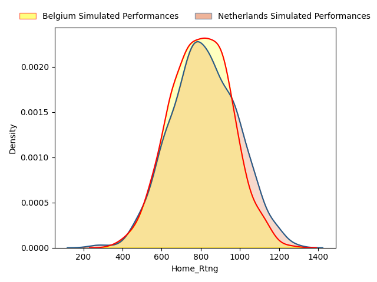
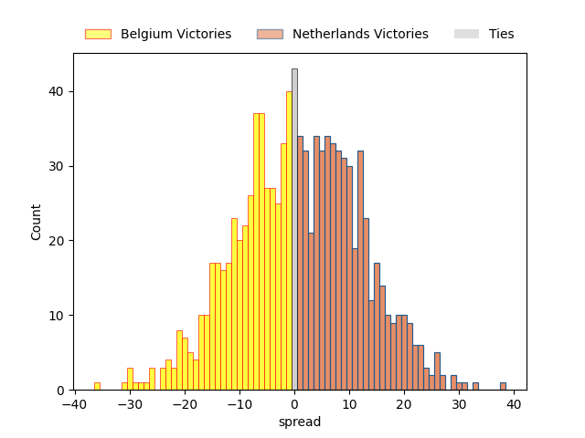

---  
layout: page  
title: Rugby Europe Championship Status  
date:   
categories: model review projection  
---
# Rugby Europe Championship Status

# Completed Match Review

| Match                               |   Result |   Lineup Prediction |   Minutes Prediction |   Club Prediction |
|:------------------------------------|---------:|--------------------:|---------------------:|------------------:|
| Romania V Poland on 2023/02/04      |       40 |                22.7 |                 22.8 |             -13.2 |
| Portugal V Belgium on 2023/02/04    |       37 |                -0.8 |                 -0.1 |              22.4 |
| Georgia V Germany on 2023/02/05     |       63 |                16.3 |                 17.3 |              33.1 |
| Spain V Netherlands on 2023/02/05   |        8 |                40.4 |                 43.8 |              37.2 |
| Poland V Portugal on 2023/02/11     |      -62 |                -5.5 |                 -5.9 |              19.4 |
| Netherlands V Georgia on 2023/02/11 |      -32 |               -31.8 |                -32.6 |             -41.1 |
| Belgium V Romania on 2023/02/11     |      -51 |               -24.4 |                -25.8 |             -10.7 |
| Germany V Spain on 2023/02/12       |      -18 |                 2.9 |                  2.4 |             -11.2 |
| Germany V Netherlands on 2023/02/18 |       -4 |               -34.7 |                -31.3 |              21.4 |
| Spain V Georgia on 2023/02/18       |      -38 |               -17.1 |                -18.3 |              -8.4 |
| Poland V Belgium on 2023/02/18      |        6 |               -21.6 |                -19.9 |              37.4 |
| Portugal V Romania on 2023/02/19    |       18 |                 3.6 |                  3.9 |               7.2 |
| ------ | ------ | ------ | ------ | ------ |
| Average Error |       - | 27.7 | 27.1 | 30.1 |
| Correct Winner |       - | 75.0% | 75.0% | 75.0% |

## Future Club-Level Match Predictions

### Week 4

#### Portugal V Spain on 2023/03/04

Average Margin: Portugal by 11.5

#### Georgia V Romania on 2023/03/05

Average Margin: Georgia by 17.3

#### Netherlands V Belgium on 2023/03/04

Average Margin: Netherlands by 0.9

#### Poland V Germany on 2023/03/05

Average Margin: Germany by 35.9

