---  
layout: page  
title:  2022 Status  
date:   
categories: model review projection  
---
#  2022 Status

# Completed Match Review

| Match                            |   Result |   Lineup Prediction |   Minutes Prediction |   Club Prediction |
|:---------------------------------|---------:|--------------------:|---------------------:|------------------:|
| Wales V Ireland on 2023/02/04    |      -24 |               -22.2 |                -24.1 |             -11.1 |
| England V Scotland on 2023/02/04 |       -6 |               -14.2 |                -11.7 |               4.8 |
| Italy V France on 2023/02/05     |       -5 |               -17.2 |                -16   |             -10.7 |
| Ireland V France on 2023/02/11   |       13 |                22.5 |                 23.7 |               7.5 |
| Scotland V Wales on 2023/02/11   |       28 |                16.1 |                 18.4 |              10.6 |
| England V Italy on 2023/02/12    |       17 |                14   |                 15.5 |              13.4 |
|
| Average Error |       - | 7.8 | 6.4 | 9.3 |
| Correct Winner |       - | 100.0% | 100.0% | 83.3% |
## Future Match Predictions

### Week 3

#### Italy V Ireland on 2023/02/25

Average Margin: Ireland by 15.8

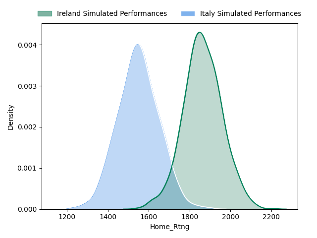

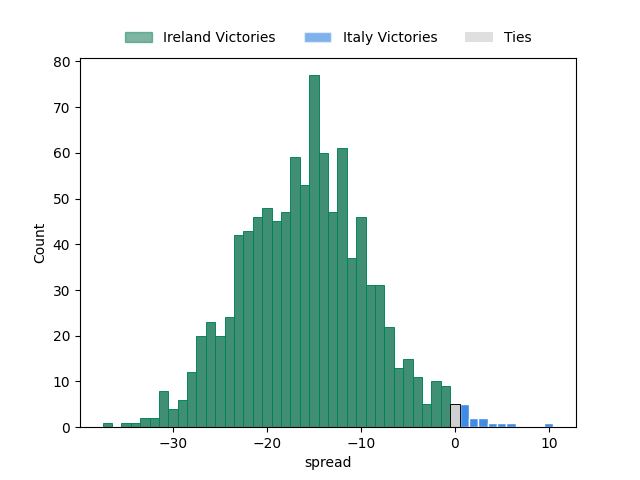

#### Wales V England on 2023/02/25

Average Margin: England by 3.4

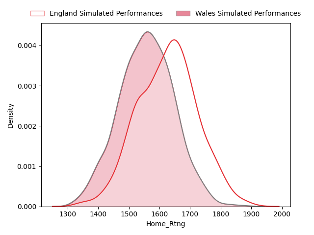
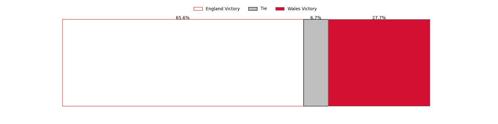
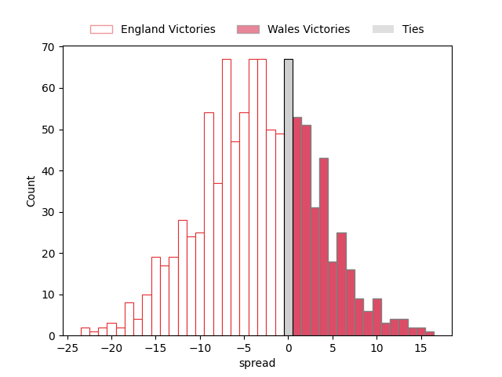

#### France V Scotland on 2023/02/26

Average Margin: France by 6.4

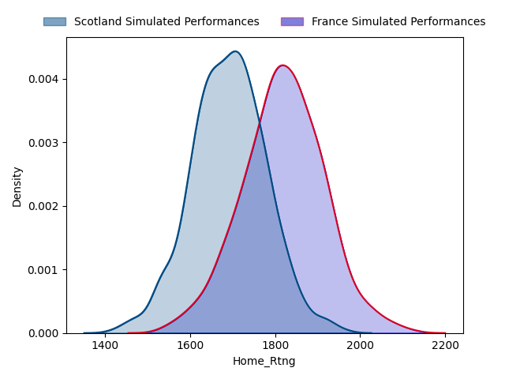
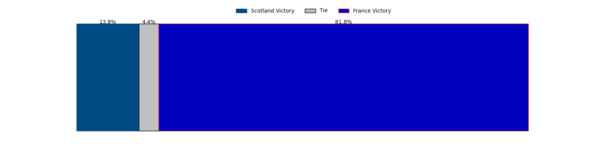
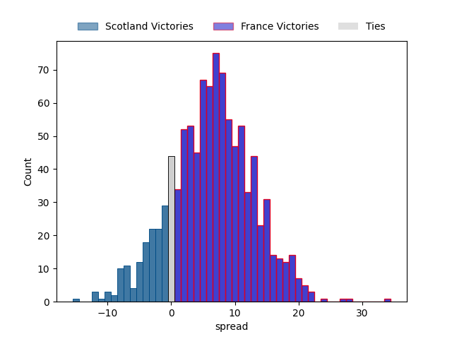

### Week 4

#### Italy V Wales on 2023/03/11

Average Margin: Italy by 2.8

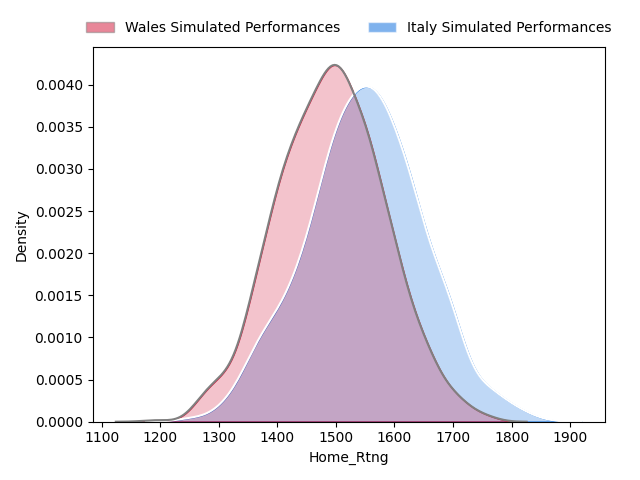

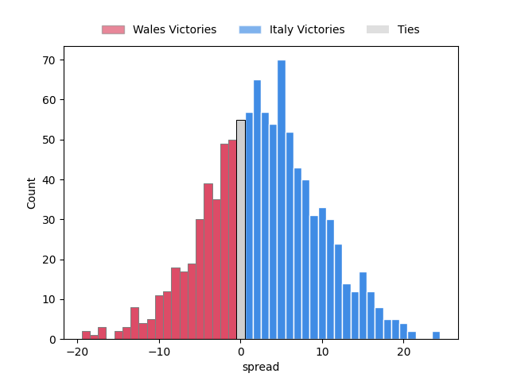

#### England V France on 2023/03/11

Average Margin: France by 2.5

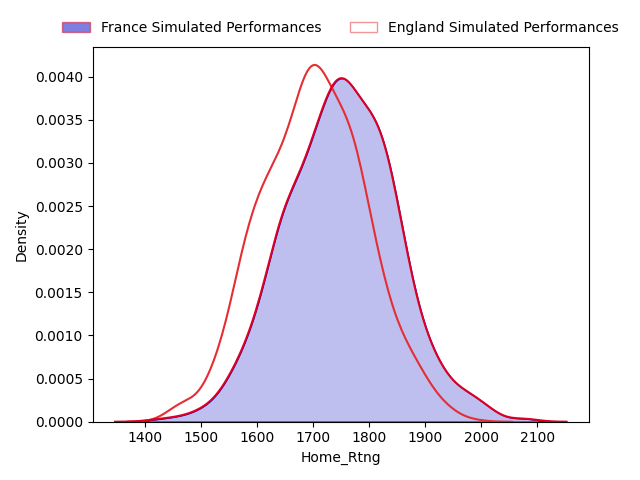
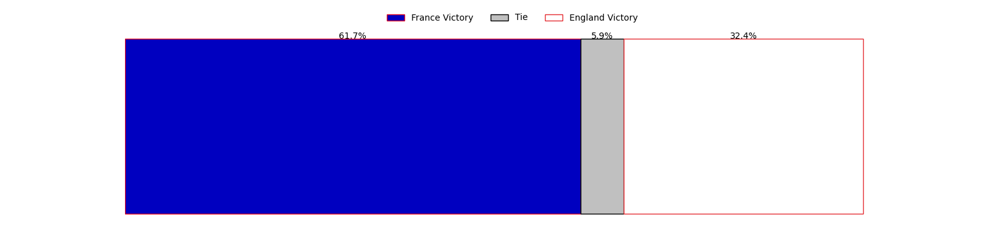
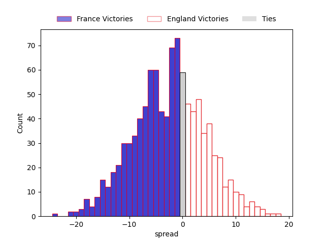

#### Scotland V Ireland on 2023/03/12

Average Margin: Ireland by 5.4

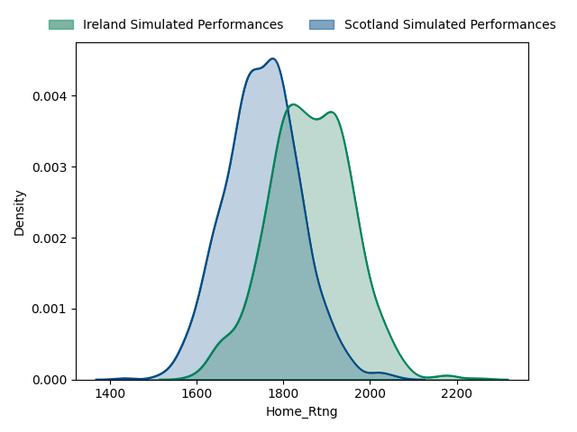
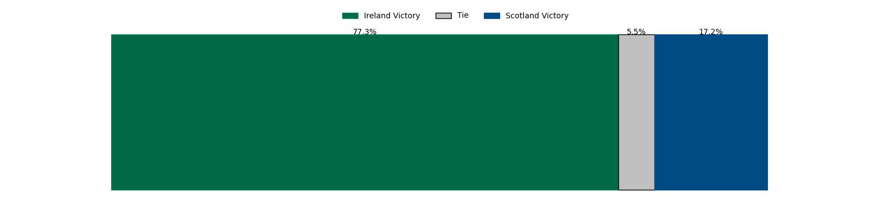
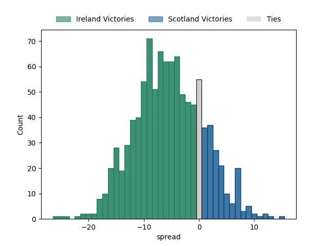

### Week 5

#### Scotland V Italy on 2023/03/18

Average Margin: Scotland by 13.7

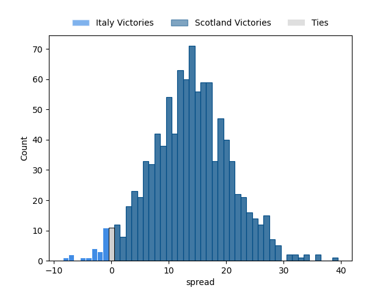

#### France V Wales on 2023/03/18

Average Margin: France by 16.6

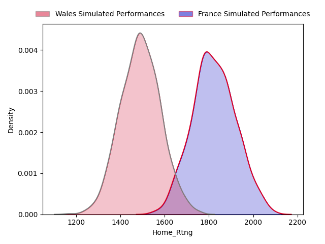
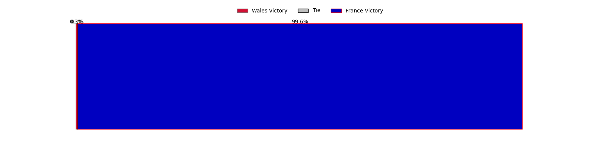
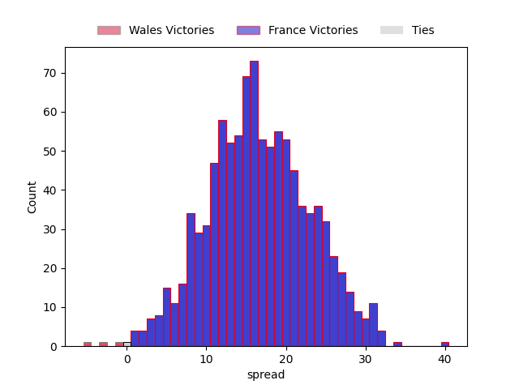

#### Ireland V England on 2023/03/18

Average Margin: Ireland by 15.0

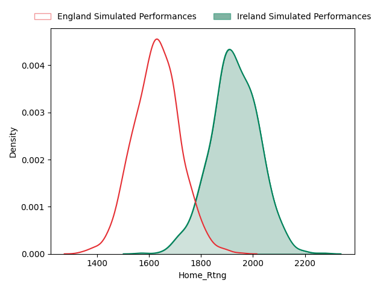

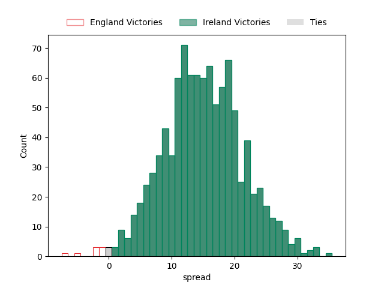

