---  
layout: page  
title: Six Nations Championship Status  
date:   
categories: model review projection  
---
# Six Nations Championship Status

# Completed Match Review

| Match                            |   Result |   Lineup Prediction |   Minutes Prediction |   Club Prediction |
|:---------------------------------|---------:|--------------------:|---------------------:|------------------:|
| Wales V Ireland on 2023/02/04    |      -24 |               -18.6 |                -20.5 |             -10.1 |
| England V Scotland on 2023/02/04 |       -6 |                -8.7 |                 -6   |               6.3 |
| Italy V France on 2023/02/05     |       -5 |               -16.1 |                -15.3 |             -10.7 |
| Ireland V France on 2023/02/11   |       13 |                27.4 |                 31.8 |               7.5 |
| Scotland V Wales on 2023/02/11   |       28 |                25.2 |                 27.3 |               9.5 |
| England V Italy on 2023/02/12    |       17 |                17.3 |                 18.2 |              14.9 |
| ------ | ------ | ------ | ------ | ------ |
| Average Error |       - | 6.1 | 5.8 | 9.7 |
| Correct Winner |       - | 100.0% | 100.0% | 83.3% |

## Future Club-Level Match Predictions

### Week 3

#### France V Scotland on 2023/02/26

Average Margin: France by 6.5

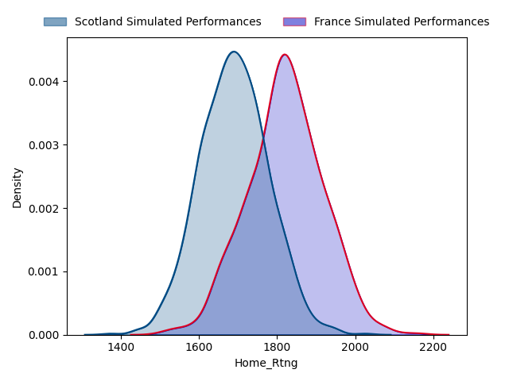
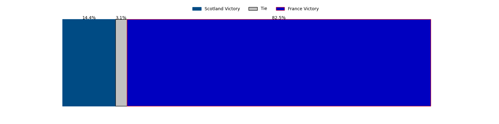
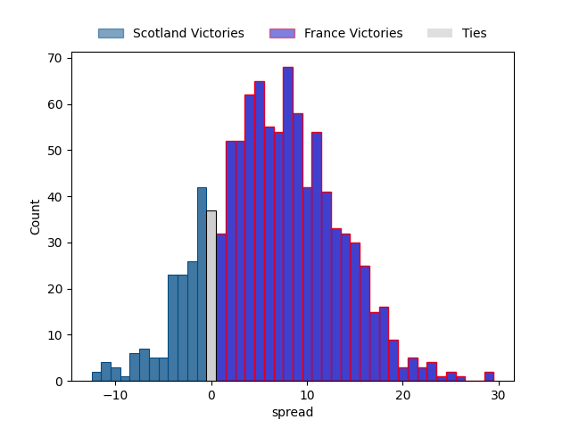

### Week 4

#### Italy V Wales on 2023/03/11

Average Margin: Italy by 2.3

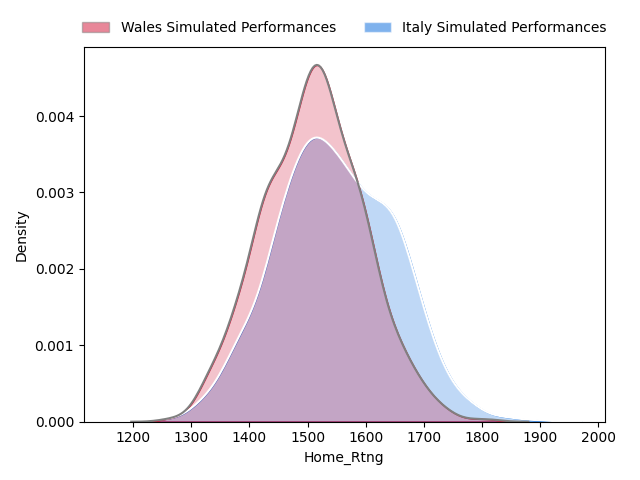

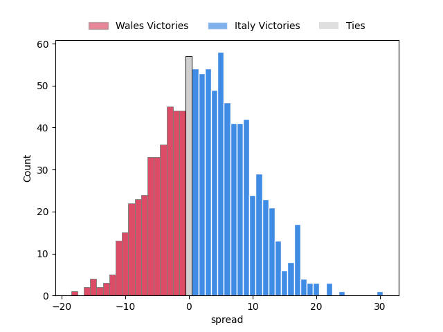

#### England V France on 2023/03/11

Average Margin: France by 1.5

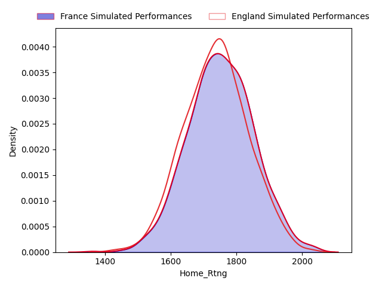

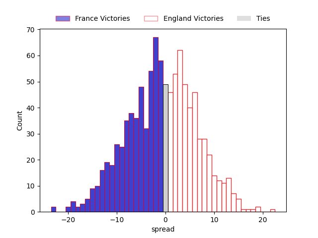

#### Scotland V Ireland on 2023/03/12

Average Margin: Ireland by 5.2

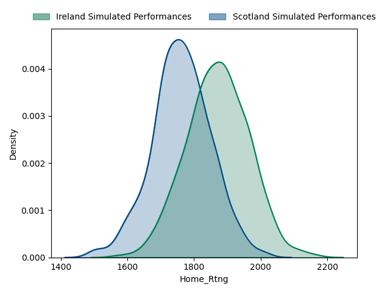

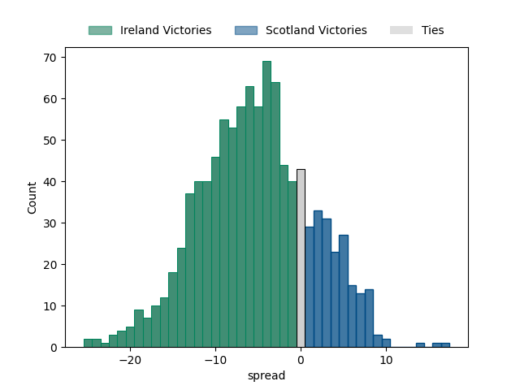

### Week 5

#### Scotland V Italy on 2023/03/18

Average Margin: Scotland by 13.9

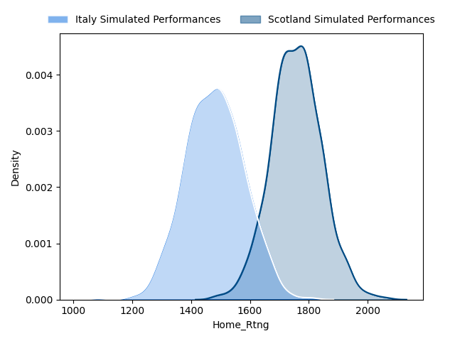

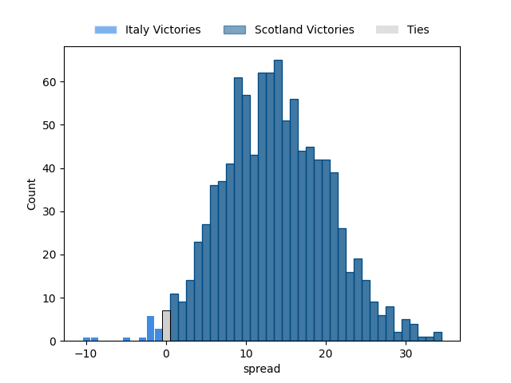

#### France V Wales on 2023/03/18

Average Margin: France by 15.6

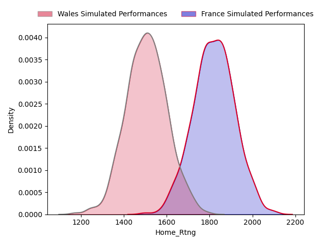
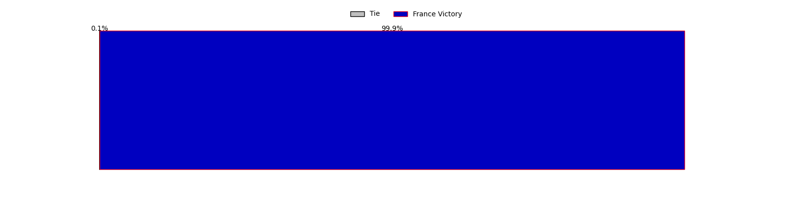
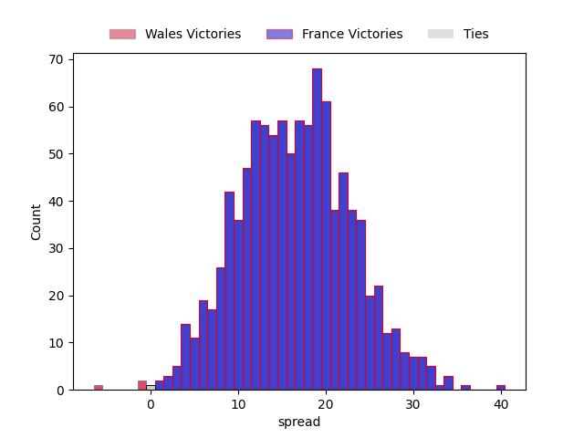

#### Ireland V England on 2023/03/18

Average Margin: Ireland by 14.0

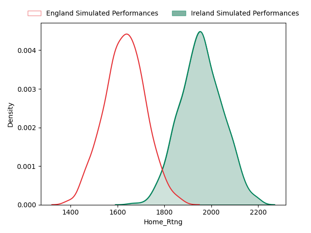
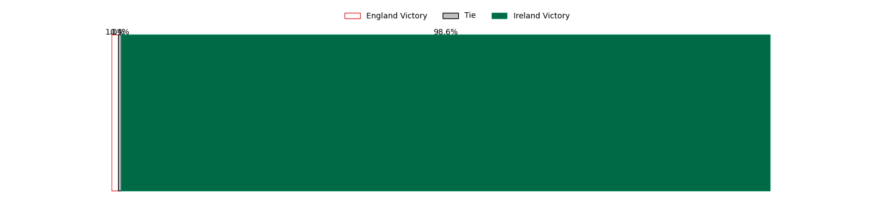
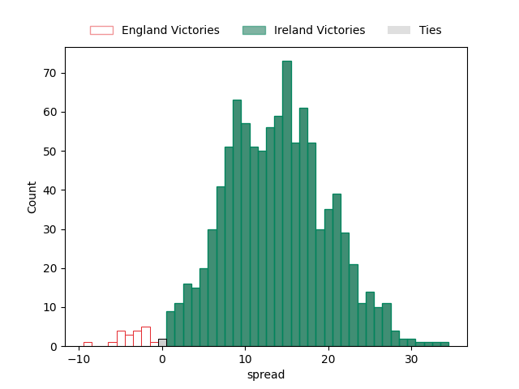

