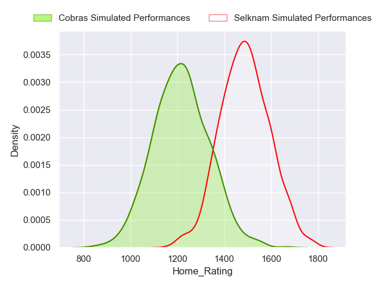
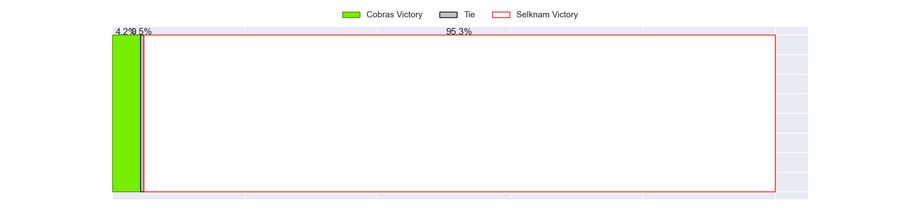
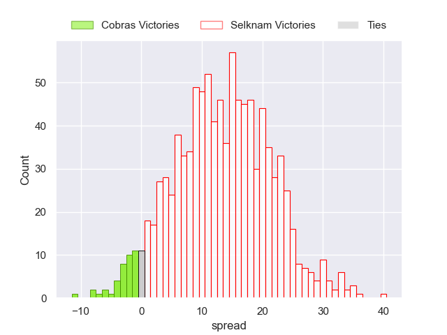

---  
title: "Super Rugby Americas Status"  
date: 2023-04-28 6:00:00 -0500  
categories: model review projection  
layout: article  
aside:  
    toc: true  
---
# Current Team Rankings

# Standings

## Current Standings

| Club             |   Played |   Wins |   Point Differential |   Losing Bonus Points |   Try Bonus Points |   Competition Points |
|:-----------------|---------:|-------:|---------------------:|----------------------:|-------------------:|---------------------:|
| Dogos XV         |        9 |      7 |                   76 |                     1 |                  7 |                   36 |
| Penarol Rugby    |        8 |      7 |                  128 |                     1 |                  6 |                   35 |
| Pampas XV        |        8 |      6 |                  143 |                     0 |                  3 |                   27 |
| Selknam          |        7 |      3 |                   40 |                     2 |                nan |                   17 |
| Cobras           |       10 |      3 |                 -107 |                     1 |                  4 |                   17 |
| Yacare XV        |        8 |      3 |                  -62 |                     1 |                nan |                   15 |
| American Raptors |       10 |      1 |                 -218 |                     2 |                  3 |                    9 |

## Projected Remaining Table

| Club             |   Matches Remaining |   Wins |   Point Differential |   Losing Bonus Points |   Try Bonus Points |   Competition Points |
|:-----------------|--------------------:|-------:|---------------------:|----------------------:|-------------------:|---------------------:|
| Penarol Rugby    |                   4 |    3.8 |                 80.7 |                   0.1 |                3.8 |                 19.2 |
| Pampas XV        |                   5 |    3.5 |                 49.4 |                   0.6 |                3.4 |                 18   |
| Dogos XV         |                   4 |    3.1 |                 47.5 |                   0.5 |                3   |                 15.7 |
| Selknam          |                   5 |    2.5 |                  4.1 |                   0.7 |                2.5 |                 13.1 |
| Cobras           |                   4 |    1   |                -48.1 |                   0.3 |                1   |                  5.2 |
| American Raptors |                   4 |    0.6 |                -67.7 |                   0.5 |                0.7 |                  3.6 |
| Yacare XV        |                   4 |    0.5 |                -66   |                   0.5 |                0.5 |                  3.1 |

## Projected Total Table

| Club             |   Total Matches |   Wins |   Point Differential |   Losing Bonus Points |   Try Bonus Points |   Competition Points |
|:-----------------|----------------:|-------:|---------------------:|----------------------:|-------------------:|---------------------:|
| Penarol Rugby    |              12 |   10.8 |                208.7 |                   1.1 |                9.8 |                 54.2 |
| Dogos XV         |              13 |   10.1 |                123.5 |                   1.5 |               10   |                 51.7 |
| Pampas XV        |              13 |    9.5 |                192.4 |                   0.6 |                6.4 |                 45   |
| Selknam          |              12 |    5.5 |                 44.1 |                   2.7 |                2.5 |                 30.1 |
| Cobras           |              14 |    4   |               -155.1 |                   1.3 |                5   |                 22.2 |
| Yacare XV        |              12 |    3.5 |               -128   |                   1.5 |                0.5 |                 18.1 |
| American Raptors |              14 |    1.6 |               -285.7 |                   2.5 |                3.7 |                 12.6 |

# Completed Match Review

| Model | Percent Correct Predictions | Spread Error |
| ------ | ------ | ------ |
| Club Level | 74.1% | 12.4 |
| Player Level: Lineup | 53.8% | 16.0 |
| Player Level: Minutes | 50.0% | 16.9 |

# Future Predictions

## Week 8

### Pampas XV V Cobras on 2023/04/28

Average Margin: Pampas XV by 21.1

### Selknam V Dogos XV on 2023/04/29

Average Margin: Dogos XV by 1.7

### American Raptors V Penarol Rugby on 2023/04/30

Average Margin: Penarol Rugby by 29.1

## Week 9

### Dogos XV V Pampas XV on 2023/05/05

Average Margin: Dogos XV by 0.6

### Selknam V Cobras on 2023/05/06

Average Margin: Selknam by 13.3

### American Raptors V Yacare XV on 2023/05/07

Average Margin: American Raptors by 0.9

## Week 10

### Yacare XV V Dogos XV on 2023/05/12

Average Margin: Dogos XV by 18.0

### Pampas XV V Selknam on 2023/05/12

Average Margin: Pampas XV by 10.6

### Penarol Rugby V Cobras on 2023/05/12

Average Margin: Penarol Rugby by 26.6

## Week 11

### Penarol Rugby V Pampas XV on 2023/05/19

Average Margin: Penarol Rugby by 8.9

### Selknam V Yacare XV on 2023/05/20

Average Margin: Selknam by 19.8

### Dogos XV V American Raptors on 2023/05/21

Average Margin: Dogos XV by 27.6

## Week 12

### Pampas XV V Yacare XV on 2023/05/26

Average Margin: Pampas XV by 27.8

### Penarol Rugby V Selknam on 2023/05/26

Average Margin: Penarol Rugby by 16.6

### Cobras V American Raptors on 2023/05/27

Average Margin: Cobras by 12.3

