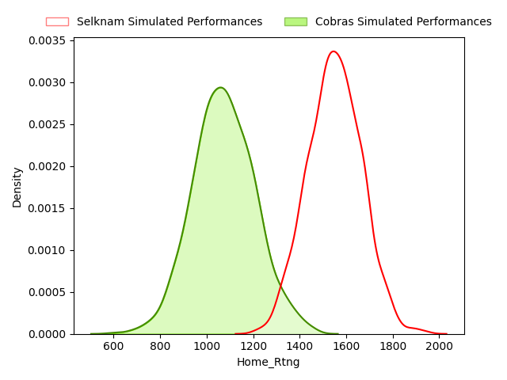
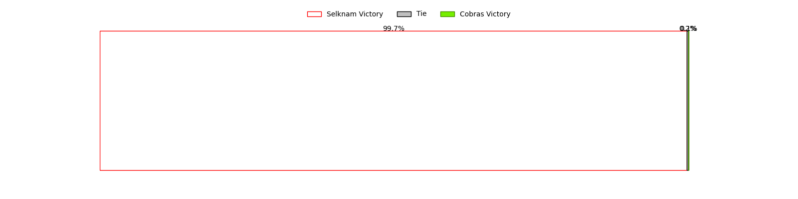
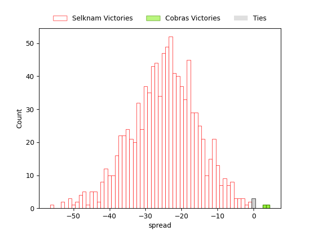
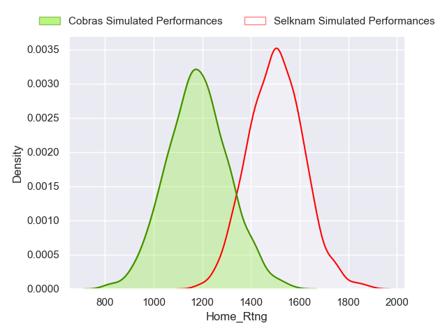
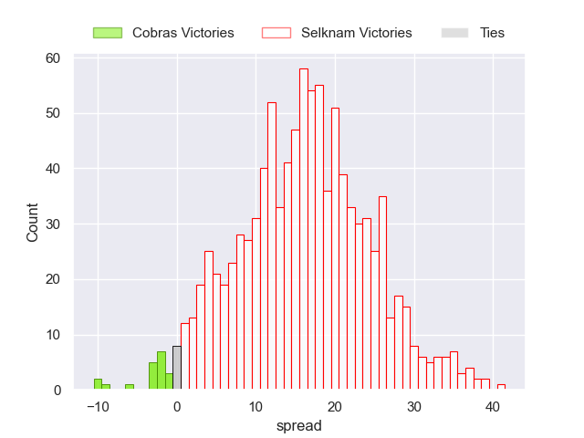

---  
layout: page  
title: Super Rugby Americas Status  
date:   
categories: model review projection  
---
# Super Rugby Americas Status

# Completed Match Review

| Match                                          |   Result |   Lineup Prediction |   Minutes Prediction |   Club Prediction |
|:-----------------------------------------------|---------:|--------------------:|---------------------:|------------------:|
| Dogos XV V Yacare XV on 2023/02/17             |        6 |                81.5 |                 87.4 |               4.5 |
| Selknam V American Raptors on 2023/02/18       |       35 |                 6.8 |                  7.6 |               5.8 |
| Cobras V Pampas XV on 2023/02/19               |      -20 |                -5.5 |                 -7.4 |             -17   |
| Penarol Rugby V American Raptors on 2023/02/25 |        9 |                31.2 |                 34.1 |               5.9 |
| Selknam V Pampas XV on 2023/02/25              |       14 |                 3.3 |                  3.5 |               5.8 |
| Cobras V Dogos XV on 2023/02/26                |      -17 |                86.9 |                 93.7 |             -17   |
| Pampas XV V American Raptors on 2023/03/03     |       11 |                -2.6 |                 -2.6 |              12.5 |
| Dogos XV V Penarol Rugby on 2023/03/04         |       -6 |                15.7 |                 13.6 |               6.2 |
| Dogos XV V Penarol Rugby on 2023/03/04         |       -6 |                15.7 |                 13.6 |               6.2 |
| Cobras V Yacare XV on 2023/03/05               |      -20 |               -36.4 |                -31.4 |             -15   |
| Cobras V Yacare XV on 2023/03/05               |      -20 |               -36.4 |                -31.4 |             -15   |
| Dogos XV V Selknam on 2023/03/10               |       14 |               -18.3 |                -18.7 |               4.1 |
| Penarol Rugby V Cobras on 2023/03/11           |       26 |                26.3 |                 24.3 |              30.1 |
| ------ | ------ | ------ | ------ | ------ |
| Average Error |       - | 29.0 | 29.1 | 7.3 |
| Correct Winner |       - | 61.5% | 61.5% | 84.6% |

## Future Club-Level Match Predictions

### Week 4

#### Yacare XV V American Raptors on 2023/03/12

Average Margin: Yacare XV by 18.5

### Week 5

#### Penarol Rugby V Yacare XV on 2023/03/17

Average Margin: Penarol Rugby by 7.6

#### Pampas XV V Dogos XV on 2023/03/17

Average Margin: Pampas XV by 2.5

#### Cobras V Selknam on 2023/03/19

Average Margin: Selknam by 24.7

### Week 6

#### Yacare XV V Pampas XV on 2023/03/24

Average Margin: Yacare XV by 9.4

#### Selknam V Penarol Rugby on 2023/03/25

Average Margin: Selknam by 1.0

#### American Raptors V Dogos XV on 2023/03/26

Average Margin: Dogos XV by 5.2

### Week 7

#### Pampas XV V Penarol Rugby on 2023/03/31

Average Margin: Penarol Rugby by 5.9

#### Yacare XV V Selknam on 2023/04/01

Average Margin: Yacare XV by 1.1

#### American Raptors V Cobras on 2023/04/02

Average Margin: American Raptors by 16.5

### Week 8

#### Dogos XV V Cobras on 2023/04/14

Average Margin: Dogos XV by 24.9

#### Yacare XV V Selknam on 2023/04/15

Average Margin: Yacare XV by 1.1

#### American Raptors V Pampas XV on 2023/04/16

Average Margin: Pampas XV by 5.1

### Week 9

#### Penarol Rugby V Dogos XV on 2023/04/21

Average Margin: Penarol Rugby by 12.5

#### American Raptors V Selknam on 2023/04/22

Average Margin: Selknam by 11.0

#### Yacare XV V Cobras on 2023/04/23

Average Margin: Yacare XV by 29.7

### Week 10

#### Pampas XV V Cobras on 2023/04/28

Average Margin: Pampas XV by 25.2

#### Selknam V Dogos XV on 2023/04/29

Average Margin: Selknam by 10.3

#### American Raptors V Penarol Rugby on 2023/04/30

Average Margin: Penarol Rugby by 13.9

### Week 11

#### Dogos XV V Pampas XV on 2023/05/05

Average Margin: Dogos XV by 3.4

#### Selknam V Cobras on 2023/05/06

Average Margin: Selknam by 30.5

#### American Raptors V Yacare XV on 2023/05/07

Average Margin: Yacare XV by 8.2

### Week 12

#### Pampas XV V Selknam on 2023/05/12

Average Margin: Selknam by 3.4

#### Penarol Rugby V Cobras on 2023/05/12

Average Margin: Penarol Rugby by 33.3

#### Yacare XV V Dogos XV on 2023/05/12

Average Margin: Yacare XV by 6.7

### Week 13

#### Penarol Rugby V Pampas XV on 2023/05/19

Average Margin: Penarol Rugby by 12.3

#### Selknam V Yacare XV on 2023/05/20

Average Margin: Selknam by 5.7

#### Dogos XV V American Raptors on 2023/05/21

Average Margin: Dogos XV by 10.8

### Week 14

#### Pampas XV V Yacare XV on 2023/05/26

Average Margin: Yacare XV by 0.4

#### Penarol Rugby V Selknam on 2023/05/26

Average Margin: Penarol Rugby by 5.4

#### Cobras V American Raptors on 2023/05/27

Average Margin: American Raptors by 9.9

