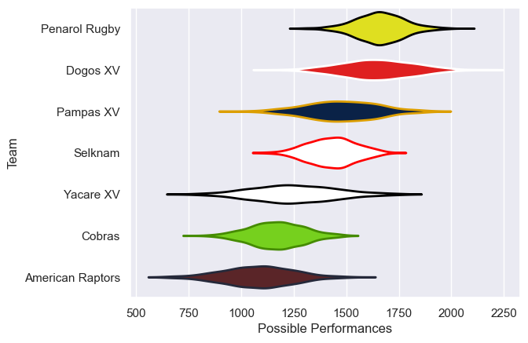

---  
title: "Super Rugby Americas 2022 Status"  
date: 2023-05-18 6:00:00 -0500  
categories: model review projection  
layout: article  
aside:  
    toc: true  
---
# Current Team Rankings

# Standings

## Current Standings

| Club             |   Played |   Wins |   Point Differential |   Losing Bonus Points |   Try Bonus Points |   Competition Points |
|:-----------------|---------:|-------:|---------------------:|----------------------:|-------------------:|---------------------:|
| Dogos XV         |        5 |      4 |                   49 |                     1 |                  4 |                   21 |
| Penarol Rugby    |        3 |      3 |                   41 |                     0 |                  2 |                   14 |
| Yacare XV        |        3 |      2 |                   36 |                     1 |                  1 |                   10 |
| Selknam          |        3 |      2 |                   35 |                     0 |                  2 |                   10 |
| Pampas XV        |        4 |      2 |                   -1 |                     0 |                  1 |                    9 |
| American Raptors |        4 |      0 |                  -77 |                     0 |                  0 |                    0 |
| Cobras           |        4 |      0 |                  -83 |                     0 |                  0 |                    0 |

## Projected Remaining Table

| Club             |   Matches Remaining |   Wins |   Point Differential |   Losing Bonus Points |   Try Bonus Points |   Competition Points |
|:-----------------|--------------------:|-------:|---------------------:|----------------------:|-------------------:|---------------------:|
| Penarol Rugby    |                   2 |    1.5 |                 19.2 |                   0.3 |                1.4 |                  7.8 |
| Yacare XV        |                   2 |    1.1 |                  5.7 |                   0.3 |                1.1 |                  5.9 |
| Selknam          |                   2 |    0.9 |                  0.7 |                   0.5 |                0.9 |                  5.2 |
| Dogos XV         |                   1 |    1   |                 22.7 |                   0   |                1   |                  4.9 |
| American Raptors |                   2 |    0.8 |                -16.6 |                   0.1 |                0.8 |                  4.1 |
| Pampas XV        |                   2 |    0.4 |                -25.6 |                   0.2 |                0.4 |                  2.4 |
| Cobras           |                   1 |    0.2 |                 -6   |                   0.3 |                0.3 |                  1.5 |

## Projected Total Table

| Club             |   Total Matches |   Wins |   Point Differential |   Losing Bonus Points |   Try Bonus Points |   Competition Points |
|:-----------------|----------------:|-------:|---------------------:|----------------------:|-------------------:|---------------------:|
| Dogos XV         |               6 |    5   |                 71.7 |                   1   |                5   |                 25.9 |
| Penarol Rugby    |               5 |    4.5 |                 60.2 |                   0.3 |                3.4 |                 21.8 |
| Yacare XV        |               5 |    3.1 |                 41.7 |                   1.3 |                2.1 |                 15.9 |
| Selknam          |               5 |    2.9 |                 35.7 |                   0.5 |                2.9 |                 15.2 |
| Pampas XV        |               6 |    2.4 |                -26.6 |                   0.2 |                1.4 |                 11.4 |
| American Raptors |               6 |    0.8 |                -93.6 |                   0.1 |                0.8 |                  4.1 |
| Cobras           |               5 |    0.2 |                -89   |                   0.3 |                0.3 |                  1.5 |

# Completed Match Review

| Model | Percent Correct Predictions | Spread Error |
| ------ | ------ | ------ |
| Club Level | 92.3% | 7.7 |
| Player Level: Lineup | 66.7% | 29.8 |
| Player Level: Minutes | 66.7% | 30.3 |

# Future Predictions

## Week 6

### Penarol Rugby V Pampas XV on 2023/05/19

Average Margin: Penarol Rugby by 17.4

### Selknam V Yacare XV on 2023/05/20

Average Margin: Selknam by 2.9

### Dogos XV V American Raptors on 2023/05/21

Average Margin: Dogos XV by 23.2

## Week 7

### Pampas XV V Yacare XV on 2023/05/26

Average Margin: Yacare XV by 8.6

### Penarol Rugby V Selknam on 2023/05/26

Average Margin: Penarol Rugby by 2.2

### Cobras V American Raptors on 2023/05/27

Average Margin: American Raptors by 6.2

