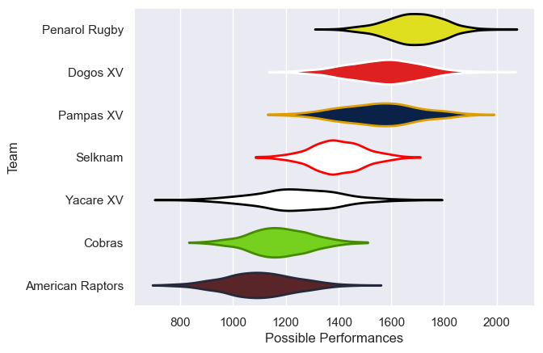

---  
title: "Super Rugby Americas 2023 Status"  
date: 2023-05-11 6:00:00 -0500  
categories: model review projection  
layout: article  
aside:  
    toc: true  
---
# Current Team Rankings

# Standings

## Current Standings

| Club             |   Played |   Wins |   Point Differential |   Losing Bonus Points |   Try Bonus Points |   Competition Points |
|:-----------------|---------:|-------:|---------------------:|----------------------:|-------------------:|---------------------:|
| Penarol Rugby    |        9 |      8 |                  141 |                     1 |                  7 |                   40 |
| Dogos XV         |       10 |      8 |                   73 |                     1 |                  7 |                   40 |
| Pampas XV        |        9 |      6 |                   99 |                     1 |                  3 |                   28 |
| Yacare XV        |        8 |      4 |                  -29 |                     1 |                  3 |                   20 |
| Selknam          |        8 |      3 |                   22 |                     2 |                  4 |                   18 |
| Cobras           |       10 |      2 |                 -134 |                     1 |                  2 |                   11 |
| American Raptors |       10 |      1 |                 -172 |                     2 |                  4 |                   10 |

## Projected Remaining Table

| Club             |   Matches Remaining |   Wins |   Point Differential |   Losing Bonus Points |   Try Bonus Points |   Competition Points |
|:-----------------|--------------------:|-------:|---------------------:|----------------------:|-------------------:|---------------------:|
| Penarol Rugby    |                   3 |    2.9 |                 56.9 |                   0.1 |                2.8 |                 14.4 |
| Pampas XV        |                   3 |    2   |                 18.3 |                   0.3 |                1.9 |                 10.2 |
| Dogos XV         |                   2 |    1.9 |                 40.3 |                   0.1 |                1.9 |                  9.6 |
| Selknam          |                   3 |    1   |                -17.4 |                   0.4 |                1   |                  5.3 |
| Cobras           |                   2 |    0.8 |                -21.6 |                   0.2 |                0.8 |                  4   |
| Yacare XV        |                   3 |    0.2 |                -42.7 |                   0.5 |                0.2 |                  1.7 |
| American Raptors |                   2 |    0.2 |                -33.3 |                   0.3 |                0.3 |                  1.5 |

## Projected Total Table

| Club             |   Total Matches |   Wins |   Point Differential |   Losing Bonus Points |   Try Bonus Points |   Competition Points |
|:-----------------|----------------:|-------:|---------------------:|----------------------:|-------------------:|---------------------:|
| Penarol Rugby    |              12 |   10.9 |                197.9 |                   1.1 |                9.8 |                 54.4 |
| Dogos XV         |              12 |    9.9 |                113.3 |                   1.1 |                8.9 |                 49.6 |
| Pampas XV        |              12 |    8   |                117.3 |                   1.3 |                4.9 |                 38.2 |
| Selknam          |              11 |    4   |                  4.6 |                   2.4 |                5   |                 23.3 |
| Yacare XV        |              11 |    4.2 |                -71.7 |                   1.5 |                3.2 |                 21.7 |
| Cobras           |              12 |    2.8 |               -155.6 |                   1.2 |                2.8 |                 15   |
| American Raptors |              12 |    1.2 |               -205.3 |                   2.3 |                4.3 |                 11.5 |

# Completed Match Review

| Model | Percent Correct Predictions | Spread Error |
| ------ | ------ | ------ |
| Club Level | 75.0% | 10.6 |
| Player Level: Lineup | 62.5% | 14.3 |
| Player Level: Minutes | 53.1% | 15.4 |

# Future Predictions

## Week 11

### Penarol Rugby V Cobras on 2023/05/12

Average Margin: Penarol Rugby by 28.9

### Yacare XV V Dogos XV on 2023/05/12

Average Margin: Dogos XV by 13.8

### Pampas XV V Selknam on 2023/05/12

Average Margin: Pampas XV by 10.9

## Week 12

### Penarol Rugby V Pampas XV on 2023/05/19

Average Margin: Penarol Rugby by 10.6

### Selknam V Yacare XV on 2023/05/20

Average Margin: Selknam by 11.1

### Dogos XV V American Raptors on 2023/05/21

Average Margin: Dogos XV by 27.0

## Week 13

### Pampas XV V Yacare XV on 2023/05/26

Average Margin: Pampas XV by 18.2

### Penarol Rugby V Selknam on 2023/05/26

Average Margin: Penarol Rugby by 17.9

### Cobras V American Raptors on 2023/05/27

Average Margin: Cobras by 6.8

