---  
title: "Super Rugby Pacific Status"  
date: 2023-04-28 6:00:00 -0500  
categories: model review projection  
layout: article  
aside:  
    toc: true  
---
# Current Team Rankings

# Standings

## Current Standings

| Club                     |   Played |   Wins |   Point Differential |   Losing Bonus Points |   Try Bonus Points |   Competition Points |
|:-------------------------|---------:|-------:|---------------------:|----------------------:|-------------------:|---------------------:|
| Chiefs                   |        8 |      8 |                  150 |                     0 |                  4 |                   36 |
| Brumbies                 |        9 |      7 |                   67 |                     1 |                  3 |                   32 |
| Hurricanes               |        9 |      7 |                  117 |                     1 |                  2 |                   31 |
| Crusaders                |        8 |      6 |                   85 |                     1 |                  3 |                   28 |
| Blues                    |        8 |      5 |                  112 |                     3 |                  3 |                   26 |
| New South Wales Waratahs |        9 |      3 |                  -28 |                     3 |                  2 |                   17 |
| Queensland Reds          |        8 |      3 |                  -21 |                     2 |                  1 |                   15 |
| Highlanders              |        9 |      3 |                  -58 |                     1 |                  2 |                   15 |
| Western Force            |        8 |      3 |                  -72 |                     1 |                  0 |                   13 |
| Fijian Drua              |        8 |      3 |                 -100 |                     1 |                  0 |                   13 |
| Melbourne Rebels         |        8 |      2 |                  -82 |                     2 |                  0 |                   10 |
| Moana Pasifika           |        8 |      0 |                 -170 |                     2 |                  0 |                    2 |

## Projected Remaining Table

| Club                     |   Matches Remaining |   Wins |   Point Differential |   Losing Bonus Points |   Try Bonus Points |   Competition Points |
|:-------------------------|--------------------:|-------:|---------------------:|----------------------:|-------------------:|---------------------:|
| Chiefs                   |                   6 |    5.2 |                 57.4 |                   0.7 |                5.1 |                 26.7 |
| Blues                    |                   6 |    5.1 |                 71.3 |                   0.6 |                5   |                 25.8 |
| Crusaders                |                   6 |    4.7 |                 61.5 |                   0.9 |                4.5 |                 24.3 |
| Brumbies                 |                   5 |    4.3 |                 47.4 |                   0.5 |                4.2 |                 22   |
| New South Wales Waratahs |                   5 |    3.3 |                 20.4 |                   0.6 |                3.2 |                 17.1 |
| Queensland Reds          |                   6 |    2.4 |                -20   |                   1.5 |                2.2 |                 13.4 |
| Hurricanes               |                   5 |    2.4 |                 13.6 |                   1.1 |                2.3 |                 13.1 |
| Highlanders              |                   5 |    1.7 |                -26.1 |                   0.7 |                1.6 |                  9.3 |
| Fijian Drua              |                   6 |    1.5 |                -34.1 |                   1.5 |                1.4 |                  9   |
| Melbourne Rebels         |                   6 |    1.6 |                -38   |                   1.4 |                1.4 |                  9   |
| Western Force            |                   6 |    1.3 |                -47   |                   1.4 |                1.2 |                  8   |
| Moana Pasifika           |                   6 |    0.3 |               -106.3 |                   0.7 |                0.2 |                  2.3 |

## Projected Total Table

| Club                     |   Total Matches |   Wins |   Point Differential |   Losing Bonus Points |   Try Bonus Points |   Competition Points |
|:-------------------------|----------------:|-------:|---------------------:|----------------------:|-------------------:|---------------------:|
| Chiefs                   |              14 |   13.2 |                207.4 |                   0.7 |                9.1 |                 62.7 |
| Brumbies                 |              14 |   11.3 |                114.4 |                   1.5 |                7.2 |                 54   |
| Crusaders                |              14 |   10.7 |                146.5 |                   1.9 |                7.5 |                 52.3 |
| Blues                    |              14 |   10.1 |                183.3 |                   3.6 |                8   |                 51.8 |
| Hurricanes               |              14 |    9.4 |                130.6 |                   2.1 |                4.3 |                 44.1 |
| New South Wales Waratahs |              14 |    6.3 |                 -7.6 |                   3.6 |                5.2 |                 34.1 |
| Queensland Reds          |              14 |    5.4 |                -41   |                   3.5 |                3.2 |                 28.4 |
| Highlanders              |              14 |    4.7 |                -84.1 |                   1.7 |                3.6 |                 24.3 |
| Fijian Drua              |              14 |    4.5 |               -134.1 |                   2.5 |                1.4 |                 22   |
| Western Force            |              14 |    4.3 |               -119   |                   2.4 |                1.2 |                 21   |
| Melbourne Rebels         |              14 |    3.6 |               -120   |                   3.4 |                1.4 |                 19   |
| Moana Pasifika           |              14 |    0.3 |               -276.3 |                   2.7 |                0.2 |                  4.3 |

## Projected Playoff Results

|                          | Reach Quarterfinals   | Reach Semifinals   | Reach Final   | Win Final   |
|:-------------------------|:----------------------|:-------------------|:--------------|:------------|
| Chiefs                   | 100.0 %               | 99.9 %             | 83.5 %        | 66.5 %      |
| Crusaders                | 100.0 %               | 94.9 %             | 56.4 %        | 21.1 %      |
| Blues                    | 100.0 %               | 93.3 %             | 35.0 %        | 8.3 %       |
| Brumbies                 | 100.0 %               | 96.2 %             | 23.9 %        | 4.1 %       |
| Hurricanes               | 100.0 %               | 14.3 %             | 1.2 %         | 0.0 %       |
| New South Wales Waratahs | 99.9 %                | 1.0 %              | 0.0 %         | 0.0 %       |
| Queensland Reds          | 85.2 %                | 0.3 %              | 0.0 %         | 0.0 %       |
| Highlanders              | 69.4 %                | 0.1 %              | 0.0 %         | 0.0 %       |
| Fijian Drua              | 21.4 %                | 0.0 %              | 0.0 %         | 0.0 %       |
| Western Force            | 17.0 %                | 0.0 %              | 0.0 %         | 0.0 %       |
| Melbourne Rebels         | 7.1 %                 | 0.0 %              | 0.0 %         | 0.0 %       |

# Completed Match Review

| Model | Percent Correct Predictions | Spread Error |
| ------ | ------ | ------ |
| Club Level | 78.0% | 12.8 |
| Player Level: Lineup | 72.2% | 14.5 |
| Player Level: Minutes | 78.0% | 14.5 |

# Future Predictions

## Week 9

### Fijian Drua V Blues on 2023/04/29

Average Margin: Blues by 15.3

### Chiefs V Crusaders on 2023/04/29

Average Margin: Chiefs by 3.9

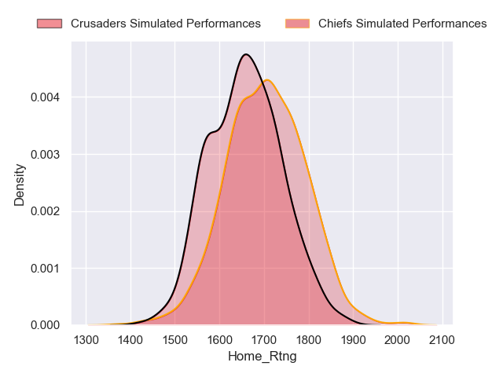
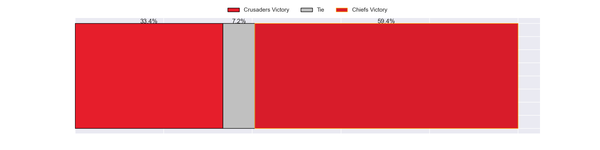
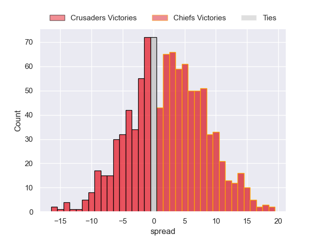

### Queensland Reds V Western Force on 2023/04/29

Average Margin: Queensland Reds by 6.8

### Moana Pasifika V Melbourne Rebels on 2023/04/29

Average Margin: Melbourne Rebels by 4.5

## Week 10

### Highlanders V Chiefs on 2023/05/05

Average Margin: Chiefs by 10.8

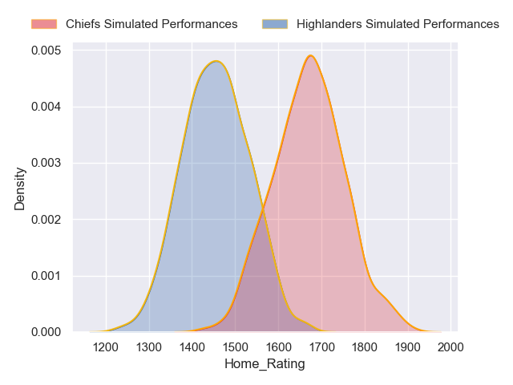
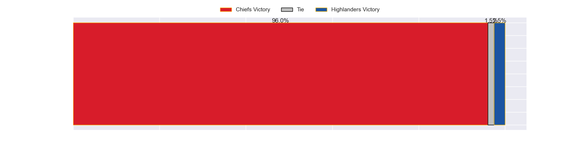
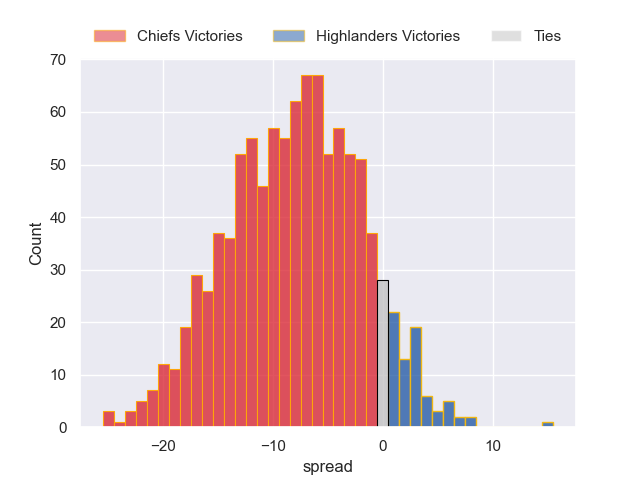

### Crusaders V Western Force on 2023/05/06

Average Margin: Crusaders by 20.6

### Queensland Reds V New South Wales Waratahs on 2023/05/06

Average Margin: Queensland Reds by 1.5

### Blues V Moana Pasifika on 2023/05/06

Average Margin: Blues by 28.2

### Fijian Drua V Hurricanes on 2023/05/06

Average Margin: Hurricanes by 10.4

### Melbourne Rebels V Brumbies on 2023/05/07

Average Margin: Brumbies by 10.7

## Week 11

### Western Force V Fijian Drua on 2023/05/12

Average Margin: Western Force by 5.7

### Chiefs V Queensland Reds on 2023/05/12

Average Margin: Chiefs by 17.7

### New South Wales Waratahs V Melbourne Rebels on 2023/05/13

Average Margin: New South Wales Waratahs by 9.4

### Crusaders V Blues on 2023/05/13

Average Margin: Crusaders by 4.5

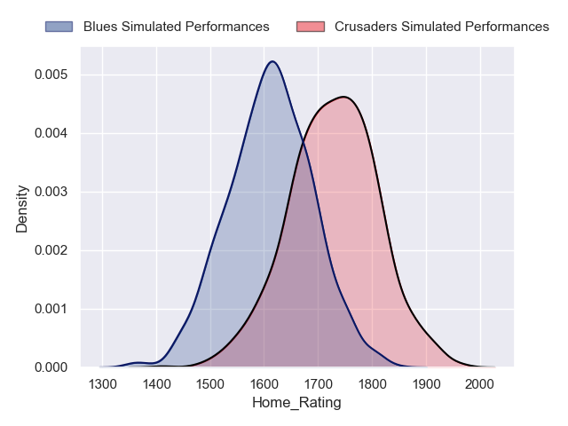
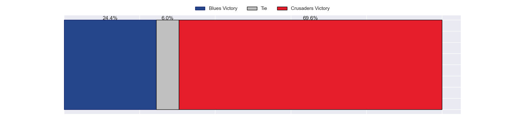
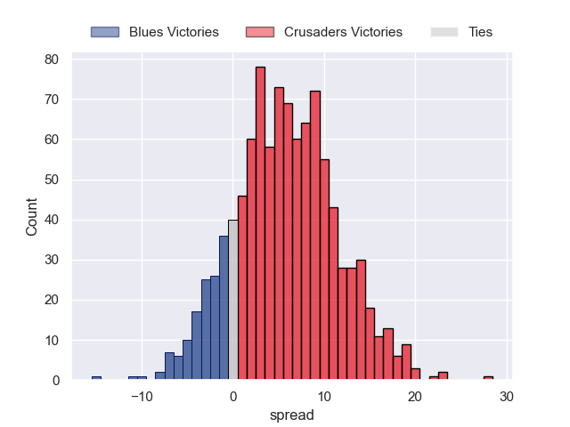

### Hurricanes V Moana Pasifika on 2023/05/13

Average Margin: Hurricanes by 23.8

### Brumbies V Highlanders on 2023/05/14

Average Margin: Brumbies by 12.5

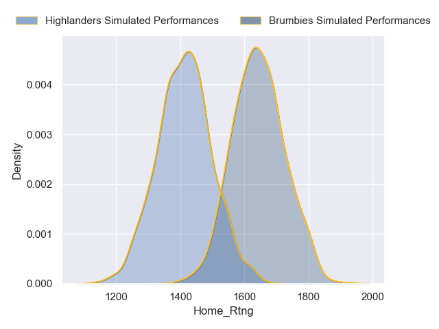
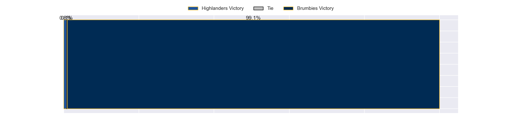
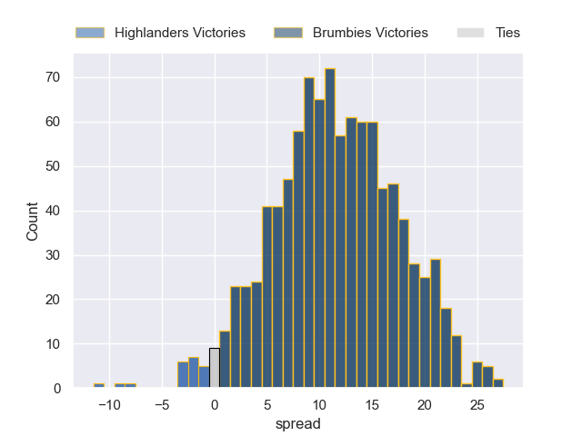

## Week 12

### Queensland Reds V Blues on 2023/05/19

Average Margin: Blues by 9.3

### Moana Pasifika V Crusaders on 2023/05/19

Average Margin: Crusaders by 23.0

### New South Wales Waratahs V Fijian Drua on 2023/05/20

Average Margin: New South Wales Waratahs by 11.0

### Chiefs V Hurricanes on 2023/05/20

Average Margin: Chiefs by 9.9

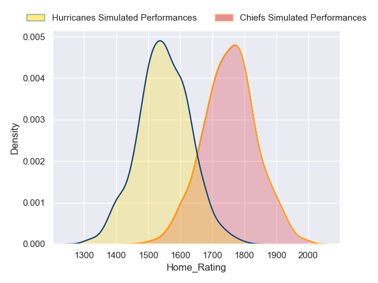
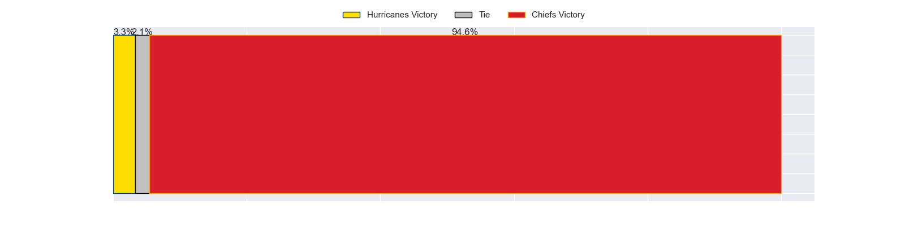

### Western Force V Brumbies on 2023/05/20

Average Margin: Brumbies by 9.5

### Highlanders V Melbourne Rebels on 2023/05/20

Average Margin: Highlanders by 8.5

## Week 13

### Melbourne Rebels V Western Force on 2023/05/26

Average Margin: Melbourne Rebels by 2.3

### Highlanders V Queensland Reds on 2023/05/26

Average Margin: Highlanders by 3.8

### Blues V Hurricanes on 2023/05/27

Average Margin: Blues by 8.0

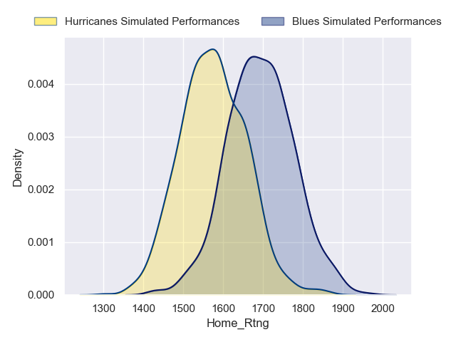
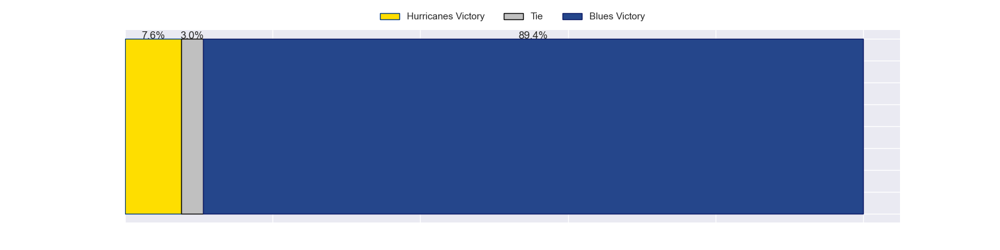
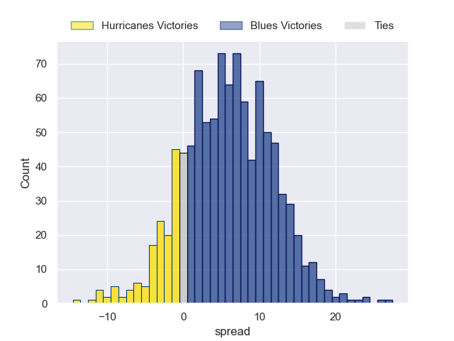

### Crusaders V New South Wales Waratahs on 2023/05/27

Average Margin: Crusaders by 15.5

### Fijian Drua V Moana Pasifika on 2023/05/27

Average Margin: Fijian Drua by 10.0

### Brumbies V Chiefs on 2023/05/27

Average Margin: Chiefs by 1.5

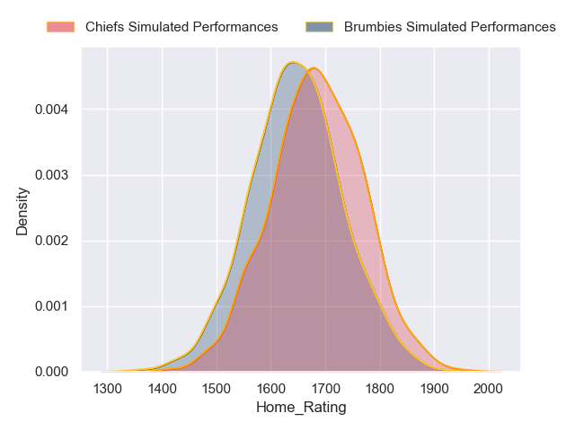
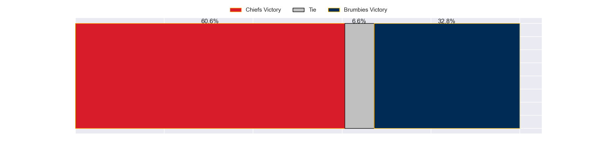
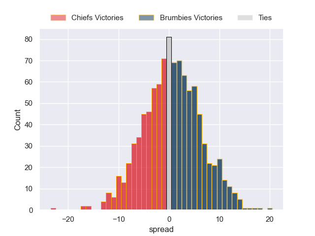

## Week 14

### Brumbies V Melbourne Rebels on 2023/06/02

Average Margin: Brumbies by 16.7

### Blues V Highlanders on 2023/06/02

Average Margin: Blues by 15.6

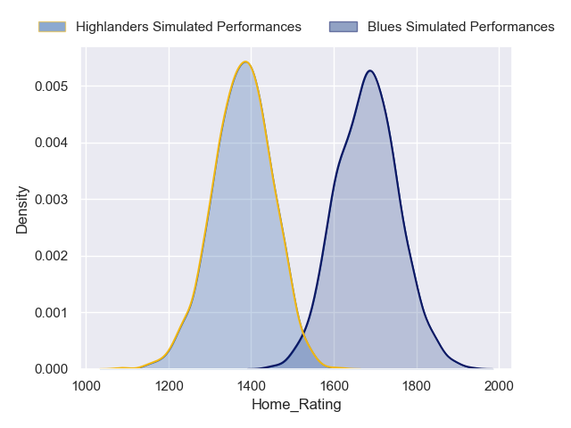
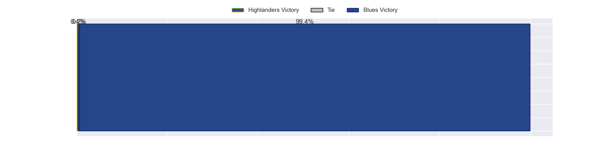

### Fijian Drua V Queensland Reds on 2023/06/03

Average Margin: Queensland Reds by 2.1

### New South Wales Waratahs V Moana Pasifika on 2023/06/03

Average Margin: New South Wales Waratahs by 17.4

### Western Force V Chiefs on 2023/06/03

Average Margin: Chiefs by 14.1

### Hurricanes V Crusaders on 2023/06/03

Average Margin: Crusaders by 2.3

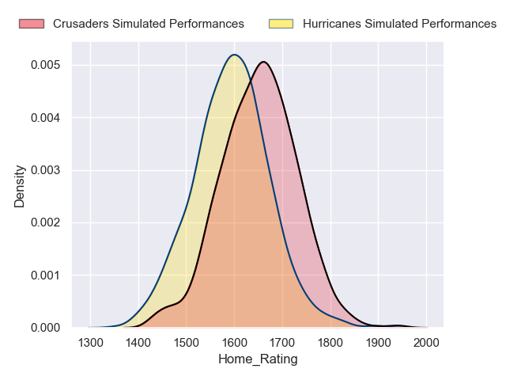

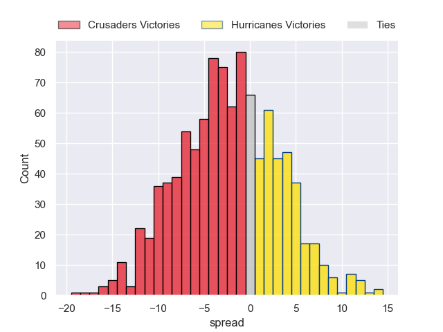

