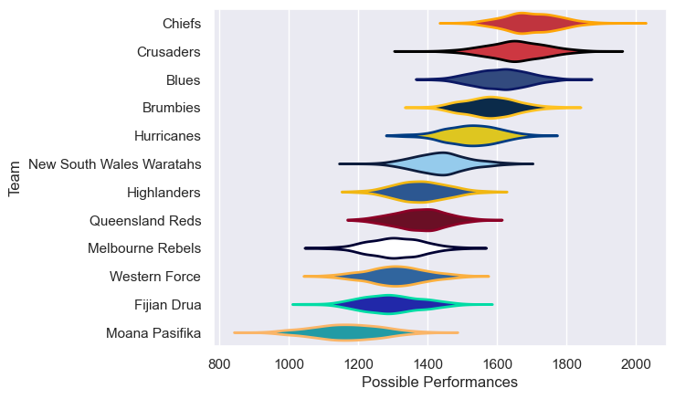

---  
title: "Super Rugby Pacific Status"  
date: 2023-04-21 6:00:00 -0500  
categories: model review projection  
layout: article  
aside:  
    toc: true  
---
# Current Team Rankings

# Standings

## Current Standings

| Club                     |   Played |   Wins |   Point Differential |   Losing Bonus Points |   Try Bonus Points |   Competition Points |
|:-------------------------|---------:|-------:|---------------------:|----------------------:|-------------------:|---------------------:|
| Chiefs                   |        8 |      8 |                  150 |                     0 |                  4 |                   36 |
| Brumbies                 |        8 |      7 |                   72 |                     0 |                  3 |                   31 |
| Crusaders                |        8 |      6 |                   85 |                     1 |                  3 |                   28 |
| Hurricanes               |        8 |      6 |                  112 |                     1 |                  2 |                   27 |
| Blues                    |        7 |      4 |                   78 |                     3 |                  2 |                   21 |
| Queensland Reds          |        8 |      3 |                  -21 |                     2 |                  1 |                   15 |
| Highlanders              |        7 |      3 |                  -44 |                     0 |                  2 |                   14 |
| New South Wales Waratahs |        7 |      2 |                    5 |                     3 |                  2 |                   13 |
| Fijian Drua              |        8 |      3 |                 -100 |                     1 |                  0 |                   13 |
| Melbourne Rebels         |        8 |      2 |                  -82 |                     2 |                  0 |                   10 |
| Western Force            |        7 |      2 |                  -85 |                     1 |                  0 |                    9 |
| Moana Pasifika           |        8 |      0 |                 -170 |                     2 |                  0 |                    2 |

## Projected Remaining Table

| Club                     |   Matches Remaining |   Wins |   Point Differential |   Losing Bonus Points |   Try Bonus Points |   Competition Points |
|:-------------------------|--------------------:|-------:|---------------------:|----------------------:|-------------------:|---------------------:|
| Blues                    |                   7 |    6   |                 80.3 |                   0.6 |                5.9 |                 30.6 |
| Chiefs                   |                   6 |    5.3 |                 58   |                   0.6 |                5.1 |                 26.8 |
| Brumbies                 |                   6 |    4.7 |                 46.5 |                   1   |                4.5 |                 24.3 |
| Crusaders                |                   6 |    4.7 |                 62   |                   1   |                4.5 |                 24.2 |
| New South Wales Waratahs |                   7 |    4.1 |                 15.3 |                   1   |                4   |                 21.5 |
| Hurricanes               |                   6 |    3   |                 15.3 |                   1.5 |                2.9 |                 16.5 |
| Highlanders              |                   7 |    2.8 |                -22.5 |                   1.4 |                2.6 |                 15.1 |
| Queensland Reds          |                   6 |    2.4 |                -18.6 |                   1.5 |                2.2 |                 13.3 |
| Fijian Drua              |                   6 |    1.6 |                -31.3 |                   1.5 |                1.5 |                  9.5 |
| Melbourne Rebels         |                   6 |    1.7 |                -37.6 |                   1.2 |                1.5 |                  9.4 |
| Western Force            |                   7 |    1.4 |                -59.9 |                   1.8 |                1.2 |                  8.6 |
| Moana Pasifika           |                   6 |    0.3 |               -107.3 |                   0.7 |                0.2 |                  2.1 |

## Projected Total Table

| Club                     |   Total Matches |   Wins |   Point Differential |   Losing Bonus Points |   Try Bonus Points |   Competition Points |
|:-------------------------|----------------:|-------:|---------------------:|----------------------:|-------------------:|---------------------:|
| Chiefs                   |              14 |   13.3 |                208   |                   0.6 |                9.1 |                 62.8 |
| Brumbies                 |              14 |   11.7 |                118.5 |                   1   |                7.5 |                 55.3 |
| Crusaders                |              14 |   10.7 |                147   |                   2   |                7.5 |                 52.2 |
| Blues                    |              14 |   10   |                158.3 |                   3.6 |                7.9 |                 51.6 |
| Hurricanes               |              14 |    9   |                127.3 |                   2.5 |                4.9 |                 43.5 |
| New South Wales Waratahs |              14 |    6.1 |                 20.3 |                   4   |                6   |                 34.5 |
| Highlanders              |              14 |    5.8 |                -66.5 |                   1.4 |                4.6 |                 29.1 |
| Queensland Reds          |              14 |    5.4 |                -39.6 |                   3.5 |                3.2 |                 28.3 |
| Fijian Drua              |              14 |    4.6 |               -131.3 |                   2.5 |                1.5 |                 22.5 |
| Melbourne Rebels         |              14 |    3.7 |               -119.6 |                   3.2 |                1.5 |                 19.4 |
| Western Force            |              14 |    3.4 |               -144.9 |                   2.8 |                1.2 |                 17.6 |
| Moana Pasifika           |              14 |    0.3 |               -277.3 |                   2.7 |                0.2 |                  4.1 |

## Projected Playoff Results

|                          | Reach Quarterfinals   | Reach Semifinals   | Reach Final   | Win Final   |
|:-------------------------|:----------------------|:-------------------|:--------------|:------------|
| Chiefs                   | 100.0 %               | 100.0 %            | 86.6 %        | 68.7 %      |
| Crusaders                | 100.0 %               | 95.6 %             | 48.5 %        | 17.2 %      |
| Blues                    | 100.0 %               | 93.1 %             | 30.0 %        | 7.1 %       |
| Brumbies                 | 100.0 %               | 93.9 %             | 33.5 %        | 6.9 %       |
| Hurricanes               | 100.0 %               | 14.8 %             | 1.4 %         | 0.1 %       |
| New South Wales Waratahs | 99.4 %                | 2.0 %              | 0.0 %         | 0.0 %       |
| Highlanders              | 92.5 %                | 0.5 %              | 0.0 %         | 0.0 %       |
| Queensland Reds          | 82.6 %                | 0.1 %              | 0.0 %         | 0.0 %       |
| Fijian Drua              | 19.1 %                | 0.0 %              | 0.0 %         | 0.0 %       |
| Western Force            | 3.7 %                 | 0.0 %              | 0.0 %         | 0.0 %       |
| Melbourne Rebels         | 2.7 %                 | 0.0 %              | 0.0 %         | 0.0 %       |

# Completed Match Review

| Model | Percent Correct Predictions | Spread Error |
| ------ | ------ | ------ |
| Club Level | 78.3% | 13.0 |
| Player Level: Lineup | 64.6% | 15.7 |
| Player Level: Minutes | 69.6% | 15.9 |

# Future Predictions

## Week 9

### Western Force V Highlanders on 2023/04/22

Average Margin: Highlanders by 2.9

### Blues V New South Wales Waratahs on 2023/04/22

Average Margin: Blues by 13.0

## Week 10

### Hurricanes V Brumbies on 2023/04/28

Average Margin: Hurricanes by 1.6

### New South Wales Waratahs V Highlanders on 2023/04/28

Average Margin: New South Wales Waratahs by 4.5

### Fijian Drua V Blues on 2023/04/29

Average Margin: Blues by 14.6

### Queensland Reds V Western Force on 2023/04/29

Average Margin: Queensland Reds by 8.7

### Chiefs V Crusaders on 2023/04/29

Average Margin: Chiefs by 4.1

### Moana Pasifika V Melbourne Rebels on 2023/04/29

Average Margin: Melbourne Rebels by 4.7

## Week 11

### Highlanders V Chiefs on 2023/05/05

Average Margin: Chiefs by 9.8

### Queensland Reds V New South Wales Waratahs on 2023/05/06

Average Margin: Queensland Reds by 1.1

### Blues V Moana Pasifika on 2023/05/06

Average Margin: Blues by 27.9

### Crusaders V Western Force on 2023/05/06

Average Margin: Crusaders by 22.0

### Fijian Drua V Hurricanes on 2023/05/06

Average Margin: Hurricanes by 10.1

### Melbourne Rebels V Brumbies on 2023/05/07

Average Margin: Brumbies by 10.6

## Week 12

### Chiefs V Queensland Reds on 2023/05/12

Average Margin: Chiefs by 17.5

### Western Force V Fijian Drua on 2023/05/12

Average Margin: Western Force by 3.8

### Crusaders V Blues on 2023/05/13

Average Margin: Crusaders by 4.9

### New South Wales Waratahs V Melbourne Rebels on 2023/05/13

Average Margin: New South Wales Waratahs by 10.3

### Hurricanes V Moana Pasifika on 2023/05/13

Average Margin: Hurricanes by 23.8

### Brumbies V Highlanders on 2023/05/14

Average Margin: Brumbies by 11.7

## Week 13

### Moana Pasifika V Crusaders on 2023/05/19

Average Margin: Crusaders by 22.8

### Queensland Reds V Blues on 2023/05/19

Average Margin: Blues by 8.5

### Western Force V Brumbies on 2023/05/20

Average Margin: Brumbies by 10.9

### Highlanders V Melbourne Rebels on 2023/05/20

Average Margin: Highlanders by 9.0

### Chiefs V Hurricanes on 2023/05/20

Average Margin: Chiefs by 9.9

### New South Wales Waratahs V Fijian Drua on 2023/05/20

Average Margin: New South Wales Waratahs by 11.2

## Week 14

### Melbourne Rebels V Western Force on 2023/05/26

Average Margin: Melbourne Rebels by 4.0

### Highlanders V Queensland Reds on 2023/05/26

Average Margin: Highlanders by 5.2

### Fijian Drua V Moana Pasifika on 2023/05/27

Average Margin: Fijian Drua by 10.4

### Crusaders V New South Wales Waratahs on 2023/05/27

Average Margin: Crusaders by 14.6

### Blues V Hurricanes on 2023/05/27

Average Margin: Blues by 7.7

### Brumbies V Chiefs on 2023/05/27

Average Margin: Chiefs by 1.5

## Week 15

### Blues V Highlanders on 2023/06/02

Average Margin: Blues by 14.1

### Brumbies V Melbourne Rebels on 2023/06/02

Average Margin: Brumbies by 16.8

### Fijian Drua V Queensland Reds on 2023/06/03

Average Margin: Queensland Reds by 2.4

### Hurricanes V Crusaders on 2023/06/03

Average Margin: Crusaders by 2.3

### New South Wales Waratahs V Moana Pasifika on 2023/06/03

Average Margin: New South Wales Waratahs by 18.3

### Western Force V Chiefs on 2023/06/03

Average Margin: Chiefs by 15.7

