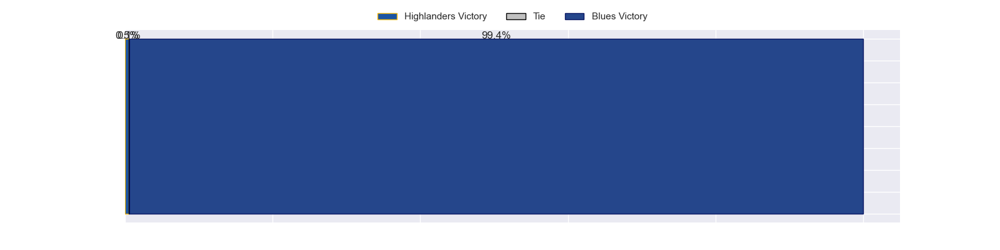

---  
layout: page  
title:  2022 Status  
date:   
categories: model review projection  
---
#  2022 Status

# Completed Match Review

| Match                                             |   Result |   Lineup Prediction |   Minutes Prediction |   Club Prediction |
|:--------------------------------------------------|---------:|--------------------:|---------------------:|------------------:|
| Crusaders V Chiefs on 2023/02/24                  |      -21 |                 4.5 |                 -0.2 |              12.4 |
| New South Wales Waratahs V Brumbies on 2023/02/24 |       -6 |                 4.2 |                  4.6 |              -0.9 |
| ------ | ------ | ------ | ------ | ------ |
| Average Error |       - | 17.8 | 15.7 | 19.2 |
| Correct Winner |       - | 0.0% | 50.0% | 50.0% |
## Future Club-Level Match Predictions

### Week 1

#### Moana Pasifika V Fijian Drua on 2023/02/25

Average Margin: Fijian Drua by 2.6

#### Highlanders V Blues on 2023/02/25

Average Margin: Blues by 9.2

#### Queensland Reds V Hurricanes on 2023/02/25

Average Margin: Hurricanes by 0.8

#### Western Force V Melbourne Rebels on 2023/02/25

Average Margin: Western Force by 1.0

### Week 2

#### Crusaders V Highlanders on 2023/03/03

Average Margin: Crusaders by 11.9

#### Melbourne Rebels V Hurricanes on 2023/03/03

Average Margin: Hurricanes by 7.8

#### Moana Pasifika V Chiefs on 2023/03/04

Average Margin: Chiefs by 17.8

#### Fijian Drua V New South Wales Waratahs on 2023/03/04

Average Margin: New South Wales Waratahs by 9.2

#### Blues V Brumbies on 2023/03/05

Average Margin: Blues by 7.6

#### Western Force V Queensland Reds on 2023/03/05

Average Margin: Queensland Reds by 6.6

### Week 3

#### Chiefs V Highlanders on 2023/03/10

Average Margin: Chiefs by 7.5

#### Melbourne Rebels V New South Wales Waratahs on 2023/03/10

Average Margin: New South Wales Waratahs by 6.0

#### Fijian Drua V Crusaders on 2023/03/11

Average Margin: Crusaders by 16.3

#### Hurricanes V Blues on 2023/03/11

Average Margin: Blues by 5.5

#### Brumbies V Queensland Reds on 2023/03/11

Average Margin: Brumbies by 5.3

#### Western Force V Moana Pasifika on 2023/03/11

Average Margin: Western Force by 10.4

### Week 4

#### Hurricanes V New South Wales Waratahs on 2023/03/17

Average Margin: Hurricanes by 8.8

#### Chiefs V Melbourne Rebels on 2023/03/18

Average Margin: Chiefs by 18.6

#### Blues V Crusaders on 2023/03/18

Average Margin: Blues by 0.7

#### Brumbies V Moana Pasifika on 2023/03/18

Average Margin: Brumbies by 22.1

#### Highlanders V Western Force on 2023/03/19

Average Margin: Highlanders by 6.6

#### Queensland Reds V Fijian Drua on 2023/03/19

Average Margin: Queensland Reds by 10.5

### Week 5

#### Crusaders V Brumbies on 2023/03/24

Average Margin: Crusaders by 6.3

#### New South Wales Waratahs V Chiefs on 2023/03/24

Average Margin: Chiefs by 6.2

#### Highlanders V Fijian Drua on 2023/03/25

Average Margin: Highlanders by 14.4

#### Moana Pasifika V Hurricanes on 2023/03/25

Average Margin: Hurricanes by 16.5

#### Melbourne Rebels V Queensland Reds on 2023/03/25

Average Margin: Queensland Reds by 3.9

#### Blues V Western Force on 2023/03/26

Average Margin: Blues by 19.6

### Week 6

#### Moana Pasifika V Highlanders on 2023/03/31

Average Margin: Highlanders by 10.5

#### Queensland Reds V Crusaders on 2023/03/31

Average Margin: Crusaders by 5.9

#### Fijian Drua V Melbourne Rebels on 2023/04/01

Average Margin: Fijian Drua by 0.1

#### Chiefs V Blues on 2023/04/01

Average Margin: Chiefs by 1.5

#### Brumbies V New South Wales Waratahs on 2023/04/01

Average Margin: Brumbies by 9.9

#### Hurricanes V Western Force on 2023/04/02

Average Margin: Hurricanes by 13.6

### Week 7

#### Crusaders V Moana Pasifika on 2023/04/07

Average Margin: Crusaders by 21.2

#### Queensland Reds V Brumbies on 2023/04/07

Average Margin: Brumbies by 5.3

#### Highlanders V Hurricanes on 2023/04/08

Average Margin: Hurricanes by 0.0

#### Melbourne Rebels V Blues on 2023/04/08

Average Margin: Blues by 13.4

### Week 8

#### Moana Pasifika V Queensland Reds on 2023/04/14

Average Margin: Queensland Reds by 9.3

#### Brumbies V Fijian Drua on 2023/04/14

Average Margin: Brumbies by 19.1

#### Hurricanes V Chiefs on 2023/04/15

Average Margin: Chiefs by 3.9

#### New South Wales Waratahs V Western Force on 2023/04/15

Average Margin: New South Wales Waratahs by 8.4

### Week 9

#### Chiefs V Fijian Drua on 2023/04/21

Average Margin: Chiefs by 21.5

#### Melbourne Rebels V Crusaders on 2023/04/21

Average Margin: Crusaders by 12.4

#### Blues V New South Wales Waratahs on 2023/04/22

Average Margin: Blues by 13.8

#### Western Force V Highlanders on 2023/04/22

Average Margin: Highlanders by 6.6

### Week 10

#### Hurricanes V Brumbies on 2023/04/28

Average Margin: Hurricanes by 2.0

#### New South Wales Waratahs V Highlanders on 2023/04/28

Average Margin: New South Wales Waratahs by 1.6

#### Fijian Drua V Blues on 2023/04/29

Average Margin: Blues by 16.4

#### Moana Pasifika V Melbourne Rebels on 2023/04/29

Average Margin: Melbourne Rebels by 2.7

#### Chiefs V Crusaders on 2023/04/29

Average Margin: Chiefs by 2.4

#### Queensland Reds V Western Force on 2023/04/29

Average Margin: Queensland Reds by 6.6

### Week 11

#### Highlanders V Chiefs on 2023/05/05

Average Margin: Chiefs by 7.5

#### Fijian Drua V Hurricanes on 2023/05/06

Average Margin: Hurricanes by 10.4

#### Crusaders V Western Force on 2023/05/06

Average Margin: Crusaders by 18.3

#### Blues V Moana Pasifika on 2023/05/06

Average Margin: Blues by 25.1

#### Queensland Reds V New South Wales Waratahs on 2023/05/06

Average Margin: Queensland Reds by 4.5

#### Melbourne Rebels V Brumbies on 2023/05/07

Average Margin: Brumbies by 12.5

### Week 12

#### Chiefs V Queensland Reds on 2023/05/12

Average Margin: Chiefs by 11.4

#### Western Force V Fijian Drua on 2023/05/12

Average Margin: Western Force by 7.4

#### Hurricanes V Moana Pasifika on 2023/05/13

Average Margin: Hurricanes by 16.5

#### Crusaders V Blues on 2023/05/13

Average Margin: Blues by 0.7

#### New South Wales Waratahs V Melbourne Rebels on 2023/05/13

Average Margin: New South Wales Waratahs by 6.0

#### Brumbies V Highlanders on 2023/05/14

Average Margin: Brumbies by 8.5

### Week 13

#### Moana Pasifika V Crusaders on 2023/05/19

Average Margin: Crusaders by 21.2

#### Queensland Reds V Blues on 2023/05/19

Average Margin: Blues by 6.2

#### Highlanders V Melbourne Rebels on 2023/05/20

Average Margin: Highlanders by 10.9

#### Chiefs V Hurricanes on 2023/05/20

Average Margin: Chiefs by 3.9

#### New South Wales Waratahs V Fijian Drua on 2023/05/20

Average Margin: New South Wales Waratahs by 9.2

#### Western Force V Brumbies on 2023/05/20

Average Margin: Brumbies by 8.0

### Week 14

#### Highlanders V Queensland Reds on 2023/05/26

Average Margin: Highlanders by 3.7

#### Melbourne Rebels V Western Force on 2023/05/26

Average Margin: Western Force by 1.0

#### Fijian Drua V Moana Pasifika on 2023/05/27

Average Margin: Fijian Drua by 2.6

#### Crusaders V New South Wales Waratahs on 2023/05/27

Average Margin: Crusaders by 13.4

#### Blues V Hurricanes on 2023/05/27

Average Margin: Blues by 5.5

#### Brumbies V Chiefs on 2023/05/27

Average Margin: Brumbies by 0.5

### Week 15

#### Blues V Highlanders on 2023/06/02

Average Margin: Blues by 9.2

#### Brumbies V Melbourne Rebels on 2023/06/02

Average Margin: Brumbies by 12.5

#### Fijian Drua V Queensland Reds on 2023/06/03

Average Margin: Queensland Reds by 10.5

#### Hurricanes V Crusaders on 2023/06/03

Average Margin: Crusaders by 1.4

#### New South Wales Waratahs V Moana Pasifika on 2023/06/03

Average Margin: New South Wales Waratahs by 14.4

#### Western Force V Chiefs on 2023/06/03

Average Margin: Chiefs by 10.4

