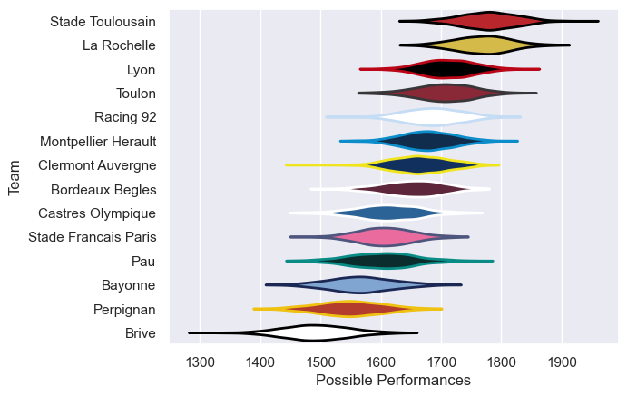
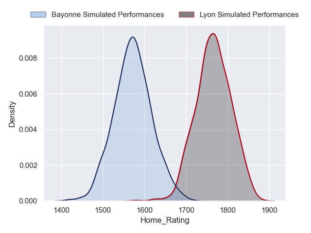
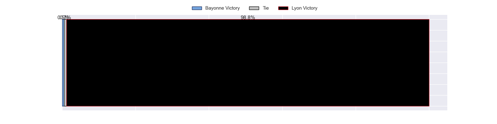
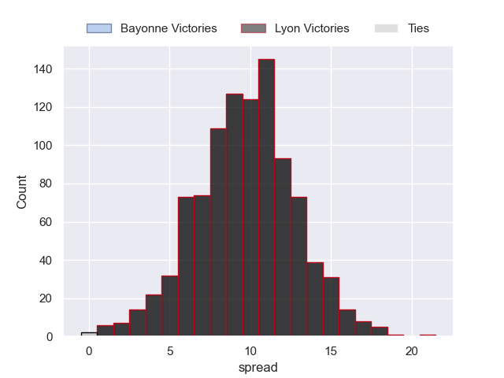

---  
title: "Top 14 Orange 2022 Status"  
date: 2023-05-11 6:00:00 -0500  
categories: model review projection  
layout: article  
aside:  
    toc: true  
---
# Current Team Rankings

# Standings

## Current Standings

| Club                 |   Played |   Wins |   Point Differential |   Losing Bonus Points |   Try Bonus Points |   Competition Points |
|:---------------------|---------:|-------:|---------------------:|----------------------:|-------------------:|---------------------:|
| Stade Toulousain     |       24 |     16 |                  169 |                     1 |                  8 |                   75 |
| La Rochelle          |       24 |     16 |                  201 |                     3 |                  7 |                   74 |
| Stade Francais Paris |       24 |     13 |                  140 |                     5 |                  5 |                   64 |
| Racing 92            |       24 |     13 |                   21 |                     3 |                  4 |                   61 |
| Lyon                 |       24 |     13 |                   30 |                     5 |                  3 |                   60 |
| Bordeaux Begles      |       24 |     12 |                   63 |                     5 |                  3 |                   58 |
| Toulon               |       24 |     13 |                   50 |                     2 |                  3 |                   57 |
| Bayonne              |       24 |     12 |                  -35 |                     2 |                  2 |                   54 |
| Clermont Auvergne    |       24 |     10 |                  -43 |                     5 |                  4 |                   51 |
| Montpellier Herault  |       24 |     10 |                   21 |                     6 |                  4 |                   50 |
| Castres Olympique    |       24 |     11 |                 -116 |                     2 |                  1 |                   49 |
| Pau                  |       24 |      9 |                  -39 |                     5 |                  4 |                   47 |
| Perpignan            |       24 |      9 |                 -218 |                     3 |                  0 |                   39 |
| Brive                |       24 |      7 |                 -244 |                     6 |                  1 |                   35 |

## Projected Remaining Table

| Club                 |   Matches Remaining |   Wins |   Point Differential |   Losing Bonus Points |   Try Bonus Points |   Competition Points |
|:---------------------|--------------------:|-------:|---------------------:|----------------------:|-------------------:|---------------------:|
| Stade Toulousain     |                   2 |    2   |                 23   |                   0   |                2   |                 10   |
| La Rochelle          |                   2 |    1.8 |                 13.4 |                   0.2 |                1.8 |                  9.3 |
| Castres Olympique    |                   2 |    1.7 |                  8.1 |                   0.3 |                1.5 |                  8.5 |
| Lyon                 |                   2 |    1.5 |                  8.9 |                   0.5 |                1.3 |                  7.7 |
| Clermont Auvergne    |                   2 |    1.4 |                  3.4 |                   0.5 |                1.2 |                  7.6 |
| Toulon               |                   2 |    1.2 |                  1.8 |                   0.6 |                1   |                  6.3 |
| Bordeaux Begles      |                   2 |    1.1 |                  2.9 |                   0.5 |                1   |                  5.9 |
| Racing 92            |                   2 |    0.9 |                 -0.4 |                   0.8 |                0.8 |                  5.4 |
| Montpellier Herault  |                   2 |    0.6 |                 -2.9 |                   1   |                0.5 |                  4.1 |
| Pau                  |                   2 |    0.5 |                 -6.7 |                   0.6 |                0.4 |                  3.2 |
| Stade Francais Paris |                   2 |    0.5 |                -10.2 |                   0.5 |                0.4 |                  3   |
| Bayonne              |                   2 |    0.4 |                -10.3 |                   0.6 |                0.2 |                  2.3 |
| Brive                |                   2 |    0.3 |                -16.7 |                   0.6 |                0.2 |                  2   |
| Perpignan            |                   2 |    0   |                -14.4 |                   0.4 |                0   |                  0.5 |

## Projected Total Table

| Club                 |   Total Matches |   Wins |   Point Differential |   Losing Bonus Points |   Try Bonus Points |   Competition Points |
|:---------------------|----------------:|-------:|---------------------:|----------------------:|-------------------:|---------------------:|
| Stade Toulousain     |              26 |   18   |                192   |                   1   |               10   |                 85   |
| La Rochelle          |              26 |   17.8 |                214.4 |                   3.2 |                8.8 |                 83.3 |
| Lyon                 |              26 |   14.5 |                 38.9 |                   5.5 |                4.3 |                 67.7 |
| Stade Francais Paris |              26 |   13.5 |                129.8 |                   5.5 |                5.4 |                 67   |
| Racing 92            |              26 |   13.9 |                 20.6 |                   3.8 |                4.8 |                 66.4 |
| Bordeaux Begles      |              26 |   13.1 |                 65.9 |                   5.5 |                4   |                 63.9 |
| Toulon               |              26 |   14.2 |                 51.8 |                   2.6 |                4   |                 63.3 |
| Clermont Auvergne    |              26 |   11.4 |                -39.6 |                   5.5 |                5.2 |                 58.6 |
| Castres Olympique    |              26 |   12.7 |               -107.9 |                   2.3 |                2.5 |                 57.5 |
| Bayonne              |              26 |   12.4 |                -45.3 |                   2.6 |                2.2 |                 56.3 |
| Montpellier Herault  |              26 |   10.6 |                 18.1 |                   7   |                4.5 |                 54.1 |
| Pau                  |              26 |    9.5 |                -45.7 |                   5.6 |                4.4 |                 50.2 |
| Perpignan            |              26 |    9   |               -232.4 |                   3.4 |                0   |                 39.5 |
| Brive                |              26 |    7.3 |               -260.7 |                   6.6 |                1.2 |                 37   |

## Projected Playoff Results

|                      | Reach Quarterfinals   | Reach Semifinals   | Reach Final   | Win Final   |
|:---------------------|:----------------------|:-------------------|:--------------|:------------|
| La Rochelle          | 100.0 %               | 100.0 %            | 97.1 %        | 64.9 %      |
| Stade Toulousain     | 100.0 %               | 100.0 %            | 92.5 %        | 35.0 %      |
| Lyon                 | 99.9 %                | 64.1 %             | 4.8 %         | 0.1 %       |
| Toulon               | 26.7 %                | 20.6 %             | 2.3 %         | 0.0 %       |
| Racing 92            | 80.8 %                | 54.9 %             | 2.1 %         | 0.0 %       |
| Bordeaux Begles      | 92.6 %                | 22.8 %             | 1.2 %         | 0.0 %       |
| Stade Francais Paris | 100.0 %               | 37.6 %             | 0.0 %         | 0.0 %       |

## Projected Promotion and Relegation Results

| Club           | Current Competition   | To Top 14   | To Pro D2   |
|:---------------|:----------------------|:------------|:------------|
| Perpignan      | Top 14                | 71.1 %      | 29.0 %      |
| Brive          | Top 14                | 9.8 %       | 90.1 %      |
| Oyonnax        | Pro D2                | 98.6 %      | 1.0 %       |
| Mont-de-Marsan | Pro D2                | 19.5 %      | 77.6 %      |
| Nevers         | Pro D2                | 1.0 %       | 2.2 %       |
| Vannes         | Pro D2                | 0.0 %       | 0.1 %       |

# Completed Match Review

| Model | Percent Correct Predictions | Spread Error |
| ------ | ------ | ------ |
| Club Level | 68.5% | 10.8 |
| Player Level: Lineup | 64.3% | 17.3 |
| Player Level: Minutes | 67.3% | 17.5 |

# Future Predictions

## Week 25

### Racing 92 V Toulon on 2023/05/13

Average Margin: Racing 92 by 2.2

### Bordeaux Begles V Pau on 2023/05/13

Average Margin: Bordeaux Begles by 7.2

### Montpellier Herault V La Rochelle on 2023/05/13

Average Margin: La Rochelle by 3.0

### Brive V Castres Olympique on 2023/05/13

Average Margin: Castres Olympique by 1.5

### Bayonne V Clermont Auvergne on 2023/05/13

Average Margin: Clermont Auvergne by 1.1

### Perpignan V Stade Toulousain on 2023/05/13

Average Margin: Stade Toulousain by 7.8

### Stade Francais Paris V Lyon on 2023/05/14

Average Margin: Stade Francais Paris by 0.3

## Week 26

### La Rochelle V Stade Francais Paris on 2023/05/28

Average Margin: La Rochelle by 10.9

### Pau V Montpellier Herault on 2023/05/28

Average Margin: Pau by 0.1

### Toulon V Bordeaux Begles on 2023/05/28

Average Margin: Toulon by 4.1

### Lyon V Bayonne on 2023/05/28

Average Margin: Lyon by 9.7

### Castres Olympique V Perpignan on 2023/05/28

Average Margin: Castres Olympique by 7.1

### Clermont Auvergne V Racing 92 on 2023/05/28

Average Margin: Clermont Auvergne by 2.7

### Stade Toulousain V Brive on 2023/05/28

Average Margin: Stade Toulousain by 15.7

