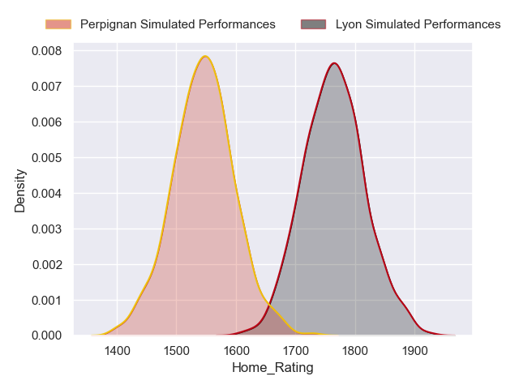
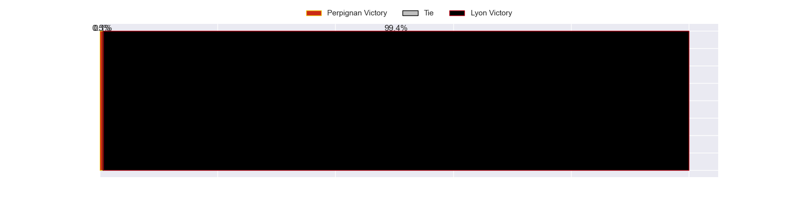
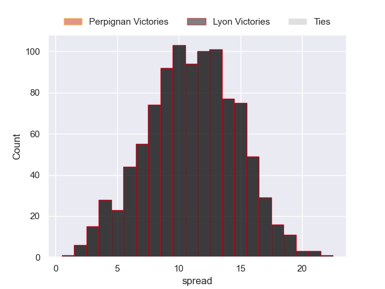

---  
title: "Top 14 Orange Status"  
date: 2023-04-28 6:00:00 -0500  
categories: model review projection  
layout: article  
aside:  
    toc: true  
---
# Current Team Rankings

# Standings

## Current Standings

| Club                 |   Played |   Wins |   Point Differential |   Losing Bonus Points |   Try Bonus Points |   Competition Points |
|:---------------------|---------:|-------:|---------------------:|----------------------:|-------------------:|---------------------:|
| Stade Toulousain     |       23 |     15 |                  155 |                     1 |                  8 |                   71 |
| La Rochelle          |       23 |     15 |                  186 |                     3 |                  7 |                   70 |
| Stade Francais Paris |       23 |     13 |                  156 |                     5 |                  5 |                   64 |
| Bordeaux Begles      |       23 |     12 |                   77 |                     5 |                  3 |                   58 |
| Toulon               |       23 |     13 |                   65 |                     2 |                  3 |                   57 |
| Lyon                 |       23 |     12 |                   20 |                     5 |                  3 |                   56 |
| Racing 92            |       23 |     12 |                  -20 |                     3 |                  3 |                   56 |
| Bayonne              |       23 |     12 |                    6 |                     2 |                  2 |                   54 |
| Montpellier Herault  |       23 |     10 |                   22 |                     5 |                  4 |                   49 |
| Castres Olympique    |       23 |     11 |                  -79 |                     2 |                  1 |                   49 |
| Clermont Auvergne    |       23 |      9 |                  -59 |                     5 |                  3 |                   46 |
| Pau                  |       23 |      8 |                  -76 |                     5 |                  3 |                   42 |
| Perpignan            |       23 |      9 |                 -208 |                     3 |                  0 |                   39 |
| Brive                |       23 |      6 |                 -245 |                     6 |                  1 |                   31 |

## Projected Remaining Table

| Club                 |   Matches Remaining |   Wins |   Point Differential |   Losing Bonus Points |   Try Bonus Points |   Competition Points |
|:---------------------|--------------------:|-------:|---------------------:|----------------------:|-------------------:|---------------------:|
| Stade Toulousain     |                   3 |    3   |                 31.4 |                   0   |                3   |                 14.9 |
| Lyon                 |                   3 |    2.4 |                 19.6 |                   0.5 |                2.3 |                 12.6 |
| La Rochelle          |                   3 |    2.3 |                 12.3 |                   0.6 |                2.1 |                 12.1 |
| Clermont Auvergne    |                   3 |    2.2 |                  6.5 |                   0.7 |                2   |                 11.6 |
| Castres Olympique    |                   3 |    2.1 |                  8   |                   0.8 |                1.9 |                 11   |
| Montpellier Herault  |                   3 |    1.9 |                  9   |                   0.9 |                1.7 |                 10   |
| Racing 92            |                   3 |    1.9 |                  6.3 |                   0.9 |                1.7 |                 10   |
| Toulon               |                   3 |    1.7 |                  1.7 |                   1.1 |                1.4 |                  9.1 |
| Pau                  |                   3 |    1.1 |                 -6.7 |                   1   |                0.9 |                  6.2 |
| Bordeaux Begles      |                   3 |    1.1 |                 -4.2 |                   0.7 |                1   |                  6   |
| Stade Francais Paris |                   3 |    0.7 |                -12.7 |                   1   |                0.5 |                  4.2 |
| Bayonne              |                   3 |    0.5 |                -17.2 |                   0.7 |                0.4 |                  2.9 |
| Brive                |                   3 |    0.2 |                -28.9 |                   0.6 |                0.1 |                  1.7 |
| Perpignan            |                   3 |    0   |                -25.7 |                   0.4 |                0   |                  0.5 |

## Projected Total Table

| Club                 |   Total Matches |   Wins |   Point Differential |   Losing Bonus Points |   Try Bonus Points |   Competition Points |
|:---------------------|----------------:|-------:|---------------------:|----------------------:|-------------------:|---------------------:|
| Stade Toulousain     |              26 |   18   |                186.4 |                   1   |               11   |                 85.9 |
| La Rochelle          |              26 |   17.3 |                198.3 |                   3.6 |                9.1 |                 82.1 |
| Lyon                 |              26 |   14.4 |                 39.6 |                   5.5 |                5.3 |                 68.6 |
| Stade Francais Paris |              26 |   13.7 |                143.3 |                   6   |                5.5 |                 68.2 |
| Toulon               |              26 |   14.7 |                 66.7 |                   3.1 |                4.4 |                 66.1 |
| Racing 92            |              26 |   13.9 |                -13.7 |                   3.9 |                4.7 |                 66   |
| Bordeaux Begles      |              26 |   13.1 |                 72.8 |                   5.7 |                4   |                 64   |
| Castres Olympique    |              26 |   13.1 |                -71   |                   2.8 |                2.9 |                 60   |
| Montpellier Herault  |              26 |   11.9 |                 31   |                   5.9 |                5.7 |                 59   |
| Clermont Auvergne    |              26 |   11.2 |                -52.5 |                   5.7 |                5   |                 57.6 |
| Bayonne              |              26 |   12.5 |                -11.2 |                   2.7 |                2.4 |                 56.9 |
| Pau                  |              26 |    9.1 |                -82.7 |                   6   |                3.9 |                 48.2 |
| Perpignan            |              26 |    9   |               -233.7 |                   3.4 |                0   |                 39.5 |
| Brive                |              26 |    6.2 |               -273.9 |                   6.6 |                1.1 |                 32.7 |

## Projected Playoff Results

|                      | Reach Quarterfinals   | Reach Semifinals   | Reach Final   | Win Final   |
|:---------------------|:----------------------|:-------------------|:--------------|:------------|
| La Rochelle          | 100.0 %               | 100.0 %            | 95.5 %        | 55.5 %      |
| Stade Toulousain     | 100.0 %               | 100.0 %            | 92.0 %        | 43.3 %      |
| Toulon               | 66.5 %                | 49.8 %             | 5.1 %         | 0.6 %       |
| Lyon                 | 100.0 %               | 65.0 %             | 5.6 %         | 0.5 %       |
| Stade Francais Paris | 99.7 %                | 47.0 %             | 0.6 %         | 0.1 %       |
| Racing 92            | 73.6 %                | 24.4 %             | 0.9 %         | 0.0 %       |
| Bordeaux Begles      | 57.1 %                | 13.3 %             | 0.3 %         | 0.0 %       |
| Castres Olympique    | 2.3 %                 | 0.3 %              | 0.0 %         | 0.0 %       |
| Montpellier Herault  | 0.8 %                 | 0.2 %              | 0.0 %         | 0.0 %       |

## Projected Promotion and Relegation Results

| Club           | Current Competition   | To Top 14   | To Pro D2   |
|:---------------|:----------------------|:------------|:------------|
| Perpignan      | Top 14                | 81.6 %      | 18.2 %      |
| Pau            | Top 14                | 0.2 %       | 0.0 %       |
| Brive          | Top 14                | 0.0 %       | 100.0 %     |
| Oyonnax        | Pro D2                | 98.9 %      | 0.9 %       |
| Nevers         | Pro D2                | 12.8 %      | 44.1 %      |
| Vannes         | Pro D2                | 5.0 %       | 23.7 %      |
| Grenoble       | Pro D2                | 1.2 %       | 11.6 %      |
| Mont-de-Marsan | Pro D2                | 0.3 %       | 1.5 %       |

# Completed Match Review

| Model | Percent Correct Predictions | Spread Error |
| ------ | ------ | ------ |
| Club Level | 68.3% | 10.6 |
| Player Level: Lineup | 60.2% | 12.6 |
| Player Level: Minutes | 64.0% | 12.5 |

# Future Predictions

## Week 24

### Montpellier Herault V Brive on 2023/05/06

Average Margin: Montpellier Herault by 10.9

### Racing 92 V Bayonne on 2023/05/06

Average Margin: Racing 92 by 7.8

### Lyon V Perpignan on 2023/05/06

Average Margin: Lyon by 11.0

### Clermont Auvergne V Stade Francais Paris on 2023/05/06

Average Margin: Clermont Auvergne by 3.8

### Pau V Castres Olympique on 2023/05/06

Average Margin: Pau by 1.3

### Toulon V La Rochelle on 2023/05/06

Average Margin: La Rochelle by 0.8

### Stade Toulousain V Bordeaux Begles on 2023/05/06

Average Margin: Stade Toulousain by 8.0

## Week 25

### Racing 92 V Toulon on 2023/05/13

Average Margin: Racing 92 by 1.6

### Montpellier Herault V La Rochelle on 2023/05/13

Average Margin: La Rochelle by 2.1

### Brive V Castres Olympique on 2023/05/13

Average Margin: Castres Olympique by 2.3

### Bayonne V Clermont Auvergne on 2023/05/13

Average Margin: Clermont Auvergne by 0.3

### Perpignan V Stade Toulousain on 2023/05/13

Average Margin: Stade Toulousain by 7.7

### Bordeaux Begles V Pau on 2023/05/13

Average Margin: Bordeaux Begles by 7.7

### Stade Francais Paris V Lyon on 2023/05/14

Average Margin: Stade Francais Paris by 0.5

## Week 26

### Lyon V Bayonne on 2023/05/28

Average Margin: Lyon by 9.6

### Clermont Auvergne V Racing 92 on 2023/05/28

Average Margin: Clermont Auvergne by 2.8

### Castres Olympique V Perpignan on 2023/05/28

Average Margin: Castres Olympique by 7.4

### Toulon V Bordeaux Begles on 2023/05/28

Average Margin: Toulon by 4.2

### Pau V Montpellier Herault on 2023/05/28

Average Margin: Montpellier Herault by 0.7

### La Rochelle V Stade Francais Paris on 2023/05/28

Average Margin: La Rochelle by 9.9

### Stade Toulousain V Brive on 2023/05/28

Average Margin: Stade Toulousain by 16.2

