---  
title: "Top 14 Orange Status"  
date: 2023-04-03 6:00:00 -0500  
categories: model review projection  
layout: article  
aside:  
    toc: true  
---
# Standings

## Current Standings

| Club                 |   Wins |   Point Differential |   Losing Bonus Points |   Try Bonus Points |   Competition Points |
|:---------------------|-------:|---------------------:|----------------------:|-------------------:|---------------------:|
| Stade Toulousain     |     12 |                  136 |                     1 |                  7 |                   58 |
| La Rochelle          |     12 |                  138 |                     2 |                  5 |                   55 |
| Lyon                 |     12 |                   60 |                     3 |                  3 |                   54 |
| Racing 92            |     11 |                   24 |                     3 |                  2 |                   49 |
| Toulon               |     11 |                   43 |                     1 |                  2 |                   47 |
| Stade Francais Paris |      9 |                   70 |                     5 |                  3 |                   46 |
| Bordeaux Begles      |      9 |                   32 |                     4 |                  2 |                   44 |
| Bayonne              |     10 |                   18 |                     2 |                  2 |                   44 |
| Clermont Auvergne    |      9 |                  -18 |                     3 |                  3 |                   44 |
| Montpellier Herault  |      9 |                   36 |                     4 |                  3 |                   43 |
| Castres Olympique    |      9 |                  -97 |                     1 |                  0 |                   37 |
| Pau                  |      7 |                  -42 |                     4 |                  3 |                   35 |
| Perpignan            |      8 |                 -148 |                     3 |                  0 |                   35 |
| Brive                |      3 |                 -252 |                     5 |                  1 |                   18 |

## Projected Remaining Table

| Club                 |   Wins |   Point Differential |   Losing Bonus Points |   Try Bonus Points |   Competition Points |
|:---------------------|-------:|---------------------:|----------------------:|-------------------:|---------------------:|
| Stade Toulousain     |    4.8 |                 42.5 |                   0.1 |                0.7 |                 20.2 |
| La Rochelle          |    4.1 |                 34.9 |                   0.6 |                0.6 |                 17.9 |
| Racing 92            |    3.7 |                 17.6 |                   0.9 |                0.3 |                 16.2 |
| Montpellier Herault  |    3.5 |                 21.1 |                   1   |                0.3 |                 16.1 |
| Lyon                 |    3.2 |                 19.7 |                   1   |                0.6 |                 14.8 |
| Toulon               |    3   |                 13.3 |                   1.3 |                0.2 |                 14.2 |
| Clermont Auvergne    |    2.8 |                  1.3 |                   1   |                0   |                 12.7 |
| Castres Olympique    |    2.2 |                 -2.2 |                   1.5 |                0   |                 10.9 |
| Pau                  |    2.2 |                 -3.5 |                   1.7 |                0   |                 10.9 |
| Bordeaux Begles      |    1.5 |                -12.8 |                   1.6 |                0   |                  7.8 |
| Stade Francais Paris |    1   |                -21.1 |                   1.7 |                0.1 |                  6.5 |
| Brive                |    0.9 |                -33.9 |                   1.4 |                0   |                  5.3 |
| Bayonne              |    0.5 |                -37.4 |                   1.2 |                0   |                  3.6 |
| Perpignan            |    0.2 |                -39.5 |                   1.2 |                0   |                  2.2 |

## Projected Total Table

| Club                 |   Wins |   Point Differential |   Losing Bonus Points |   Try Bonus Points |   Competition Points |
|:---------------------|-------:|---------------------:|----------------------:|-------------------:|---------------------:|
| Stade Toulousain     |   16.8 |                178.5 |                   1.1 |                7.7 |                 78.2 |
| La Rochelle          |   16.1 |                172.9 |                   2.6 |                5.6 |                 72.9 |
| Lyon                 |   15.2 |                 79.7 |                   4   |                3.6 |                 68.8 |
| Racing 92            |   14.7 |                 41.6 |                   3.9 |                2.3 |                 65.2 |
| Toulon               |   14   |                 56.3 |                   2.3 |                2.2 |                 61.2 |
| Montpellier Herault  |   12.5 |                 57.1 |                   5   |                3.3 |                 59.1 |
| Clermont Auvergne    |   11.8 |                -16.7 |                   4   |                3   |                 56.7 |
| Stade Francais Paris |   10   |                 48.9 |                   6.7 |                3.1 |                 52.5 |
| Bordeaux Begles      |   10.5 |                 19.2 |                   5.6 |                2   |                 51.8 |
| Castres Olympique    |   11.2 |                -99.2 |                   2.5 |                0   |                 47.9 |
| Bayonne              |   10.5 |                -19.4 |                   3.2 |                2   |                 47.6 |
| Pau                  |    9.2 |                -45.5 |                   5.7 |                3   |                 45.9 |
| Perpignan            |    8.2 |               -187.5 |                   4.2 |                0   |                 37.2 |
| Brive                |    3.9 |               -285.9 |                   6.4 |                1   |                 23.3 |

## Projected Playoff Results

|                      | Reach Quarterfinals   | Reach Semifinals   | Reach Final   | Win Final   |
|:---------------------|:----------------------|:-------------------|:--------------|:------------|
| Stade Toulousain     | 100.0 %               | 100.0 %            | 98.2 %        | 82.2 %      |
| La Rochelle          | 100.0 %               | 99.9 %             | 92.5 %        | 17.1 %      |
| Lyon                 | 100.0 %               | 96.7 %             | 8.1 %         | 0.7 %       |
| Racing 92            | 99.6 %                | 70.9 %             | 0.8 %         | 0.0 %       |
| Toulon               | 93.1 %                | 25.1 %             | 0.2 %         | 0.0 %       |
| Montpellier Herault  | 78.4 %                | 6.4 %              | 0.2 %         | 0.0 %       |
| Clermont Auvergne    | 24.6 %                | 1.0 %              | 0.0 %         | 0.0 %       |
| Stade Francais Paris | 3.2 %                 | 0.0 %              | 0.0 %         | 0.0 %       |
| Bordeaux Begles      | 1.1 %                 | 0.0 %              | 0.0 %         | 0.0 %       |

# Completed Match Review

| Match                                                    |   Result |   Lineup Prediction |   Minutes Prediction |   Club Prediction |
|:---------------------------------------------------------|---------:|--------------------:|---------------------:|------------------:|
| Racing 92 V Castres Olympique on 2022/09/03              |        6 |                -2.9 |                 -3.8 |               7.4 |
| Brive V Lyon on 2022/09/03                               |       -4 |               -12.8 |                 -9.6 |              -2.2 |
| Pau V Perpignan on 2022/09/03                            |        2 |                 1.5 |                 -1.8 |               4.9 |
| Stade Francais Paris V Clermont Auvergne on 2022/09/03   |        6 |                -1.5 |                 -3.1 |               0.2 |
| Toulon V Bayonne on 2022/09/03                           |       15 |                 7.7 |                  5.1 |              10.8 |
| La Rochelle V Montpellier Herault on 2022/09/03          |        4 |                16.5 |                 10.9 |               7.8 |
| Bordeaux Begles V Stade Toulousain on 2022/09/04         |       -1 |                -2   |                 -1.2 |               2.8 |
| Lyon V La Rochelle on 2022/09/10                         |       -2 |                 5.7 |                  4.8 |               0.5 |
| Bayonne V Racing 92 on 2022/09/10                        |        6 |                 8.7 |                 10.7 |              -3.4 |
| Castres Olympique V Stade Francais Paris on 2022/09/10   |       10 |                12.7 |                 11.7 |               8.1 |
| Clermont Auvergne V Pau on 2022/09/10                    |        9 |                10.4 |                 10.6 |               9.5 |
| Perpignan V Brive on 2022/09/10                          |      -11 |                 6.6 |                  9.8 |               5.2 |
| Montpellier Herault V Bordeaux Begles on 2022/09/10      |       10 |                 4.3 |                  8.8 |               4.5 |
| Stade Toulousain V Toulon on 2022/09/11                  |       20 |                 6.3 |                  8.8 |               6.8 |
| Bordeaux Begles V Castres Olympique on 2022/09/17        |       21 |                 9.3 |                 10.9 |               6.4 |
| Brive V Montpellier Herault on 2022/09/17                |       -5 |                 2.9 |                  0.5 |              -2.9 |
| La Rochelle V Perpignan on 2022/09/17                    |       35 |                23.9 |                 24.5 |              14.4 |
| Racing 92 V Lyon on 2022/09/17                           |       13 |                 6   |                  8.6 |               6.2 |
| Stade Francais Paris V Bayonne on 2022/09/17             |       10 |                13.7 |                 13.2 |               5.9 |
| Pau V Stade Toulousain on 2022/09/17                     |       10 |                -8.5 |                 -7.9 |              -3.4 |
| Toulon V Clermont Auvergne on 2022/09/18                 |        1 |                13   |                 10.9 |               5.1 |
| Perpignan V Toulon on 2022/09/24                         |        6 |                 3.1 |                  5.9 |              -1.6 |
| Bayonne V Bordeaux Begles on 2022/09/24                  |        5 |                -2.6 |                 -1.6 |              -2.4 |
| Castres Olympique V Brive on 2022/09/24                  |        6 |                 7.1 |                 13.1 |               9.9 |
| Lyon V Stade Francais Paris on 2022/09/24                |        6 |                 9.9 |                 11.5 |               9.4 |
| Montpellier Herault V Pau on 2022/09/24                  |       26 |                10.5 |                 12.3 |              10.7 |
| Stade Toulousain V Racing 92 on 2022/09/24               |       27 |                24.7 |                 23.8 |               5.2 |
| Clermont Auvergne V La Rochelle on 2022/09/25            |        9 |                -7.4 |                 -8.9 |               0   |
| Bordeaux Begles V Stade Francais Paris on 2022/10/01     |        5 |                 8.8 |                 15.4 |               9.2 |
| Brive V Bayonne on 2022/10/01                            |        3 |                 1.8 |                  2.6 |               4.3 |
| Clermont Auvergne V Lyon on 2022/10/01                   |       23 |                 4.6 |                  6.1 |               4.7 |
| Pau V Toulon on 2022/10/01                               |      -17 |                 1.3 |                  4.2 |              -0.1 |
| Perpignan V Castres Olympique on 2022/10/01              |        4 |                 9.1 |                 11.2 |              -0.3 |
| La Rochelle V Racing 92 on 2022/10/01                    |        5 |                15.7 |                 17.5 |               7.4 |
| Montpellier Herault V Stade Toulousain on 2022/10/02     |       -2 |                 6.3 |                 11.7 |               3.1 |
| Castres Olympique V Montpellier Herault on 2022/10/08    |       13 |                -2.6 |                 -2.4 |               1.4 |
| Bayonne V La Rochelle on 2022/10/08                      |       16 |                -5.2 |                 -3.8 |              -5   |
| Racing 92 V Pau on 2022/10/08                            |       13 |                22   |                 19.9 |              10.8 |
| Stade Francais Paris V Perpignan on 2022/10/08           |       49 |                17   |                 11.7 |               6.6 |
| Toulon V Brive on 2022/10/08                             |       47 |                21.6 |                 21.2 |               9.8 |
| Stade Toulousain V Clermont Auvergne on 2022/10/08       |       36 |                20.5 |                 22.4 |               7.6 |
| Lyon V Bordeaux Begles on 2022/10/09                     |       15 |                12.9 |                  9   |               3.8 |
| Brive V Stade Toulousain on 2022/10/15                   |      -38 |               -18.2 |                -16.6 |              -4.4 |
| Castres Olympique V Bayonne on 2022/10/15                |       17 |                 5.4 |                  3.9 |               8.6 |
| Montpellier Herault V Lyon on 2022/10/15                 |       -7 |                19.1 |                 22.3 |               6.4 |
| Pau V Stade Francais Paris on 2022/10/15                 |       -2 |                 3.3 |                  3.9 |               3.5 |
| Perpignan V Clermont Auvergne on 2022/10/15              |      -10 |               -14.8 |                -14.9 |              -1.8 |
| Bordeaux Begles V Racing 92 on 2022/10/15                |       12 |                 0.4 |                  3.5 |               3.9 |
| La Rochelle V Toulon on 2022/10/16                       |       27 |                 3.2 |                 -0.1 |               9   |
| Racing 92 V Montpellier Herault on 2022/10/22            |        7 |                 1.1 |                  3.1 |               4   |
| Bayonne V Perpignan on 2022/10/22                        |        4 |                 5.6 |                  8.7 |               5.2 |
| Lyon V Pau on 2022/10/22                                 |        4 |                 8.6 |                  8.3 |               9.4 |
| Stade Francais Paris V Brive on 2022/10/22               |       27 |                19   |                 23.7 |               6.1 |
| Toulon V Castres Olympique on 2022/10/22                 |        8 |                26.5 |                 25.9 |               5.5 |
| Clermont Auvergne V Bordeaux Begles on 2022/10/22        |        0 |                -0.1 |                  1.7 |               4   |
| Stade Toulousain V La Rochelle on 2022/10/23             |        9 |                 8   |                  9.4 |               3.6 |
| Castres Olympique V Clermont Auvergne on 2022/10/29      |        4 |                -0.1 |                  1.3 |               3   |
| Brive V Racing 92 on 2022/10/29                          |       -5 |               -10.6 |                -14   |              -2.4 |
| La Rochelle V Pau on 2022/10/29                          |      -17 |                10.5 |                 13.7 |              13.6 |
| Montpellier Herault V Stade Francais Paris on 2022/10/29 |        4 |                -5.2 |                 -3.9 |              10.3 |
| Perpignan V Lyon on 2022/10/29                           |        7 |                 8.7 |                  9   |              -1.6 |
| Bayonne V Stade Toulousain on 2022/10/29                 |        4 |                10.7 |                 11.1 |              -4.1 |
| Bordeaux Begles V Toulon on 2022/10/30                   |        1 |                -9   |                 -7.6 |               5.6 |
| Stade Toulousain V Stade Francais Paris on 2022/11/05    |        0 |                17.6 |                 13.4 |              11.2 |
| Brive V La Rochelle on 2022/11/05                        |       -2 |                -4.3 |                 -3   |              -5.1 |
| Clermont Auvergne V Bayonne on 2022/11/05                |       -5 |                 4.5 |                  1.5 |               9.3 |
| Lyon V Castres Olympique on 2022/11/05                   |        6 |                 2.5 |                 -1   |               5.3 |
| Racing 92 V Perpignan on 2022/11/05                      |       24 |                11.5 |                 12.7 |              12.2 |
| Pau V Bordeaux Begles on 2022/11/06                      |       26 |                 6.4 |                  8.6 |              -0.5 |
| Toulon V Montpellier Herault on 2022/11/06               |      -10 |                 5.7 |                  4.8 |               4.8 |
| La Rochelle V Castres Olympique on 2022/11/26            |       46 |                 4.1 |                  2.5 |               7.8 |
| Montpellier Herault V Bayonne on 2022/11/26              |       21 |                 5   |                  2.5 |               9.3 |
| Pau V Brive on 2022/11/26                                |       16 |                10.9 |                 14.3 |               7.2 |
| Perpignan V Bordeaux Begles on 2022/11/26                |        3 |               -14.8 |                -10.5 |              -2.3 |
| Stade Francais Paris V Toulon on 2022/11/26              |       -5 |                13.4 |                 17.6 |               1.5 |
| Racing 92 V Clermont Auvergne on 2022/11/27              |       34 |                10.5 |                 14.9 |               5.6 |
| Lyon V Stade Toulousain on 2022/11/27                    |        7 |                -6.9 |                 -4   |               0   |
| Clermont Auvergne V Montpellier Herault on 2022/12/03    |        5 |                -1.4 |                  1.7 |               2.6 |
| Bayonne V Lyon on 2022/12/03                             |       12 |                -0.2 |                  5.3 |               0.1 |
| Bordeaux Begles V Brive on 2022/12/03                    |       20 |                12.3 |                 10.9 |              11.5 |
| Stade Toulousain V Perpignan on 2022/12/03               |       21 |                20.2 |                 21.4 |              14.4 |
| Stade Francais Paris V La Rochelle on 2022/12/03         |       13 |                 8.1 |                  7.9 |              -0.5 |
| Castres Olympique V Pau on 2022/12/04                    |        4 |                10.9 |                  3.4 |               6.7 |
| Toulon V Racing 92 on 2022/12/04                         |      -17 |                -5.7 |                 -3.8 |               2.7 |
| Bordeaux Begles V Bayonne on 2023/01/07                  |        8 |                 6.5 |                  7.1 |               9.3 |
| Brive V Toulon on 2023/01/07                             |        9 |                 3.2 |                  1.1 |              -3.4 |
| Clermont Auvergne V Perpignan on 2023/01/07              |       11 |                13   |                  9.1 |              11.2 |
| Pau V Lyon on 2023/01/07                                 |       -9 |                 3.9 |                  6.9 |               1.2 |
| Stade Francais Paris V Castres Olympique on 2023/01/07   |       19 |                -1.6 |                 -3.1 |               4.4 |
| La Rochelle V Stade Toulousain on 2023/01/07             |       23 |                 1   |                  1   |               3.2 |
| Montpellier Herault V Racing 92 on 2023/01/08            |        5 |                 7.5 |                  7   |               2.8 |
| Lyon V Clermont Auvergne on 2023/01/28                   |       20 |                19.1 |                 20   |               4.4 |
| Bayonne V Brive on 2023/01/28                            |       28 |                -8.3 |                 -7.5 |               7.5 |
| Castres Olympique V Bordeaux Begles on 2023/01/28        |        5 |                 2.3 |                  2   |               2.9 |
| Perpignan V Stade Francais Paris on 2023/01/28           |        7 |                -4   |                 -4.7 |              -0.2 |
| Toulon V Pau on 2023/01/28                               |       10 |                 7.5 |                  6.6 |               7.7 |
| Racing 92 V La Rochelle on 2023/01/28                    |        3 |                 6.5 |                  6.3 |               3.6 |
| Stade Toulousain V Montpellier Herault on 2023/01/29     |       14 |                16.5 |                 18.1 |               8.4 |
| Stade Toulousain V Bayonne on 2023/02/04                 |        5 |                 3.4 |                  1.8 |              15.2 |
| Brive V Perpignan on 2023/02/04                          |       -2 |                 1.6 |                  0.6 |               3.6 |
| Clermont Auvergne V Castres Olympique on 2023/02/04      |       15 |                -0.3 |                  4.2 |               6.5 |
| La Rochelle V Lyon on 2023/02/04                         |       -4 |                -3.8 |                 -4.3 |               7.9 |
| Pau V Racing 92 on 2023/02/04                            |       19 |                 0.6 |                  1.9 |              -2.2 |
| Montpellier Herault V Toulon on 2023/02/04               |       -2 |                 3.9 |                 -1.3 |               5.1 |
| Stade Francais Paris V Bordeaux Begles on 2023/02/05     |        6 |                 6.1 |                  9   |               3.9 |
| Bayonne V Stade Francais Paris on 2023/02/18             |        3 |                10.9 |                  8.5 |               0.6 |
| Castres Olympique V La Rochelle on 2023/02/18            |      -15 |               -12.7 |                -12.5 |              -2.9 |
| Lyon V Montpellier Herault on 2023/02/18                 |       10 |                22.1 |                 22.2 |               5.2 |
| Perpignan V Pau on 2023/02/18                            |       20 |                15.2 |                 15.8 |               2.1 |
| Racing 92 V Brive on 2023/02/18                          |       10 |                 1.4 |                  3.7 |              14.5 |
| Toulon V Stade Toulousain on 2023/02/18                  |       11 |                -1   |                  1.5 |              -0.9 |
| Bordeaux Begles V Clermont Auvergne on 2023/02/19        |        9 |                -0.1 |                 -2.6 |               4.3 |
| Stade Francais Paris V Montpellier Herault on 2023/02/25 |       10 |                 1.2 |                  1.7 |               2.4 |
| Bayonne V Castres Olympique on 2023/02/25                |       31 |                10.2 |                  7.5 |               1.8 |
| Bordeaux Begles V Perpignan on 2023/02/25                |       36 |                 7   |                  7.4 |              10.2 |
| La Rochelle V Brive on 2023/02/25                        |       16 |                28.2 |                 27.1 |              16.7 |
| Lyon V Racing 92 on 2023/02/25                           |       34 |                11.3 |                 11.4 |               3.4 |
| Stade Toulousain V Pau on 2023/02/25                     |       24 |                 2.5 |                  3.8 |              14.1 |
| Clermont Auvergne V Toulon on 2023/02/26                 |       15 |               -11.2 |                 -9.3 |               3.9 |
| Montpellier Herault V Clermont Auvergne on 2023/03/04    |       28 |                -4.9 |                 -3.8 |               4.8 |
| Brive V Bordeaux Begles on 2023/03/04                    |      -21 |                -5.1 |                 -7.3 |              -2.6 |
| Castres Olympique V Lyon on 2023/03/04                   |        5 |               -18.4 |                -19.7 |              -1.5 |
| Pau V La Rochelle on 2023/03/04                          |       -4 |                -8.6 |                 -8.4 |              -4.3 |
| Perpignan V Bayonne on 2023/03/04                        |        7 |                10.6 |                 14   |               2.8 |
| Toulon V Stade Francais Paris on 2023/03/04              |       28 |                 1.5 |                 -1.3 |               6.1 |
| Racing 92 V Stade Toulousain on 2023/03/05               |       -4 |                -0.5 |                 -2.6 |               1   |
| Castres Olympique V Stade Toulousain on 2023/03/25       |       10 |                -4.8 |                 -2.9 |              -4.1 |
| Bayonne V Pau on 2023/03/25                              |      -10 |                11.9 |                 12.5 |               4.2 |
| Clermont Auvergne V Brive on 2023/03/25                  |       28 |                 8   |                  8.5 |              11.8 |
| Lyon V Toulon on 2023/03/25                              |       -4 |                -2.7 |                 -0.9 |               6.5 |
| Perpignan V Montpellier Herault on 2023/03/25            |       -1 |                -1.4 |                 -0.9 |              -1.7 |
| Bordeaux Begles V La Rochelle on 2023/03/25              |      -30 |                14.3 |                 14.6 |              -0.7 |
| Stade Francais Paris V Racing 92 on 2023/03/26           |       -4 |                11.6 |                 12.8 |               1.9 |
| ------ | ------ | ------ | ------ | ------ |
| Average Error |       - | 11.1 | 11.0 | 10.5 |
| Correct Winner |       - | 67.7% | 69.2% | 69.9% |

# Future Predictions

## Week 8

### Racing 92 V Bordeaux Begles on 2023/04/15

Average Margin: Racing 92 by 4.8

### Brive V Stade Francais Paris on 2023/04/15

Average Margin: Stade Francais Paris by 2.1

### Montpellier Herault V Castres Olympique on 2023/04/15

Average Margin: Montpellier Herault by 7.0

### Toulon V Perpignan on 2023/04/15

Average Margin: Toulon by 10.5

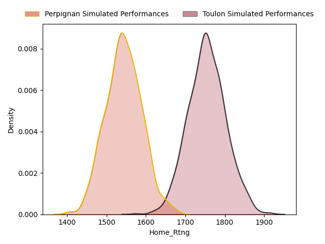
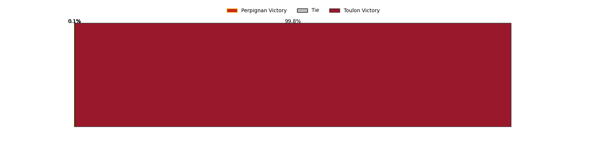
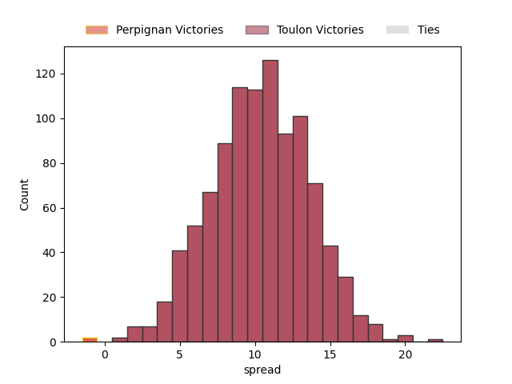

### Pau V Clermont Auvergne on 2023/04/15

Average Margin: Clermont Auvergne by 0.3

### La Rochelle V Bayonne on 2023/04/15

Average Margin: La Rochelle by 13.4

### Stade Toulousain V Lyon on 2023/04/16

Average Margin: Stade Toulousain by 5.6

## Week 9

### Bayonne V Montpellier Herault on 2023/04/22

Average Margin: Montpellier Herault by 2.3

### Brive V Pau on 2023/04/22

Average Margin: Pau by 1.2

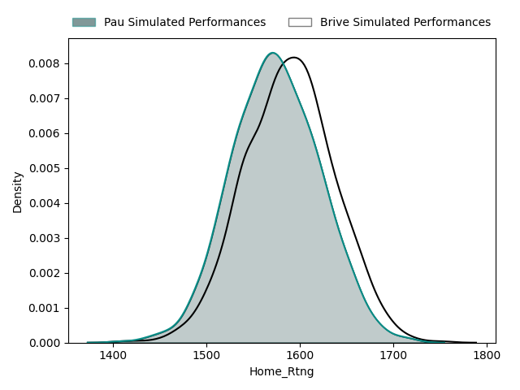
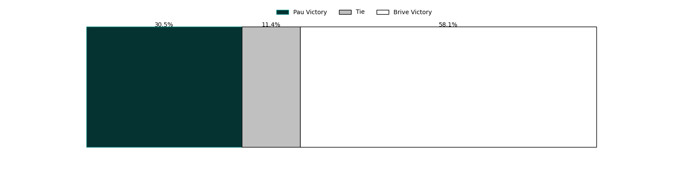
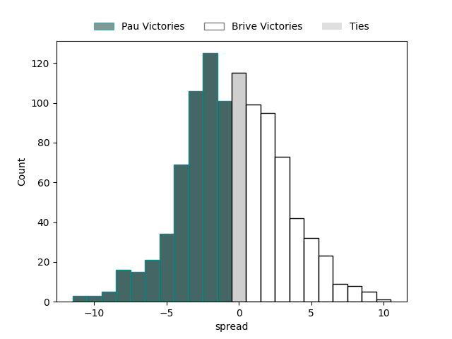

### Castres Olympique V Toulon on 2023/04/22

Average Margin: Toulon by 0.9

### La Rochelle V Clermont Auvergne on 2023/04/22

Average Margin: La Rochelle by 8.6

### Stade Francais Paris V Stade Toulousain on 2023/04/22

Average Margin: Stade Toulousain by 4.3

### Bordeaux Begles V Lyon on 2023/04/22

Average Margin: Lyon by 0.2

### Perpignan V Racing 92 on 2023/04/22

Average Margin: Racing 92 by 3.5

## Week 10

### Clermont Auvergne V Stade Francais Paris on 2023/05/06

Average Margin: Clermont Auvergne by 5.6

### Lyon V Perpignan on 2023/05/06

Average Margin: Lyon by 12.1

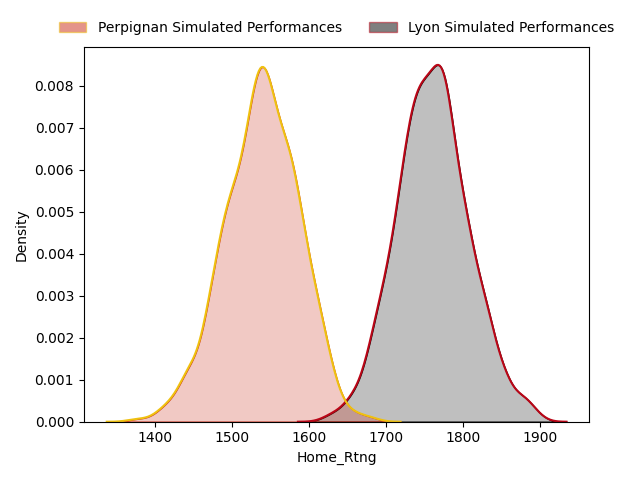
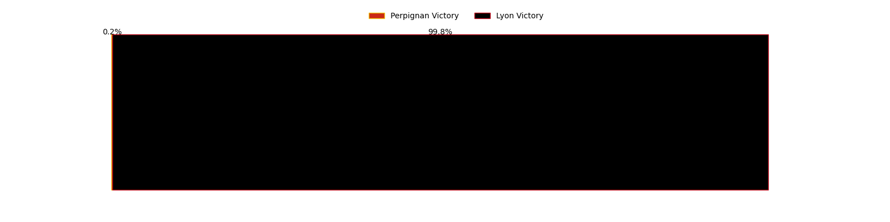
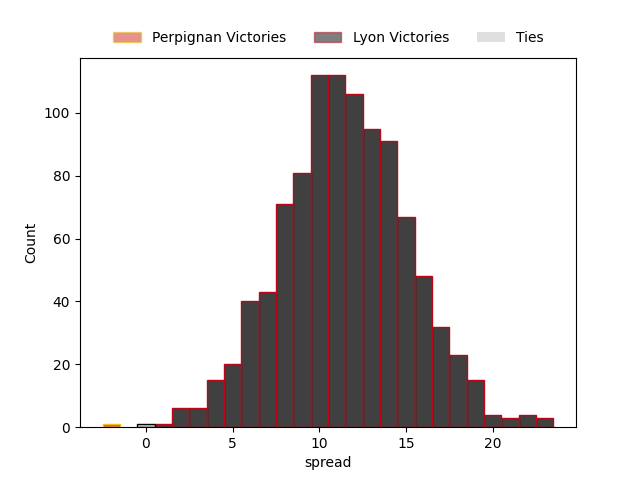

### Racing 92 V Bayonne on 2023/05/06

Average Margin: Racing 92 by 9.1

### Montpellier Herault V Brive on 2023/05/06

Average Margin: Montpellier Herault by 12.0

### Toulon V La Rochelle on 2023/05/06

Average Margin: La Rochelle by 0.5

### Pau V Castres Olympique on 2023/05/06

Average Margin: Pau by 2.6

### Stade Toulousain V Bordeaux Begles on 2023/05/06

Average Margin: Stade Toulousain by 8.7

## Week 11

### Bayonne V Clermont Auvergne on 2023/05/13

Average Margin: Clermont Auvergne by 1.4

### Brive V Castres Olympique on 2023/05/13

Average Margin: Castres Olympique by 2.0

### Montpellier Herault V La Rochelle on 2023/05/13

Average Margin: La Rochelle by 1.0

### Stade Francais Paris V Lyon on 2023/05/13

Average Margin: Lyon by 1.9

### Racing 92 V Toulon on 2023/05/13

Average Margin: Racing 92 by 2.8

### Bordeaux Begles V Pau on 2023/05/13

Average Margin: Bordeaux Begles by 6.2

### Perpignan V Stade Toulousain on 2023/05/13

Average Margin: Stade Toulousain by 7.3

## Week 12

### Lyon V Bayonne on 2023/05/27

Average Margin: Lyon by 11.1

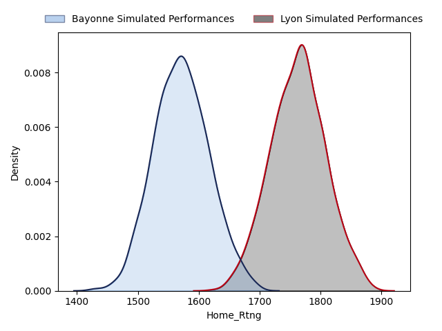

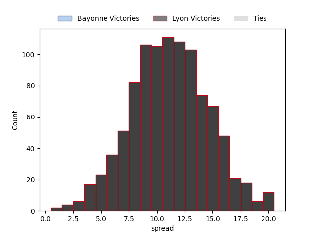

### Clermont Auvergne V Racing 92 on 2023/05/27

Average Margin: Clermont Auvergne by 2.6

### Castres Olympique V Perpignan on 2023/05/27

Average Margin: Castres Olympique by 6.3

### Toulon V Bordeaux Begles on 2023/05/27

Average Margin: Toulon by 5.3

### Pau V Montpellier Herault on 2023/05/27

Average Margin: Montpellier Herault by 0.8

### La Rochelle V Stade Francais Paris on 2023/05/27

Average Margin: La Rochelle by 11.4

### Stade Toulousain V Brive on 2023/05/27

Average Margin: Stade Toulousain by 16.6

