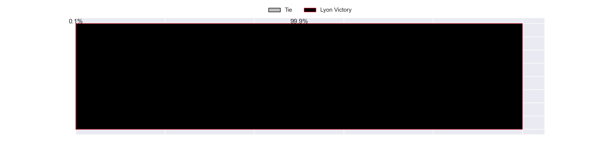

---  
title: "Top 14 Orange Status"  
date: 2023-04-21 6:00:00 -0500  
categories: model review projection  
layout: article  
aside:  
    toc: true  
---
# Current Team Rankings

# Standings

## Current Standings

| Club                 |   Played |   Wins |   Point Differential |   Losing Bonus Points |   Try Bonus Points |   Competition Points |
|:---------------------|---------:|-------:|---------------------:|----------------------:|-------------------:|---------------------:|
| Stade Toulousain     |       19 |     13 |                  164 |                     1 |                  7 |                   62 |
| La Rochelle          |       19 |     12 |                  135 |                     2 |                  5 |                   55 |
| Racing 92            |       19 |     12 |                   32 |                     2 |                  3 |                   53 |
| Toulon               |       19 |     12 |                   74 |                     1 |                  3 |                   52 |
| Lyon                 |       19 |     11 |                   46 |                     4 |                  2 |                   50 |
| Stade Francais Paris |       19 |      9 |                   56 |                     5 |                  3 |                   46 |
| Bayonne              |       19 |     10 |                    6 |                     2 |                  2 |                   44 |
| Bordeaux Begles      |       19 |      8 |                   21 |                     5 |                  2 |                   41 |
| Clermont Auvergne    |       19 |      8 |                  -34 |                     4 |                  3 |                   41 |
| Castres Olympique    |       19 |     10 |                  -69 |                     1 |                  0 |                   41 |
| Montpellier Herault  |       19 |      8 |                   22 |                     4 |                  3 |                   39 |
| Pau                  |       19 |      8 |                  -28 |                     4 |                  3 |                   39 |
| Perpignan            |       19 |      8 |                 -159 |                     3 |                  0 |                   35 |
| Brive                |       19 |      2 |                 -266 |                     6 |                  1 |                   15 |

## Projected Remaining Table

| Club                 |   Matches Remaining |   Wins |   Point Differential |   Losing Bonus Points |   Try Bonus Points |   Competition Points |
|:---------------------|--------------------:|-------:|---------------------:|----------------------:|-------------------:|---------------------:|
| Stade Toulousain     |                   4 |    3.9 |                 36.6 |                   0.1 |                3.8 |                 19.5 |
| La Rochelle          |                   4 |    3.1 |                 20.2 |                   0.8 |                2.9 |                 16.2 |
| Lyon                 |                   4 |    3   |                 20.5 |                   0.8 |                2.8 |                 15.6 |
| Racing 92            |                   4 |    2.8 |                 11.3 |                   0.9 |                2.6 |                 14.7 |
| Castres Olympique    |                   4 |    2.5 |                  7.6 |                   1.2 |                2.3 |                 13.5 |
| Montpellier Herault  |                   4 |    2.4 |                 11.5 |                   1.3 |                2.2 |                 13.3 |
| Clermont Auvergne    |                   4 |    2.5 |                  2.5 |                   0.6 |                2.3 |                 12.9 |
| Toulon               |                   4 |    2.3 |                  4   |                   1.4 |                2   |                 12.6 |
| Pau                  |                   4 |    2.1 |                 -0.6 |                   1.2 |                1.8 |                 11.5 |
| Bordeaux Begles      |                   4 |    1.7 |                 -6.5 |                   0.9 |                1.5 |                  9.1 |
| Bayonne              |                   4 |    0.6 |                -22.1 |                   1.3 |                0.4 |                  4   |
| Stade Francais Paris |                   4 |    0.4 |                -23.4 |                   1.3 |                0.3 |                  3.4 |
| Brive                |                   4 |    0.4 |                -34.4 |                   1.1 |                0.2 |                  2.8 |
| Perpignan            |                   4 |    0.2 |                -28   |                   1.1 |                0.1 |                  2   |

## Projected Total Table

| Club                 |   Total Matches |   Wins |   Point Differential |   Losing Bonus Points |   Try Bonus Points |   Competition Points |
|:---------------------|----------------:|-------:|---------------------:|----------------------:|-------------------:|---------------------:|
| Stade Toulousain     |              23 |   16.9 |                200.6 |                   1.1 |               10.8 |                 81.5 |
| La Rochelle          |              23 |   15.1 |                155.2 |                   2.8 |                7.9 |                 71.2 |
| Racing 92            |              23 |   14.8 |                 43.3 |                   2.9 |                5.6 |                 67.7 |
| Lyon                 |              23 |   14   |                 66.5 |                   4.8 |                4.8 |                 65.6 |
| Toulon               |              23 |   14.3 |                 78   |                   2.4 |                5   |                 64.6 |
| Castres Olympique    |              23 |   12.5 |                -61.4 |                   2.2 |                2.3 |                 54.5 |
| Clermont Auvergne    |              23 |   10.5 |                -31.5 |                   4.6 |                5.3 |                 53.9 |
| Montpellier Herault  |              23 |   10.4 |                 33.5 |                   5.3 |                5.2 |                 52.3 |
| Pau                  |              23 |   10.1 |                -28.6 |                   5.2 |                4.8 |                 50.5 |
| Bordeaux Begles      |              23 |    9.7 |                 14.5 |                   5.9 |                3.5 |                 50.1 |
| Stade Francais Paris |              23 |    9.4 |                 32.6 |                   6.3 |                3.3 |                 49.4 |
| Bayonne              |              23 |   10.6 |                -16.1 |                   3.3 |                2.4 |                 48   |
| Perpignan            |              23 |    8.2 |               -187   |                   4.1 |                0.1 |                 37   |
| Brive                |              23 |    2.4 |               -300.4 |                   7.1 |                1.2 |                 17.8 |

## Projected Playoff Results

|                      | Reach Quarterfinals   | Reach Semifinals   | Reach Final   | Win Final   |
|:---------------------|:----------------------|:-------------------|:--------------|:------------|
| La Rochelle          | 100.0 %               | 99.6 %             | 86.2 %        | 49.1 %      |
| Stade Toulousain     | 100.0 %               | 100.0 %            | 85.9 %        | 46.5 %      |
| Lyon                 | 100.0 %               | 66.8 %             | 11.5 %        | 2.9 %       |
| Toulon               | 99.8 %                | 54.6 %             | 8.9 %         | 1.2 %       |
| Racing 92            | 100.0 %               | 75.6 %             | 7.4 %         | 0.3 %       |
| Montpellier Herault  | 18.8 %                | 0.6 %              | 0.1 %         | 0.0 %       |
| Clermont Auvergne    | 32.0 %                | 1.7 %              | 0.0 %         | 0.0 %       |
| Castres Olympique    | 35.5 %                | 0.9 %              | 0.0 %         | 0.0 %       |
| Pau                  | 7.8 %                 | 0.1 %              | 0.0 %         | 0.0 %       |
| Bordeaux Begles      | 1.4 %                 | 0.1 %              | 0.0 %         | 0.0 %       |
| Bayonne              | 2.4 %                 | 0.0 %              | 0.0 %         | 0.0 %       |
| Stade Francais Paris | 2.3 %                 | 0.0 %              | 0.0 %         | 0.0 %       |

# Completed Match Review

| Model | Percent Correct Predictions | Spread Error |
| ------ | ------ | ------ |
| Club Level | 69.9% | 10.3 |
| Player Level: Lineup | 68.4% | 11.0 |
| Player Level: Minutes | 70.7% | 10.9 |

# Future Predictions

## Week 8

### Stade Francais Paris V Stade Toulousain on 2023/04/22

Average Margin: Stade Toulousain by 4.5

### Perpignan V Racing 92 on 2023/04/22

Average Margin: Racing 92 by 3.2

### Castres Olympique V Toulon on 2023/04/22

Average Margin: Toulon by 0.4

### Brive V Pau on 2023/04/22

Average Margin: Pau by 2.5

### Bayonne V Montpellier Herault on 2023/04/22

Average Margin: Montpellier Herault by 1.7

### La Rochelle V Clermont Auvergne on 2023/04/22

Average Margin: La Rochelle by 8.3

### Bordeaux Begles V Lyon on 2023/04/23

Average Margin: Bordeaux Begles by 1.4

## Week 9

### Pau V Castres Olympique on 2023/05/06

Average Margin: Pau by 2.3

### Montpellier Herault V Brive on 2023/05/06

Average Margin: Montpellier Herault by 12.1

### Racing 92 V Bayonne on 2023/05/06

Average Margin: Racing 92 by 9.1

### Lyon V Perpignan on 2023/05/06

Average Margin: Lyon by 10.8

### Clermont Auvergne V Stade Francais Paris on 2023/05/06

Average Margin: Clermont Auvergne by 6.6

### Stade Toulousain V Bordeaux Begles on 2023/05/06

Average Margin: Stade Toulousain by 8.5

### Toulon V La Rochelle on 2023/05/06

Average Margin: Toulon by 0.4

## Week 10

### Bayonne V Clermont Auvergne on 2023/05/13

Average Margin: Clermont Auvergne by 1.7

### Perpignan V Stade Toulousain on 2023/05/13

Average Margin: Stade Toulousain by 7.3

### Bordeaux Begles V Pau on 2023/05/13

Average Margin: Bordeaux Begles by 5.9

### Racing 92 V Toulon on 2023/05/13

Average Margin: Racing 92 by 2.2

### Montpellier Herault V La Rochelle on 2023/05/13

Average Margin: La Rochelle by 1.4

### Brive V Castres Olympique on 2023/05/13

Average Margin: Castres Olympique by 3.4

### Stade Francais Paris V Lyon on 2023/05/13

Average Margin: Lyon by 1.4

## Week 11

### La Rochelle V Stade Francais Paris on 2023/05/27

Average Margin: La Rochelle by 11.3

### Pau V Montpellier Herault on 2023/05/27

Average Margin: Pau by 0.5

### Toulon V Bordeaux Begles on 2023/05/27

Average Margin: Toulon by 5.6

### Castres Olympique V Perpignan on 2023/05/27

Average Margin: Castres Olympique by 7.2

### Clermont Auvergne V Racing 92 on 2023/05/27

Average Margin: Clermont Auvergne by 2.7

### Lyon V Bayonne on 2023/05/27

Average Margin: Lyon by 10.1

### Stade Toulousain V Brive on 2023/05/27

Average Margin: Stade Toulousain by 16.9

